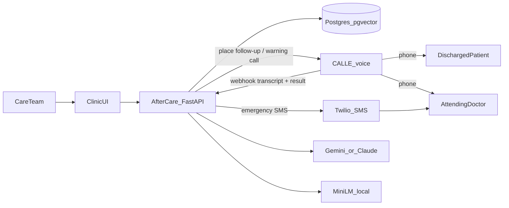
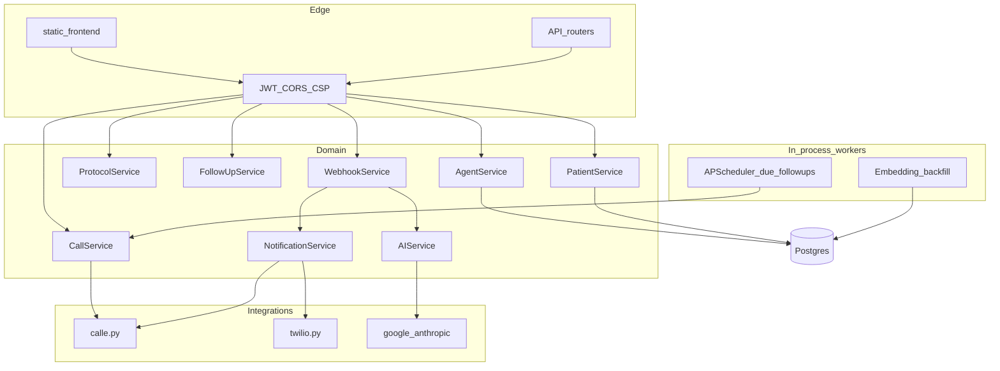
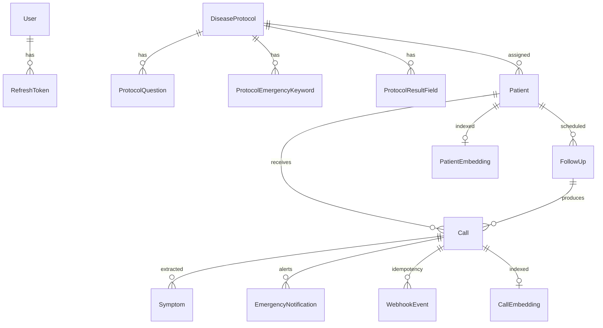
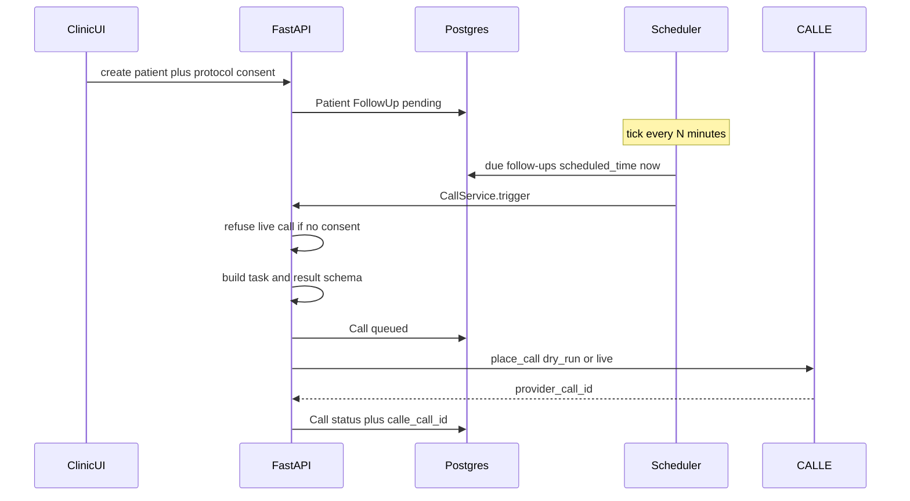
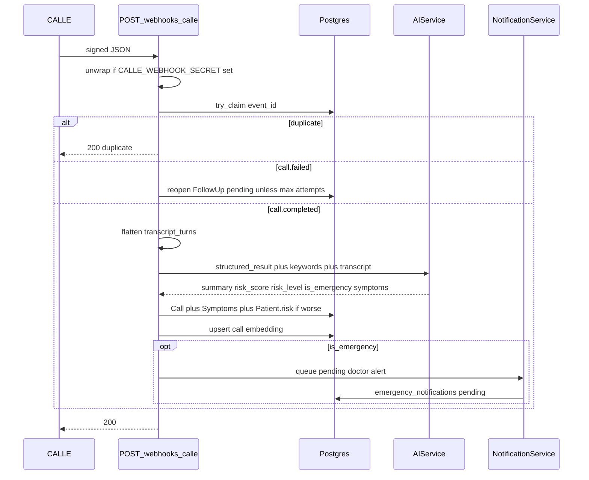

# AfterCare

**Post-discharge voice follow-up powered by CALL-E.**

Follow-up care that reaches patients before risk escalates.

AfterCare is a clinic operations app: it places structured calls after hospital discharge, scores recovery risk from the conversation, and puts the next action in front of the care team. The clinic UI is served from this same FastAPI process — judges only need to run the backend.

**Provider:** CALL-E Python SDK (`calle-ai`) against `https://api.heycall-e.com`.

**Default path places no calls.** `DRY_RUN_DEFAULT=true` records the follow-up locally and does not send a CALL-E HTTP request. Live calls are opt-in.

## What it does

- Places **consent-aware CALL-E** follow-up calls from disease-specific protocols (questions, warning signs, result schema)
- **Schedules** outreach and retries missed calls within attempt limits
- **Scores clinical risk** (low / medium / high / critical) from CALL-E structured results plus Gemini or Claude
- **Escalates emergencies**: heuristic scoring queues a pending doctor alert; staff must `POST /calls/{id}/alert-doctor` with `authorized_destination` matching on-file `doctor_contact` before Twilio SMS or a CALL-E warning call
- Serves a **clinic UI** (overview, activity, patients, protocols, AI assistant) from `static/frontend/`
- Lets staff **ask the clinic in plain language**; the assistant answers only from live tools
- **Semantic search** over patients and call transcripts (sentence-transformers + pgvector)

The agent summarizes recorded clinic data. It does not diagnose or prescribe.

## Architecture

AfterCare is one FastAPI process that both serves the clinic UI and runs the follow-up pipeline. PostgreSQL is the system of record. CALL-E is the voice plane. Twilio and LLMs are sidecar services used only after a call completes.

### 1. Context



### 2. Components inside FastAPI

Layered so HTTP handlers stay thin: routes → services → repositories → Postgres.



| Piece | Responsibility |
|---|---|
| `static/frontend/` | Built Next.js export. Served last, after API routes. |
| `app/api/routes/` | Auth, patients, protocols, follow-ups, calls, dashboard, agent, webhooks. |
| `ProtocolService` | Turns questions / keywords / fields into a CALL-E **task** and **result schema**. |
| `CallService` | Consent check, create `Call` row, place CALL-E call, mark follow-up attempts. |
| `WebhookService` | Verify payload, idempotency, flatten transcript, score risk, escalate. |
| `NotificationService` | SMS first, then CALL-E doctor warning. Skips if no doctor number. |
| `AgentService` | Tool-using clinic assistant (Gemini / Claude). Answers only from tool results. |
| APScheduler | Every `SCHEDULER_INTERVAL_MINUTES`, pick due follow-ups (limit 20). |
| Embedder | Local `all-MiniLM-L6-v2` (384-d) into `patient_embeddings` / `call_embeddings`. |

**Same-process routing:** `/health`, `/auth`, `/patients`, `/protocols`, `/calls`, `/followups`, `/dashboard`, `/agent`, `/webhooks`, `/docs` are JSON/API. Everything else (`/`, `/login`, `/admin/...`, `/_next`) is the UI.

### 3. Data model



- **Protocol** is the clinical contract for a call: what to ask, what to watch for, what structured fields CALL-E must return.
- **FollowUp** is the work queue (`pending` → `in_progress` → `completed` / `failed`), with `attempt_count` / `max_attempts` (default 3). An ambiguous provider create leaves the follow-up `in_progress` for reconciliation.
- **Call** stores provider id, transcript, summary, `risk_score`, `risk_level`, `is_emergency`.
- **WebhookEvent** unique on `event_id` so CALL-E retries do not double-score or double-alert.
- Patient `current_risk_level` only **ratchets up** (low → critical), never down from a later quieter call.

### 4. Follow-up call sequence



Immediate trigger from the UI uses the same `CallService.trigger` path as the scheduler. Dry-run writes the call row and skips the CALL-E HTTP request.

### 5. Webhook, risk, and escalation

Only terminal events are processed: `call.completed`, `call.failed`, `call.result_validation_failed`. Doctor warning calls are a separate `purpose=doctor_warning` path and do not re-score the patient.



Risk combines CALL-E structured fields, protocol emergency keywords, and LLM extraction (Claude primary, Gemini fallback) when the payload is sparse.

### 6. Clinic assistant

`POST /agent/chat` is a tool loop (max 8 rounds). Tools query Postgres only: overview, list/detail patients, risk lists, overdue follow-ups, emergencies, discharge stats, semantic patient search, transcript search. Identical tool results are deduped before UI cards are built. The model is not allowed to invent patients or give treatment advice.

### 7. Auth and safety boundaries

- JWT access + refresh (`/auth/login`, `/auth/register` with `X-Register-Secret`).
- Live CALL-E requires `consent_on_file`. Dry-run does not.
- Webhooks: optional signature verify; durable idempotency; failed claims can be retried.
- Default `DRY_RUN_DEFAULT=true` so a clone does not place real calls.
- The product summarizes recorded data. It does not diagnose or prescribe.


## Stack

Python, FastAPI, PostgreSQL + pgvector, SQLAlchemy, Alembic, CALL-E, Gemini / Claude, Twilio, sentence-transformers, Next.js static export.

## Run

From this directory (`apps/python/aftercare/`):

**Need:** Python 3.12+, PostgreSQL with the `vector` extension.

```bash
python -m venv .venv
# Windows: .venv\Scripts\activate
# macOS/Linux: source .venv/bin/activate

pip install -r requirements.txt
cp .env.example .env
# Edit .env: DATABASE_URL, JWT_SECRET, REGISTER_SECRET
# CALLE_API_KEY is required in the file but unused while DRY_RUN_DEFAULT=true
```

Enable pgvector in Postgres, then:

```bash
alembic upgrade head
python -m scripts.seed_protocols
```

Keep **`DRY_RUN_DEFAULT=true`**. Start the API with the scheduler visible but harmless in dry-run (it queues fake calls only):

```bash
uvicorn app.main:app --host 0.0.0.0 --port 8000
```

| URL | What |
|---|---|
| http://localhost:8000 | Clinic UI |
| http://localhost:8000/docs | API |
| http://localhost:8000/health | Liveness |

Create a user with `POST /auth/register` and header `X-Register-Secret` matching `REGISTER_SECRET`, then sign in on `/login`. JWT protects the admin API.

**Manual verification (no live call):** `GET /health` returns `{"status":"ok"}`. Register a patient with fictional E.164 such as `+15555550100`, consent on file, attach a protocol, trigger a follow-up. The `Call` row should show `dry_run=true` and no CALL-E request is sent.

## Tests

```bash
pip install -r requirements.txt
pytest
```

All tests run with `DRY_RUN_DEFAULT=true` and a patched CALL-E client. They do not place calls or require a live Postgres for the unit cases above.

**Live CALL-E** (opt-in only): set a real `CALLE_API_KEY` and a public HTTPS `CALLE_WEBHOOK_URL` (for example ngrok) pointing at `/webhooks/calle`. The Bearer key is sent only to `https://api.heycall-e.com`; any other `CALLE_BASE_URL` is refused. Live patient calls require `consent_on_file` and `authorized_destination` matching the exact ASCII E.164 patient phone on `POST /calls/trigger`. Live doctor alerts require `POST /calls/{id}/alert-doctor` with `authorized_destination` matching on-file `doctor_contact`. Use only numbers you are authorized to call. The scheduler places dry-run follow-ups only. Heuristic emergency scoring never sends SMS or places a doctor call.

## Side effects and safety

- **Dry-run / no-call default:** `DRY_RUN_DEFAULT=true`. The app writes `Call` rows and skips the CALL-E client. Twilio SMS is also skipped in dry-run.
- **Live side effects:** live patient calls are only `POST /calls/trigger` with `dry_run=false` and `authorized_destination` equal to the patient phone. Emergency scoring queues a pending doctor alert and does not SMS or call. Live doctor SMS / CALL-E warning calls are only `POST /calls/{id}/alert-doctor` with `dry_run=false` and `authorized_destination` equal to on-file `doctor_contact`.
- **Consent:** live patient calls require `consent_on_file`. Missing consent raises an error before CALL-E is contacted.
- **Phones:** store ASCII E.164 only (`+` and digits `[0-9]`). Samples use the reserved fictional number `+15555550100`. Logs and the assistant mask phones, transcripts, and clinical text. HTTP reads return `phone_masked` / `doctor_contact_masked` and omit raw transcripts and diagnosis text. Do not commit real numbers or PHI.
- **Credentials:** `CALLE_API_KEY`, `JWT_SECRET`, `REGISTER_SECRET`, Twilio, and LLM keys live in `.env` only (gitignored). Never put tokens in source or README. Live CALL-E credentials are sent only to `https://api.heycall-e.com`; any other `CALLE_BASE_URL` is refused.
- **Scheduler (recurring jobs):** APScheduler polls due follow-ups every `SCHEDULER_INTERVAL_MINUTES` (default 1) and **always dry-runs**. This is not a hidden live job: set `ENABLE_SCHEDULER=false` to disable it, or stop uvicorn. Live outreach requires an explicit trigger with `authorized_destination`. Failed terminal live calls reopen `pending` until `max_attempts` (default 3). An ambiguous CALL-E create (`timeout`, missing id, 5xx) stores the call as `outcome_unknown` and leaves the follow-up `in_progress` for human reconciliation — it is not auto-retried.
- **Idempotency:** inbound CALL-E webhooks claim a unique `event_id` so retries do not double-score. Doctor warning calls are a separate `purpose=doctor_warning` path and require a second authorized dispatch.
- **Medical boundary:** AfterCare is a **clinical operations helper**. It summarizes recorded call data. It does not diagnose, prescribe, or replace emergency services. Not for unsolicited outreach, legal advice, or collections.
- **Webhook signature:** set `CALLE_WEBHOOK_SECRET` in staging/production. When unset, `/webhooks/calle` accepts unsigned JSON (local demos only).

## Cancellation and rollback

- Stop new calls: `ENABLE_SCHEDULER=false` and restart, or stop the process.
- Stop a pending follow-up: set its status to `failed` (or wait until `max_attempts`).
- CALL-E has no cancel-after-create API in this app; cancellation is before `place_call` (do not trigger, or keep dry-run).
- Roll back demo data with a fresh Postgres database / `alembic` on an empty DB. Do not reuse production PHI in this demo.

## Repo map

| Path | Role |
|---|---|
| `app/api/routes/` | HTTP endpoints |
| `app/services/` | Follow-ups, risk, assistant, notifications |
| `app/integrations/calle.py` | Place calls + verify webhooks |
| `app/workers/` | Due-follow-up scheduler, embedding backfill |
| `static/frontend/` | Built clinic UI (committed; no Node required) |
| `scripts/seed_protocols.py` | Sample disease protocols |
| `scripts/sync_frontend.py` | Rebuild UI only if you have the sibling `frontend/` folder |

The clinic assistant answers only from tool results. It does not invent patients.
