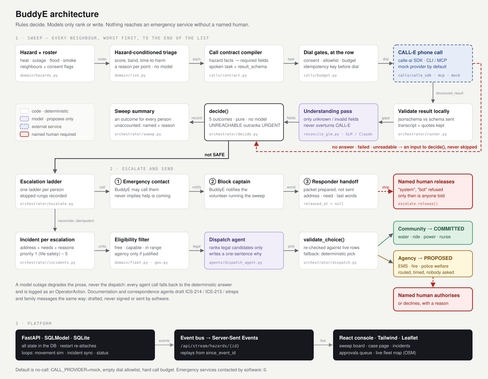

# BuddyE

**A block captain has forty vulnerable neighbours on a spreadsheet and one evening. When a hazard hits, BuddyE triages that list against the specific hazard, calls every single person on it, understands what they actually said, escalates the ones who need it — including the ones who never picked up — and then sends somebody. A volunteer with water goes on the machine's own authority. An ambulance is prepared, routed, justified, and waits for a person to put their name on it.**



Alma Reyes is a block captain in Maryvale, Phoenix. Her list is a spreadsheet: names, phone numbers, a note about the side gate, a note about the oxygen. When the National Weather Service puts out an Excessive Heat Warning at 114F, or the substation on 51st Avenue faults at four in the afternoon, she has until dark to work out who on that list is actually in danger tonight, reach all of them, and remember who she never got hold of. Fourteen calls is an evening. Forty is not possible.

Two of the names on her list explain the whole product.

**Rosa Delgado** is 75-plus, lives alone, and cools her house with a swamp cooler. A swamp cooler is not an air conditioner: it cools by evaporating water into the airstream, so in dry Phoenix air it drops a room twenty-five degrees and at 41% monsoon humidity it drops it a few and adds damp. On the day of the heat warning Rosa is the most endangered person on the block, and she will tell you three times on the phone that she is fine.

**Walter Brzezinski** runs an oxygen concentrator off wall power, with four hours of battery. Under a heat warning he is one of several people who matter. During a six-hour outage he is a subtraction: four hours of battery minus six hours of outage is a machine that stops two hours before the power comes back. Nothing about Walter changed. The hazard did.

Same fourteen people, same rows in the same table, and the phone list comes out in a completely different order. That reordering is the product, and it is computed by rules you can read (`backend/app/domain/risk.py`), not by a model.

---

## The two properties this is built around

### 1. Silence is a finding, not an error

BuddyE was ported from ShiftFill, an open-shift backfill agent, and this is the inversion that made it a different product. In a hiring cascade a `NO_ANSWER` means "try the next candidate" — the silence costs nothing and is never looked at again. Here, nobody answering is frequently the most important thing the system learns all evening. An unanswered call to a man whose life support is plugged into a wall socket during a blackout is not a gap in the data. It is the finding.

So it is built in as an outcome, not an exception:

- `CheckOutcome.UNREACHABLE` is one of five first-class outcomes, stored on the call row like any other.
- `decide()` takes `NO_ANSWER`, `FAILED` and `INVALID_RESULT` as **inputs**, with the caller's triage assessment attached. ShiftFill's early return on those statuses is deleted. Silence from Walter mid-outage and silence from a healthy 40-year-old during an advisory are not the same event and must not sort together.
- The priority table in `decide.py` puts **critical + UNREACHABLE at 100**, above URGENT's 95. A call you answered tells you what is wrong and lets the ladder start with information; silence at the critical band is unbounded.
- A provider rejecting a number (`invalid_phone`, `recipient_blocked`) is a `FAILED` leg that goes to `decide()` and comes back `UNREACHABLE`. ShiftFill skipped past those. "The number we hold for her is unroutable" is a fact about a person nobody has spoken to today.
- `unaccounted()` names **everyone on the roster with no outcome**, with the reason — opted out, never dialled, sweep still running — and it rides in every sweep summary, the dashboard, and the audit trace. A sweep is not judged by how many calls it made. It is judged by whether anybody was quietly dropped.

### 2. BuddyE never dials emergency services

The escalation ladder has three rungs and the last one is not automatic:

| Rung | Who | What BuddyE may do |
| --- | --- | --- |
| `EMERGENCY_CONTACT` | the person the neighbour nominated | **call them** |
| `BLOCK_CAPTAIN` | the volunteer running the sweep | **notify her** |
| `RESPONDER` | 911, an agency | **prepare a page and stop** |

The third rung produces a `HandoffPacket`: the address, the access note, the medical dependency, the verbatim last words, every call attempt, and a script written to be read aloud by someone under pressure. It is written with `released_at = None`. **A packet in that state has told nobody anything.** It is a document on a screen.

The only way out of it is `escalate.release()`, which takes the name of a human being, refuses an empty one, and refuses `"system"`, `"automation"`, `"bot"` and their friends — because `released_by` is the only record that a person accepted responsibility for what a stranger is about to be told about a frail neighbour's home, and a service account in that field would mean nobody did.

This is structural, not a policy note:

- `app/orchestrator/escalate.py` imports no provider and has no way to reach one. It cannot place a call even by accident.
- `release()` is the only function in the codebase that assigns `released_at`. `tests/test_escalate.py` pins that at the source level.
- `require_released()` is the gate any future transmit path must call — kept as a function so there is one obvious thing to have failed to call in review.
- The audit trace states `"emergency_services_contacted": 0` as a fact of the document, and every packet carries `status_note: "prepared only — no emergency service has been contacted and nobody has been sent"`.
- The call task itself says it out loud: *"You cannot summon anyone and you must not suggest you can. If it is an emergency, tell them to hang up and dial 911 themselves if they are able… Do not offer to make that call for them."* The call to an emergency contact carries the same prohibition, because the failure mode there is a family standing down in the belief that an ambulance is on its way.

The same boundary runs through the dispatch half, and there it is enforced rather than described. `domain.state.requires_authorisation()` is the single source of truth: community resources (a volunteer with water, a ride to the cooling centre, a power cart, the clinic nurse) are committed by an agent — sending a neighbour with a case of water to a hot house is a recoverable mistake — while `EMS_UNIT`, `FIRE_UNIT` and `POLICE_WELFARE` may never leave `PROPOSED` without a named human. A false ambulance call takes a unit away from someone else's emergency, which is not recoverable.

`orchestrator/dispatch.commit()` refuses an agency unit outright; `authorise()` is the only door, it takes a person's name, and it validates that name with **the escalation ladder's own validator** — `"system"` fails to approve an ambulance for exactly the reason it fails to release a handoff packet. `Dispatch.requires_authorisation` is stamped on the row at proposal time and never recomputed, so a later policy edit cannot retroactively bless a request nobody approved. And `domain/fleet.py` goes one step further than flagging: it refuses to *consider* an agency unit unless the incident justifies one, because `R-15` runs at 32 mph against a wellness van's 20 and a pure ETA race would hand every water drop to a rescue unit. Speed is not a licence. Declines are recorded with a name and a reason, because saying no to an ambulance is a decision with a decision's weight.

---

## What a sweep does

```text
POST /api/hazards/{id}/sweep
  TRIAGING   score every neighbour against THIS hazard: rules, reasons, band, time-to-harm
             -> call_order, worst first; people who never opted in are dropped here
  CALLING    for each neighbour, in order, to the end of the list:
               compile the contract (hazard-required facts become required schema fields)
               allowlist + budget + consent checked at the row, then dial
               validate structured_result locally against the schema we sent
               reconcile (LLM) only if fields came back invalid or unknown
               decide() -> SAFE | HELP_DECLINED | NEEDS_HELP | URGENT | UNREACHABLE
  ESCALATING anything that is not SAFE opens an escalation and climbs the ladder
  AWAITING_HUMAN  a responder packet is prepared and waiting — the sweep keeps calling
  COMPLETE   every neighbour has an outcome, or is named in `unaccounted`
```

There is no early exit. A heat warning does not become safe because the first person answered, so the roster is worked to the end; only a spent call budget or a provider failure that applies to everyone stops it.

The **hazard-conditioned triage** is in [`docs/TRIAGE.md`](docs/TRIAGE.md), the **call contract** in [`docs/CALL-CONTRACT.md`](docs/CALL-CONTRACT.md), the **outcome table and the ladder** in [`docs/ESCALATION.md`](docs/ESCALATION.md), the **resource model, the dispatch engine and the authorisation boundary** in [`docs/DISPATCH.md`](docs/DISPATCH.md), **what on the map is real and what is simulated** in [`docs/MAP.md`](docs/MAP.md), and the **routes and event stream** in [`docs/API.md`](docs/API.md).

### What the seeded evening actually produces

Running the heat sweep against the seeded block (mock provider, no network, no phones):

```text
roster 14 · queued 13 (Gerald Pryce never opted in) · 18 calls (13 neighbours + 5 emergency contacts)
URGENT 3   Rosa Delgado, Ernesto Salgado, Walter Brzezinski
UNREACHABLE 3   Hazel Nakamura, Benny Okonkwo, Faye Lindqvist
NEEDS_HELP 3   Trinidad Bustos, Ruth Ann Beecham, Lupe Ibarra
HELP_DECLINED 1   Dorothy Whitfield
SAFE 3   Yolanda Cruz, Charlie Dunn, Marisol Vega
escalations 10 · handoff packets prepared 3 · released 0 · emergency services contacted 0
incidents 10 — one address per escalation, never a rival for the same house
```

`prepared 3, released 0` is the healthy state. The machine did all of the work and told nobody.

Then declare the outage over the same fourteen people (`POST /api/demo/outage`) and nothing is precomputed — the same rules run against a different hazard profile:

| | Heat warning, 114F / 41% RH | Power outage, 6h est. / 108F |
| --- | --- | --- |
| Rosa Delgado | **100, critical** — swamp cooler in damp air | 68, high |
| Walter Brzezinski | 87, critical | **100, critical, 4.0h to harm** |

with the reason attached to every point:

> *oxygen concentrator runs 4h on battery against an outage expected to last 6h — it stops about 2h before the power comes back*

---

## Then somebody goes

Knowing who is in trouble is half a job. The other half is the one an emergency operations centre
actually runs on: resources assigned to addresses, the paperwork that assignment generates, and a
map a coordinator watches it happen on.

```text
sweep outcome (not SAFE)
  INCIDENT     opened by a reconciler, not a callback: sync_sweep() makes the incident table agree
               with the escalations, idempotent on escalation_id, safe to run twice
               -> needs derived from what the call established, priority 1-5, the neighbour's real
                  coordinates copied onto the row
  ELIGIBILITY  fleet.eligible(): who could LEGALLY take this — available, uncommitted, capable,
               capacity left, in radius, and (for EMS/fire/police) attached to an incident that
               justifies one at all. Everybody excluded comes back with a sentence saying why.
  PROPOSAL     the model ranks among those candidates and writes one justifying sentence.
               It cannot invent an asset, do arithmetic, or authorise anything.
  VALIDATION   fleet.validate_choice() re-runs the same filter against live rows.
               Nonsense, a timeout, or a unit that got taken -> the deterministic pick.
  COMMIT       community resource -> COMMITTED, EN_ROUTE, rolling. Nobody clicked.
               agency unit    -> PROPOSED. Routed, timed, justified, and nobody has been asked.
  AUTHORISE    a named human, one click. Or decline, with a name and a reason.
  MOVEMENT     position advanced on a wall clock along the same polyline the ETA was measured on
```

An `Escalation` is about **reaching a human being**. An `Incident` is about **sending resources to
an address**. Rosa's daughter is an escalation; the water truck is an incident.

**Twelve units on the board**, all from real Maryvale staging points: two wellness vans, two volunteer
drivers, a water and ice truck, a power cart, a clinic nurse and a school-district shuttle out of the
community centre and the Cartwright bus yard — and two ambulances, an engine and a patrol unit out of
Fire Stations 15 and 25 and the Maryvale precinct. The agency units are seeded **on purpose**:
leaving them off would have hidden the authorisation rule rather than enforced it. A coordinator who
never sees an ambulance on the map learns nothing about who is allowed to spend one.

**Three AI operator agents**, all on TokenRouter (`z-ai/glm-5.3-free`), all with the same discipline
as the reconciler — code filters, the model ranks, code validates, every failure path lands on the
deterministic answer:

| Agent | Proposes | Deterministic fallback | Code checks |
| --- | --- | --- | --- |
| `dispatch_agent` | which unit, and why in one sentence | `fleet.rank()`'s top pick | the choice is in the shortlist and still legal; the kind's authorisation is re-derived, never copied |
| `documentation_agent` | ICS-214, ICS-213, situation report | the same record rendered into the same ICS structure | every quote traces to the record, every number appears in it |
| `correspondence_agent` | a message to a contact, a family member, an agency | a plain template | the draft never implies it was sent or that help is coming |

Every one of those calls writes an `OperatorAction` row — agent, model, inputs, output, rationale,
latency, error, and whether a human accepted it — **including the calls where the model was never
reached**. "The gateway timed out so the deterministic default was used" is one of the answers that
has to be on the record. Emergency management runs on being able to say who decided what, when, on
what basis.

**A model outage degrades the prose, never the dispatch.** Nobody watching the board can tell,
except that the justification is terser and `source` says `deterministic`.

The map is server state, not an animation. Positions live on `Asset` rows, advanced on a wall clock
by `sim/movement.py` along `Dispatch.route` — the same polyline the map draws and the same one the
ETA was measured along, so what you watch and what you were promised cannot drift apart. **If the
backend stops, the vehicles stop where they were.** Distances use a documented grid-detour factor
rather than a routing engine, and every approximation is a named constant in one module; the only
thing simulated is that nobody is behind the wheel. [`docs/MAP.md`](docs/MAP.md) lists exactly which
is which, and how the vehicle layer is swapped for a live AVL feed.

---

## Architecture

```text
backend/app/
  domain/hazards.py       the loose `facts` dict -> a typed HazardProfile. Nothing raises.
                          Holds the evaporative-cooler curve: humidity is not decoration.
  domain/risk.py          triage. (hazard kind, severity) x (neighbour attributes) -> scored
                          contributions, each with the sentence that justifies it. No model.
  calls/contract.py       hazard + neighbour -> the spoken task and the CALL-E result_schema.
                          The hazard decides which facts are `required`.
  calls/{calle_sdk,calle_mcp,mock}.py   three providers behind one Protocol
  calls/budget.py         dial allowlist + hard call cap, enforced in code
  orchestrator/runner.py  the sweep driver. State lives in the DB; the coroutine only pushes it.
  orchestrator/decide.py  one call -> one CheckOutcome. Pure, deterministic, never raises,
                          never returns SAFE on junk.
  orchestrator/escalate.py  the ladder and the handoff packet. THE SAFETY BOUNDARY.
                          No provider import, and there must never be one.
  orchestrator/reconcile*.py  the optional LLM understanding step, on failing fields only

  domain/fleet.py         the dispatch engine. needs_for -> eligible -> rank -> validate_choice.
                          No model, no network, no clock. Both the fallback and the referee.
  domain/geo.py           haversine, grid-detour road distance, bearing, ETA, route polylines.
                          Every mile and minute on the screen comes from here.
  seed_assets.py          the fleet: twelve units at five real Maryvale staging points.
                          Idempotent by call sign, so a second call never teleports a moving van.
  orchestrator/incidents.py  escalations -> incidents. A reconciler, not a callback: idempotent,
                          keyed on escalation_id, runnable from anywhere. Priority never goes down.
  orchestrator/dispatch.py   THE ONLY PLACE A DISPATCH CHANGES STATE. propose / commit /
                          authorise / decline / start / complete. commit() refuses agency units.
  agents/                 the three operator agents + one TokenRouter client. Every call writes an
                          OperatorAction; every failure path returns the deterministic answer.
  sim/movement.py         the vehicle layer, and the ONLY thing in BuddyE that is simulated.
                          Wall-clock progress along Dispatch.route. Swappable for a live AVL feed.

  api/                    hazards + sweeps, roster, escalations + handoffs, incidents, assets,
                          dispatch, documents, correspondence, SSE, trace, demo
  events/bus.py           DB-backed event log + asyncio fanout, topic = the hazard
  obs.py                  redaction filter; everything leaving the process goes through it
  models.py, domain/state.py    the spine: entities and the validated state machines
frontend/                 Vite + React + Tailwind console
docs/                     API, triage, call contract, escalation, dispatch, map, design contract
```

Everything that decides anything is deterministic: the triage arithmetic, the required-field compilation, the outcome, the ladder, the packet, the eligibility filter, the ranking, and the authorisation gate. **A model never decides; it only ever ranks or writes.** In the reconcile step it runs on fields that came back invalid or `unknown`, may resolve an unknown but never overturn a definite answer CALL-E gave, and any quote it proposes is discarded unless the person can be shown to have said it. In the operator layer it picks among candidates deterministic code has already declared legal, and its pick is re-validated by that same code before anything is committed. Take every model out of the process and BuddyE still triages, still calls, still decides, still escalates, still dispatches and still files its paperwork — with terser sentences.

State lives in SQLite. The asyncio tasks are only drivers: a sweep interrupted by a restart re-attaches to the `CheckCall` rows it already wrote and carries on from the neighbour it had reached, reusing the same idempotency key, rather than ringing the first half of the block a second time. The incident sync loop is a reconciler, so a missed pass costs two seconds; the movement tick is a smoothness knob, so a missed tick costs nothing at all — arrival is computed from elapsed wall-clock time, not from a frame count.

Three background loops run alongside the sweep driver: `MovementSimulator` (`MOVEMENT_TICK_S`, default 2.0s) advancing positions, `incidents.sync_loop` (`INCIDENT_SYNC_S`, default 2.0s) reconciling escalations into incidents and auto-dispatching community resources, and the CALL-E status refresh. All three are started and stopped in `main.lifespan`, and all three are safe to miss.

## Health data

`conditions`, `power_dependent`, `medications`, `access_notes` and addresses are sensitive health information about named people. The rule is **redact at egress, never at the source**: triage reasons say "oxygen concentrator" because that is what makes them useful to a captain, and `app.obs.redact` masks phone numbers and credential-shaped keys on everything that leaves the process — logs, event payloads, API responses.

Two deliberate exceptions, both because redaction would destroy the thing's purpose:

- The **handoff packet** is not redacted beyond phones. Its entire job is to put an address and a medical dependency in front of a paramedic in the first sentence.
- The **roster API** returns conditions and power dependency, because there is no version of this product where a captain deciding who to drive to first cannot see that Walter runs a concentrator.

The **call task** goes the other way. It is persisted on the call row and published on the event stream, so it is parameterised from *derived* facts (`power_dependent`, `mobility`, `lives_alone`) and never interpolates a condition, a medication, or an address. First name only. On voicemail, not even the reason for the call — you do not know who is listening.

The **operator layer** inherits the same rule. `Incident.needs` and incident summaries are derived from health facts — an oxygen concentrator, insulin in a warming fridge — and are stored unredacted because that is exactly what makes them useful to a coordinator. The one payload that carries a named person's health information *off this machine* is the operator agent prompt, so it goes through `obs.redact` on the way out and the stored `OperatorAction.inputs`/`output` go through it again on the way into the database. A recipient's phone number or email is never sent to the model at all: the wording of a message to Rosa's daughter does not depend on her phone number.

Every seeded person is fictional and every committed number is an unroutable `+1 555-01xx`.

## Run it

Backend (Python 3.11+):

```bash
cd backend
uv venv && uv pip install -e ".[dev]"
.venv/bin/uvicorn app.main:app --reload --port 8000
```

No `.env` is needed for the demo: every default fails closed (`CALL_PROVIDER=mock`, empty dial allowlist, four-call budget). The database seeds itself on first boot with the fourteen neighbours and the heat warning.

Frontend (Node 22):

```bash
cd frontend
npm install
npm run dev          # proxies /api to 127.0.0.1:8000
```

Tests — mock provider only, no network, no phones:

```bash
cd backend && .venv/bin/python -m pytest -q     # 439 passed
```

The suite reads `.env` like the app does, so a local `.env` carrying `DEMO_PHONE_*` or a
`BLOCK_CAPTAIN_NAME` other than the seeded one will fail the fixtures that pin *"every seeded number
is unroutable"*. That is the guard working, not a broken test: run the suite in a shell without those
set.

**Optional inference.** `TOKENROUTER_API_KEY` (OpenAI-compatible gateway, `z-ai/glm-5.3-free`) is
read by both the reconcile step and the three operator agents; `ANTHROPIC_API_KEY` is an alternative
for the reconciler only. With neither, unknowns stay unknown and are escalated as findings, the
dispatch agent falls back to `fleet.rank()`'s top pick, and the ICS forms and correspondence come out
of their deterministic renderers. The free tier runs 20-100s per call, so nothing blocks on it and no
database session is ever held across one.

**Operator-layer settings.** `AUTO_DISPATCH` (default on) commits and starts community resources with
no click; agency units stay `PROPOSED` whatever it is set to. `OVERSEER_NAME` is the name printed on
generated paperwork as "prepared by" and **can never authorise anything** — an agency dispatch and a
handoff packet both require a name supplied in the request, by the human making the decision, at the
moment they make it. `INCIDENT_SYNC_S` and `MOVEMENT_TICK_S` are cadence knobs; a missed pass of
either costs seconds and nothing else.

### Going live

Real calls are opt-in, capped, and allowlisted, and the free tier is small. Before switching a provider on:

1. Get consent from the people you are going to call, and note it.
2. In `.env`: `CALL_PROVIDER=calle_sdk`, `CALLE_API_KEY=…`, `DEMO_PHONE_A=+1…` (becomes Rosa), `DEMO_PHONE_B=+1…` (Walter), `DEMO_PHONE_C=+1…` (Ernesto), `DIALABLE_NUMBERS=` those same numbers, `CALL_BUDGET_MAX=` the number of calls you are willing to spend.
3. Optionally run a tunnel and set `PUBLIC_BASE_URL` plus a fixed `CALLE_WEBHOOK_SECRET`; without it, polling alone completes the call.
4. `POST /api/demo/reset` so the seed picks up the demo numbers, then start the sweep.

Every other seeded neighbour keeps an unroutable number, and any number outside `DIALABLE_NUMBERS` is refused before the dial (`call.skipped`). Emergency contacts are never given a real number whatever the environment says — the ladder can place a second call on its own, and a demo must not spend the tier on somebody who never agreed to be rung.

## CALL-E integration

| Provider | Surface | What it does |
| --- | --- | --- |
| `calle_sdk` | `calle-ai` Python SDK, `client.calls.create(...)` with `result_schema`, `recipient`, `metadata`, `idempotency_key`, optional `webhook_url` | Creates the call, persists the id, polls `calls.get` and `calls.list_events`, forwards CALL-E's own developer events into the timeline. A terminal webhook short-circuits the poll. |
| `calle_mcp` | `calle` CLI: `call plan` → `call run` → `call status` | The MCP surface takes a goal, not a schema, so it returns no typed result; the reconcile step reads the fields out of the transcript and unknowns stay findings. |
| `mock` (default) | none | Fourteen scripted conversations, keyed by neighbour and overlaid per hazard. Zero network. |

What the API gives back and how it is read: `status` in `completed | failed | canceled`; `structured_result` is `null` when CALL-E could not produce a schema-valid object, which is treated as `INVALID_RESULT` and therefore as `UNREACHABLE`; the transcript is at `recipients[0].attempts[-1].transcript_turns`. There is no server-side validation field, so results are validated locally with `jsonschema` against the exact schema that was sent. `task_completed`, `completion_confidence` and `evidence` come from CALL-E's own post-call judgment; a low confidence takes `SAFE` off the table rather than overturning what was said.

Schema constraints, confirmed against the live API and enforced at compile time by `assert_calle_schema_subset()`: a plain draft-07 subset (`type`, `properties`, `required`, `enum`, `items`, `description`, `additionalProperties: false`), objects nested at most one level, arrays of plain strings only, **no nullable type arrays** (`["string","null"]` is rejected with `result_schema_invalid`; `""` means "not stated"), and every string enum carries an `unknown` value. Field descriptions reach CALL-E's extraction model, so they are written as extraction guidance and judged by meaning — see [`docs/CALL-CONTRACT.md`](docs/CALL-CONTRACT.md).

Webhooks are unsigned in current CALL-E, so `POST /api/calle/webhook/{token}` uses a random path token, requires the `CALL-E-Event-Id` header to equal the body id, deduplicates by id, and re-fetches the call from the API before acting on it.

## Safety summary

- **Default is no-call.** `CALL_PROVIDER=mock`; the whole test suite is mock.
- **Allowlist and budget in code.** A real provider refuses any number outside `DIALABLE_NUMBERS`, and the sweep ends `BUDGET_EXHAUSTED` once `CALL_BUDGET_MAX` accepted calls exist in the ledger. The ledger (`SpentCall`) survives a demo reset, so the button cannot hand the free tier back.
- **Consent is checked at the row.** `risk.call_order` drops anyone who never opted in, and the runner checks again at the moment of dialling, next to the allowlist. A guard that exists only one layer up is one an off-by-one gets past, and the thing on the other side of it is somebody's phone ringing after they said no.
- **Idempotency before the dial.** The key is written to the database before the provider is called, and reused on retry or restart.
- **The agent never negotiates and never summons.** It offers only help that exists, in the exact words supplied, with no time and no promise attached.
- **Nothing is ever sent to a responder by software.** See property 2.
- **No software commits an agency unit.** `commit()` refuses `EMS_UNIT`, `FIRE_UNIT` and `POLICE_WELFARE` by kind *and* by the flag stamped on the row; `authorise()` is the only door and it takes a person's name, validated by the escalation ladder's own rule. `AUTO_DISPATCH` cannot change this in either direction.
- **An agency unit is not offered unless the incident justifies one.** Being faster is not a reason to send an ambulance to a water drop.
- **A decline is recorded like a decision**, with a name and a reason, on the row.
- **A generated document is unsigned and a drafted message is unsent.** `approved_by` and `sent_at` are absent from everything the agents return, and `implies_already_sent()` sends a draft back to the template if it claims help is on the way.
- **Provenance on every agent call**, including the ones where the model was never reached.

The portable version of these rules — hazard-conditioned triage, the welfare contract, reading under-reported distress, the ladder, the dispatch engine and the human-authorisation boundary on both ends of it — is packaged as the [`neighbour-welfare-sweep`](../../../skills/neighbour-welfare-sweep/) skill.
