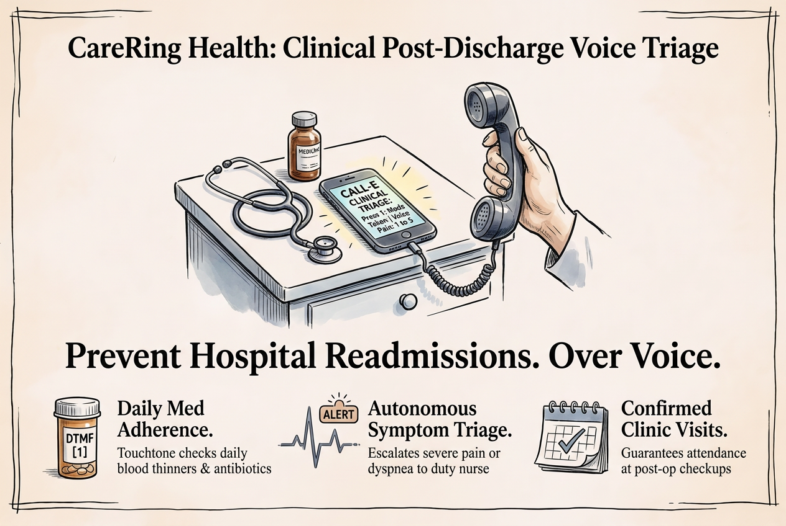

# CareRing Health

> **Clinical Post-Discharge Triage & Patient Medication Adherence Voice Concierge powered by CALL-E**

[](https://www.python.org/downloads/)
[](https://opensource.org/licenses/MIT)
[](https://heycall-e.com)
[]()



---

## The Problem: Preventable Readmissions & Post-Op Complications

According to healthcare clinical studies, nearly **20% of discharged surgical patients** experience an adverse event within 30 days of leaving the hospital:
1. **Missed Critical Medications:** Patients forget complex dosing schedules for vital therapies like blood thinners (antiplatelets/anticoagulants) or antibiotics.
2. **Ignored Early Warning Signs:** Patients dismiss severe warning indicators (shortness of breath, chest heaviness, sudden fever) until it turns into a life-threatening emergency.
3. **Severe Clinical Understaffing:** Hospitals and specialty outpatient clinics do not have the nursing bandwidth to place 150+ personalized follow-up calls every morning.

Traditional SMS reminders are passive and lack clinical diagnostic interaction, especially for elderly patients.

---

## The Solution: CareRing Health

**CareRing Health** connects hospital EHR discharge registries with autonomous outbound PSTN telephony powered by **CALL-E**:

- 🩺 **24-Hour Automated Follow-Up:** Autonomously dials discharged post-op patients over PSTN carrier networks without staff overhead.
- 💊 **Medication Adherence Gate (DTMF):** Verifies daily prescription intake via keypad confirmation (*"Did you take your prescribed blood thinner today? Press 1 for Yes, Press 2 for No"*).
- 🚨 **Autonomous Clinical Symptom Triage:** Rates surgical pain on a 1–5 scale and analyzes verbal symptoms.
- 🚑 **Emergency Nurse Escalation:** If pain >= 4 or dangerous symptoms (dyspnea, dizziness) are detected, immediately dispatches an urgent Red Alert to the on-call triage desk.
- 📅 **Follow-Up Appointment Confirmation:** Confirms scheduled post-operative clinic consultations via touchtone Key [1].
- 🔒 **HIPAA-Compliant SHA-256 Audit Trail:** Computes deterministic cryptographic hash chains across all clinical triage state transitions.
- 📊 **Real-Time Clinical Station Dashboard:** Dark-mode console for nursing staff displaying patient vitals, active red alerts, and adherence trends.

---

## Quickstart & Verification

### 1. Installation

```bash
git clone https://github.com/hackersclub111/carering-health.git
cd carering-health
pip install -r requirements.txt
```

### 2. Run Test Suite (100% Passing in <1s)

```bash
py -3.12 -B -m pytest tests/ -v
```

### 3. Run Zero-Cost Judge Evaluation CLI Demo

```bash
py -3.12 -B src/client.py --demo
```

### 4. Run Forensic Cryptographic Audit

```bash
py -3.12 -B src/client.py --verify-evidence
```

### 5. Launch Interactive Clinical Dashboard

```bash
py -3.12 -B src/client.py --serve
# Navigate to http://localhost:8002
```

---

## Architecture & CALL-E Contract

```
┌─────────────────────────┐
│ Hospital EHR / Clinic   │
│ Patient Discharge Event │
└────────────┬────────────┘
             │ Webhook POST /api/v1/patients
             ▼
┌─────────────────────────┐
│    CareRing Engine      │◄─── SHA-256 Cryptographic Audit Ledger
└────────────┬────────────┘
             │ Outbound PSTN Dial via HeyCall-E API
             ▼
┌─────────────────────────┐
│ CALL-E Telephony Agent  │
│ - Medication DTMF Check │
│ - Pain Scale (1-5)      │
│ - Dyspnea / Fever Triage│
│ - Clinic Visit Confirm  │
└────────────┬────────────┘
             │ Structured result_schema
             ▼
┌────────────────────────────────────────────────────────┐
│ Clinical Verdict:                                      │
│  [Normal]   -> NORMAL RECOVERY (Log to EHR)            │
│  [Missed]   -> MODERATE_FOLLOWUP (Alert Care Coordinator)
│  [Pain 4-5] -> CRITICAL_EMERGENCY_ESCALATION           │
│                (Immediate Red Alert to On-Call Nurse)  │
└────────────────────────────────────────────────────────┘
```

---

## Devpost Submission Package
See [`docs/READY_TO_COPY_DEVPOST.md`](docs/READY_TO_COPY_DEVPOST.md) for the exact copy-paste form fields, video timestamps, and upstream PR details.
