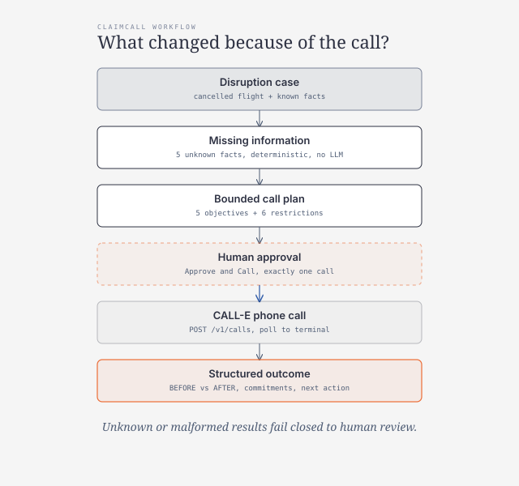
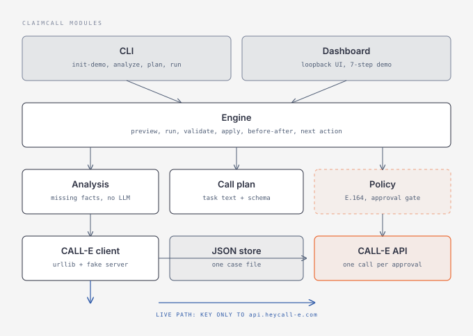

# ClaimCall

**Your AI agent that calls airlines so you don't have to.**

ClaimCall turns a disrupted-flight case into a bounded CALL-E phone task, requires the traveller
to approve exactly what the agent may ask for, and turns the resulting airline conversation into
structured case state, commitments, evidence, and the next action.



The phone call is not the product. The value is the state transition: **what changed because
of the call?**

## Why phone calls matter here

Flight-rights guidance only goes so far. After a cancellation, the facts a traveller actually
needs — the official reason, the replacement itinerary, hotel and meal authorisation, written
confirmation — live on the airline's phone line. ClaimCall knows which of those facts are
missing, shows the traveller exactly what it wants to ask, gets approval, has CALL-E make the
phone call, and converts the conversation into concrete case state.

This is different from "keep calling until the claim is resolved": one disruption case gets one
bounded call with five fixed objectives, and the outcome is a before/after comparison, not a
redial loop.

## Synthetic demo (no calls, no API key)

```bash
cd apps/python/claimcall
python3 -m claimcall --data ./data init-demo   # SYNTHETIC DEMO — NOT A REAL BOOKING
python3 -m claimcall --data ./data show
python3 -m claimcall --data ./data analyze     # missing information + call recommendation
python3 -m claimcall --data ./data plan        # bounded objectives + restrictions
python3 -m claimcall --data ./data run --mode preview
python3 -m claimcall --data ./data run --mode fixture --approve
python3 -m claimcall --data ./data serve       # http://127.0.0.1:8766, loopback only
python3 -m pytest                              # 21 tests, all offline
```

Python 3.9 or newer, standard library only. `pytest` is the only development dependency.

The demo case is fictional: passenger Santee Cooper, EuroSky Airways, booking ABC123, flight
ES421, Paris → Bengaluru, Cancelled. Phone fixtures use the fictional NANP range `555-01XX`.

## Demo script (3 minutes)

For recording the demo video. Start clean:

```bash
cd apps/python/claimcall
rm -rf ./data
python3 -m claimcall --data ./data serve   # open http://127.0.0.1:8766
```

Click **Load synthetic demo case** in the dashboard (or `init-demo` on the CLI for the
same seed). Then follow the table.

| Time | Show | Where |
| --- | --- | --- |
| 00:00 | Flight cancelled: Santee Cooper, EuroSky ES421, Paris → Bengaluru | 1. Disruption Case |
| 00:15 | Five missing facts, all unknown | 2. Missing Information |
| 00:30 | Why a phone call helps: critical facts live on the airline's line | 4. Human Approval, first paragraph |
| 00:45 | Exactly what the agent may ask: five objectives | 3. Call Plan |
| 01:00 | What it may never do: no purchases, no payment, no unrelated changes | 3. Call Plan, restrictions |
| 01:10 | Tick the checkbox, mode `fixture`, press Resolve by Phone — Approve & Call | 4. Human Approval |
| live | Type your mobile into Call my mobile, tick approval, mode `live`, Approve & Call | 4. Human Approval |
| 01:20 | CALL-E execution: call ID, completed status | 5. CALL-E Execution |
| 01:50 | Structured result folded into the case | 5. CALL-E Execution, outcome |
| 02:05 | Three commitments plus transcript evidence | 6 + 7. Outcome |
| 02:20 | BEFORE vs AFTER: every Unknown becomes a confirmed fact | 6 + 7. Outcome, table |
| 02:40 | Recommended next action: wait for the email, keep receipts | 6 + 7. Outcome, bottom |
| 02:50 | Call ID and the closed result schema that produced it | 5. CALL-E Execution |

CLI-only alternative: replace the dashboard with `run --mode fixture --approve`, which prints
the call ID, the before/after rows, the commitments, and the next action.

## Modes

| Mode | Call placed | API key | Approval |
| --- | --- | --- | --- |
| `preview` | No | No | No |
| `fixture` | No (synthetic CALL-E-shaped response, same handling code as live) | No | Yes (`--approve` / checkbox) |
| `live` | **Yes, one outbound call** | Yes (`CALLE_API_KEY`) | Yes (`--approve` + `--hotline` repeat, or dashboard checkbox) |

## Live mode

**Live mode places an outbound phone call** via the CALL-E Developer API:
`POST https://api.heycall-e.com/v1/calls` with the generated task, one recipient, and the
closed result schema, then `GET /v1/calls/{id}` is polled until the task is terminal. The call
is disclosed as an AI assistant calling on behalf of the traveller.

```bash
cp .env.example .env            # then set CALLE_API_KEY (never commit .env)
export CLAIMCALL_ALLOWLIST=+15551234567   # your own test number, exactly
python3 -m claimcall --data ./data init-demo
python3 -m claimcall --data ./data run --mode live --approve --hotline +15551234567
```

Or from the dashboard (no CLI patching): start the server with live enabled, open
http://127.0.0.1:8766, type your mobile into **Call my mobile**, tick approval, select
`live`, and press Approve & Call.

```bash
python3 -m claimcall --data ./data serve --allow-live
```

`CALLE_API_KEY` is read from real environment variables first, then from `.env` in the app
directory, the current directory, and ancestors up to the repo root — a repo-root `.env`
just works. `.env` and `.env.local` are gitignored; never commit them.

Live refuses unless **all** hold: `--approve` given, `--hotline` repeats the case hotline
exactly, `CALLE_API_KEY` set, destination a valid region-consistent E.164 number, and (when
`CLAIMCALL_ALLOWLIST` is set) the destination listed. A `CALLE_BASE_URL` override is refused.
Only fields actually returned by the current API are exposed: call ID, status, structured
result, transcript turns, summary, completion information, and evidence.

Side effects: exactly one outbound phone call per approved run. Nothing else: no emails, no
payments, no booking changes beyond asking the five objectives.

The live path is verified against the real API: schema validation happens server-side, so the
result schema uses only string, boolean, enum, object, and array types (no union types). A
completed call that reaches voicemail folds fail-closed — every fact stays unknown, the open
items are listed, and nothing is invented.

## Human approval

A call never happens because a case was loaded or analysed. Before live execution the app shows
**Why is ClaimCall making this call?** and **What is ClaimCall allowed to do?**, then requires
an explicit `Approve & Call` action covering exactly one call.

In the dashboard, type your mobile number into **Call my mobile**, tick the approval checkbox,
select `live`, and press Resolve by Phone — Approve & Call. The typed number is validated as
E.164 with a supported country code and checked against `CLAIMCALL_ALLOWLIST` when set; the
case facts stay fictional, only the destination is yours. On the CLI the same authorisation is
`--approve` plus `--hotline` repeating the destination exactly.

## Workflow

1. Load the disruption case (`show`).
2. See known facts vs missing information (`analyze`).
3. See why a phone call helps (phone-call recommendation with reason).
4. Inspect the exact call objectives and strict safety boundaries (`plan`).
5. Explicitly approve the call (`--approve` / `Approve & Call`).
6. CALL-E executes; the dashboard shows the call ID and status.
7. The structured result updates the case; malformed results fail closed to human review.
8. Compare BEFORE vs AFTER, read commitments and evidence, follow the next action.

## CALL-E integration

The request uses the same Calls API shape as the repository's reference apps — no invented
fields:

```json
{
  "task": "<generated from the disruption case>",
  "recipients": [{"phones": ["<airline hotline>"], "region": "US", "locale": "en-US"}],
  "result_schema": { "type": "object", "additionalProperties": false, "...": "..." },
  "metadata": {"app": "claimcall", "case_id": "...", "booking_ref": "...", "idempotency_key": "..."}
}
```

The task text is generated dynamically from the case (passenger, airline, flight, booking,
route); the demo passenger is fixture data, not production logic. The closed result schema
covers cancellation reason, replacement itinerary, hotel, meals, written confirmation,
representative commitments, unresolved items, and follow-up. `engine.validate_result` checks
every field locally before any state changes.

## Setup

```bash
cd apps/python/claimcall
python3 -m claimcall --data ./data init-demo
python3 -m claimcall --data ./data serve   # dashboard on 127.0.0.1:8766
```

Set `CLAIMCALL_ALLOWLIST` to your own test number before any live run. Copy `.env.example`
to `.env` for `CALLE_API_KEY`; `.env` and `.env.local` are gitignored.

## Safety boundaries

Enforced in code (`claimcall/policy.py`, `claimcall/engine.py`), see `docs/safety.md`:

- no-call default; explicit live mode; explicit per-call approval
- exact destination authorized before the call; phone numbers masked in CLI/dashboard display copies
- no payment details, no passwords, no OTPs, no account credentials
- no accepting fees, no accepting/rejecting compensation (offers stop at the human)
- no unrelated itinerary changes, no repeated automatic redial, no scheduler
- destination allowlist support for live verification on your own test number

The local case store is private operator data: it can retain the original authorized
destination, transcript, and result used for evidence checks. Display masking does not
redact that private record or every kind of personal data. Keep the data directory
private and do not commit or publish live records. Credential-bearing API requests
refuse redirects; provider error bodies are not displayed.

## Cancellation / stop behaviour

There is no recurring schedule: each run is one operator-invoked cycle, so there is nothing to
unsubscribe from. After `POST /v1/calls` succeeds, stopping the app stops only local status
polling; it does not recall the outbound call. Use the recorded call ID to check the outcome
in the [CALL-E dashboard](https://dashboard.heycall-e.com/).

## Testing

```bash
python3 -m pytest   # 21 tests, fixture-backed, zero real calls
```

Covers: demo case load, missing-information analysis, call recommendation, plan generation,
safety boundaries in the task, live-without-approval refusal, live-without-credential refusal,
bad-destination and allowlist refusal, preview guarantees, fixture workflow, malformed-result
fail-closed, case update, before/after rows, commitments, next-action generation, and a
no-secrets/fictional-numbers scan of fixtures.

## Architecture



```text
claimcall/models.py        disruption case, resolution snapshots, JSON store, masking
claimcall/analysis.py      deterministic missing-information analysis (no LLM)
claimcall/call_plan.py     bounded plan, dynamic task text, closed result schema
claimcall/policy.py        E.164/region validation, constraints, live approval gate
claimcall/calle_client.py  CALL-E Calls API client (urllib) + loopback FakeCalleServer
claimcall/engine.py        preview/run, result validation, state transition, next action
claimcall/cli.py           init-demo/show/analyze/plan/run/serve
claimcall/dashboard.py     loopback-only seven-step demo UI + JSON API
fixtures/cancelled-flight.json   synthetic terminal CALL-E response (fixture mode)
examples/demo-case.json          synthetic demo case seed
docs/safety.md             safety rules enforced in code
docs/workflow.svg          product-flow diagram (diagram-design style guide)
docs/architecture.svg      module diagram (diagram-design style guide)
tests/test_claimcall.py    offline pytest suite
```

For recurring reminders the repository default applies: a host scheduler would invoke one
`run` cycle per occasion; the provider places exactly one call per run. ClaimCall ships no
scheduler of its own.

## Limitations

- One recipient per call; conference or three-way calls are out of scope.
- The agent cannot pass identity checks that need an OTP sent to the traveller.
- Dates and times in `details` strings are validated as strings, not parsed for plausibility.
- Region validation covers the regions in `policy.REGIONS`, not a full numbering plan.
- The next action is advisory follow-up guidance, not legal advice.

## Hackathon provenance

ClaimCall was developed during the CALL-E hackathon and was inspired by the pre-existing
open-source C2C — Cancellation to Compensation Agent:

https://github.com/yablokolabs/c2c-agent

C2C explored the broader flight-disruption and passenger-compensation workflow. ClaimCall is
the new CALL-E-powered phone-resolution implementation developed for this hackathon, including
disruption-state analysis, call planning, human approval, CALL-E runtime execution, structured
outcomes, commitments/evidence, before-vs-after case state, and follow-up recommendations.
The C2C implementation itself was not created during this hackathon.
