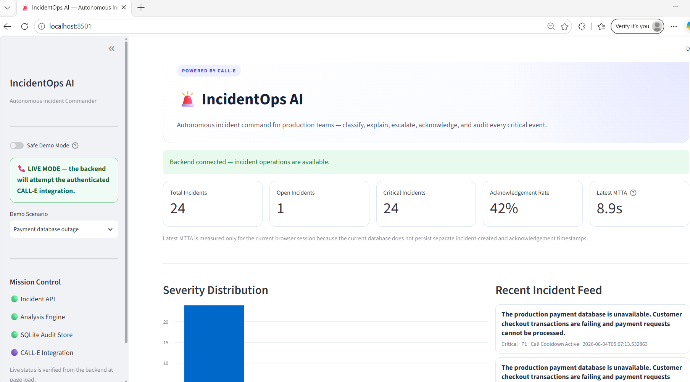
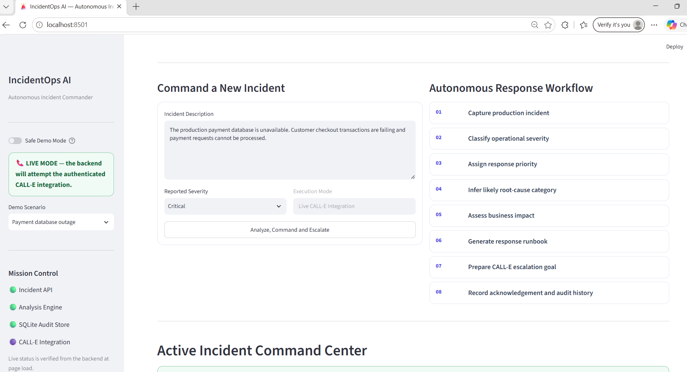
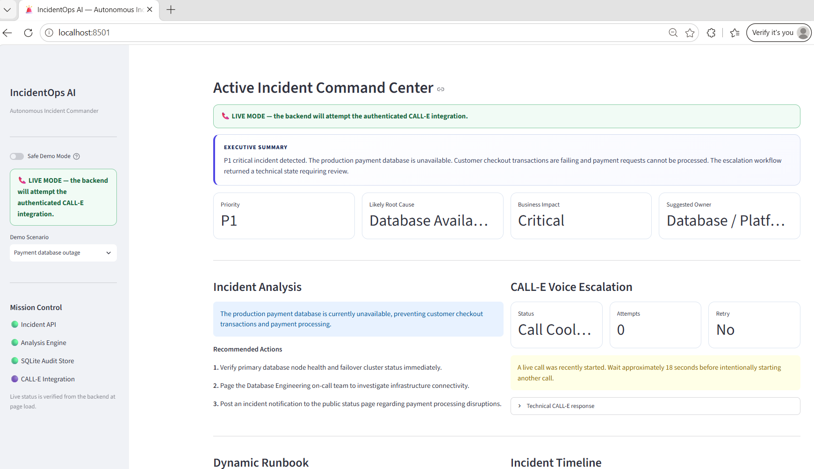
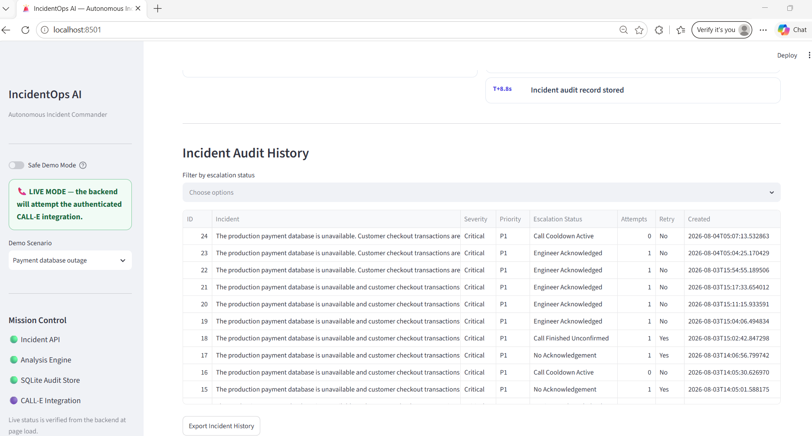
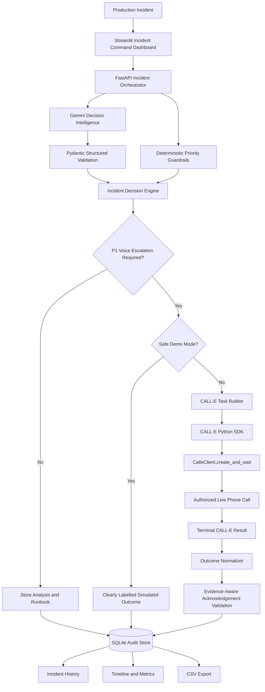

<p align="center">
  
</p>

<h1 align="center">🚨 IncidentOps AI</h1>

<p align="center">
  <strong>Autonomous Incident Commander powered by Gemini and CALL-E</strong>
</p>

<p align="center">
  IncidentOps AI transforms a production outage into an explainable response decision,
  an authorized live phone escalation, and an auditable operational outcome
  in one controlled agent workflow.
</p>

<p align="center">
  <strong>Observe → Analyze → Decide → Call → Track</strong>
</p>

<p align="center">
  <a href="#live-demo">Live Demo</a> ·
  <a href="#how-it-works">How It Works</a> ·
  <a href="#system-architecture">Architecture</a> ·
  <a href="#local-setup">Local Setup</a> ·
  <a href="#safety-and-operational-guardrails">Safety</a>
</p>

---

## Why IncidentOps AI

Monitoring systems are good at detecting failures, but detection is only the beginning.

During a critical incident, responders still need to:

- understand what happened;
- estimate business impact;
- determine severity and priority;
- identify the most appropriate engineering owner;
- prepare immediate response actions;
- contact the on-call engineer;
- confirm whether the incident was acknowledged;
- record the result for audit and follow-up.

That coordination gap increases **Mean Time to Acknowledge (MTTA)** and can extend customer-facing downtime.

**IncidentOps AI closes the gap between alert detection and operational ownership.**

It combines:

- **Gemini decision intelligence** for structured incident analysis;
- **deterministic guardrails** for reliable severity and escalation decisions;
- **CALL-E live voice execution** for authorized phone escalation;
- **evidence-aware outcome interpretation** for acknowledgement and ownership;
- **SQLite audit history** for traceability;
- **Safe Demo Mode** for transparent, zero-call demonstrations.

---

## Proven End-to-End Workflow

The project has been tested as a real working system, not only as a mock interface.

### Verified capabilities

- Gemini generated a structured incident assessment for a critical production outage.
- Deterministic guardrails mapped the incident to the correct escalation path.
- CALL-E successfully placed an authorized English-language outbound call to a Thai mobile number.
- The application received a real CALL-E terminal result containing:
  - call identifier;
  - provider status;
  - summary;
  - evidence;
  - completion confidence;
  - task-completion state;
  - acknowledgement interpretation;
  - ownership interpretation;
  - retry availability.
- The application stored the incident and escalation result in SQLite.
- The Streamlit dashboard displayed the analysis, runbook, call outcome, timeline, metrics, and incident history.
- Duplicate-call locking, cooldown controls, and per-process call limits prevented accidental repeated calls.

> **Important:** A provider-level `COMPLETED` status is not automatically treated as engineer acknowledgement. IncidentOps AI only marks acknowledgement when the returned outcome evidence supports it.

---

## Live Demo

### Video

**IncidentOps AI — Autonomous Incident Commander | Gemini + CALL-E Live Demo*

```text
https://youtu.be/2A_CYpnxv-A
```

### What the live demo shows

1. A critical payment-database incident is submitted.
2. Gemini produces structured decision intelligence.
3. The system applies deterministic response guardrails.
4. IncidentOps AI builds a constrained CALL-E phone objective.
5. CALL-E places a real authorized outbound call.
6. The system receives and normalizes the terminal call result.
7. The incident and call outcome appear in the operational dashboard and audit history.

---

## Product Screenshots

### Incident Command Dashboard

<p align="center">
  
</p>

### Gemini Decision Intelligence

<p align="center">
  
</p>

### CALL-E Voice Escalation

<p align="center">
  
</p>

### Auditable Incident History

<p align="center">
  
</p>

---

## What IncidentOps AI Does

IncidentOps AI acts as an autonomous incident commander for SRE, DevOps, cloud operations, and production-support teams.

For each incident, the system:

1. receives the incident description and severity;
2. validates and normalizes the request;
3. asks Gemini for structured operational analysis;
4. applies deterministic priority and escalation guardrails;
5. generates a dynamic incident-response runbook;
6. decides whether voice escalation is required;
7. creates a goal-driven CALL-E task for P1 incidents;
8. places one authorized live call or runs in Safe Demo Mode;
9. interprets acknowledgement conservatively from returned outcome evidence;
10. records the complete incident and escalation result;
11. displays the workflow in an operator-focused dashboard.

---

## Why This Is an Agent

IncidentOps AI does more than summarize text or display a chatbot response.

It follows a complete agent loop:

### 1. Observe

The system receives a production incident, severity, affected service, and operational context.

### 2. Analyze

Gemini produces structured incident intelligence:

- executive summary;
- recommended priority;
- root-cause hypothesis;
- business-impact assessment;
- suggested engineering owner;
- immediate response recommendations.

### 3. Decide

Deterministic guardrails verify the priority and decide whether the incident requires live voice escalation.

This hybrid design prevents the workflow from relying entirely on probabilistic output.

### 4. Call

For a P1 incident, IncidentOps AI creates a constrained phone objective and delegates the authorized real-world action to CALL-E.

### 5. Track

The application interprets the terminal CALL-E result, records the outcome, and exposes the incident through history, timeline, metrics, and CSV export.

---

## How It Works

```text
Production Incident
        │
        ▼
Streamlit Incident Command Dashboard
        │
        ▼
FastAPI Incident Orchestrator
        │
        ├──────────────► Gemini Structured Analysis
        │                    │
        │                    ▼
        │              Pydantic Validation
        │                    │
        ├──────────────► Deterministic Guardrails
        │                    │
        └───────────────┬────┘
                        ▼
                Escalation Decision
                        │
             ┌──────────┴──────────┐
             │                     │
             ▼                     ▼
       Safe Demo Mode        CALL-E Live Mode
                                   │
                                   ▼
                         Authorized Phone Call
                                   │
                                   ▼
                    Summary · Evidence · Status
                    Acknowledgement · Ownership
                                   │
                                   ▼
                         SQLite Audit History
                                   │
                                   ▼
                 Metrics · Timeline · CSV Export
```

---

## System Architecture



### Safety controls around live calls

- explicit live-call enablement;
- operator-controlled Safe Demo Mode;
- E.164 phone validation;
- duplicate-call lock;
- configurable cooldown;
- per-process live-call limit;
- no automatic redial;
- masked phone logging;
- conservative acknowledgement classification;
- no password, one-time-code, payment, or sensitive-data requests.

---

## Gemini Decision Intelligence

IncidentOps AI uses Gemini to turn an unstructured outage description into an operationally useful response object.

### Structured fields

```text
priority
summary
root_cause
business_impact
owner
recommendation[]
```

### Why structured output matters

The application does not treat the model response as presentation-only text.

The structured result is used to:

- populate the incident command dashboard;
- support the escalation decision;
- create the CALL-E phone objective;
- generate the dynamic response runbook;
- store consistent audit data.

### Deterministic fallback

If Gemini is unavailable, times out, or reaches a quota limit, IncidentOps AI falls back to deterministic analysis so the core incident workflow remains operational.

This design improves:

- resilience;
- predictable behavior;
- demo reliability;
- operational continuity.

---

## CALL-E Live Voice Execution

IncidentOps AI uses the CALL-E Python SDK:

```python
from calle import CalleClient
```

The live workflow executes one goal-driven phone task:

```python
client = CalleClient(api_key=api_key)

call = client.calls.create_and_wait(
    task=task,
)
```

### Phone objective

The CALL-E task instructs the voice agent to:

- identify itself as an automated IncidentOps AI caller;
- communicate the incident summary and priority;
- request explicit acknowledgement;
- ask whether the recipient accepts ownership;
- ask for the immediate next action;
- request an estimated mitigation-start time when available;
- leave a concise incident message if voicemail answers;
- avoid requesting credentials or sensitive information;
- return a clear terminal summary.

### Normalized operational result

The backend converts the provider result into application-level fields:

```text
success
status
message
attempts
retry_available
acknowledgement
task_completed
call_id
completion_confidence
structured_result
evidence
transcript
raw_response
```

### Evidence-aware acknowledgement

The first implementation risked finding the word `acknowledge` inside the original task prompt.

The final implementation intentionally excludes the original prompt from acknowledgement inference and checks only provider outcomes such as:

- summary;
- evidence;
- recipient result;
- attempts;
- transcript turns when available.

Negative evidence is evaluated before positive evidence to reduce false-positive acknowledgement.

---

## Safe Demo Mode vs Live Mode

| Capability | Safe Demo Mode | Live Mode |
|---|---:|---:|
| Gemini incident analysis | Yes | Yes |
| Deterministic guardrails | Yes | Yes |
| Dynamic runbook | Yes | Yes |
| Real outbound phone call | No | Yes |
| CALL-E credits used | No | Potentially |
| Simulated result clearly labelled | Yes | Not applicable |
| SQLite audit record | Yes | Yes |
| Recommended for public demos | Yes | Only when authorized |

Safe Demo Mode exists to demonstrate the complete workflow safely without creating a real-world side effect.

Live Mode should only be used with a phone number that the operator owns or is explicitly authorized to contact.

---

## Reliability and Operational Guardrails

### No automatic redial

Each intentional request creates at most one live call attempt.

The application does not automatically retry a failed, unanswered, or unacknowledged call.

### Duplicate-call protection

A non-blocking process lock prevents two concurrent live calls from being created by repeated button clicks.

### Call cooldown

A configurable cooldown blocks a new live call for a short period after the previous call starts.

### Per-process live-call limit

The backend limits the number of real calls that can be created during one process lifetime.

Restarting the backend resets this in-process counter.

### Conservative outcome classification

A completed provider workflow is not assumed to mean:

- the engineer answered;
- the engineer acknowledged;
- ownership was accepted;
- mitigation began.

The application separates:

- provider completion;
- business-task completion;
- acknowledgement;
- ownership;
- retry availability.

### Audit preservation

Even when CALL-E cannot complete the phone objective, the incident analysis and outcome are preserved for review.

---

## Technology Stack

| Layer | Technology |
|---|---|
| Incident command interface | Streamlit |
| Backend API and orchestration | FastAPI |
| Decision intelligence | Gemini |
| Structured validation | Pydantic |
| Voice execution | CALL-E Python SDK |
| Database ORM | SQLAlchemy |
| Audit database | SQLite |
| Reporting | Pandas |
| Runtime | Python |
| Local development | Windows PowerShell / VS Code |

---

## Repository Structure

```text
incidentops-ai/
├── assets/
│   ├── hero-banner.png
│   ├── diagrams/
│   ├── demo/
│   │   └── incidentops-ai-live-call-demo.mp4   # Local only; not committed
│   └── screenshots/
│       ├── dashboard-overview.png
│       ├── ai-insights.png
│       ├── call-e-escalation.png
│       └── incident-history.png
│
├── backend/
│   ├── app/
│   │   ├── main.py
│   │   ├── config.py
│   │   ├── database.py
│   │   ├── models/
│   │   │   └── incident.py
│   │   ├── routes/
│   │   │   └── incident.py
│   │   └── services/
│   │       ├── analyzer.py
│   │       ├── gemini_service.py
│   │       ├── calle_service.py
│   │       └── llm_service.py
│   ├── .env.example
│   ├── create_db.py
│   └── requirements.txt
│
├── dashboard.py
├── README.md
└── .gitignore
```

---

## Local Setup

### Prerequisites

- Python 3.12 or compatible Python 3.x runtime;
- Git;
- a Gemini API key;
- a CALL-E API key for Live Mode;
- an authorized E.164 phone number for Live Mode.

### 1. Clone the repository

```powershell
git clone https://github.com/NatthidaSirapongkulpoj/incidentops-ai.git
cd incidentops-ai
```

### 2. Create the virtual environment

```powershell
cd backend

python -m venv .venv
.\.venv\Scripts\Activate.ps1
```

### 3. Install dependencies

```powershell
python -m pip install --upgrade pip
python -m pip install -r requirements.txt
```

### 4. Configure environment variables

```powershell
Copy-Item .env.example .env
```

Open `backend/.env` and replace placeholders with local credentials.

### 5. Initialize the database

```powershell
python create_db.py
```

### 6. Start the FastAPI backend

```powershell
python -m uvicorn app.main:app --reload --host 127.0.0.1 --port 8000
```

Expected local backend:

```text
http://127.0.0.1:8000
```

### 7. Start the Streamlit dashboard

Open a second PowerShell terminal:

```powershell
cd C:\path\to\incidentops-ai
.\backend\.venv\Scripts\Activate.ps1

python -m streamlit run dashboard.py
```

Expected local dashboard:

```text
http://localhost:8501
```

---

## Environment Variables

Example `backend/.env`:

```env
# Gemini
GEMINI_API_KEY=YOUR_GEMINI_API_KEY
GEMINI_MODEL=gemini-3.6-flash
GEMINI_TIMEOUT_MS=30000

# Compatibility values currently required by application configuration
OPENAI_API_KEY=NOT_USED
LLM_MODEL=gemini-3.6-flash

# CALL-E
CALLE_API_KEY=YOUR_CALLE_API_KEY
CALLE_LANGUAGE=English
ONCALL_PHONE=YOUR_AUTHORIZED_E164_PHONE_NUMBER

# Live-call safeguards
CALLE_LIVE_CALLS_ENABLED=false
CALLE_MAX_LIVE_CALLS_PER_PROCESS=1
CALLE_CALL_COOLDOWN_SECONDS=60

# Dashboard default
SAFE_DEMO_MODE=true
```

### Recommended public-demo configuration

```env
CALLE_LIVE_CALLS_ENABLED=false
CALLE_MAX_LIVE_CALLS_PER_PROCESS=1
CALLE_CALL_COOLDOWN_SECONDS=60
SAFE_DEMO_MODE=true
```

### Intentional authorized live-test configuration

```env
CALLE_LIVE_CALLS_ENABLED=true
CALLE_MAX_LIVE_CALLS_PER_PROCESS=1
CALLE_CALL_COOLDOWN_SECONDS=60
SAFE_DEMO_MODE=false
```

After changing `.env`, restart the backend.

---

## Security

Never commit:

- `backend/.env`;
- Gemini API keys;
- CALL-E API keys;
- full private phone numbers;
- unredacted private transcripts;
- local database files;
- temporary live-call test scripts.

Recommended checks before every push:

```powershell
git status

git grep --cached -n -E "AIza[0-9A-Za-z_-]{20,}|iams_live_[0-9A-Za-z_-]{20,}|sk-[0-9A-Za-z_-]{20,}"

git grep --cached -n -E "\+66[0-9]{8,13}"

git diff --cached --check
```

---

## Operational Safety

Live Mode creates a real-world phone side effect.

Use it only when all conditions are true:

- the destination number belongs to you or an authorized recipient;
- the recipient expects the test;
- `CALLE_LIVE_CALLS_ENABLED=true` was set intentionally;
- Safe Demo Mode was deliberately disabled;
- you understand that the call may consume CALL-E credits.

The voice objective explicitly prohibits requesting:

- passwords;
- authentication codes;
- payment information;
- financial details;
- sensitive personal information.

To disable all real calls:

```env
CALLE_LIVE_CALLS_ENABLED=false
```

To stop the local backend:

```text
Ctrl + C
```

---

## Example Incident

```text
Severity: Critical

The production payment database is unavailable, preventing customer
checkout transactions from completing.
```

Expected workflow:

```text
Critical incident
    ↓
P1 classification
    ↓
Gemini structured operational analysis
    ↓
Database Reliability Engineering ownership recommendation
    ↓
Immediate database health and failover checks
    ↓
CALL-E voice escalation
    ↓
Terminal result and evidence
    ↓
Auditable incident record
```

---

## Key Engineering Decisions

### Hybrid intelligence instead of model-only control

Gemini generates rich operational analysis, while deterministic guardrails retain control over priority and escalation.

### Task-only CALL-E execution

The tested CALL-E account successfully executed live calls through a task-only request.

The live implementation therefore uses:

```python
client.calls.create_and_wait(task=task)
```

and does not require provider-enforced `result_schema`.

### Application-level result normalization

The normal CALL-E terminal result is converted into a stable application-level response contract.

This keeps the dashboard and audit workflow consistent even when provider fields are nested or optional.

### Evidence before confidence

Acknowledgement is determined from actual outcome evidence, not from the presence of positive words in the original phone instruction.

### Controlled real-world action

Live-call enablement, locking, cooldown, process limits, and no automatic retry reduce accidental or repeated external side effects.

---

## Challenges We Solved

### 1. Planning was not execution

An early integration path could prepare a call plan but did not prove that a real call had occurred.

The final system uses the CALL-E Python SDK and `create_and_wait()` to execute and wait for the terminal result.

### 2. Structured schema support differed by account or channel

The tested live path rejected `result_schema`.

Instead of blocking the project, IncidentOps AI uses the normal CALL-E terminal result and performs conservative application-level normalization.

### 3. Provider completion did not equal business completion

A completed call workflow could still contain:

- no live response;
- no acknowledgement;
- unknown ownership;
- a retry recommendation.

The final classifier keeps these concepts separate.

### 4. Prompt text caused a false-positive risk

The original task naturally contains phrases such as “ask the engineer to acknowledge.”

The final parser excludes task instructions from acknowledgement detection and evaluates outcome-only data.

### 5. External services can fail

Gemini fallback, CALL-E failure handling, audit persistence, and Safe Demo Mode keep the product demonstrable and operational under imperfect conditions.

---

## Current Limitations

- The project uses SQLite for local demonstration rather than a production database.
- The current workflow targets one configured on-call number.
- Live calls run synchronously through `create_and_wait()`.
- Multi-responder escalation ladders are not yet implemented.
- Authentication and role-based access control are not yet included.
- The application does not automatically retry calls.
- A production deployment would require stronger observability, secrets management, and asynchronous job handling.

These limitations are deliberate trade-offs for a safe, understandable, and fully demonstrable hackathon prototype.

---

## Roadmap

### Near term

- multi-responder escalation;
- service-to-owner directory;
- configurable escalation policies;
- asynchronous CALL-E task tracking;
- webhook-based call updates;
- PostgreSQL persistence;
- user authentication and role-based access;
- incident collaboration-room creation.

### Longer term

- integration with monitoring and observability platforms;
- Slack, Teams, PagerDuty, and ticketing integration;
- incident timeline summarization;
- post-incident review generation;
- escalation analytics;
- response-quality scoring;
- multilingual voice escalation;
- production deployment with secrets management and distributed job control.

---

## Hackathon Submission

### Project

```text
IncidentOps AI
```

### Tagline

```text
Autonomous Incident Commander powered by Gemini and CALL-E
```

### Main repository

```text
https://github.com/NatthidaSirapongkulpoj/incidentops-ai
```

### Public demo video

```text
https://youtu.be/2A_CYpnxv-A
```

### CALL-E Awesome Phone Call Agents Pull Request

```text
Submitted through this repository contribution
```

### Built With

- CALL-E
- Gemini
- Python
- FastAPI
- Streamlit
- Pydantic
- SQLAlchemy
- SQLite
- Pandas

---

## What Makes IncidentOps AI Different

Traditional monitoring tools stop at sending an alert.

IncidentOps AI continues the operational workflow:

```text
Alert detected
    ↓
Incident understood
    ↓
Priority decided
    ↓
Owner identified
    ↓
Response actions generated
    ↓
On-call engineer contacted
    ↓
Outcome interpreted
    ↓
Audit record preserved
```

The result is not just another dashboard.

It is a controlled autonomous agent that connects AI reasoning with a real-world phone action and an auditable operational outcome.

---

## Author

**Natthida Sirapongkulpoj**

GitHub:

```text
https://github.com/NatthidaSirapongkulpoj
```

---

<p align="center">
  <strong>IncidentOps AI</strong><br>
  Observe · Analyze · Decide · Call · Track
</p>

<p align="center">
  Gemini Decision Intelligence + CALL-E Live Voice Execution
</p>
