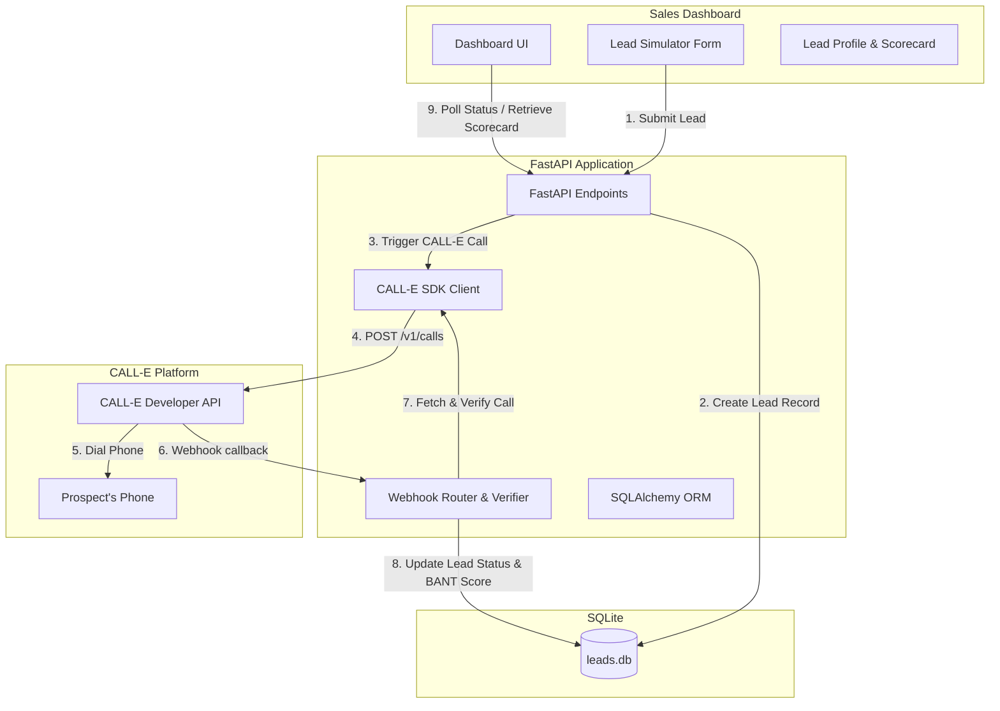

# LeadQualify // CALL-E Automated Lead Qualification Agent

LeadQualify is a production-ready, AI-first outbound voice agent that qualifies incoming sales leads in real time. Built on top of the **CALL-E Developer Platform**, LeadQualify dials new prospects within seconds of form submission, conducts a structured conversational interview to collect BANT (Budget, Authority, Need, Timeline) metrics, and updates a premium glassmorphism sales dashboard with live transcripts, scorecard grades, and human-agent handoff alerts.

---

## 🚀 Key Features

* **Instant Conversational Callbacks**: Triggers outbound dial tasks to new leads automatically upon form submission.
* **BANT Metrics Extraction**: Uses CALL-E's custom `result_schema` to parse transcripts into strict structured variables (`budget_status`, `timeline_window`, `pain_point`, `interest_level`, `handoff_recommended`).
* **Secure Webhook Handler**: Receives terminal call tasks, validates the `CALL-E-Event-Id` header, and implements origin validation queries to verify authenticity.
* **Premium Glassmorphism Dashboard**: A dark-theme UI with CSS animations, live call alerts, metrics calculations, and messaging-style chat transcript feeds.
* **Intelligent Offline Simulator**: Operates in **Mock Mode** if no API key is set, simulating the complete call lifecycle and webhook callbacks for clean local demonstrations.

---

## 🛠️ Folder Structure

```text
f:\Python Program\Projects\CALL-E Agent\
├── .env                  # Local secret tokens (CALLE_API_KEY)
├── app.py                # Main FastAPI router, endpoints & mock simulation workers
├── config.py             # App configurations, logging, & CALL-E SDK Client init
├── database.py           # SQLite database configuration and SQLAlchemy ORM models
├── playbooks.py          # Prompt templates and CALL-E result extraction schemas
├── schemas.py            # Pydantic validation schemas for API inputs and webhooks
├── README.md             # This comprehensive setup & hackathon portal
├── static/               # Client-side web portal files
│   ├── index.html        # Dashboard main panel
│   ├── styles.css        # Dashboard styling system
│   └── app.js            # Dash state polling and visual transcript streaming
└── tests/
    └── test_app.py       # Pytest suite verifying endpoint routing & security gates
```

---

## 🏗️ Production Architecture



---

## 🔌 API Endpoints

### Lead Management
* **`POST /api/leads`**: Creates a lead record and triggers a CALL-E outbound call.
  * *Request Body*: `{ "name": "...", "phone": "...", "company": "...", "product_interest": "..." }`
* **`GET /api/leads`**: Returns list of all leads, sorted descending by creation date.
* **`GET /api/leads/{id}`**: Returns details of a specific lead (including scorecards and transcripts).

### Webhooks
* **`POST /api/webhook`**: Receives asynchronous terminal webhook callbacks from CALL-E when a call finishes.
  * *Headers Required*: `CALL-E-Event-Id` (must match the body event `id` to pass validation checks).

---

## 📦 Installation & Setup

### Prerequisites
* Python 3.9+
* (Optional) [ngrok](https://ngrok.com/) for exposing the local server to receive live webhooks.

### 1. Install Dependencies
Run the package installation:
```bash
pip install fastapi uvicorn sqlalchemy pydantic python-dotenv pytest httpx calle-ai
```

### 2. Configure Environment Variables
Create a `.env` file in the project root:
```ini
# Leave CALLE_API_KEY blank to run in local Mock Mode
CALLE_API_KEY="your_calle_api_key"
CALLE_BASE_URL="https://api.heycall-e.com"
# CALL-E's official US English testing hotline. Set this to the lead phone
# only when that destination region/language is supported for your account.
CALLE_CALL_RECIPIENT="+12763229632"

# Server configurations
PORT=8000
DATABASE_URL="sqlite:///./leads.db"

# Webhook Endpoint (e.g. ngrok forwarding URL)
# Required only in live mode
WEBHOOK_URL="https://your-ngrok-subdomain.ngrok-free.app/api/webhook"
```

### 3. Exposing Live Webhook Endpoint (Live Mode Only)
If utilizing a live API key, start an HTTP tunnel using ngrok in a separate terminal:
```bash
ngrok http 8000
```
Copy the forwarding URL (e.g. `https://1234.ngrok-free.app`) and paste it as `WEBHOOK_URL` in your `.env` file, appending `/api/webhook` (e.g. `https://1234.ngrok-free.app/api/webhook`).

### 4. Running the Server
Launch the FastAPI development environment:
```bash
uvicorn app:app --reload --port 8000
```
Open your browser and navigate to **`http://localhost:8000`** to view the LeadQualify dashboard.

### 5. Running Automated Tests
Run the pytest suite to verify database operations and validation limits:
```bash
python -m pytest
```

---

## 🏆 Devpost Submission Materials

### 1. Project Description
**LeadQualify** is an AI-first sales development representative (SDR) that instantly calls inbound leads, qualifies them based on BANT framework parameters (Budget, Authority, Need, Timeline), and flags hot leads for immediate human handoff. It combines standard webhooks with CALL-E's conversational extraction engine to replace hours of slow manual calling with instant, data-dense responses.

### 2. Problem Statement
For sales teams, speed-to-lead is everything. If a prospect is not contacted within 5 minutes of filling out a form, the chance of qualifying them drops by 80%. However, human sales reps are often busy, in meetings, or dialing other numbers. Leads go cold, and businesses lose millions in potential revenue.

### 3. Solution
LeadQualify solves the speed-to-lead bottleneck by calling prospects within seconds of clicking "Submit". A natural, professional AI voice agent discusses their business challenges, implementation timeline, and budget constraints. The conversation transcript is instantly analyzed, and the results are structured into a clean sales scorecard so that when a human representative takes over, they have all the context they need to close the deal.

### 4. Technology Stack
* **Outbound Voice & Extraction**: CALL-E API & `calle-ai` Python SDK.
* **Backend Core**: FastAPI, Uvicorn, Python.
* **Database**: SQLite, SQLAlchemy ORM.
* **Frontend**: HTML5, Vanilla CSS (glassmorphism tokens), Vanilla JavaScript.
* **Testing**: Pytest, HTTPX TestClient.

### 5. Innovation
Instead of standard robotic phone trees or text-only SMS follow-ups, LeadQualify uses a dynamic conversational voice loop. It combines a natural voice interface with rigorous JSON Schema validation. By translating a fluid phone call into strict data points (e.g., categorizing timeline as "immediate" or "1-3 months"), it bridges the gap between unstructured voice communication and structured CRM systems (like Salesforce or Hubspot).

### 6. Challenges
Implementing origin validation on webhooks was crucial. Because webhook payloads can technically be spoofed, we solved this by implementing an API validation query back to the secure CALL-E servers to verify the final status and contents of the call.

### 7. Future Scope & Impact
* **CRM Integrations**: Directly pushing scorecards to Hubspot, Salesforce, and Zoho.
* **Interactive Calendaring**: Allowing the AI agent to access a rep's calendar and book a Zoom meeting directly during the call using booking APIs.
* **Multi-lingual Support**: Qualifying global leads in Spanish, French, or German based on form input.

---

## 🎙️ 3-Minute Demo Flow

### ⏱️ Minute 0:00 - 0:45: The Problem & Submission
* **What to Show**: Present the Sales Dashboard (showing 0 leads) and open the "Simulate Lead" form.
* **What to Say**: *"Every second counts when a new lead fills out an interest form. Today, I'll show you LeadQualify. Watch how fast we bridge the gap between form submission and conversational qualification."*
* **Action**: Fill in Name ("Bruce Wayne"), Phone (your phone number or test number), Company ("Wayne Enterprises"), choose "AI Customer Support Agent", and click **Submit**.

### ⏱️ Minute 0:45 - 2:00: The Call (WOW Moment)
* **What to Show**: The dashboard immediately updates with a ringing indicator, and an active dial widget slides into view.
* **What to Say**: *"As soon as the lead clicks submit, our FastAPI backend registers them in the database and triggers an outbound call via CALL-E. In Mock Mode, the agent simulates the call; in Live Mode, my phone is ringing right now."*
* **Action**: (If live) Answer the call and respond to the questions. (If mock) Wait for the 5-second simulated background call to complete.

### ⏱️ Minute 2:00 - 3:00: The Scorecard & AI Analytics
* **What to Show**: Select the lead from the queue. The BANT Scorecard instantly populates (Timeline: Immediate, Budget: Approved, Handoff: Recommended) and the complete messaging-style transcript loads.
* **What to Say**: *"Once the call ends, CALL-E compiles the transcript and extracts structured data according to our validation schema. Looking at Bruce's profile, our AI SDR qualified him automatically because his budget is approved and his timeline is immediate. A human sales representative can take over with full context of the conversation!"*
