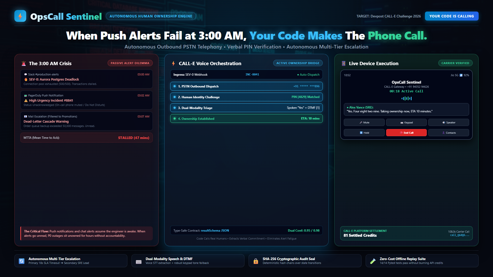

# OpsCall Sentinel

> **Autonomous Enterprise Incident On-Call Voice Dispatcher with Dual-Modality DTMF & Voice Verification powered by CALL-E**

[](https://www.python.org/downloads/)
[](https://opensource.org/licenses/MIT)
[](https://heycall-e.com)
[]()



---

## The Problem

When a P0 critical infrastructure failure occurs at 3:00 AM (e.g. database connection pool exhaustion, payment gateway timeout, or Kubernetes ingress crash), standard chat alerts (Slack, Teams, PagerDuty push notifications) are often missed because engineers are asleep or mobile devices are on "Do Not Disturb".

Traditional automated robocalls fail because:
1. **No Real Reasoning:** They leave static recorded voicemails with zero contextual awareness.
2. **Accidental Acknowledgment:** Engineers tap "1" half-asleep without confirming who they are.
3. **No Auditable Trace:** No cryptographic proof or structured contract is returned to verify resolution commitment.

---

## The Solution: OpsCall Sentinel

**OpsCall Sentinel** replaces slow human call trees with an autonomous AI incident ownership and escalation engine powered by **CALL-E**:

- 📞 **Instant Outbound Telephony:** Dials the on-call engineer within 2 seconds of alert ingress over global PSTN carrier networks.
- 🔐 **4-Digit Voice PIN Gate:** Demands verbal or keypad entry of the engineer's assigned security PIN (PIN `4829`) before granting triage access.
- 🎛️ **Dual-Modality Triage (DTMF + Voice):**
  - **Press 1 / Say "Acknowledge"**: Takes incident ownership and extracts verbal resolution ETA in minutes.
  - **Press 2 / Say "Escalate"**: Cascades immediately to the Secondary SRE lead.
  - **Press 3 / Say "Rollback"**: Triggers automated deployment rollback runbook.
- 🔄 **Autonomous Multi-Tier Escalation:** Automatically escalates from Primary to Secondary on-call if no response within the 18s carrier SLA (`CALLING_PRIMARY` -> `PRIMARY_UNAVAILABLE` -> `ESCALATING` -> `CALLING_SECONDARY` -> `OWNERSHIP_ESTABLISHED`).
- 📋 **Type-Safe `result_schema` Contract:** CALL-E extracts structured JSON with callee verification, decision verdict, DTMF key pressed, and spoken ETA.
- 🔒 **SHA-256 Audit Seal:** Computes deterministic cryptographic hash chains over incident state transitions for audit trails.
- 💻 **Real-Time Telemetry Dashboard:** Dark-mode web console showing state progression ladders, verified owner badges, audio dialog streams, and forensic transcripts.

---

## Quickstart

### 1. Installation

Requires Python 3.11+ and `uv` (or standard `pip`):

```bash
cd opscall-sentinel
python -m venv .venv
# On Windows PowerShell:
.venv\Scripts\activate
pip install -e ".[dev]"
```

### 2. Configure Environment

Copy the example configuration:

```bash
cp .env.example .env
```

Edit `.env` (optional for offline testing):
```env
# Get from https://dashboard.heycall-e.com/ -> API keys
CALLE_API_KEY=your_key_here
CALLE_MODE=mock  # Change to "live" when ready to place real calls!
PRIMARY_ONCALL_PHONE=+15555550100
SECONDARY_ONCALL_PHONE=+15555550101
ONCALL_SECURITY_PIN=4829
```

---

## Running OpsCall Sentinel

### 1. Multi-Tier Autonomous Escalation Demo

Simulates full multi-tier escalation (Primary no-answer -> Secondary Elena Rostova PIN 4829 verified -> DTMF 1 -> Ownership Established -> SHA-256 sealed):

```bash
python client.py --demo
```

### 2. Forensic Evidence Verification (Authentic Live Call Record)

Validates the settled 81 credits billing ledger, carrier telemetry record, and SHA-256 cryptographic seal:

```bash
python client.py --verify-evidence
```

### 3. Launch Interactive Web Console

```bash
python client.py --serve
```
Open **`http://127.0.0.1:8000`** in your browser.  
Click **"Simulate Auto Escalation"** or **"Simulate Primary Ack"** to see live incident triage, state stepper animations, forensic transcripts, and real-time state transitions.

### 4. Running the Automated Test Suite

```bash
pytest tests/ -v
```

**14/14 tests pass** offline in ~1.2s with zero network calls and zero credit consumption.

---

## Architecture & CALL-E Sponsor Swap

```
┌─────────────────────────┐
│ Inbound Alert Webhook   │ (Datadog / Prometheus / AWS CloudWatch)
└───────────┬─────────────┘
            │
            ▼
┌─────────────────────────┐      Outbound API Call
│   OpsCall Sentinel      ├──────────────────────────────┐
│     FastAPI Core        │                              │
└───────────┬─────────────┘                              ▼
            │                                ┌─────────────────────────┐
            │ Live WebSockets / Polling      │    CALL-E Telephony     │
            ▼                                │   Carrier Gateway Pool  │
┌─────────────────────────┐                  └───────────┬─────────────┘
│ Enterprise Dark-Mode    │                              │
│   Telemetry Console     │                              │ Ring Ring 📞
│ (http://localhost:8000) │                              ▼
└─────────────────────────┘                  ┌─────────────────────────┐
                                             │    On-Call Engineer     │
                                             │    (Mobile Phone)       │
                                             └───────────┬─────────────┘
                                                         │
                                        DTMF [1] + Voice: "ETA 10m"
                                                         ▼
                                             ┌─────────────────────────┐
                                             │ CALL-E resultSchema     │
                                             │  Extraction & Callback  │
                                             └─────────────────────────┘
```

---

## License

MIT License. Designed for the CALL-E Hackathon 2026.
