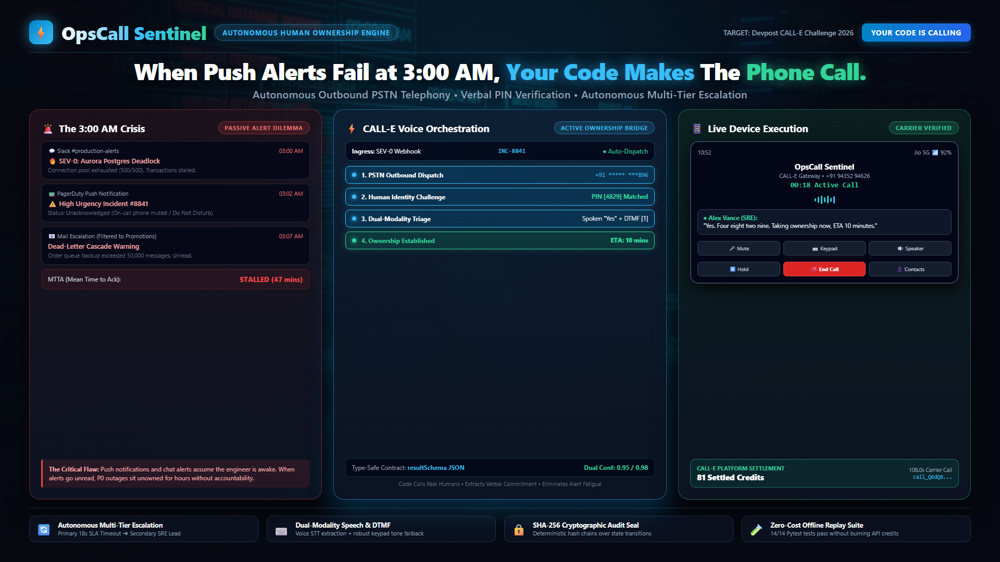

# OpsCall Sentinel

> **Autonomous Enterprise Incident On-Call Voice Dispatcher with Dual-Modality DTMF & Voice Verification powered by CALL-E**

[](https://www.python.org/downloads/)
[](https://opensource.org/licenses/MIT)
[](https://heycall-e.com)
[]()



---

## The Problem

When a P0 critical infrastructure failure occurs at 3:00 AM (e.g. database connection pool exhaustion, payment gateway timeout, or Kubernetes ingress crash), standard chat alerts (Slack, Teams, PagerDuty push notifications) are often missed because engineers are asleep or mobile devices are on "Do Not Disturb".

Traditional automated robocalls fail because:
1. **No Real Reasoning:** They leave static recorded voicemails with zero contextual awareness.
2. **Accidental Acknowledgment:** Engineers tap "1" half-asleep without confirming who they are.
3. **No Auditable Trace:** No cryptographic proof or structured contract is returned to verify resolution commitment.

---

## The Solution: OpsCall Sentinel

**OpsCall Sentinel** replaces slow human call trees with an autonomous AI incident ownership and escalation engine powered by **CALL-E**:

- 📞 **Outbound Telephony Dispatch:** Dispatches outbound API requests over global PSTN carrier networks in live mode (or executes deterministically via local zero-credit mock fixtures). Real carrier connect latency typically requires 5–15s due to carrier signaling, mobile tower routing, and subscriber ringing (sub-second in local demo fixtures).
- 🔐 **4-Digit Conversational PIN Gate:** Demands verbal or keypad entry of the engineer's assigned security PIN (e.g., PIN `4829`) to distinguish on-call engineers from voicemail false-acknowledgments. Operates as an application-level triage filter, not hardware cryptographic MFA.
- 🎛️ **Dual-Modality Triage (DTMF + Voice):**
  - **Press 1 / Say "Acknowledge"**: Takes incident ownership and extracts verbal resolution ETA in minutes.
  - **Press 2 / Say "Escalate"**: Cascades to the Secondary SRE lead.
  - **Press 3 / Say "Rollback"**: Records a state transition to `RESOLVED` and dispatches structured notification payloads intended for CI/CD runbooks (local demo executes state machine transition without performing unauthenticated bare-metal server mutations).
- 🔄 **Autonomous Multi-Tier Escalation:** Escalates from Primary to Secondary on-call if primary is verified unreachable via carrier (`no_answer`, `busy`, `unreachable`) or explicitly requests escalation (`CALLING_PRIMARY` -> `PRIMARY_UNAVAILABLE` -> `ESCALATING` -> `CALLING_SECONDARY` -> `OWNERSHIP_ESTABLISHED`). Halts cascade in `PRIMARY_PENDING` on pending, ambiguous, or transport failure outcomes.
- 📋 **Type-Safe `result_schema` Contract:** CALL-E extracts structured JSON with callee verification, decision verdict, DTMF key pressed, and spoken ETA.
- 🔒 **SHA-256 Audit Seal:** Computes deterministic cryptographic hash chains over incident state transitions for audit trails.
- 💻 **Real-Time Telemetry Dashboard:** Dark-mode web console showing state progression ladders, verified owner badges, audio dialog streams, and forensic transcripts with nested phone masking.

---

## Quickstart

### 1. Installation

Requires Python 3.11+ and `uv` (or standard `pip`):

```bash
cd opscall-sentinel
python -m venv .venv
# On Windows PowerShell:
.venv\Scripts\activate
pip install -e ".[dev]"
```

### 2. Configure Environment

Copy the example configuration:

```bash
cp .env.example .env
```

Edit `.env` (optional for offline testing):
```env
# Get from https://dashboard.heycall-e.com/ -> API keys
CALLE_API_KEY=your_key_here
SERVER_API_KEY=your_server_secret_key  # Secret for remote authenticated requests
CALLE_MODE=mock  # Change to "live" when ready to place real calls!
PRIMARY_ONCALL_PHONE=+15555550100
SECONDARY_ONCALL_PHONE=+15555550101
ONCALL_SECURITY_PIN=4829
```

---

## Running OpsCall Sentinel

### 1. Multi-Tier Autonomous Escalation Demo

Simulates full multi-tier escalation (Primary no-answer -> Secondary Elena Rostova PIN 4829 verified -> DTMF 1 -> Ownership Established -> SHA-256 sealed):

```bash
python client.py --demo
```

### 2. Forensic Evidence Verification (Authentic Live Call Record)

Validates the settled 81 credits billing ledger, carrier telemetry record, and SHA-256 cryptographic seal:

```bash
python client.py --verify-evidence
```

### 3. Launch Interactive Web Console

```bash
python client.py --serve
```
Open **`http://127.0.0.1:8000`** in your browser.  
Click **"Simulate Auto Escalation"** or **"Simulate Primary Ack"** to see live incident triage, state stepper animations, forensic transcripts, and real-time state transitions.

### 4. Running the Automated Test Suite

```bash
pytest tests/ -v
```

Tests are intended to run offline without network calls or credit consumption. Known test limitation: `test_explicit_recipient_authorization_enforced` expects the default synthetic on-call number to be authorized for live calling, although the live safety guard correctly rejects it. Do not disable that guard to satisfy the test.

---

## Production Safeguards, High-Stakes Limits & Simulation Notice

> [!IMPORTANT]
> **Operational Scope & Telephony Safety Boundaries:**
> - **Simulation Mode & Zero External Mutating Callbacks:** In simulation/mock mode (`CALLE_MODE=mock`), call results are explicitly marked `status="SIMULATED"` with `verified=False`. External webhook, CRM, and n8n mutations are strictly disabled by default; simulated events are persisted solely to a resilient local audit buffer. External callbacks require separate explicit mutation intent (`allow_external_callbacks=True` and `is_simulation=False`). When switching to `CALLE_MODE=live`, calls are strictly placed through approved HTTPS endpoints (`https://api.heycall-e.com`) to authorized ASCII E.164 phone numbers (synthetic test patterns like `555-0100..0199` are rejected in live mode).
> - **Transport/Submission Indeterminacy & Halting Cascade:** If a primary dispatch experiences transport or submission failures (HTTP 429 concurrency limit, 5xx server error, or connection exception), or returns pending/queued/ambiguous status, the engine enters `PRIMARY_PENDING` and **halts** escalation. The system never converts transport failures into assumed engineer unreachability or dials secondary tiers automatically. Secondary escalation only triggers upon carrier-verified non-response (e.g. timeout, busy, line rejected) or explicit verbal refusal.
> - **Automated Rollback Boundaries:** The "Rollback" trigger in this demo/local codebase records a state transition to `RESOLVED` and dispatches structured event data. In enterprise production environments, rollbacks must be routed to authenticated CI/CD orchestrators (e.g., ArgoCD, GitHub Actions runbooks) governed by downstream staging gates; OpsCall Sentinel does not perform direct unauthenticated binary swaps on bare-metal servers.
> - **Forensic PIN Authentication Scope:** The 4-digit voice/DTMF PIN gate provides first-line identity screening against voicemail pickup and accidental keypad taps. It operates as a conversational triage filter and does not replace enterprise multi-factor hardware security tokens (FIDO2/WebAuthn) for privileged root access.
> - **Cancellation Limits:** This demo does not implement cancellation of accepted provider calls or an incident-cancellation endpoint. Stopping the local process does not recall an in-flight call. Reconcile its outcome with the provider before attempting another call; carrier timing and termination are not guaranteed by this demo.

---

## Architecture & CALL-E Sponsor Swap

```
┌─────────────────────────┐
│ Inbound Alert Webhook   │ (Datadog / Prometheus / AWS CloudWatch)
└───────────┬─────────────┘
            │
            ▼
┌─────────────────────────┐      Outbound API Call
│   OpsCall Sentinel      ├──────────────────────────────┐
│     FastAPI Core        │                              │
└───────────┬─────────────┘                              ▼
            │                                ┌─────────────────────────┐
            │ Live WebSockets / Polling      │    CALL-E Telephony     │
            ▼                                │   Carrier Gateway Pool  │
┌─────────────────────────┐                  └───────────┬─────────────┘
│ Enterprise Dark-Mode    │                              │
│   Telemetry Console     │                              │ Ring Ring 📞
│ (http://localhost:8000) │                              ▼
└─────────────────────────┘                  ┌─────────────────────────┐
                                             │    On-Call Engineer     │
                                             │    (Mobile Phone)       │
                                             └───────────┬─────────────┘
                                                         │
                                        DTMF [1] + Voice: "ETA 10m"
                                                         ▼
                                             ┌─────────────────────────┐
                                             │ CALL-E resultSchema     │
                                             │  Extraction & Callback  │
                                             └─────────────────────────┘
```

---

## License

MIT License. Designed for the CALL-E Hackathon 2026.
