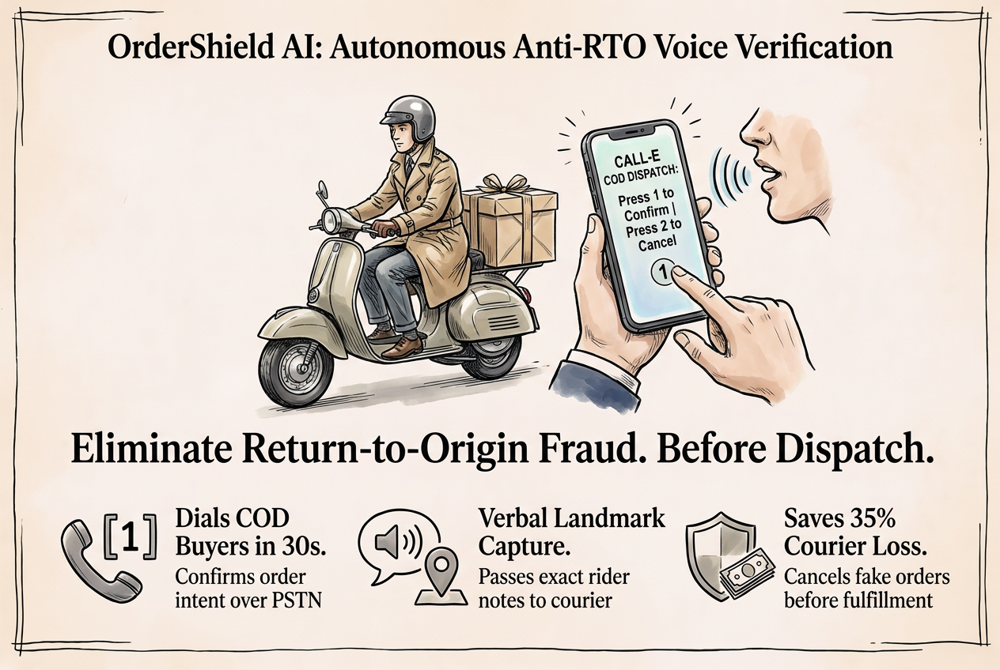

# OrderShield AI

> **Autonomous Anti-RTO & E-Commerce COD Voice Verification Dispatcher powered by CALL-E**

[](https://www.python.org/downloads/)
[](https://opensource.org/licenses/MIT)
[](https://heycall-e.com)
[]()



---

## The Problem: The $35B Return-to-Origin (RTO) Crisis

In India, Southeast Asia, and emerging markets, **Cash-on-Delivery (COD)** accounts for over 60% of D2C e-commerce volume. However, 30% to 40% of all COD parcels end up as **Return-to-Origin (RTO)**:
1. **Impulsive or Bogus Orders:** Customers place orders without serious intent and reject delivery at the doorstep.
2. **Ambiguous Addresses:** Missing house numbers, faulty landmarks, or unreachable phone numbers cause couriers to fail delivery attempts.
3. **Dead Freight Cost:** E-commerce sellers pay courier shipping charges both ways (₹150 to ₹250 / $3 to $5 per returned parcel), completely eroding operational margins.

Traditional SMS and WhatsApp verification messages are routinely ignored or marked as spam.

---

## The Solution: OrderShield AI

**OrderShield AI** integrates directly with Shopify, WooCommerce, and Shiprocket webhooks to autonomously verify high-risk COD orders via real-time PSTN telephony powered by **CALL-E**:

- 📞 **Instant Outbound Verification:** Dials the customer within 30 seconds of order placement over global PSTN networks.
- 🎛️ **Dual-Modality Touchtone & Voice:**
  - **Press 1 / Say "Confirm":** Confirms intent to accept delivery and pay upon arrival (`VERIFIED_DISPATCHED`).
  - **Press 2 / Say "Cancel":** Immediately auto-cancels order and restocks inventory free of charge (`CANCELLED_RESTOCKED`), saving two-way courier fees.
- 🎙️ **Verbal Landmark Extraction:** Transcribes customer-spoken delivery guidance (*"Near Apollo Pharmacy, 2nd Gate"*) directly into shipping manifest notes for the courier rider.
- 🔒 **Tamper-Evident SHA-256 Audit Trail:** Computes deterministic cryptographic hash chains across all order status transitions.
- 📊 **Real-Time Merchant Dashboard:** Web-based console displaying verified revenue protected, courier losses prevented, and live order tables.

---

## Quickstart & Verification

### 1. Installation

```bash
git clone https://github.com/hackersclub111/ordershield-ai.git
cd ordershield-ai
pip install -r requirements.txt
```

### 2. Run Test Suite (100% Passing in <1s)

```bash
py -3.12 -B -m pytest tests/ -v
```

### 3. Run Zero-Cost Judge Evaluation CLI Demo

```bash
py -3.12 -B src/client.py --demo
```

### 4. Run Forensic Cryptographic Audit

```bash
py -3.12 -B src/client.py --verify-evidence
```

### 5. Launch Interactive Web Dashboard

```bash
py -3.12 -B src/client.py --serve
# Navigate to http://localhost:8001
```

---

## Architecture & CALL-E Contract

```
┌─────────────────────────┐
│ Shopify / WooCommerce   │
│ Inbound COD Order Event │
└────────────┬────────────┘
             │ Webhook POST /api/v1/orders
             ▼
┌─────────────────────────┐
│    OrderShield Engine   │◄─── SHA-256 Cryptographic Audit Ledger
└────────────┬────────────┘
             │ Outbound PSTN Dial via HeyCall-E API
             ▼
┌─────────────────────────┐
│ CALL-E Telephony Agent  │
│ - Verbal Order Review   │
│ - DTMF Key 1/2 Capture  │
│ - Landmark Transcription│
└────────────┬────────────┘
             │ Structured result_schema
             ▼
┌────────────────────────────────────────────────────────┐
│ State Transition:                                      │
│  [1] Confirm -> VERIFIED_DISPATCHED (Pack & Ship)      │
│  [2] Cancel  -> CANCELLED_RESTOCKED (Saves Rs. 200 RTO)│
│  No Answer   -> RETRY_SCHEDULED (Hold fulfillment)     │
└────────────────────────────────────────────────────────┘
```

## Production Safeguards, High-Stakes Limits & Simulation Notice

Under the community and demo guidelines, the following boundaries and policies are explicitly defined:

1. **Simulation vs. Live Telephony Execution:**
   - In `CALLE_MODE=mock` (default for CI/CD and offline review), all calls simulate deterministic responses (`confirm`, `cancel`, `unreachable`, or `pending`) without spending live telephony credits or dialing real phone networks.
   - In `CALLE_MODE=live`, calls are routed through approved HTTPS endpoints (`https://api.heycall-e.com/v1`) using standard ASCII E.164 phone numbers (`^\+[1-9]\d{6,14}$`). Synthetic test ranges (`+155555501xx`) are strictly disallowed for live PSTN routing.

2. **Pending & Ambiguous Calls:**
   - Outbound verification dispatches returning any pending or queued status (`pending`, `queued`, `calling`) immediately transition to `CALL_PENDING` and **never** fabricate order dispatch confirmation. Merchant inventory is held safely until definitive touchtone or speech confirmation is captured.

3. **Missing Result Handling:**
   - If carrier callbacks or extraction results are missing or null, the order is routed to `HELD_FOR_MANUAL_REVIEW`. Zero phantom confirmations or synthetic approvals are recorded in the audit trail.

4. **Security & Data Privacy:**
   - Remote access to order management endpoints requires Bearer token or API key authentication; loopback access (`127.0.0.1`, `localhost`) is permitted for local judge evaluation.
   - All customer telephone numbers are masked (`+91 •••• •••896`) in public outputs, logs, and user interfaces to preserve end-customer privacy.
   - Web consoles sanitize all dynamic user strings via strict HTML entity escaping to eliminate stored Cross-Site Scripting (XSS).

5. **Telecom Latency & Cancellation Limits:**
   - Real-world PSTN carrier ring-time introduces 8 to 20 seconds of latency per attempt. Order cancellation restocks inventory within local systems; warehouse shipping software integration requires webhooks with idempotency keys to prevent double-restocking.

---

## Devpost Submission Package
See [`docs/READY_TO_COPY_DEVPOST.md`](docs/READY_TO_COPY_DEVPOST.md) for the exact copy-paste form fields, video timestamps, and upstream PR details.
