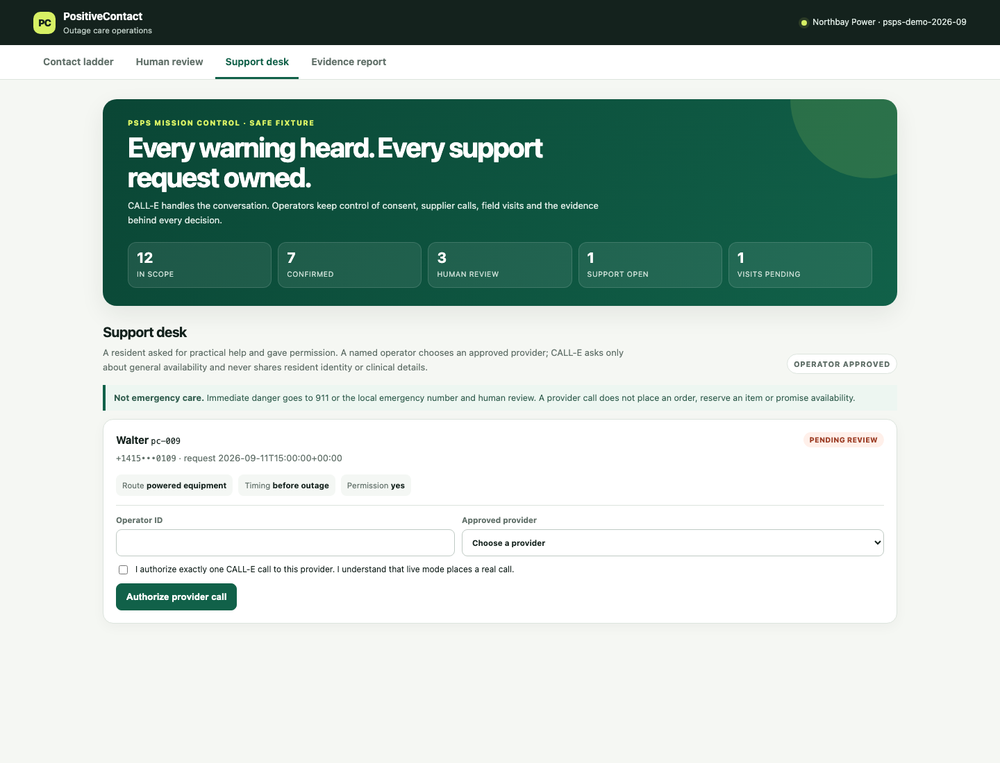
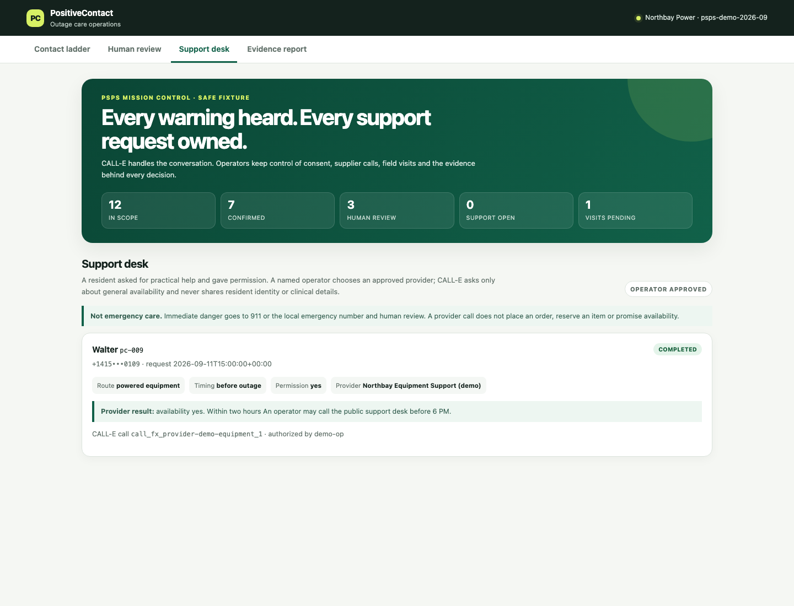

# PositiveContact

**Before a utility switches off power to stop a wildfire, it has to confirm that a real
person heard the warning. Voicemail does not count.**

PositiveContact takes a shutoff event and a customer roster, places one disclosed
[CALL-E](https://www.heycall-e.com/) call per authorized step, decides fail-closed whether
a human actually acknowledged the notice, walks an escalation ladder toward a field visit
when they did not, and produces a report whose every count carries its denominator. If a
resident asks for critical-supply help, a named operator can approve one identity-free
CALL-E availability call to an allowlisted pharmacy or equipment provider.

Fixture mode is the default. Nothing here places a call until three separate gates are
opened by a person.

```bash
cd apps/python/positive-contact
python3 -m venv /tmp/positive-contact-venv
/tmp/positive-contact-venv/bin/pip install -e ".[dev]"
/tmp/positive-contact-venv/bin/pc preflight          # masked plan, no calls
/tmp/positive-contact-venv/bin/pc run --mode fixture # full offline simulation
/tmp/positive-contact-venv/bin/pc serve              # http://127.0.0.1:8000
```

The virtual environment lives outside this checkout because the repository directory name
contains a colon, which can break generated launcher paths on macOS.

The fixture run finishes in under a second and prints the whole event: confirmed contacts,
voicemail-only outcomes, a medical question owned by a person, a consented support request
and field visits waiting for approval.

## The problem

California utilities run Public Safety Power Shutoffs (PSPS) to keep energized lines from
starting wildfires. Cutting power to a neighbourhood is itself dangerous for the people in
it who depend on powered medical equipment, so those customers are enrolled in a **Medical
Baseline** programme and get a stricter notification duty than everyone else.

The duty is not "send a notice". It is **confirm the notice was received**.

- The CPUC's PSPS guidelines have been tightened across four rounds since 2012, through
  Resolution ESRB-8 (2018) and decisions D.19-05-042, D.20-05-051, and D.21-06-034, each
  adding notification and reporting obligations before and after a de-energization
  ([CPUC, Evolution of PSPS Guidelines](https://www.cpuc.ca.gov/consumer-support/psps/evolution-of-psps-guidelines)).
- In practice this means that when a Medical Baseline customer does not acknowledge the
  notice, the utility keeps escalating: repeat calls, then somebody at the door. PG&E
  states that Medical Baseline customers must confirm receipt, and that if they do not
  respond it will make further attempts hourly or contact them in person until they are
  reached ([PG&E, Medical Baseline Program](https://www.pge.com/en/account/billing-and-assistance/financial-assistance/medical-baseline-program.html);
  [PG&E, Medical Devices](https://www.pge.com/en/newsroom/safety-action-center/emergency-preparedness/medical-devices.html)).

So the unit of work is not a call. It is a **confirmed human acknowledgement**, tracked per
customer, against a deadline, with an audit trail, ending either in a confirmation or in a
truck.

Today that reconciliation is a call centre working a spreadsheet under time pressure, and
the failure mode is silent: a call that rang out, or reached an answering machine, gets
counted as "notified" and nobody drives to the door.

## Why a phone call

The people on Medical Baseline are disproportionately elderly and are, by definition, the
ones for whom losing power is a medical problem rather than an inconvenience. A push
notification does not reach them. A text does not confirm anything. The regulatory bar is
a person hearing it, and a phone call is the only channel that can clear that bar for this
population within hours.

## Why an agent, and not the robodialer they already have

Utilities already run IVR robodialers for PSPS notices. Those systems talk. They cannot
listen.

The people they call have questions. "When will it come back on?" "Where is the resource
centre?" "I run an oxygen concentrator at night, what do I do?" A scripted dialer cannot
answer the first two, and it must not answer the third.

A conversational agent can do three things a dialer cannot:

1. **Tell a person from an answering machine**, using what was actually said rather than a
   carrier signal.
2. **Answer the approved questions** about the outage window and the resource centre, so
   the call is useful and not merely compliant.
3. **Recognise the question it must refuse**, give no medical advice, capture only a coded
   support route and permission, then leave any supplier call to a named operator.

That third one is the reason this is an agent and not a menu tree. The correct behaviour
is to notice a question and decline to answer it.

## The one rule

> **A contact is confirmed only when transcript evidence shows a human acknowledged the
> notice. Every other outcome moves the ladder forward, toward the truck.**

Everything else in this app is machinery for holding that line under pressure.

## What it does

1. **Preflight.** Validates the event and roster and refuses rather than repairs. A number
   that is not already E.164 is a blocking error, not something to fix with a country code.
   An unknown timezone is a blocking error, not a reason to fall back to the event default.
   An unsupported locale is not a reason to call in English anyway. Prints a masked preview
   and the exact words the call will use.
2. **Reserve.** Writes a durable intent, with its idempotency key, before anything is sent.
3. **Dispatch.** Submits exactly one call per intent, with the key derived from what was
   authorized, and persists the returned call id before appending the state transition.
4. **Intake.** Treats a webhook as a wake-up only, re-reads the call by id, and verifies
   the result is bound to the intent we authorized before anything acts on it.
5. **Adjudicate.** Runs two independent judges plus a confidence gate over the verified
   read, and produces exactly one disposition with the evidence spans that justify it.
6. **Escalate.** Advances the ladder, opens human review, retires wrong numbers, refuses to
   redial a refusal, and prepares a field visit when the ladder or the clock runs out.
7. **Coordinate support.** Creates one durable request after consent. An operator may
   authorize a CALL-E call that asks an approved supplier about general availability. No
   resident identity or clinical detail goes into that call.
8. **Report.** Counts with denominators, and never infers a confirmation from a completed
   call.

### The escalation ladder

| Step | Target | Delay | Runs when |
| --- | --- | --- | --- |
| 1 | primary | 0 min | always |
| 2 | primary | 45 min | last outcome was no answer, busy, or voicemail |
| 3 | alternate | 0 min | an alternate number exists |
| 4 | primary | 180 min | last outcome was no answer, busy, or voicemail |

A step whose condition does not match is skipped, not fatal, so a live person who did not
acknowledge falls through to the alternate contact rather than ending the ladder. Every
step is its own authorization with its own key. `max_calls_per_contact` is a hard ceiling
across all of them.

### The states a contact can be in

`RESERVED`, `SUBMITTED`, `SUBMISSION_UNKNOWN`, `TERMINAL_UNVERIFIED`, `ADJUDICATED`,
`CONFIRMED`, `UNCONFIRMED_WAITING`, `NEEDS_HUMAN`, `FIELD_VISIT_PENDING`,
`FIELD_VISIT_ISSUED`, `CLOSED_REFUSED`.

Transitions come from one table in `positive_contact/escalate.py`. Anything not in that
table raises. `transitions` is append-only, enforced by SQLite triggers, and
`Ledger.reconstruct()` replays an intent's history through the same table, so a corrupted
audit trail is detected rather than trusted.

Two rules that are easy to lose and are tested explicitly:

- **A contact under human review is still on the clock.** If nobody resolves it before the
  field-visit cutoff, it becomes a pending field visit automatically. Review pauses the
  automation, never the deadline.
- **The cutoff sweep runs per contact, not per call.** The duty is about the customer, so
  at the deadline every contact who is not confirmed gets a visit prepared. Sweeping per
  call used to drop three kinds of person silently: one whose submission outcome was never
  resolved, one whose next step was reserved but never dispatched, and one who was never
  dialable at all, such as an unsupported locale whose bilingual callback did not happen
  in time. Each of those is exactly a customer nobody reached.
- **Wrong numbers and refusals never redial.** A language barrier never redials
  automatically, and never in a different language.

### Adjudication

Three signals, combined fail-closed.

- **Judge A** reads the structured result and the call status. It never guesses voicemail
  from a status value, because CALL-E publishes no answering-machine indicator.
- **Judge B** reads the transcript. It looks for an acknowledgement in a recipient turn
  that comes *after* the notice turn, and records the exact span. A recipient turn matching
  an answering-machine greeting marks voicemail whatever Judge A says.
- **Judge C** is an optional model-based third opinion. Off by default, behind an explicit
  environment variable, consulted only when A and B disagree, and it never overrides an
  agreement. It writes a note for the reviewer, not a verdict.
- **The confidence gate** requires a `high` label or a score at or above the threshold. A
  missing confidence object fails it.

`CONFIRMED` needs all four: live person, acknowledged, confidence at the gate, and Judge B
independently finding the acknowledgement in the transcript. Agreement means both judges
reached the same read; an `unknown` from Judge B is never agreement. So every confirmation
in the ledger has a quoted transcript span behind it.

`docs/adjudication.md` walks the full table, one row at a time, and `tests/test_adjudicate.py`
has a named test for each of them.

### The report

```text
| Metric                                            | Value | Denominator                        |
| Enrolled contacts in scope                        | 12    | -                                  |
| Contacts attempted                                | 11    | of 12 in scope                     |
| Live human reached                                | 9     | of 11 attempted                    |
| Positive contact confirmed                        | 7     | of 9 live reached                  |
|   confirmed by the adjudicator                    | 7     | of 7 confirmed                     |
|   confirmed by an operator with evidence          | 0     | of 7 confirmed                     |
| Voicemail only                                    | 1     | of 11 attempted                    |
| Wrong number                                      | 1     | of 11 attempted                    |
| Refused                                           | 1     | of 9 live reached                  |
| Language not supported, bilingual callback opened | 1     | of 12 in scope, never dialled      |
| Field visits pending approval / issued            | 5 / 0 | -                                  |
| Calls placed                                      | 16    | -                                  |
```

Sixteen calls were placed and seven contacts were confirmed. A report that printed only
the first number would be true and useless. The one that matters to a regulator is "7 of 9
live reached", and it comes from `dispositions.disposition = CONFIRMED` or from an operator
who cited evidence, never from a call that completed.

The contact routed for an unsupported locale is reported against contacts *in scope*, not
against contacts *attempted*, because it was deliberately never dialled. Folding it into
"attempted" would be exactly the kind of quiet denominator shift this report exists to
prevent.

## Quickstart, no calls placed

```bash
cd apps/python/positive-contact
python3 -m venv /tmp/positive-contact-venv
/tmp/positive-contact-venv/bin/pip install -e ".[dev]"

/tmp/positive-contact-venv/bin/pc preflight
/tmp/positive-contact-venv/bin/pc run --mode fixture --db /tmp/pc-demo.db
/tmp/positive-contact-venv/bin/pc serve --db /tmp/pc-demo.db
```

To look at the dashboard the way an operator would, mid-event, stop the simulated clock
just short of the deadline so the review queue still has items in it:

```bash
/tmp/positive-contact-venv/bin/pc run --mode fixture --stop-before-cutoff --db /tmp/pc-mid.db
/tmp/positive-contact-venv/bin/pc serve --db /tmp/pc-mid.db
```

Without that flag the run plays the whole event through to the cutoff, which is correct
and leaves the review queue empty, because everything unresolved has become a field visit.

`preflight` prints the masked roster, the ladder, the quiet-hours window, the confidence
gate, the contact that will not be called and why, and the exact call script. It exits
non-zero on any blocking issue.

`run --mode fixture` walks every contact's ladder against scripted CALL-E responses on a
simulated clock, then prints the report. No network, no credentials, about a second.

`serve` opens the dashboard and the webhook receiver on one process, and runs the intake
worker that drains the inbox, polls calls that are still open, and sweeps the field-visit
cutoff. The receiver is deliberately inert, so without that worker a deployment would
accept terminal webhooks and never act on them.

The dashboard has four sections: the contact ladder, a review queue with the evidence
behind each decision, the consented Support desk and a denominator-aware evidence report.
In fixture mode, choose `Demo Equipment Support`, enter an operator ID, tick the explicit
one-call authorization and submit. The scripted provider result returns without a network
connection.

To exercise the adjudicator against stored payloads instead of scripted ones:

```bash
/tmp/positive-contact-venv/bin/pc run --mode replay --db /tmp/pc-replay.db
```

Replay states its own provenance. Payloads captured from real calls by `pc record` are
labelled `live-redacted`; payloads written against the published contract are labelled
`synthetic-contract-shape`, and a run over those says so, so a contract-shaped run can
never be reported as a live verification.

## Placing real calls

A real call is a real-world side effect on somebody who did not ask to be called. Three
independent gates, all supplied by a person, all required:

```bash
export PC_MODE=live
export CALLE_API_KEY=...            # never committed, never logged
/tmp/positive-contact-venv/bin/pc run \
  --mode live \
  --i-understand-this-places-real-calls \
  --max-calls 3
```

Missing any one of them fails with a non-zero exit and no call placed. Then, before
dialling, the command prints the masked preview and the exact task text and waits for the
operator to type `PLACE`. `--max-calls N` is a hard ceiling counted across every path
including reconciliation; the run stops rather than exceeding it.

The long-running live worker has the same gates:

```bash
/tmp/positive-contact-venv/bin/pc serve \
  --mode live \
  --i-understand-this-places-real-calls \
  --max-calls 3
```

It asks for `PLACE` before opening the server. The ceiling is shared by resident and
provider calls and starts with any durable submission paths already recorded for the event.

Live credentials are only ever sent to `https://api.heycall-e.com`. A different base URL is
refused rather than trusted.

### Side effects of a live run

- Places up to `--max-calls` outbound phone calls to real people.
- Consumes CALL-E credits.
- Writes intents, attempts, transitions, dispositions and work orders to the SQLite ledger.
- Creates field-visit work orders in a **pending** state. Nothing is dispatched to a crew
  until a named operator approves it.

It does not send email, does not write to any external system, and does not modify any
customer record.

## The cancellation boundary

**Once a call has been submitted and CALL-E has returned a call id, this application cannot
stop that call.** The CALL-E API publishes no cancel endpoint; `canceled` exists only as a
status CALL-E may set on its own. There is deliberately no `cancel()` method anywhere in
the transport interface, and a test asserts its absence.

What "stop" means here:

- **Stopping the run** stops scheduling. No further ladder steps are reserved, no retries
  are submitted, and the process exits. Calls already in flight run to completion.
- **A polling timeout** means we stopped asking, not that the call ended. The error says so
  and tells you to reuse the existing call id rather than submit a new one.
- **Killing the process** is safe. The call id was persisted before the state transition,
  so a restart recovers the binding and resumes polling instead of dialling again.

If you need a call to stop, that is a conversation with CALL-E, not a button here.

## Credentials

`CALLE_API_KEY` is read from the environment and nowhere else. It is never written to the
ledger, never included in a log line, never stored in a recorded payload, and never needed
by `fixture` or `replay` mode. The whole test suite runs without it, and a session-wide
fixture makes any outbound connection attempt fail the test that made it.

Set `PC_OPERATOR_TOKEN` before exposing an operator-enabled dashboard outside localhost.
State-changing routes reject cross-origin requests and require HTTP Basic authentication
on a non-local host. The password is the token; the username is only an operator label.

## App API

PositiveContact calls CALL-E through its REST API. The application also exposes three
small endpoints for hosting and approved operator integrations:

| Endpoint | Access | Response |
| --- | --- | --- |
| `GET /healthz` | Public | Process and event health |
| `GET /api/v1/status` | Public | Mode and masked event counts |
| `GET /api/v1/support-requests` | Operator guard | Masked, redacted support requests |

The JSON API cannot place a call. Provider-call authorization stays on the guarded support
form so a person must see and accept the one-call statement.

## Public read-only demo

The deployment entry point seeds the full offline story and disables every operator
mutation. It does not read `CALLE_API_KEY`, build a CALL-E transport or open the network.

Hosted FastAPI demo: [positive-contact-demo.onrender.com](https://positive-contact-demo.onrender.com/)

The hosted free instance may take a short time to wake after inactivity. Use the local
fixture flow below when recording the operator authorization action; the public process
intentionally renders no forms or action buttons.

```bash
cd apps/python/positive-contact
docker build -t positive-contact-demo .
docker run --rm -p 8000:8000 positive-contact-demo
curl http://127.0.0.1:8000/healthz
```

For a host that reads a Procfile, the process is already defined. The equivalent command
is:

```bash
uvicorn positive_contact.deploy:app --host 0.0.0.0 --port "${PORT:-8000}"
```

This public process is for judging. To demonstrate the authorization click, run the
localhost fixture steps above. Do not turn the public fixture process into the live worker.

For a static Cloudflare Pages deployment, export the same verified read views into a fresh
directory, authenticate Wrangler and deploy that directory:

```bash
pc_site_dir=$(mktemp -d /tmp/positive-contact-site.XXXXXX)
/tmp/positive-contact-venv/bin/python -m positive_contact.static_demo --out "$pc_site_dir"
npx wrangler whoami
npx wrangler pages deploy "$pc_site_dir" --project-name=positive-contact-demo
```

The exporter refuses to overwrite a non-empty directory. It writes all four pages, their
HTMX fragments, the health and status JSON, and security headers. Every rendered action is
disabled before the files leave the machine.

The [timed demo script](docs/demo-script.md) covers the exact browser clicks, narration and
recording checks for a video under three minutes.

### Demo gallery

| Operator support request | Completed provider result |
| --- | --- |
|  |  |

## Where data is stored, and for how long

One SQLite file. No external database, no queue service, no ORM.

| Table | What is in it |
| --- | --- |
| `events` | The shutoff event, its window, policy and configured public supplier numbers |
| `contacts` | The roster. **The only place a raw customer E.164 exists** |
| `intents` | One authorized call intention, with its idempotency key |
| `attempts` | The provider call id, and the terminal snapshot, redacted |
| `inbox` | Webhook receipts, deduplicated by event id |
| `transitions` | Append-only audit trail, enforced by database trigger |
| `dispositions` | One adjudication per call, with its evidence spans |
| `support_requests` | Coded consent, operator authorization and redacted supplier result |
| `work_orders` | Field visits, and who approved each one |

Everything except `contacts` uses the contact id and a masked number (`+1415<dots>0142`).
Supplier numbers are public business destinations configured per event; views still mask
them.
`tests/test_masking.py` walks every table and asserts the raw numbers appear in `contacts`
and nowhere else, and separately checks the preview, the run log, all three report formats,
the work-order export, the audit rows, the stored CALL-E snapshots, and every dashboard
page.

Raw transcripts are retained for the event review window, 30 days by default and
configurable through `PC_TRANSCRIPT_RETENTION_DAYS`. Evidence spans, being the
justification for a decision, are kept longer.

## Safety boundaries

- **Disclosure first.** The call names the utility, says it is automated, and says it may
  be recorded, before anything else.
- **The call asks for nothing.** No account number, no payment, no date of birth, no
  identifying detail beyond "am I speaking with {first_name} or someone in the household".
  Utility impersonation scams are common, and this design makes the real call trivially
  distinguishable from one.
- **No medical advice.** A question about equipment or health gets the emergency boundary,
  a coded route, a broad time window and a permission question. The agent asks for no
  product or clinical detail and makes no promise about supply.
- **No PHI-shaped field.** There is no field for a condition, specific device, diagnosis,
  medicine, dose or prescription number. Medical Baseline is a tariff enrollment flag.
  `tests/test_no_phi.py` scans the models, schema, database columns, shipped files and
  fixtures.
- **A supplier gets no resident identity.** Its CALL-E task contains only category, broad
  timing and the supplier's own public details. The call checks availability. It does not
  order, reserve or transfer a prescription.
- **Free-text redaction.** Notes and transcript snippets pass through a redactor before
  they are stored outside `contacts`.
- **No repaired numbers, no inferred timezones.** Both are refusals.
- **Quiet hours** are computed in the contact's own IANA timezone. The emergency override
  exists, is off by default, and is printed in the preflight preview.
- **Health words are stripped from durable text.** No field carries PHI, but a customer can
  say a condition out loud and extraction can copy it into the free-text note. That note is
  stored and shown to operators, so a redactor removes device, condition, and treatment
  terms from it and from evidence spans on the way in.

`docs/threat-model.md` works through what an attacker or a bad payload could try, and what
stops it.

These are claims that were tested adversarially rather than asserted. A review pass over
this build found, among other things, a contracted denial ("I couldn't hear a word") being
recorded as a confirmation, an answering-machine greeting being confirmed with its own
greeting quoted as the evidence, a live run reusing the fixture demo clock, and webhook
bodies being stored with the raw number in them. Each is fixed, and each has a named test
in `tests/test_regressions.py` that fails if it comes back.

## Run modes

| Mode | Network | What it is for |
| --- | --- | --- |
| `fixture` (default) | none | Scripted responses per contact per step, simulated clock. Every test and the first half of any demo |
| `replay` | none | Stored CALL-E payloads, labelled by provenance. Proves the adjudicator against response shapes it did not author |
| `live` | CALL-E | Requires `PC_MODE=live`, `--i-understand-this-places-real-calls`, `--max-calls N`, a typed confirmation, and an API key |

## Commands

| Command | What it does |
| --- | --- |
| `pc preflight` | Validate event and roster, print the masked plan and the exact script, exit non-zero on any blocking issue |
| `pc run` | Walk the ladder. Fixture by default, live behind three gates. `--stop-before-cutoff` holds the simulated clock at the deadline for the mid-event view |
| `pc serve` | Operator dashboard, webhook receiver and due-call worker on one process; live mode uses the same gates as `pc run` |
| `pc report` | Print the report as Markdown, CSV, or JSON |
| `pc approve-field-visits` | Approve prepared field visits and export them, masked |
| `pc record` | Fetch one real call, redact it, and save it for replay mode |

## Layout

```text
positive_contact/
  models.py       domain types, the state enum, and the idempotency key derivation
  config.py       run modes and the three live gates
  ledger.py       SQLite, append-only transitions, reconstruct()
  policy.py       ladder, quiet hours, cutoff arithmetic
  preflight.py    validation that refuses rather than repairs
  script.py       the call text per locale, the result schema, strict local validation
  redact.py       masking and free-text redaction
  dispatch.py     reserve, derive key, submit once, bind the call id
  intake.py       webhook receiver, re-read worker, poller fallback
  adjudicate.py   Judge A, Judge B, optional Judge C, confidence gate
  escalate.py     the transition table, and the engine that walks the ladder
  support.py      operator-approved, identity-free supplier availability calls
  report.py       counts with denominators, work-order export
  cli.py          pc
  transports/     base, fixture, replay, calle
  web/            FastAPI, Jinja2, HTMX. Four sections, no build step
fixtures/         event, rosters, resident/provider scenarios, replay payloads
docs/             adapter notes, adjudication, threat model, timed demo script
tests/            offline regression suite
```

## Tests

```bash
/tmp/positive-contact-venv/bin/pytest
```

The suite is organised around the invariants rather than the modules:

| File | What it holds the line on |
| --- | --- |
| `test_state_machine.py` | Every edge in the diagram, and ten that must raise |
| `test_ledger_reconstruct.py` | A crash between two transitions stays reconstructible; the audit trail cannot be updated or deleted |
| `test_policy.py` | Quiet hours in the contact's own timezone, cutoff arithmetic, ladder selection |
| `test_preflight.py` | Seven malformed number shapes rejected, unsupported locale routed, preview carries no raw number |
| `test_schema_local_validation.py` | Unexpected keys, missing fields, bad enums, over-long values, and that the wire schema stays inside the supported subset |
| `test_idempotency.py` | The key survives a restart; a second submit is a no-op; an orphaned binding is recovered rather than redialled |
| `test_submission_unknown.py` | No redial, no new key, no ladder advance; reconciliation replays a byte-identical body |
| `test_inbox.py` | Duplicate deliveries add no row, conflicting payloads are quarantined, a binding mismatch routes to a human |
| `test_adjudicate.py` | One named test per row of the adjudication table, plus the judges themselves |
| `test_escalation.py` | All nine scenarios end to end, and human review that hits the cutoff becomes a field visit |
| `test_report.py` | Denominators add up and confirmed counts only confirmations |
| `test_masking.py` | No raw E.164 in any log, preview, report, export, audit row, snapshot, or dashboard page |
| `test_no_phi.py` | No PHI-shaped field in any model, schema, column, fixture, or shipped file |
| `test_support.py` | Consent gating, identity-free provider payload, idempotency and safe results |
| `test_deploy.py` | Health check, seeded public story and disabled public mutations |
| `test_cli_and_web.py` | The live gates, worker dispatch, operator guard, API and all four dashboard sections |
| `test_calle_transport.py` | The live client's wire behaviour against a stub: the `Idempotency-Key` header, the request body against the contract, and which error codes mean "unknown" rather than "rejected" |
| `test_regressions.py` | Every defect adversarial review turned up, each with the case that used to fail |

A session fixture patches `socket.connect`, so a test that reaches the network fails
instead of quietly costing money.

## Contract notes

`docs/adapter-notes.md` records every decision taken against the published CALL-E contract
before any code was written, including five places where the contract and the original
design disagreed. The load-bearing ones:

- **There is no answering-machine indicator.** No status enum carries one and `failure_code`
  is explicitly not for branching on. Voicemail detection therefore lives in Judge B's
  transcript reading, and the contradiction check is redefined as Judge B against Judge A.
- **`maxLength` is not in the supported schema subset.** Sending it risks the call being
  rejected outright, so the bound moved into the field description and into the local
  validator that runs after the call.
- **The US line supports English only.** Not a design preference. The published region
  table lists exactly one language for `US`, which is why the demo roster carries a `vi-VN`
  contact who is routed to a bilingual callback rather than called in English.
- **`POST /v1/calls` accepts no scheduled start time**, so every ladder delay is host-side
  scheduling against a persisted `not_before`.
- **Webhooks carry no authentication.** They are wake-ups; the re-read is the evidence.

## What we did not build

- **No cancel.** The API has none, so neither does this. Pretending otherwise would be the
  most dangerous thing in the app.
- **No batch submission.** One recipient per call keeps the ladder and the idempotency key
  one-to-one with an authorization. Batching would make "which call was that" ambiguous
  exactly when it matters.
- **No LLM in the default path.** Judge C exists behind an interface and is off. Fixture
  and replay mode call no model at all, so the tests are deterministic and the adjudication
  is auditable.
- **No telephony, STT, or TTS.** CALL-E does the call.
- **No live recordings yet.** `pc record` is implemented and `replay` works, but the three
  payloads in `fixtures/recorded/` are written against the published contract rather than
  captured, and they say so in a `source` field the loader requires. A replay run over them
  prints "not captured", so it can never be reported as a live verification. Replacing them
  needs an API key and consenting people to call.
- **No Judge C implementation.** The interface, the disagreement-only call site, and the
  off-by-default switch are all there, but no model is wired behind it. Setting
  `PC_ENABLE_JUDGE_C` without wiring one fails loudly rather than pretending a third
  opinion was consulted.
- **No auto-dispatch of field visits.** The system prepares a work order; a named person
  approves it. Sending a crew to somebody's door is not a decision to automate.
- **No automated purchase or prescription transfer.** The provider loop asks about general
  availability. A person owns any resident-specific or regulated follow-up.
- **No multi-locale scripts.** Adding one means adding an acknowledgement lexicon and a
  voicemail-greeting lexicon for that language, not translating the template. Until a
  destination line supports the language, the bilingual-callback path is the honest answer.
