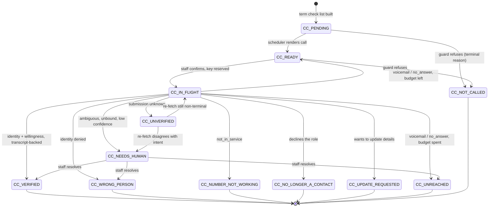
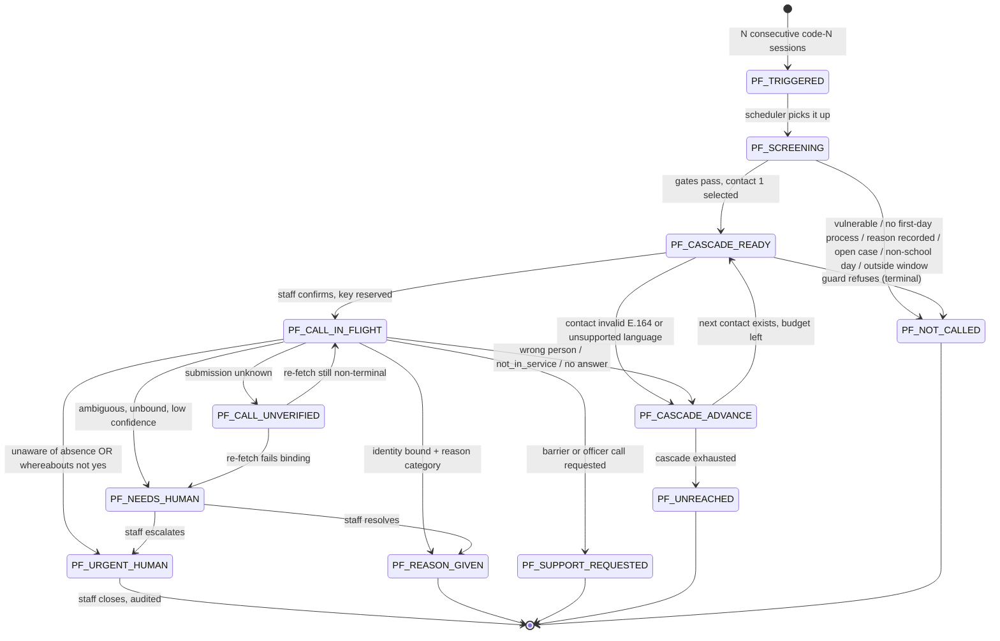

# Reachable — State Machines

Two machines. The **contact-check machine** runs per contact per term. The
**pattern follow-up machine** runs per pupil per trigger and cascades through
that pupil's contacts.

Three rules govern every transition in both.

1. **Guards are code.** CALL-E and any model choose wording only. No transition
   into a dialling state is reachable without passing every guard in section 3.
2. **Fail closed.** Any event that does not positively match a transition below
   lands in `NEEDS_HUMAN`. There is no fall-through to a success state, and
   anything touching a child's whereabouts lands in `URGENT_HUMAN`.
3. **A refusal is a result.** Declining to call is a named outcome with a stored
   reason, never a silent no-op
   ([`SOURCES.md` §1.8](SOURCES.md#18-fail-closed-dispositions)).

Case states are Reachable's own vocabulary. They are deliberately not CALL-E call
statuses and not attendance codes
([`SOURCES.md` §1.5](SOURCES.md#15-the-production-workflow-pattern)).

---

## 1. The contact-check machine

One instance per `(term, contact)`.

### 1.1 States

| State | Meaning | Terminal |
| --- | --- | --- |
| `CC_PENDING` | In this term's check list, not yet rendered | no |
| `CC_READY` | Call rendered and authorised, not yet submitted | no |
| `CC_IN_FLIGHT` | Reserved and submitted | no |
| `CC_UNVERIFIED` | Submission or terminal outcome ambiguous; awaiting reconciliation | no |
| `CC_VERIFIED` | Named person confirmed identity and willingness on this number | yes |
| `CC_WRONG_PERSON` | Someone answered; not the named contact | yes |
| `CC_NUMBER_NOT_WORKING` | Not in service or repeatedly unobtainable | yes |
| `CC_NO_LONGER_A_CONTACT` | Named person declines the role | yes |
| `CC_UPDATE_REQUESTED` | Wants details changed. Office task raised; **no number taken** | yes |
| `CC_UNREACHED` | Attempt budget spent without contact | yes |
| `CC_NEEDS_HUMAN` | Ambiguous, unbound, low-confidence, schema-invalid, or unsupported language | no |
| `CC_NOT_CALLED` | A guard refused. Reason stored | yes |

`CC_NEEDS_HUMAN` is not terminal: a person routes it out, and that routing is
itself an audited transition.

### 1.2 Diagram

### 1.3 Transitions

Triggers: **import** (CSV load), **scheduler**, **staff** (dashboard or CLI
click), **call** (the reconciler, after an authoritative `GET /v1/calls/{id}`).

| From | Trigger | Guard | To | Logged reason |
| --- | --- | --- | --- | --- |
| — | import | `is_emergency_contact = Y`, not `do_not_call` | `CC_PENDING` | "Added to term T check list" |
| `CC_PENDING` | scheduler | guards 1-9 pass | `CC_READY` | "Contact check rendered" |
| `CC_PENDING` | scheduler | `phone_e164` fails ASCII E.164 | `CC_NOT_CALLED` | "Invalid destination; not repaired" |
| `CC_PENDING` | scheduler | language not English | `CC_NOT_CALLED` | "Language not supported on the UK line; staff task raised" |
| `CC_READY` | staff | guards re-checked at click | `CC_IN_FLIGHT` | "Submitted, key k" |
| `CC_READY` | staff | any guard fails | `CC_NOT_CALLED` or stays | see section 4 |
| `CC_IN_FLIGHT` | call | `identity_confirmed = yes` **and** transcript-backed **and** `still_willing = yes` | `CC_VERIFIED` | "Identity and willingness confirmed, quote bound" |
| `CC_IN_FLIGHT` | call | `identity_confirmed = yes`, transcript-backed, `still_willing = no` | `CC_NO_LONGER_A_CONTACT` | "Declines the contact role" |
| `CC_IN_FLIGHT` | call | `identity_confirmed = yes`, `best_number_for_school = wants_to_update` | `CC_UPDATE_REQUESTED` | "Update requested; office task raised, no number captured" |
| `CC_IN_FLIGHT` | call | `identity_confirmed = no` | `CC_WRONG_PERSON` | "Not the named contact" |
| `CC_IN_FLIGHT` | call | `outcome = not_in_service` | `CC_NUMBER_NOT_WORKING` | "Number not in service" |
| `CC_IN_FLIGHT` | call | `outcome ∈ {voicemail, no_answer}`, attempts remain | `CC_READY` | "No contact; attempt n of N may be authorised" |
| `CC_IN_FLIGHT` | call | `outcome ∈ {voicemail, no_answer}`, budget spent | `CC_UNREACHED` | "Attempt budget spent" |
| `CC_IN_FLIGHT` | call | `identity_confirmed = yes` but **no recipient-spoken turn supports it** | `CC_NEEDS_HUMAN` | "Identity claim not backed by a `speaker: user` turn" |
| `CC_IN_FLIGHT` | call | disposition not `confirmed` | `CC_NEEDS_HUMAN` | "disposition; `failure_code` verbatim" |
| `CC_IN_FLIGHT` | call | submission outcome unknown | `CC_UNVERIFIED` | "Submission unknown; reconciling, not redialling" |
| `CC_UNVERIFIED` | call | re-fetch matches reserved intent, terminal | as if terminal | "Reconciled from `GET /v1/calls`" |
| `CC_UNVERIFIED` | call | re-fetch disagrees on call id, key, destination or contact | `CC_NEEDS_HUMAN` | "Snapshot fails the binding check" |
| any live | staff | staff closes the case | `CC_NOT_CALLED` | "Closed by <who>" |

A `CC_WRONG_PERSON` or `CC_NUMBER_NOT_WORKING` immediately writes a contact-health
flag and a suggested-change row. That is the A→B half of the loop in
[`SPEC.md` §5](SPEC.md#5-the-loop-between-the-workflows).

---

## 2. The pattern follow-up machine

One instance per `(trigger_date, pupil)`. It owns a cascade over that pupil's
contacts in `contact_order`.

### 2.1 States

| State | Meaning | Terminal |
| --- | --- | --- |
| `PF_TRIGGERED` | Run of code-N sessions detected; nothing decided | no |
| `PF_SCREENING` | Policy gates being evaluated | no |
| `PF_CASCADE_READY` | Next contact selected and rendered; awaiting authorisation | no |
| `PF_CALL_IN_FLIGHT` | Reserved and submitted to that contact | no |
| `PF_CALL_UNVERIFIED` | Submission or terminal outcome ambiguous | no |
| `PF_CASCADE_ADVANCE` | This contact failed; choosing the next | no |
| `PF_REASON_GIVEN` | Reason category and note captured; suggestion awaiting staff approval | yes |
| `PF_SUPPORT_REQUESTED` | Barrier mentioned or attendance-officer call requested | yes |
| `PF_URGENT_HUMAN` | Contact unaware of absence, or whereabouts unknown | no |
| `PF_UNREACHED` | Cascade exhausted without a confirmed contact | yes |
| `PF_NOT_CALLED` | A gate refused. Reason stored | yes |
| `PF_NEEDS_HUMAN` | Ambiguous, unbound, low-confidence, schema-invalid | no |

`PF_URGENT_HUMAN` is **not terminal and not auto-closable**. Only a named member
of staff closes it, and closing is an audited action. It is drawn separately
because it is the one state the whole design exists to surface.

### 2.2 Diagram

### 2.3 Transitions

| From | Trigger | Guard | To | Logged reason |
| --- | --- | --- | --- | --- |
| — | import | run of N adjacent school-day sessions coded `N`, `reason_recorded` empty | `PF_TRIGGERED` | "Trigger: sessions listed" |
| `PF_TRIGGERED` | scheduler | — | `PF_SCREENING` | "Screening gates" |
| `PF_SCREENING` | scheduler | `vulnerable_flag = Y` | `PF_NOT_CALLED` | "Vulnerable pupil; staff task raised, no call" |
| `PF_SCREENING` | scheduler | `first_day_process_description` empty | `PF_NOT_CALLED` | "No first-day process configured; Workflow B disabled" |
| `PF_SCREENING` | scheduler | any triggering session now has `reason_recorded` | `PF_NOT_CALLED` | "Reason recorded since trigger" |
| `PF_SCREENING` | scheduler | open case already exists for this pupil | `PF_NOT_CALLED` | "Open staff case already exists" |
| `PF_SCREENING` | scheduler | today is not a `SCHOOL_DAY` | `PF_NOT_CALLED` (hold) | "Non-school day" |
| `PF_SCREENING` | scheduler | outside the school's calling window | `PF_NOT_CALLED` (hold) | "Outside calling window (local time)" |
| `PF_SCREENING` | scheduler | gates pass | `PF_CASCADE_READY` | "Contact 1 of M selected" |
| `PF_CASCADE_READY` | staff | guards 1-9 re-checked | `PF_CALL_IN_FLIGHT` | "Submitted to contact c, key k" |
| `PF_CASCADE_READY` | scheduler | contact fails E.164 or language | `PF_CASCADE_ADVANCE` | "Contact skipped; flagged in contact health" |
| `PF_CALL_IN_FLIGHT` | call | `aware_of_absence ≠ yes` (`no` or `unknown`) | **`PF_URGENT_HUMAN`** | "Could not establish that the contact knew about the absence" |
| `PF_CALL_IN_FLIGHT` | call | `knows_child_whereabouts = no` | **`PF_URGENT_HUMAN`** | "Contact says they do not know where the pupil is" |
| `PF_CALL_IN_FLIGHT` | call | identity bound, `reason_category` set and not `unknown` | `PF_REASON_GIVEN` | "Reason category; suggestion awaiting approval" |
| `PF_CALL_IN_FLIGHT` | call | identity bound, `barrier_mentioned = yes` or `wants_call_from_attendance_officer = yes` | `PF_SUPPORT_REQUESTED` | "Support requested" |
| `PF_CALL_IN_FLIGHT` | call | identity bound, `reason_category = prefers_to_speak_to_staff` | `PF_SUPPORT_REQUESTED` | "Prefers to speak to staff" |
| `PF_CALL_IN_FLIGHT` | call | `identity_confirmed = no` | `PF_CASCADE_ADVANCE` | "Wrong person; contact flagged, cascade advances" |
| `PF_CALL_IN_FLIGHT` | call | `outcome = not_in_service` | `PF_CASCADE_ADVANCE` | "Number not in service; contact flagged" |
| `PF_CALL_IN_FLIGHT` | call | `outcome ∈ {voicemail, no_answer}` | `PF_CASCADE_ADVANCE` | "No contact; cascade advances" |
| `PF_CALL_IN_FLIGHT` | call | identity claim not backed by a `speaker: user` turn | `PF_NEEDS_HUMAN` | "Identity not transcript-backed" |
| `PF_CALL_IN_FLIGHT` | call | disposition not `confirmed` | `PF_NEEDS_HUMAN` | "disposition; not treated as an answer" |
| `PF_CASCADE_ADVANCE` | scheduler | next contact exists and cascade limit not reached | `PF_CASCADE_READY` | "Contact c+1 of M" |
| `PF_CASCADE_ADVANCE` | scheduler | no contact left, or cascade limit reached | `PF_UNREACHED` | "Cascade exhausted; no contact reachable" |
| `PF_REASON_GIVEN` | staff | staff approves the suggested reason | stays | "Suggestion approved by <who>; staff records the code" |

Note the two rows that dominate all others: **the `URGENT_HUMAN` rows are
evaluated first**, before reason, support or anything else. A call that produces
both a reason *and* an indication the contact did not know about the absence is
an `URGENT_HUMAN`, not a `REASON_GIVEN`.

Awareness is the primary signal and escalates on `unknown` as well as `no`.
Whereabouts is secondary and asymmetric: an explicit `no` escalates on its own,
while `unknown` is recorded and displayed but does not escalate, because the
question often does not arise in a call where the contact clearly knew about the
absence. See [`CALL_CONTRACTS.md` §3.3](CALL_CONTRACTS.md#33-mapping).

`PF_REASON_GIVEN` does not write anything to the register. It produces a
suggestion; staff record the code in their own system
([`SAFETY.md`](SAFETY.md), forbidden list).

---

## 3. Guards

Evaluated in this order, in code, immediately before any dial. Each is a pure
function of stored state and the clock. The first failure stops evaluation and
produces the refusal in section 4.

| # | Guard | Passes when |
| --- | --- | --- |
| 1 | `live_mode` | `REACHABLE_LIVE_CALLS=1`. Otherwise the call is rendered as a preview and never submitted |
| 2 | `per_call_confirmation` | A human confirmed **this specific call**: typed confirmation in the CLI, or the confirm step in the dashboard |
| 3 | `not_vulnerable` | The pupil is not flagged vulnerable. Evaluated for Workflow B before anything else in screening |
| 4 | `first_day_process` | `school.csv` carries a non-empty `first_day_process_description` |
| 5 | `school_day_and_window` | Today is a `SCHOOL_DAY` in the calendar, and the local clock is inside the school's window, in the school's IANA timezone |
| 6 | `one_in_flight` | No call attempt for this pupil (Workflow B) or this contact (Workflow A) is `reserved`, `accepted` or `submission_unknown` |
| 7 | `attempt_budget` | Attempts for this contact are below `REACHABLE_MAX_ATTEMPTS`, and cascade position is below `REACHABLE_CASCADE_LIMIT` |
| 8 | `destination_valid` | The stored number matches `^\+[1-9][0-9]{7,14}$` on **ASCII input only**. Rejected, never repaired |
| 9 | `key_unreserved` | The derived idempotency key has no prior reservation, or the reservation is for this exact intent |
| 10 | `language_supported` | The contact's language is English, the only language CALL-E lists for GB |

Guard 1 is necessary and not sufficient — guard 2 is the reason.

Idempotency keys, reserved in an append-only ledger **before** dialling:

- pattern follow-up: `(trigger_date, pupil_id, contact_id, authorisation)`
- contact check: `(term_id, contact_id, authorisation)`

Derived from the authorised intent, never from the attempt
([`SOURCES.md` §1.6](SOURCES.md#16-idempotency)). The `authorisation` ordinal is
what makes the "attempts remain" branches below reachable: it advances only when
a person authorises that household to be rung again, so every network retry of
one authorisation reuses one key. See
[`SAFETY.md` §6](SAFETY.md#6-idempotency).

---

## 4. Decisions not to call

Each is a stored outcome with its own reason string, surfaced in the dashboard's
"Decisions not to call" view. A **hold** re-arms on the next cycle; a
**terminal** reason does not.

| Reason | Kind | Guard | Resulting state |
| --- | --- | --- | --- |
| `PUPIL_VULNERABLE` | terminal | 3 | `PF_NOT_CALLED` + staff task |
| `REASON_NOW_RECORDED` | terminal | screening | `PF_NOT_CALLED` |
| `OPEN_CASE_EXISTS` | terminal | screening | `PF_NOT_CALLED` |
| `OUTSIDE_CALLING_WINDOW` | hold | 5 | stays; re-evaluated next cycle |
| `NON_SCHOOL_DAY` | hold | 5 | stays; re-evaluated next school day |
| `CALL_IN_PROGRESS` | hold | 6 | stays |
| `IDEMPOTENCY_KEY_USED` | terminal | 9 | `*_NEEDS_HUMAN` |
| `ATTEMPT_BUDGET_SPENT` | terminal | 7 | `CC_UNREACHED` / `PF_UNREACHED` |
| `INVALID_DESTINATION` | terminal | 8 | `CC_NOT_CALLED` / `PF_CASCADE_ADVANCE` + contact-health flag |
| `LANGUAGE_NOT_SUPPORTED` | terminal | 10 | `CC_NOT_CALLED` / `PF_CASCADE_ADVANCE` + staff task |
| `NO_FIRST_DAY_PROCESS` | terminal | 4 | `PF_NOT_CALLED`, whole workflow disabled |
| `DRY_RUN` | hold | 1 | stays; preview stored |
| `AWAITING_CONFIRMATION` | hold | 2 | stays |

Four of these deserve their reasoning stated, because they are the ones a
reviewer will ask about.

**`PUPIL_VULNERABLE`** is evaluated before every other gate. A child with a
social worker or on a protection plan is precisely the child for whom an
automated call could do harm and for whom a named professional already exists.
The task carries `notes_for_staff` and nothing is dialled.

**`NO_FIRST_DAY_PROCESS`** disables Workflow B entirely rather than degrading it.
Reachable is explicitly an addition to first-day calling
([`SPEC.md` §4.2](SPEC.md#42-it-adds-to-first-day-calling-it-never-replaces-it)).
A school without a first-day process needs one, not an automated second-day call
standing in for it.

**`LANGUAGE_NOT_SUPPORTED`** produces a staff task rather than silence. CALL-E
lists English only for GB
([`SOURCES.md` §2.8](SOURCES.md#28-united-kingdom-region-line-and-language)).
Calling a family in a language they may not speak, about their child's absence,
would be worse than not calling — but quietly skipping them would hide a
population from the school. So the contact is surfaced for a human call.

**`IDEMPOTENCY_KEY_USED`** routes to human review rather than being swallowed. A
key collision means either a crash-and-replay, which is fine, or two different
intents colliding, which is a bug. A person decides which.

---

## 5. Unknown and ambiguous outcomes

> "**Ambiguity is a state, not an error.** Errors get retried. States get
> resolved."
> — [`ambiguous-outcomes.md`](../../../../skills/service-dispatch-call/references/ambiguous-outcomes.md)

### 5.1 What counts as ambiguous

Read together, never one at a time
([`SOURCES.md` §1.8](SOURCES.md#18-fail-closed-dispositions)):

| Signal | Ambiguous when |
| --- | --- |
| `status` | `failed` or `canceled`, or still non-terminal past the read deadline |
| Event type | Not one of the three terminal webhook types |
| `task_completed` | `false`, or `null` on a terminal call |
| `completion_confidence.score` | Below `REACHABLE_CONFIDENCE_FLOOR` (default 0.6), or the object is null |
| `completion_confidence.label` | `low`, or not one of the documented examples. Checked **as well as** the score, never instead |
| `structured_result` | `null`, empty, or missing a required field |
| Values inside it | An enum value outside our schema, or an uppercase CLI/MCP value such as `NO_ANSWER`, which is rejected as malformed |
| `failure_code` | Any non-null value. Logged verbatim, **never branched on** |
| Binding | Call id, idempotency key, destination number, pupil or contact disagrees with the reserved intent |
| Transcript | `identity_confirmed = yes` with no `speaker: user` turn supporting it |

All route to `NEEDS_HUMAN`. None can reach `CC_VERIFIED`, `PF_REASON_GIVEN` or
any other success state.

### 5.2 The binding check, in full

A result counts only if **all five** match the call we placed
([`SAFETY.md`](SAFETY.md) requirement 3):

1. the CALL-E `call_id` equals the one we stored at reservation;
2. the idempotency key equals the one we reserved;
3. the destination equals `recipients[].attempts[].phone` for the attempt we are
   reading;
4. `metadata.pupil_id` equals the case's pupil;
5. `metadata.contact_id` equals the contact we dialled.

Plus the transcript condition: an `identity_confirmed = yes` must be supported by
at least one turn where `speaker == "user"` whose text plausibly affirms
identity. A `speaker: bot` turn is our own agent talking, and a `speaker:
unknown` turn is unattributed — **neither is evidence**
([`SOURCES.md` §2.3](SOURCES.md#23-transcript-turns-and-speakers--how-binding-is-possible)).

A generic yes/no with no attributable turn never triggers an attendance or
safeguarding action.

### 5.3 How an unknown outcome is reconciled

**By reading the call back. Never by re-dialling.**

1. `GET /v1/calls/{call_id}` with our own bearer token — the authoritative read.
   "A lookup is cheap. A duplicate call is not."
2. If no call id was ever returned, the attempt stays `submission_unknown` and
   guard 6 blocks the pupil or contact until a person resolves it.
3. A non-terminal snapshot is **not ready**, not a failure. Read again next
   cycle. CALL-E's `in_progress` includes post-call result finalisation, so a
   call that has hung up can still legitimately read as non-terminal.
4. If terminal, run the full binding check before any write.
5. `GET /v1/calls/{call_id}/events` may be read for explanation. It costs nothing.
6. If it is still not established what happened, the case stays in `NEEDS_HUMAN`.

The dashboard never offers a one-click redial on an unknown outcome without
stating that a call may already have been placed.

### 5.4 Webhook replay

Both CALL-E and GitHub-style webhooks deliver at least once. Every event is
written to an inbox keyed on the provider's **event** identifier
(`CALL-E-Event-Id`), not the call id, because one call produces several events.

- An exact replay of a processed event is acknowledged and ignored.
- A conflicting payload under a known id is rejected and raised, never allowed to
  overwrite.
- A CALL-E webhook is never itself authority — it cannot be authenticated
  ([`SOURCES.md` C4](SOURCES.md#c4-call-e-webhooks-cannot-be-verified-at-all)) —
  so it only wakes the reconciler, which then performs step 1.
- The inbox row outlives the case it guards, so a redelivery after cleanup cannot
  produce a second call.
