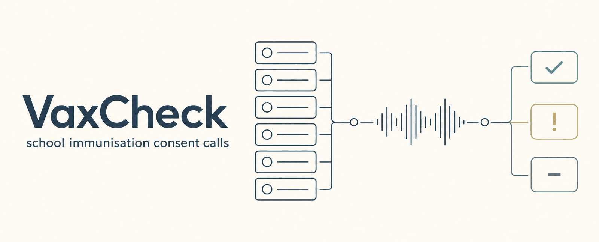
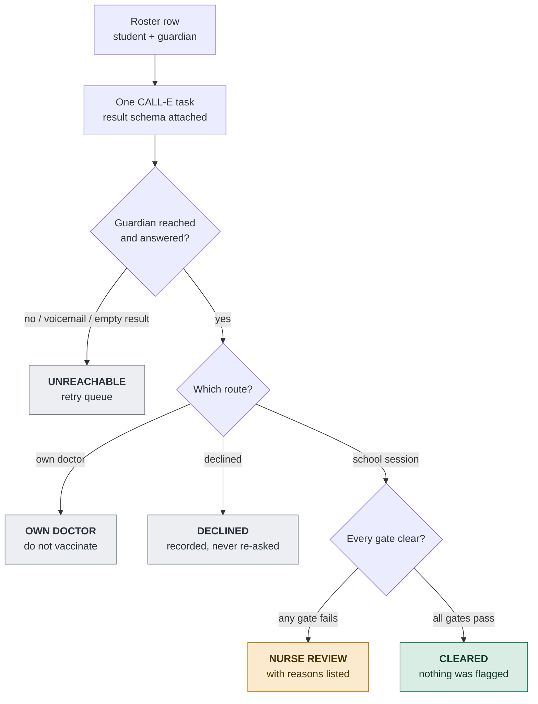

# VaxCheck



Consent and screening calls for school immunisation sessions, built on CALL-E.

A school runs an immunisation session. Before the nurses arrive, someone has to reach
every guardian and establish four things: do you consent, has your child already had
this, do they have allergies, are they well today. Today that goes home as a paper
form in a schoolbag. A large share never comes back, so the office spends the week
before the session on the phone, and on the morning itself there is still a row of
children nobody can account for.

VaxCheck does the calling and returns a roster a nurse can work from: who is cleared,
who is doing it with their own doctor, who declined, who was never reached, and — the
part that matters — **who a person needs to look at before anything happens**.

This is a runnable demo app, not a CALL-E SDK.

| | |
| --- | --- |
| **What it does** | Calls every guardian on a class roster, captures consent, allergy history, prior doses and routing choice, and returns a triaged day-of roster |
| **CALL-E surface** | Developer API via `calle-ai` (`POST /v1/calls`), plus `plan_call` through the CLI for preflight |
| **Unit of work** | One CALL-E task per student — not one task per roster |
| **Default mode** | Fixture replay. No network, no credentials, no calls |
| **Runs with** | Python 3.11+, stdlib only. SDK needed only for `--execute` |
| **Tests** | 68, all offline; 11 drive the real SDK through a mock HTTP transport |
| **Outputs** | Text roster for the terminal, JSON for the office, a self-contained HTML board for the nurse |
| **Never does** | Give medical advice, decide fitness to vaccinate, schedule anything recurring, or treat silence as consent |

> **Origin.** This was built for Indonesia's *Bulan Imunisasi Anak Sekolah* (BIAS), the
> national school immunisation month, where the paper-form problem is at its largest.
> CALL-E cannot dial Indonesia yet (see [Regions](#regions)), so the sample roster uses
> reserved fictional US numbers and the app is corridor-agnostic.

---

## The part that matters



Every gate below must be clear before a student reaches `CLEARED`.

Clearance is earned, never assumed. A student is cleared only when **every** signal is
unambiguously positive. Anything else routes to a human.

| Signal | Cleared requires | Otherwise |
| --- | --- | --- |
| Guardian reached | `yes` | not reached → retry queue |
| Identity confirmed | `yes` | nurse review |
| Consent | `granted` | nurse review |
| Route | `school_session` | own doctor / declined → recorded, not vaccinated |
| Allergy reported | `none` or `mild` | `severe` or `unsure` → nurse review |
| Unwell today | `no` | `yes` or `unsure` → nurse review |
| Prior dose | `no` | `yes` or `unsure` → nurse review |
| Guardian asked a question | none outstanding | nurse review |
| Callback requested | `no` | nurse review |
| `task_completed` | `true` | nurse review |
| `completion_confidence` | `>= 0.70` | nurse review |

Two consequences worth stating plainly:

- **Silence is never consent.** Voicemail, a dropped call, a wrong number and an empty
  result all land in the retry queue. None of them can produce a cleared row.
- **A cleared row is not a medical decision.** It means nothing was flagged. A nurse
  still confirms the final list. The app records what a guardian reported; it never
  assesses whether a child should be vaccinated.

Roster totals are counted locally from the triaged records, not asked of the model, so
the numbers a nurse reads are arithmetic rather than a generated field.

---

## Setup

Python 3.11+. **No packages are required** for preview or mock.

```bash
cd apps/python/vaxcheck
python3 client.py --roster fixtures/sample_roster.json
```

For `--doctor` and `--preflight`, the CALL-E CLI, authenticated:

```bash
npm install -g @call-e/cli && calle auth login
```

For `--execute`, the Python SDK and an API key:

```bash
pip install 'calle-ai>=0.7.0'
export CALLE_API_KEY="<key from dashboard.heycall-e.com/account/api-keys>"
```

---

## Is this machine actually able to place these calls?

```bash
python3 client.py --roster fixtures/sample_roster.json --doctor
```

Four read-only checks against the **live** service. None of them can dial.

```
  PASS  calle CLI        authenticated, token valid to 2029-06-09T14:06:41Z
  PASS  calle-ai SDK     version 0.7.0
  WARN  CALLE_API_KEY    not set - needed only for --execute
  PASS  region corridor  US/English accepted by plan_call
```

The API key check issues a real authenticated `GET /v1/goals`; the corridor check
issues a real `plan_call`. Both are free. Answer this question the week before a
session, not on the morning of one.

---

## Five modes, in increasing order of consequence

### 1. Preview — default, no network

```bash
python3 client.py --roster fixtures/sample_roster.json
```

Prints the masked roster, the exact call script CALL-E will be given, the result
schema, and the idempotency key for every student. Nothing leaves the machine.

### 2. Mock — fixture replay, no network

```bash
python3 client.py --roster fixtures/sample_roster.json --mock
python3 client.py --roster fixtures/sample_roster.json --mock \
  --fixture conversation_allergy_severe.json
```

Replays conversation fixtures through the **same** sanitiser, triage, and report code
the live path uses, so what you are testing is the real logic.

| Fixture | Outcome |
| --- | --- |
| `conversation_consent_school.json` | cleared for the session |
| `conversation_private_provider.json` | own doctor — do not vaccinate |
| `conversation_allergy_severe.json` | nurse review: severe allergy, question unanswered |
| `conversation_decline.json` | declined — recorded, not re-asked |
| `conversation_unsure.json` | nurse review: guardian cannot recall |
| `conversation_voicemail.json` | not reached — retry |

### 3. Preflight — real CALL-E API, still no phone call

```bash
python3 client.py --roster fixtures/sample_roster.json --preflight --preflight-limit 3
```

Runs a real, authenticated `plan_call` per student. CALL-E resolves each number's
region, checks the region/language corridor, and reports whether the call is ready to
run. **It does not dial and does not consume call quota.**

Validating a 200-guardian roster the week before is the difference between finding a
dead corridor or a malformed number on Tuesday and finding it on session morning.

```
Preflighting 2 of 6 students against CALL-E (US/English). This calls plan_call and does NOT dial.

  [S-041] +14*****0101  OK
  [S-042] +14*****0102  OK

2/2 ready to run.
```

### The board — the roster as a page

```bash
python3 client.py --roster fixtures/sample_roster.json --mock --out roster.json --html board.html
```

`--html` writes the same triaged roster as a single self-contained HTML page: no JavaScript,
no external assets, phone numbers already masked. The review queue comes first, every
review card shows the guardian's reported answers beside the reasons, and the nurse's line
closes the page. It is what a school nurse opens at 7 a.m.

To add the live readiness and preflight panels from their JSON:

```bash
python3 client.py --roster fixtures/sample_roster.json --doctor --out doctor.json
python3 client.py --roster fixtures/sample_roster.json --preflight --out preflight.json
python3 board.py --roster roster.json --doctor doctor.json --preflight preflight.json -o board.html
```

### 4. Execute — real outbound calls

```bash
python3 client.py --roster your-real-roster.json --execute --confirm-consent \
  --out roster-result.json
```

Guarded twice: `--execute` alone refuses to run without `--confirm-consent`. Calls run
sequentially, one CALL-E task per student.

Resume a single call without re-dialling — the call is bound to one roster row by the
metadata this app wrote when it created it, never by phone number:

```bash
python3 client.py --roster your-real-roster.json --resume call_abc123 --student S-043
```

---

## Design notes

**One task per student, not one task per roster.** A CALL-E task reports a single
`task_completed` and `completion_confidence`. Batching a roster into one task would
force every child to share one score — one voicemail at the end would drag a clean
consent at the start below threshold. Per-student tasks keep each decision backed by
that child's own call.

**Idempotency keys are derived, never generated.** The key is
`vaxcheck-<school>-<session-date>-<student-id>` — no timestamp, no UUID. Within
CALL-E's idempotency window, a retried create with the same key and the same request
returns the same call instead of dialling again. That window is finite and
provider-defined, and the app does not persist call ids: outside the window, or if any
part of the request changes, a re-run creates a new call. Keep `--out` output, and
resume a specific call with `--resume <call_id> --student <id>`. A crash between
`create` and writing output can leave a call whose id you do not have — check the
CALL-E dashboard before re-running that student.

**Unknown values are dropped, not coerced.** A value the schema did not define is not
a signal we understand, so it is discarded — and triage treats absence as "route to a
human", which is the behaviour we want.

**Numbers are masked everywhere.** Validated once on load as ASCII E.164 (full match,
after stripping spaces, hyphens, dots and parentheses), then masked in every preview,
log, report and error. Free text that comes back from a call — summaries, evidence,
what a guardian said — is redacted at ingestion, so a phone number a guardian read out
never reaches the report, the JSON or the board. Provider error messages are redacted
before they are shown. The request sent to CALL-E is never altered.

**Credentials only go to an approved origin.** The API key is sent to
`https://api.heycall-e.com` and nowhere else. `CALLE_BASE_URL` may select among approved
origins but cannot add one; anything else is refused before a request is made.

---

## Regions

CALL-E validates the region/language corridor at plan time. Verified 2026-09-13:

| Corridor | Result |
| --- | --- |
| `US` / English | works |
| `SG` / English | works |
| `ID` / English | **blocked** — "calls in Indonesia / English are not currently supported" |
| `ID` / Indonesian | blocked |
| `MY` / English, `MY` / Malay | **blocked** |

`ID`/English and both `MY` corridors are listed as supported in CALL-E's published
regions table but are refused by the live service. Run `--preflight` before committing
a roster to a corridor. Set `region` and `language` in the roster's `session` block.

---

## Roster format

```json
{
  "session": {
    "school_name": "Riverside Primary School",
    "vaccine_name": "HPV vaccine (dose 1)",
    "session_date": "2026-10-02",
    "nurse_contact": "the school office on +1 415 555 0100",
    "region": "US",
    "language": "English"
  },
  "students": [
    {
      "student_id": "S-041",
      "student_name": "Aisha Rahman",
      "class_name": "P5-B",
      "guardian_name": "Nadia Rahman",
      "guardian_phone": "+14155550101"
    }
  ]
}
```

Phone numbers must be E.164. Duplicate `student_id`s are rejected, because duplicate
ids produce duplicate idempotency keys and therefore a second call to one family.

All sample numbers are NANPA reserved fictional numbers (`555-01xx`). Replace them with
numbers you are authorised to call before using `--execute`.

---

## Tests

```bash
python3 -m unittest discover -s tests -v
```

68 tests. No network, no credentials, no calls.

**57 offline tests** cover E.164 handling and masking, every triage branch, schema
sanitisation against unknown and illegal values, call-script safety properties, and
the full roster-to-report flow, and the HTML board (every student present, no raw number, review queue first, consent shown beside the flag, self-contained).

**11 live-path tests** exercise the real CALL-E SDK. Rather than stubbing this app's
own code, they install an `httpx` transport underneath a genuine `CalleClient`, so the
SDK does its real work — signature validation, payload assembly, header handling,
terminal-state polling — and the test asserts on the exact HTTP request CALL-E's API
would have received: the `/v1/calls` payload, both schemas, the `Idempotency-Key`
header and its determinism, one task per student with distinct keys, that the raw
number never reaches the call script, that a real-shaped response triages correctly,
that a severe allergy in a real response cannot clear, and that a 401 or a missing call
id becomes a clean error.

Together that covers every part of the live path except CALL-E's servers dialling a
phone. They skip automatically when the optional SDK is absent:

```bash
pip install 'calle-ai>=0.7.0' httpx
python3 -m unittest discover -s tests -v
```

---

## Safety

See [docs/safety.md](docs/safety.md). Summary: explicit intent before any call,
disclosure and identity confirmation before any detail about a child, no medical
advice under any circumstance, a decline is final, every clinical signal routes to a
person, numbers masked everywhere, deterministic idempotency, and no recurring
schedule of any kind.

## Limitations

- Calls run sequentially. A large roster takes a while; that is deliberate, since a
  failure mid-roster should stop rather than continue dialling families.
- No inbound handling. CALL-E is outbound-only, so a guardian who calls back reaches
  the school, not this app.
- `webhook_url` is plumbed through but there is no bundled receiver; CALL-E webhook
  deliveries are currently unsigned, so authenticate them yourself before trusting one.
- The app has no database. Results are files. A real deployment would persist
  `call_id` per student before waiting.
