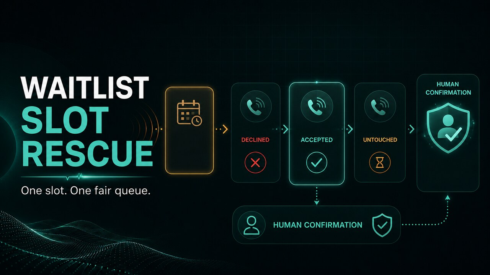

# Waitlist Slot Rescue

Fill a last-minute service cancellation without making the whole waitlist race for the same slot.



This focused Python app calls previously opted-in waitlist candidates in their existing order. It stops at the first explicit acceptance, never creates a booking, and hands the candidate's response to a human for final confirmation. An ambiguous result stops the cascade instead of risking a duplicate offer.

The workflow is for non-regulated services such as salons, vehicle or home services, tutoring, and fitness. It deliberately rejects medical, legal, financial, emergency, collections, political, and unsolicited-marketing use.

## Why this workflow

A cancellation creates a short-lived coordination problem. Calling everybody at once overbooks the slot; calling one person manually at a time is slow; treating voicemail or a vague answer as acceptance is unsafe. This app makes the queue, expiry, stopping rules, and commitment boundary explicit:

- contact only people who opted into waitlist calls;
- preserve the business's queue order;
- disclose the AI caller and confirm the intended participant;
- offer one unreserved slot with an explicit expiry;
- stop on the first clear yes or any ambiguous outcome; and
- require a human to make the actual booking.

## Zero-cost demo

Python 3.11 or newer is enough. The default preview and fixture simulation have no dependencies, credentials, network access, or phone side effects.

```bash
cd apps/python/waitlist-slot-rescue
python rescue.py --request example_request.json
python rescue.py \
  --request example_request.json \
  --simulate-results example_results.json
```

The simulation contacts candidate A, records a decline, receives candidate B's acceptance, and proves candidate C remained untouched. Every displayed phone number is masked.

### Judge-facing visual demo

The self-contained browser demo uses only fictional data and has no network or
call capability:

**[Open the judge demo](https://htmlpreview.github.io/?https://github.com/Piotr1231/awesome-phone-call-agents/blob/feat/waitlist-slot-rescue/apps/python/waitlist-slot-rescue/demo/index.html)**

```bash
cd apps/python/waitlist-slot-rescue
python3 -m http.server 8000 --directory demo
```

Open `http://localhost:8000` and run both scenarios:

- **Golden path:** candidate A declines, candidate B accepts, candidate C stays
  untouched, and the result requires a human booking confirmation.
- **Safe halt:** the first participant ends the call without a reliable answer,
  the outcome remains `unknown`, and the rest of the queue stays untouched.

The safe-halt replay is based on the privacy-minimized behavior of one
authorized live call, not a claimed successful acceptance. See
[`docs/live-verification.md`](docs/live-verification.md).

## Reproducible impact model

`evaluate.py` compares manual sequential calling with the same queue automated
by this app. It uses an explicit fictional model, not customer or production
data. Every probability, duration, expiry window, and operator-time assumption
is written into the result:

```bash
python3 evaluate.py --trials 10000 --seed 20260823
```

The committed [`evaluation_results.json`](evaluation_results.json) is
reproducible from that command. Under its documented assumptions, mean active
operator time falls from 6.56 to 1.25 minutes (81.0%) while preserving queue
order, sequential calls, ambiguity stopping, no automatic redial, and
human-only booking. These are modeled results and must not be represented as
measured customer impact.

## Live CALL-E run

Install the SDK and keep the server credential outside files and source control:

```bash
uv sync --dev
export CALLE_API_KEY="<CALL_E_API_KEY>"
export CALLE_BASE_URL="https://api.heycall-e.com"

uv run python rescue.py \
  --request your-authorized-waitlist.json \
  --execute \
  --confirm-authorized-waitlist \
  --output private-result.json
```

Live execution creates at most one call at a time. Each candidate has a stable, slot-specific idempotency key, so retrying the same workflow cannot silently create a second task for that person. Output files are mode `0600` and existing files are never overwritten.

## Input contract

- `workflow_id` and `slot_id`: stable, non-secret identifiers;
- `business_display_name`: the name disclosed during the call;
- `service_category`: one supported non-regulated category;
- `service_label`: a short, non-sensitive description;
- `slot_start` and `offer_expires_at`: timezone-aware ISO 8601 timestamps;
- `candidates`: 1-20 entries with a stable id, E.164 phone number, unique queue position, locale, and literal `consented_to_waitlist_calls: true`.

Do not put names, health details, account data, payment information, credentials, or other sensitive information in the request.

## Safety and side effects

- Preview and simulation never contact CALL-E and never place a call.
- Live mode requires both `--execute` and a separate `--confirm-authorized-waitlist` acknowledgement.
- The call identifies itself as AI, explains the opt-in waitlist source, confirms the intended participant, and honors opt-out immediately.
- The task uses each candidate's BCP 47 locale, asks one short question per turn, and waits after every question. Silence, interruption, a hang-up, and unclear speech can never count as agreement.
- The caller cannot book, cancel, take payment, negotiate, collect sensitive information, or promise that the slot is reserved.
- An acceptance is only a candidate response; `booking_created` remains `false` and the result says human confirmation is required.
- A conversational outcome is trusted only when CALL-E reports a completed task, high confidence, provider evidence, a transcript, and a consistent set of independent fields. A single generated `outcome` label can never fill the slot.
- Live results include privacy-safe classification diagnostics: provider status,
  task-completion flag, normalized confidence, evidence/transcript presence,
  bounded decision fields, and a machine-readable reason. They never copy the
  raw transcript, provider evidence text, phone number, or participant name.
- A failed call advances as `no-answer` only with positive provider-authored no-contact evidence and no contradictory transcript or structured result; every other failure halts for review.
- The expiry is checked before and after every call. A response arriving after expiry is retained for human review but cannot select a candidate.
- Duplicate phone numbers are rejected even when they use different candidate IDs, preventing the same person from being called twice in one queue.
- The app has no scheduler, background worker, automatic retry, or recurring job. Stopping the process prevents the next call.
- Once CALL-E accepts a call task, this app cannot guarantee cancellation. Use provider controls if they expose cancellation; otherwise the script instructs the caller to end after one bounded answer.

## Tests

Tests use fake transports and fictional `+1 555-01xx` numbers. They never need an account or make a real call.

```bash
python -m pytest -q
python3 ../../../scripts/validate_repository.py
```

The public no-call verification run checked out this contribution, installed
the locked environment, and completed **23/23 tests** on Python 3.12. Every
live-call step was skipped: [view GitHub Actions evidence](https://github.com/Piotr1231/awesome-phone-call-agents/actions/runs/32639686513).

The regressions cover phone masking, consent and expiry validation,
duplicate-recipient rejection, candidate-locale task construction,
one-question-per-turn prompting, first-acceptance stopping, answered-then-ended
safe halting, privacy-safe diagnostics, expiry during a call, evidence-gated
classification, verified no-answer handling, human-only booking, explicit live
confirmation, CALL-E payload construction, result redaction, stable
candidate-specific idempotency, and reproducible evaluation.
