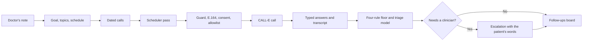

# AfterVisit

AfterVisit is a clinical follow-up agent for a small practice. A doctor writes a
free-text note after a consultation and presses *Save and start follow-up*.
AfterVisit reads the note into a goal, up to five things to find out (each quoting
the note) and a schedule, then owns the follow-up as CALL-E calls: it dials on
schedule in the patient's language, retries the calls nobody answers, reads every
call, and routes anything uncertain or concerning to the doctor with the patient's
own words. It never gives clinical advice and never diagnoses.

**Contribution area: User-facing Apps.** This directory is a catalog and setup
guide for the runnable [AfterVisit application](https://github.com/sharmilaraghu/Aftervisit).
The application source and tests are maintained there under the MIT license. These
instructions target revision
[`cc4ef0c`](https://github.com/sharmilaraghu/Aftervisit/tree/cc4ef0c79011bb292c18d1a8d04862743e43d094).

- [Source repository](https://github.com/sharmilaraghu/Aftervisit)
- [Hosted demo](https://aftervisit-calle.vercel.app) (fictional patients; the judges' Try a call needs a passcode)
- [CALL-E port](https://github.com/sharmilaraghu/Aftervisit/blob/cc4ef0c79011bb292c18d1a8d04862743e43d094/lib/calle/port.ts), the only module that imports the CALL-E SDK

## Where to look

| File | What it shows |
| --- | --- |
| [`lib/calle/port.ts`](https://github.com/sharmilaraghu/Aftervisit/blob/cc4ef0c79011bb292c18d1a8d04862743e43d094/lib/calle/port.ts) | The only module that imports `@call-e/calle`: `calls.create` with `task`, per-recipient `locale` and `region`, `resultSchema`, `recipientResultSchema`, `metadata`, optional `webhookUrl` and an idempotency key; `calls.get`; `calls.waitForResult`. The guard, E.164, consent and dial-allowlist checks all run inside `dial()`, so no call site can skip them. |
| [`lib/schedule/tick.ts`](https://github.com/sharmilaraghu/Aftervisit/blob/cc4ef0c79011bb292c18d1a8d04862743e43d094/lib/schedule/tick.ts) | One scheduler pass: reconcile abandoned calls, retire calls too late to place, claim due calls, assemble and guard the task, record it, dial, persist the CALL-E call id immediately, then extract, evaluate, triage, escalate and retry when a call finishes. |
| [`lib/schedule/store.ts`](https://github.com/sharmilaraghu/Aftervisit/blob/cc4ef0c79011bb292c18d1a8d04862743e43d094/lib/schedule/store.ts) | Every scheduler write as one conditional `UPDATE … RETURNING` or idempotent insert, because the Neon HTTP driver has no transactions: claims, retries, reschedule, skip and the extra call a doctor places now. |
| [`lib/plan/compile.ts`](https://github.com/sharmilaraghu/Aftervisit/blob/cc4ef0c79011bb292c18d1a8d04862743e43d094/lib/plan/compile.ts) | The note read by an OpenAI structured output with every defaultable field nullable; [`defaults.ts`](https://github.com/sharmilaraghu/Aftervisit/blob/cc4ef0c79011bb292c18d1a8d04862743e43d094/lib/plan/defaults.ts) fills gaps in code and marks each value *from the note* or *default*; [`grounding.ts`](https://github.com/sharmilaraghu/Aftervisit/blob/cc4ef0c79011bb292c18d1a8d04862743e43d094/lib/plan/grounding.ts) refuses a medication the note does not name. |
| [`lib/script/build.ts`](https://github.com/sharmilaraghu/Aftervisit/blob/cc4ef0c79011bb292c18d1a8d04862743e43d094/lib/script/build.ts) | The task text, assembled by a pure function: the goal and topics with the AI disclosure, the non-advice statement, and the instruction to stop the call and hand off when a patient describes anything urgent. |
| [`lib/script/guard.ts`](https://github.com/sharmilaraghu/Aftervisit/blob/cc4ef0c79011bb292c18d1a8d04862743e43d094/lib/script/guard.ts) | The three-phase guard: on each topic when the note is read and on the assembled task (both in English, whatever the call language), then on the agent's own transcript turns afterwards. It rejects advice, diagnosis, dosage changes, prognosis and reassurance, and fails a task missing any required safety clause. **Limitation:** the transcript patterns are English-only, so a call in another language gets the pre-call checks on its English task text but no post-call scan of what the agent said. |
| [`lib/rules/engine.ts`](https://github.com/sharmilaraghu/Aftervisit/blob/cc4ef0c79011bb292c18d1a8d04862743e43d094/lib/rules/engine.ts) | Four pure rules under the model: the patient asked for a person, emergency language, a reached call that did not find out what it set out to, and nobody answering. No IO, no clock, no model. |
| [`lib/triage/triage.ts`](https://github.com/sharmilaraghu/Aftervisit/blob/cc4ef0c79011bb292c18d1a8d04862743e43d094/lib/triage/triage.ts) | A model's reading of each finished call — severity, a one-sentence summary, the doctor's own escalating conditions. It fails closed: an outage or an unreadable answer queues the call for a clinician. |
| [`app/api/calle/webhook/route.ts`](https://github.com/sharmilaraghu/Aftervisit/blob/cc4ef0c79011bb292c18d1a8d04862743e43d094/app/api/calle/webhook/route.ts) | The unsigned webhook: takes only a call id and re-fetches the call through the authenticated API before trusting anything. |
| [`lib/calle/fake-server.ts`](https://github.com/sharmilaraghu/Aftervisit/blob/cc4ef0c79011bb292c18d1a8d04862743e43d094/lib/calle/fake-server.ts) | An in-process stand-in for CALL-E's HTTP API that the test suite dials instead of a phone. |

## Workflow boundary

1. The front desk registers a patient and records, once, whether they agreed to
   automated calls. Anything other than an explicit `granted` is refused at dial time
   with a visible reason.
2. After the consultation the doctor writes the note and an optional "escalate to me
   if…", and presses *Save and start follow-up*. That button is the human decision; the
   calls that follow are placed by the scheduler.
3. The follow-up page lists every dated call. The doctor can move a call, skip it, or
   place one extra call now (Try a call) behind a confirm that names the patient, the
   masked number and the language.
4. A scheduler pass (a cron against `POST /api/tick`, or an open console tab) claims due
   calls and dials each through the port. The call row and the exact task are written
   before the dial, and CALL-E's call id is stored the instant `calls.create` returns,
   because CALL-E has no endpoint to list calls.
5. When a call ends, typed answers and per-topic findings are extracted from the fixed
   result schema, the four floor rules run, and a model reads the transcript. Anything
   that needs a clinician becomes an escalation carrying the patient's own words; an
   urgent one pauses the follow-up until a doctor resolves it. Unanswered calls retry.
6. The doctor's Follow-ups board shows how each patient is doing, and the doctor records
   the decision. AfterVisit never makes a clinical decision.



## Setup

Use Node.js 20 or newer and pnpm.

```bash
git clone https://github.com/sharmilaraghu/Aftervisit.git
cd Aftervisit
git checkout --detach cc4ef0c79011bb292c18d1a8d04862743e43d094
pnpm install --frozen-lockfile
pnpm run verify   # vitest, typecheck, eslint
```

`pnpm run verify` needs no database, no CALL-E key and no OpenAI key, and places no
call. Expected result: 382 tests pass, and typecheck and lint pass. The tests cover
phone normalization, the three-phase guard, task assembly, the four-rule floor, schedule
expansion, extraction, and the CALL-E port and scheduler against the fake server. They do
not prove a live call.

To run the console locally:

```bash
test -f .env || cp .env.example .env   # then set DATABASE_URL (a free Neon database is enough)
pnpm run db:migrate                     # apply migrations
pnpm run db:seed:closed                 # optional: fictional patients with finished follow-ups
./start.sh                              # starts the dev server and stays in the foreground
```

Reading a note needs `OPENAI_API_KEY`; without it the note is refused and nothing is
scheduled.

## Usage

1. **Patients** — register a patient, record consent, and book a visit.
2. **Consultations** — open the waiting visit, write the note, and press *Save and start
   follow-up*.
3. **The follow-up** — read the goal, what the calls find out with the note's words for
   each, and the schedule marked *from your note* or *default*. Move, skip or place a call
   from the calling schedule.
4. **Follow-ups** — patients who need a clinician are listed first, with the reason and the
   patient's own words. Resolve the escalation, or end the follow-up with a summary.

## Default no-call path and dry run

Three independent locks each stop a dial, and all three are closed by default:

| Lock | Default | Effect |
| --- | --- | --- |
| `CALLE_API_KEY` | unset | No key, no calls; the follow-up page says so. |
| `AFTER_VISIT_CALL_ALLOWLIST` | unset = locked | Every dial is refused `not_allowlisted` until an operator lists numbers, or sets `*` for any consenting patient. |
| Patient consent | `unknown` | `dial()` refuses anyone whose consent is not an explicit `granted`. |

A refused dial is written as a visible row with its reason, never silently skipped. Every
call's exact task text is stored before it dials and shown on the call page. Seeded data is
fictional, with US fiction-reserved `555-01xx` numbers that cannot connect.

## Opt-in live verification

Live mode places a real phone call and spends CALL-E credit. Only call your own number or
someone who has agreed to an automated call from an AI assistant.

1. Set `CALLE_API_KEY` and `AFTER_VISIT_CALL_ALLOWLIST` to your own E.164 number.
2. Register yourself as a patient with consent recorded, write a note, and start the
   follow-up.
3. Use **Try a call** on the follow-up page, or run a scheduler pass
   (`./demo-tick.sh --every 5`, or keep the Follow-ups page open).

The hosted demo instead runs with the allowlist at `*`, so it locks its console: with
`AFTER_VISIT_CONSOLE_PASSCODE` set, every console page and server action (registering a
patient, recording consent, starting a follow-up, placing a call) requires that password
first, so a visitor without it cannot schedule a call to any number. The judges' page, which
rings a typed number once with nothing saved, sits behind its own `AFTER_VISIT_TRY_PASSCODE`.
Both passcodes are given to judges in the private submission, never in this repository.
Unset, the console is open — the intended local setup, where no key and a locked allowlist
mean nothing can be dialled.

## Side effects

- Once a follow-up starts, the scheduler dials **without a person pressing a button per
  call**: one call per scheduled day, and up to 3 attempts a day, 2 hours apart, when
  nobody answers. A call more than 90 minutes late is retired rather than placed.
- Try a call places one extra call immediately after a confirm.
- Patients, notes, plans, calls, transcripts and escalations are written to Postgres.
- Note text and call transcripts are sent to OpenAI to read the note and triage the call.
  Use only fictional or appropriately governed data.
- `POST /api/tick` runs a scheduler pass and can place due calls; it is closed unless
  `AFTER_VISIT_TICK_TOKEN` is set and the request carries it.

## Credential handling

- Every secret comes from the environment; only `.env.example` is committed. No key is
  written to the database, logged, or sent to the browser.
- `CALLE_API_KEY` is read only by the server-side port. `OPENAI_API_KEY` is used server-side
  for reading notes and triage only.
- `AFTER_VISIT_TICK_TOKEN`, `CRON_SECRET` and `AFTER_VISIT_WEBHOOK_TOKEN` each guard one endpoint,
  and an unset value keeps that endpoint closed. Webhook payloads are never trusted; the call
  is re-fetched through the authenticated API.
- Phone numbers are masked everywhere in the console and hidden as they are typed.

## Cancellation and rollback

- **End follow-up** on a patient's follow-up closes it and skips every remaining call.
- **Skip** drops one scheduled call; **Stop all calls** on the patient record pauses the
  follow-up and skips every pending call.
- An urgent escalation pauses the follow-up until a clinician resolves it.
- Instance-wide, unsetting `CALLE_API_KEY` or `AFTER_VISIT_CALL_ALLOWLIST` refuses every dial,
  and disabling the cron stops unattended scheduler passes.
- AfterVisit does not use a hang-up API. A call that CALL-E has accepted cannot be recalled;
  the patient can end it. No records are deleted by any of the above.

## License

The upstream AfterVisit source is MIT licensed. CALL-E, OpenAI, Neon and Vercel retain their
own terms. This guide contains no API keys, private phone numbers, call recordings, or
transcripts.
