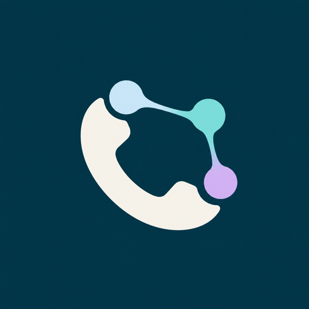

<div align="center">



# CallNeuron

**Consent-first scholarship outreach, one reviewed phone call at a time.**

[Open CallNeuron](https://call-neuron-preview.pages.dev/) · [Operator checklist](OPERATOR-GUIDE.md)

</div>

CallNeuron is a functional, consent-first operator prototype for scholarship and education-support outreach. It connects to the operator's own CALL-E account, creates one reviewable plan at a time, requires a final real-call confirmation, monitors the provider result, and keeps the business outcome under human review.

> [!IMPORTANT]
> CallNeuron places real phone calls when the operator completes the final confirmation. Use it only with an adult who has validly agreed to automated, processed and transcribed outreach. This is a practical prototype, not a substitute for organizational privacy, safeguarding, endpoint-security or legal review.

## What works

- A real organization/name, callback number, approved offer, factual details and escalation boundary can be saved locally.
- Recipients can be added manually or imported from CSV, XLSX, one-table DOCX or selectable-text PDF files smaller than 50 MB.
- E.164 phones, required codes, consent state, recipient type, duplicate codes, file size and the 500-row limit are validated before planning.
- The operator reviews four consent attestations for the selected adult.
- The browser completes CALL-E broker sign-in, MCP initialization, `tools/list`, `plan_call`, `run_call` and `get_call_run` at runtime.
- `plan_call` and `run_call` are separate. Creating a plan cannot ring a phone.
- Every real call requires a new checkbox and **Confirm and place one call** action.
- The caller introduces CallNeuron, names the organization, explains why it is calling, asks permission, confirms identity, answers only from the approved brief, asks about interest, and promises a human follow-up when appropriate.
- Voicemail is off by default. When enabled, it contains only the organization and public callback number.
- Provider result and human disposition remain separate. A privacy-minimal CSV can be exported for follow-up.
- Multiple recipients can be handled sequentially in one browser tab while the CALL-E connection remains in memory.

There is no automatic ranking, award decision, batch dispatch, hidden scheduling or automatic retry.

## Use it safely

### 1. Approve the offer

Enter:

- your organization or personal operating name;
- a public callback number in E.164 format, such as `+60…`;
- one approved offer sentence;
- factual details the caller may repeat;
- every topic that must return to a human.

Do not enter grades, identity documents, financial records, payment details, application evidence or promises of an award.

### 2. Add recipients

For one person, open **Add one recipient manually**. For a larger shortlist, use the CSV template or import a supported spreadsheet/document.

Required columns are:

```text
student_name,student_code,recipient_name,recipient_type,phone,employee_code,consent_status,consent_source,consent_timestamp
```

`recipient_type` accepts guardian/parent/caregiver or adult-student forms. Phones must use E.164. Explicit withdrawn, opted-out or do-not-call consent stays blocked.

### 3. Verify consent

Select one unattempted adult and confirm all four attestations. This check applies to that call only. A phone number or prior relationship is not permission.

### 4. Connect and plan

In **Call**:

1. Select **Connect CALL-E**.
2. Open the secure sign-in and authorize your CALL-E account.
3. Return to CallNeuron and select **I authorized · check**.
4. Select **Create CALL-E plan · no call**.
5. Review the recipient ending, language/region, voicemail rule, confirmation expiry and exact CALL-E instruction.

Nothing rings during these steps.

### 5. Place one call

Select the real-call checkbox only after the plan is correct, then select **Confirm and place one call**. Keep the tab open while CallNeuron reads status. It checks the same run for up to ten minutes and never creates a retry.

After CALL-E reaches a terminal state, assign the human disposition, review any requested callback details, and export the privacy-minimal CSV when needed. **Prepare another recipient** returns to the one-person selection flow without retaining a reusable call confirmation.

## Data and privacy boundary

| Data | Location and lifetime |
|---|---|
| Imported/manual recipient rows, approved brief, dispositions | Browser IndexedDB until **Reset local campaign** |
| Original CSV/XLSX/DOCX/PDF | Parsed locally and never uploaded or retained |
| Selected recipient and approved call instruction | Sent to CALL-E only after the operator creates a plan |
| CALL-E token, MCP session, plan/confirmation and transcript view | Browser memory; lost when the tab closes or refreshes |
| Provider-side call record | CALL-E; not deleted by resetting CallNeuron |
| Export | Student/employee codes, provider signal, disposition, follow-up flag, attempt count and timestamp only |

The export excludes names, phone numbers, transcripts and offer details. Spreadsheet-formula prefixes are neutralized.

## Local operation

Node.js 20 or later is required.

```bash
cd apps/typescript/call-neuron
npm install
npm run verify
npm run preview:operator
```

Open `http://localhost:8788`. The checked `wrangler.toml` supplies the local and deployed server gate. CALL-E authentication happens through the website and is separate from Wrangler/Cloudflare authentication.

## Deployment

The project uses free Cloudflare Pages infrastructure and browser-local storage. No database, paid font, analytics service or custom domain is required.

```bash
npm run deploy
```

`wrangler.toml` is the Pages configuration source of truth and enables `CALLNEURON_LIVE_MODE=operator-prototype`. The application still requires each operator to authenticate with their own CALL-E account before MCP tools are available.

## Verification

```bash
npm run verify
python3 ../../../scripts/validate_repository.py
```

`npm run verify` runs TypeScript, twelve focused Node tests, the shared fake broker/MCP sequence and a Vite production build. Tests use reserved fictional numbers and cannot place a call.

The test suite covers stateless and session-based MCP initialization, the plan/run/status sequence, rejection of expanded `run_call` contracts, manual and file intake validation, withdrawn consent, privacy-minimal export, disposition metrics, voicemail policy and the disabled-server gate.

## Current limits

- English calls and Malaysia region are fixed in this prototype.
- One live call is monitored at a time; each recipient can be attempted once per local campaign.
- A CALL-E call already accepted by the provider cannot be cancelled from CallNeuron because no active cancellation tool is exposed.
- Live tokens, run identifiers and transcripts are intentionally not recoverable after a refresh.
- There is no shared team database, role management, audit log, call-credit counter or server-side campaign history.
- Physical iOS Safari and Android Chrome verification remains required before claiming production phone-browser support.
- Real student or guardian use still requires the operator's applicable consent, privacy, safeguarding and calling-law review.

See [DEMO.md](DEMO.md) for the competition video runbook and [OPERATOR-GUIDE.md](OPERATOR-GUIDE.md) for the concise day-to-day checklist.
