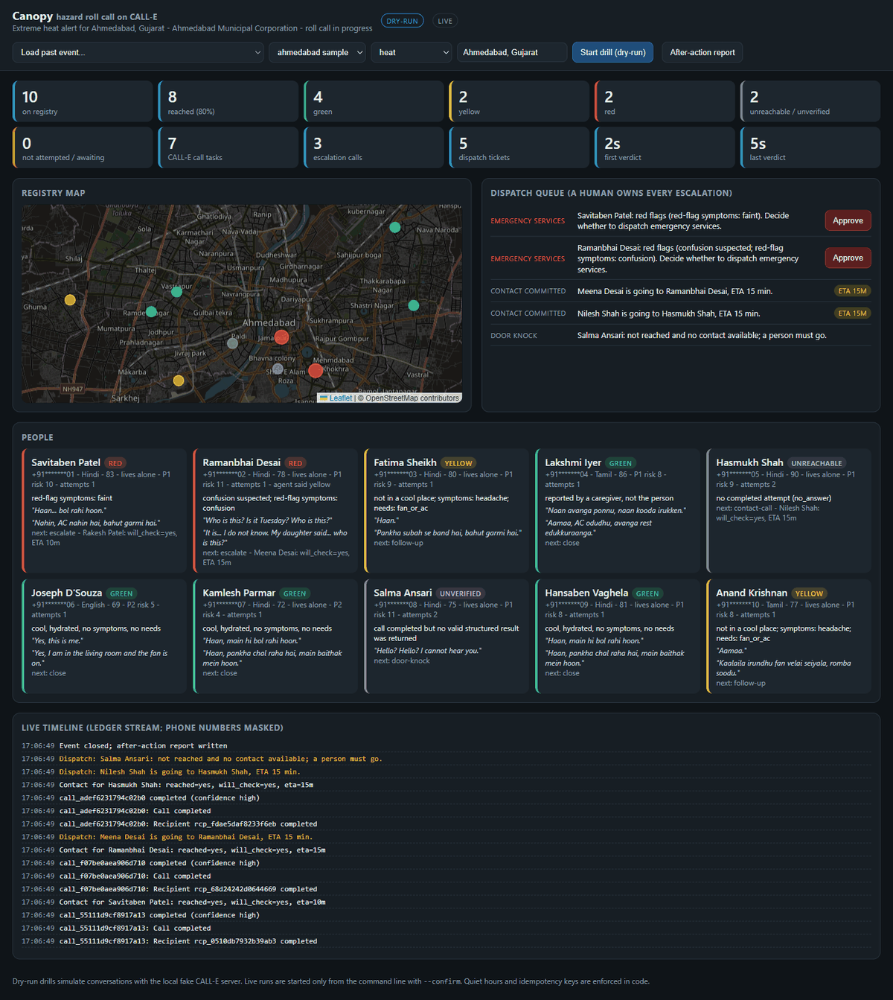

# Canopy

Hazard-triggered welfare roll call on CALL-E. Alerts go one way; Canopy listens back.

When an official heat, flood, power-outage or smoke alert fires for an area, Canopy phones every
opted-in vulnerable person in that area within the hour, in their own language, runs a four-question
triage, escalates the people who need help to a real human (their emergency contact or a volunteer,
also by phone), and writes the after-action report an emergency manager has to file afterwards.

**The voice agent interprets the conversation. Canopy decides what happens next, and a human owns
every escalation.**



## Why this exists

The people who die in heat waves are the ones nobody reached. Cities know this and keep opt-in
registries of vulnerable residents: Paris has about 10,650 people on its heat registry and pays a
call centre to phone them within 48 hours of an alert; Rome's programme of proactive phone contact
with over-80s cut excess heat-wave mortality by 30 to 56 percent (Orlando et al., 2021). Most cities,
district health offices and NGOs have the list but not the call centre. A two-way roll call of a few
thousand people in one hour, in a dozen languages, is exactly the shape of work a batch phone-call
agent is for.

Long-form background, evidence and the demo guide live in [`docs/canopy/README.md`](../../../docs/canopy/README.md).

## What it does

1. **Trigger.** A hazard event is declared by hand, by a drill, by an active US National Weather
   Service alert (`api.weather.gov`), by an Open-Meteo apparent-temperature forecast crossing the
   playbook threshold (anywhere in the world), or by Singapore's NEA 24-hour PSI (data.gov.sg).
2. **Plan.** Every consented registry row gets an explainable risk score (age, living alone, no cooling,
   medical conditions). People are cut into waves; the highest-risk wave is dialled first.
3. **Call.** In live mode, one CALL-E call task per person, placed in parallel per wave, so the agent
   always knows whom it is speaking to. In batch mode, one task per wave with `recipients[]`. Both carry
   a per-recipient result schema (who answered, cool, hydrated, symptoms, needs, tier), a task-level
   aggregate schema, correlation metadata, and an idempotency key per event, wave, attempt and person.
4. **Classify.** Fail-closed rules turn the agent's result into `green`, `yellow`, `red`, `declined`,
   `unreachable` or `unverified`. Confusion or a red-flag symptom always wins; an unknown never becomes green.
5. **Cascade.** Silence is the signal. Unreachable people are redialled once, then their emergency
   contact is phoned by CALL-E and asked for a commitment and an ETA, then they go on the door-knock list.
   Red people escalate immediately, and an emergency-services ticket waits for a human to approve.
6. **Report.** A live dashboard (map, tiers, dispatch queue, ledger stream) during the event, and a
   reproducible after-action report from the append-only ledger afterwards.

Five hazard playbooks ship as JSON: `heat`, `flood`, `outage-medical` (oxygen, dialysis, insulin),
`smoke`, `boil-water`. A playbook holds the questions, red flags, advice, escalation wording and a
`life_safety` flag; the CALL-E task is rendered from it plus the person's own facts, so the conversation
is goal-driven rather than scripted.

## What happens when things go wrong

This is the part that matters for real people, so it is explicit:

| Situation | What Canopy does | What it never does |
| --- | --- | --- |
| CALL-E returns 429, 5xx or a connection error when a task is created | Retries with backoff (4 tries), reusing the same idempotency key | Treat it as "nobody answered" |
| CALL-E still refuses the task | Marks those people `not_attempted`, writes a `not_attempted` ticket, flags the report incomplete | Phone their emergency contacts about a call that never happened |
| A call has not finished when the timeout passes | Leaves the people `awaiting`, records the call id, keeps going | Guess a verdict |
| The process crashes or is stopped | `resume --event-id` reattaches to pending calls by id and re-places refused waves with the same keys | Dial anyone a second time for the same wave |
| The cascade runs twice (resume, follow-up) | Tickets are unique per person and kind; a contact is phoned at most once per event | Duplicate an escalation |
| A person answers and says "not now" | Classifies them `declined`, schedules a follow-up in 45 minutes, keeps their emergency contact out of it | Escalate someone who is demonstrably alive and reachable |
| A live run is started inside quiet hours | Refuses, unless the playbook is life-safety and the operator gives `--override-quiet-hours "<reason>"`, which is written to the ledger | Ring elderly people at 3 a.m. for a boil-water notice |
| The dashboard is exposed through a tunnel for webhooks | Requires a token on every route except `/calle/webhook` (auto-generated when `CANOPY_PUBLIC_URL` is set) | Let the internet approve a dispatch |

All of these are covered by tests in `test/robustness.test.ts` and `test/safety.test.ts`.

## What is in this directory

| Path | Purpose |
| --- | --- |
| `src/registry.ts` | Opt-in registry loader: E.164 validation, consent, phone de-duplication, masking |
| `src/risk.ts` | Explainable risk score, priority, wave planning |
| `src/playbooks.ts`, `playbooks/*.json` | Hazard playbooks and the CALL-E task renderer |
| `src/schemas.ts` | Recipient, task-level and escalation JSON Schemas handed to CALL-E |
| `src/classify.ts` | Fail-closed verdict from the agent's structured result |
| `src/cascade.ts` | Retry, contact call, door knock, follow-up, operator-review decisions |
| `src/quiet-hours.ts` | Calling-window rules |
| `src/calle.ts` | The only module that talks to CALL-E (`@call-e/calle`) |
| `src/orchestrator.ts` | Waves, create retries, waiting (webhook first, polling always), classification, cascade, resume |
| `src/ledger.ts` | Append-only JSONL ledger and its projection |
| `src/server.ts`, `public/index.html` | Dashboard, JSON API, SSE stream, webhook receiver, dispatch approval, token auth |
| `src/report.ts` | After-action report |
| `src/feeds/` | NWS, Open-Meteo and NEA PSI triggers |
| `src/fake-calle-server.ts` | Local fake CALL-E API for the no-call path, with failure injection and localized transcripts |
| `data/registry.sample.csv`, `data/registry.sample.ahmedabad.csv` | Fictional registries (reserved 555 numbers) with dry-run scenarios |
| `Dockerfile` | Hosted dry-run demo image (never live) |
| `test/` | 50+ tests, including end-to-end drills, failure modes, resume and auth |

## Setup

Requires Node.js 20.11 or newer. No account is needed for the default path.

```bash
npm install
npm test          # no network, no credentials, no calls
npm run check     # tsc --noEmit
npm run plan      # score the sample registry, plan waves, print the rendered CALL-E task; no call
npm run demo      # full dry-run roll call against the local fake CALL-E server
npm run serve     # dashboard at http://127.0.0.1:4700 with a "Start drill" button (dry-run only)
```

Copy `.env.example` to `.env` to change the organisation name, emergency number, ports, quiet hours,
time zone or wave size. The dashboard lets you pick the Phoenix or the Ahmedabad sample registry and
reload past events.

### Hosted dry-run demo

```bash
docker build -t canopy-demo .
docker run -p 4700:4700 canopy-demo
```

The image pins `CANOPY_MODE=dry-run` and binds to `0.0.0.0`; the fake CALL-E server runs inside the
container. Any platform that runs a container and sets `PORT` works (Canopy honours `PORT` when
`CANOPY_PORT` is unset).

### Running live (opt-in)

Live calls need three independent signals. Any one missing means no call is placed:

```bash
CANOPY_MODE=live
CALLE_API_KEY=iams_live_...          # from the CALL-E dashboard, never committed
node --import tsx src/cli.ts run --registry data/my-registry.private.csv --hazard heat \
  --area "Ahmedabad, Gujarat" --headline "IMD heat wave warning" --resource "Cooling centre at ..." --confirm
```

- `CANOPY_PUBLIC_URL`: a public HTTPS tunnel (for example ngrok) so CALL-E can deliver terminal
  webhooks. Without it Canopy polls, which also works. Setting it enables a dashboard token; the run
  prints the tokenised dashboard URL.
- `CANOPY_LIVE_ALLOWLIST`: comma-separated E.164 numbers, to hard-limit which rows may be dialled during
  a rehearsal.
- `CANOPY_QUIET_HOURS` (default `21:00-07:00`) and `CANOPY_TIMEZONE` (default: system zone).
- `CANOPY_TASK_MODE`: `per-person` (live default) or `batch`. Batch sends one task per wave with a
  roster of names and relies on the agent matching the dialled number to the roster; verify that on
  your own account before using it live.

Live runs are started only from this command line. The dashboard's "Start drill" button refuses to
run in live mode (see `test/e2e.test.ts`).

## Commands

| Command | What it does | Places calls |
| --- | --- | --- |
| `plan` | Load registry, score, plan waves, print the rendered task and schemas | never |
| `run` | Run a roll call for one event | dry-run: no; live: yes, with `--confirm` |
| `resume` | Reattach to an interrupted event and finish it | as `run` |
| `serve` | Dashboard and webhook receiver; drills from the browser | dry-run only |
| `watch` | Poll NWS (`--nws-area AZ`), Open-Meteo (`--lat --lng --label`) or NEA (`--nea-psi`) and run on a match | as `run` |
| `follow-up` | Redial the yellow people whose follow-up is due (`--event-id`, `--now`) | as `run` |
| `report` | Rebuild the after-action report from a ledger | never |
| `fake-server` | Run the local fake CALL-E API in the foreground | never |

`node --import tsx src/cli.ts --help` prints every option.

## Real-world side effects

In dry-run mode (the default) **nothing leaves the machine**: the app talks to a fake CALL-E server on
`127.0.0.1` that plays scripted conversations chosen from the `scenario` column of the registry.

In live mode, one `run` can place:

- one CALL-E call task per person (per-person mode) or per wave (batch mode) for every consented person;
- one redial for people not reached on the first pass (at most two attempts per person);
- one escalation call per red or unreachable person who has an emergency contact on file;
- one follow-up wave per `follow-up` invocation.

Each of those consumes CALL-E credit. Every call task carries an `Idempotency-Key`
(`canopy:<event>:wave<n>:attempt<m>[:<person>]` or `canopy:<event>:escalation:<person>`), so a crash
and restart of the same event cannot dial anybody twice. Re-running an event whose ledger already exists
is refused; `resume` is the way back in.

What CALL-E receives about a person: their name, their language, an age band, whether they live alone,
and, on an escalation call, the contact's name and the one-line reason. Addresses, coordinates, medical
keywords and notes stay on the operator's machine.

## Cancellation

The CALL-E Developer API has no cancel operation, so Canopy keeps its blast radius small instead:
waves are sequential by default (`--parallel 1`), each wave is at most `CANOPY_WAVE_SIZE` people, and
stopping the process (Ctrl+C) prevents every task that has not been created yet. Calls already accepted
by CALL-E will complete on the platform; `resume` reattaches to them by call id and attributes their
results to the event.

There is no recurring scheduler inside Canopy. `watch` polls while it runs and stops when the process
stops; recurrence, if wanted, belongs to the host scheduler (cron, systemd, a workflow tool), which
should invoke `run`, `watch` or `follow-up` and own its own cancellation.

## Credentials and phone data

- `CALLE_API_KEY` is read from the environment or a local `.env`; it is never written anywhere.
- Phone numbers are validated as E.164 once, on load, and masked (`+14*******01`) in every log line,
  dashboard view, ledger timeline entry, transcript excerpt and report.
- The full registry stays in the operator's CSV. `data/*.private.csv` and `data/runs/` are git-ignored.
- Webhook deliveries are not signed by CALL-E. The receiver checks `CALL-E-Event-Id` against the body,
  de-duplicates by event id, and then re-fetches the call through the authenticated API before any
  decision is taken from it.
- Rows without recorded consent, with a non-E.164 phone, or sharing a phone with an earlier row are
  skipped and reported, never dialled.
- The dashboard binds to `127.0.0.1` unless `CANOPY_HOST` says otherwise, and requires a token whenever
  a public URL is configured.

## Boundaries

Canopy is not a medical or emergency service. The agent asks four questions, offers public-health
advice lines from the playbook, tells anyone with red flags to call the local emergency number, and
alerts a human. It does not diagnose, discuss doses, or promise a visit. An emergency-services ticket
is a recommendation that a person approves on the dashboard; Canopy never contacts emergency services
itself. A `contact_committed` ticket records that somebody said they would go, not that they did.

## Design notes

- **Fail closed.** `unknown` is a first-class enum value in every schema and never resolves to green.
  A completed call with a null structured result is `unverified` and treated like a missed call.
- **Nobody is escalated for a call that never happened.** Platform refusals become `not_attempted`, a
  distinct state with its own ticket, never `unreachable`.
- **The agent proposes, the code decides.** The agent's own `tier` is stored beside Canopy's verdict so
  disagreements are visible in the report (in the sample drill, Harold's "yellow" becomes red because
  `confusion_suspected` is true).
- **Webhook first, polling always.** Results are awaited from either channel, because a call can be
  queued for a long time and dial after a client has given up (platform issue #283).
- **Two schemas per task.** The per-recipient schema carries the verdict inputs; the task-level schema
  asks CALL-E for the aggregate counts, which the report cross-checks.
- **Every fact is a ledger line.** The report is rebuilt from the JSONL file, so it is reproducible and
  auditable; the dashboard is a projection of the same stream.

## Known limitations

- Voicemail detection depends on the agent filling `answered_by`; the Calls API has no built-in
  answered-by disposition, so a voicemail the agent mislabels would look like an unverified call rather
  than a missed one. Both paths lead to a redial.
- The first bot turn can start well after connect on the live platform (issue #295). The report lists
  recipients whose first bot turn started 15 s or more in, so operators can judge whether elderly
  recipients hung up on silence.
- Indian numbers are dialled through CALL-E's international line, so recipients see a foreign caller
  ID. Registry onboarding must tell people which number will call them, and a production deployment in
  India needs a local number on the CALL-E platform.
- "Within the hour" depends on CALL-E's concurrency limits, which are not published. `--parallel`
  raises throughput; the ledger records exactly how long each wave took.
- Recipients are matched back to registry rows by phone number; two rows with one number are collapsed
  on load because CALL-E collapses them into one run (issue #235).
- Follow-up timing is recorded, not scheduled. Run `follow-up` from a host scheduler.
- Map tiles need internet access; the people list works offline.
