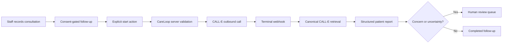

# CareLoop AI

CareLoop AI is a consent-gated post-consultation follow-up workspace for clinics.
It prepares one outbound CALL-E task from clinician-authored recommendations,
captures a strict patient-reported result, and routes uncertainty or concerning
answers to a human care team instead of making a clinical decision.

**Contribution area: User-facing Apps.** This directory is a catalog and setup
guide for the runnable [CareLoop AI application](https://github.com/blas-rodriguez/careloop-ai).
The application source and tests are maintained there under the MIT license. These
instructions target the sanitized root revision
[`233c639`](https://github.com/blas-rodriguez/careloop-ai/tree/233c63959a9f9afe54edca7b0227a8ea50cd299f).

- [Public no-call showcase](https://careloop-ai-three.vercel.app/showcase)
- [Source repository](https://github.com/blas-rodriguez/careloop-ai)
- [Security review](https://github.com/blas-rodriguez/careloop-ai/blob/233c63959a9f9afe54edca7b0227a8ea50cd299f/docs/security-review.md)
- [CALL-E provider adapter](https://github.com/blas-rodriguez/careloop-ai/blob/233c63959a9f9afe54edca7b0227a8ea50cd299f/src/lib/calls/provider.ts)

## Workflow boundary

CareLoop handles the clinic-side workflow around one phone call:

1. An authenticated staff member records a fictional or appropriately governed
   patient, a consultation, and clinician-authored recommendations.
2. The patient must have explicitly consented to automated calls before a
   follow-up can be scheduled. Consent is checked again immediately before a call.
3. The staff member explicitly presses the start action. Scheduling a follow-up
   does not dial automatically and the app creates no recurring jobs.
4. The server validates follow-up state, attempt count, HTTPS application origin,
   and the recipient's E.164 number before sending one `POST /v1/calls` request.
5. CALL-E receives an automation disclosure, the clinician-authored context, a
   strict recipient result schema, correlation metadata, and a stable idempotency
   key derived from the follow-up identifier.
6. A terminal webhook is treated as a notification, not trusted as the result.
   CareLoop fetches the canonical call from CALL-E, deduplicates the event, and
   stores the structured result and transcript through a server-only Supabase client.
7. Worsening, new symptoms, uncertainty, or a request for clinical help is routed
   to human review. CareLoop never diagnoses, prescribes, or resolves emergencies.



## Default no-call demonstration

The application defaults to `CALL_PROVIDER=mock`. Credentials alone do not enable
live calling. The mock path creates deterministic fictional outcomes for improving,
unchanged, worsening, appointment-requested, and new-symptom scenarios without
contacting CALL-E.

The hosted `/showcase` route is public and read-only. It presents fictional UI
screens and the safety architecture; it cannot start a call, mutate Supabase, or
reveal credentials. The authenticated workspace and demo reset use per-user
Supabase Row Level Security.

## Reproduce the no-call checks

Use Node.js 20 or newer. The commands below do not require a CALL-E key and the
unit tests do not place a phone call:

```bash
git clone https://github.com/blas-rodriguez/careloop-ai.git
cd careloop-ai
git checkout --detach 233c63959a9f9afe54edca7b0227a8ea50cd299f
npm ci
npm test
npm run lint
npm run typecheck
npm run build
```

Expected unit-test result: 23 tests pass. The tests cover strict E.164 validation,
phone masking, plausible birth dates, sanitized provider diagnostics, trusted CALL-E
origin validation, bounded text input, secret boundaries, and the service-only webhook
event table. Lint, type-check, and the production build also pass at the pinned
revision. These checks do not prove carrier connectivity or a successful live call.

To run the authenticated workspace locally, create a dedicated Supabase project,
copy `.env.example` to `.env.local`, fill the public Supabase values, apply the
committed migrations, and keep `CALL_PROVIDER=mock`. Use only the fictional seed
records; never load real health information into a demo environment.

Every committed demonstration identity is explicitly named `Demo Patient` or
`Demo Clinician`. Contact fixtures use reserved `202-555-01xx` example numbers and
the `.invalid` email domain; narrative fields identify themselves as synthetic.

## Opt-in live verification

Live mode is an intentional real-world side effect. It may consume CALL-E credits
and contact a real phone. Only test with your own number or a recipient who has
explicitly agreed to this specific automated follow-up.

1. Confirm that CALL-E supports the destination region and spoken locale. Do not
   label an unsupported destination as another region to bypass provider controls.
2. Store `CALL_E_API_KEY` and `SUPABASE_SECRET_KEY` only in server-side environment
   configuration. Neither variable may use a `NEXT_PUBLIC_` prefix.
3. Set `NEXT_PUBLIC_APP_URL` to the deployment's exact HTTPS origin. The server uses
   it to build `/api/call-e/webhook`.
4. Configure the provider-supported `CALL_E_REGION` and `CALL_E_LOCALE`, then set
   `CALL_PROVIDER=call-e` and redeploy.
5. Create a fictional consultation, use the authorized E.164 destination, enable
   automated-call consent, and schedule one follow-up.
6. Review the recommendations and masked destination, then explicitly start the call.
7. Reconcile the result in both CareLoop and CALL-E before considering any retry.
   A timeout, browser interruption, or ambiguous response is not permission to dial again.
8. Return to `CALL_PROVIDER=mock` after live verification unless the deployment is
   intentionally operated with the required clinical, privacy, and security controls.

The current public CALL-E documentation lists the supported recipient regions.
Provider rejection before a call ID is created must be reported as a failed request,
not as live-call evidence.

CALL-E support confirmed that Argentina was temporarily restricted and authorized
its official US testing hotline for integration testing. CareLoop does not relabel
an Argentine destination as another region. A hotline verification, if performed,
uses only synthetic context and is reported separately from the mock patient demo.

## Structured result and human ownership

The recipient result asks whether recommendations were followed, whether the
patient is improving, unchanged, or worsening, whether new symptoms appeared,
whether an appointment or callback is requested, and an optional one-to-five care
rating. Missing or declined answers remain unknown; the application does not invent
them.

The phone report is patient-reported information for clinic staff. It is not a
medical assessment. CareLoop does not change medication, provide treatment advice,
book an appointment automatically, contact emergency services, or replace a clinician.
The call tells the recipient to use local emergency services for emergencies and
routes concerning results to a human.

## Credentials, data, and tenant isolation

- The CALL-E key and Supabase secret key are imported only by server-only modules.
- Browser code receives readiness booleans, never private credential values.
- Only the Supabase URL, publishable key, and public application origin are public.
- Supabase RLS resolves ownership through each record's foreign-key chain so one
  authenticated demo user cannot read another user's workspace.
- The webhook validates size, event identifiers, event type, and call identifier,
  then retrieves the canonical provider result with the server-side key.
- Event IDs are persisted for deduplication and result text is length-limited.
- Phone numbers, transcripts, and health-related reports are sensitive. Do not put
  them in screenshots, repository fixtures, logs, issues, or pull requests.

The prototype is not a certified clinical system. Production use would additionally
require formal clinical review, healthcare and privacy compliance, organizational
roles, audit and retention controls, encrypted backups, incident response, rate
limiting, and operational monitoring.

## Side effects, retries, and cancellation

- Creating patients, consultations, and follow-ups writes to the configured Supabase
  project. Use a disposable demo project for the fictional scenario.
- Scheduling does not call anyone. Before execution, do not press the call action;
  switch back to mock mode if the deployment should be incapable of live calls.
- Starting in live mode sends the authorized number, call instructions, result schema,
  metadata, and webhook URL to CALL-E and may place one outbound call.
- The application does not expose a provider hang-up API. After CALL-E accepts a call,
  the recipient can decline or end it; provider support or account controls may be
  needed for remote cancellation.
- The same follow-up uses a stable idempotency key and has a bounded attempt count.
  Never retry an uncertain request until the original state has been reconciled.
- There are no hidden recurring schedules and no automatic redial loop.
- A demo workspace can be restored to fictional seed state through its explicit reset
  action. Reset is destructive for that authenticated user's demo records only.

## License

The upstream CareLoop AI source is MIT licensed. CALL-E, Supabase, Vercel, and other
third-party services retain their own terms. This guide contains no API keys, private
phone numbers, patient records, call recordings, or transcripts.
