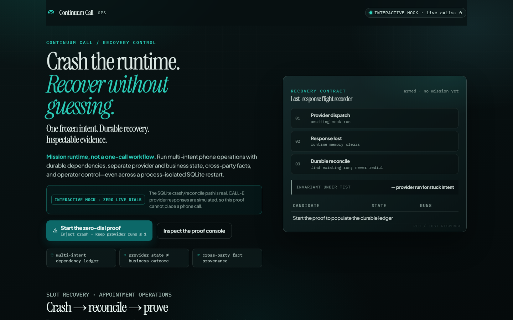
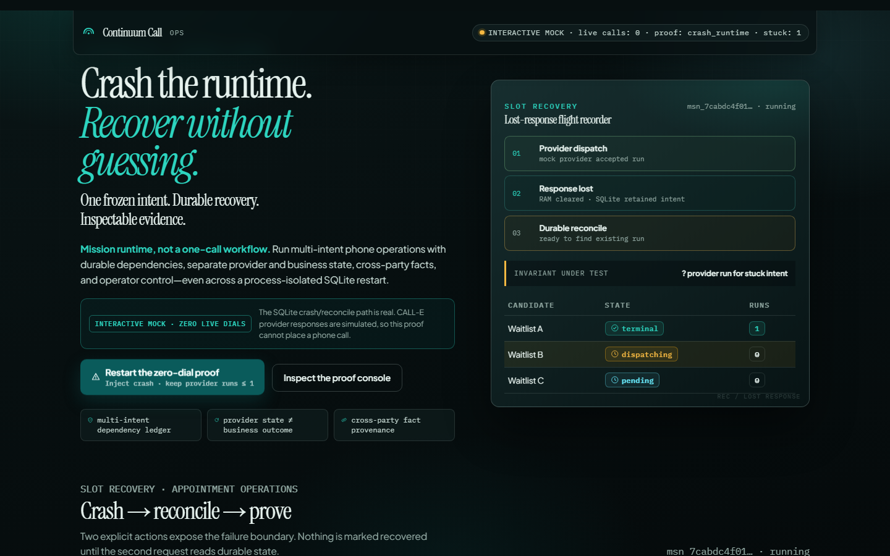
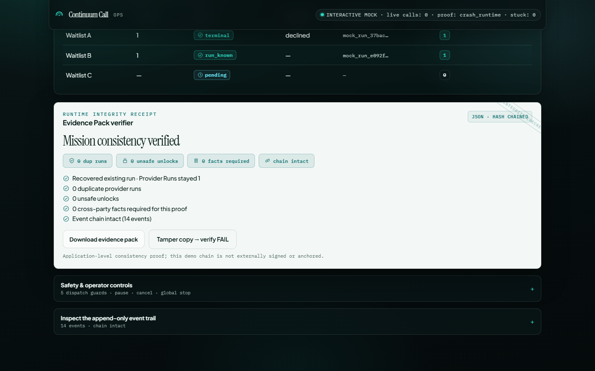

# Continuum Call

> Resume a phone mission after a crash without improvising another call.

Continuum Call is a durable orchestration layer for CALL-E phone workflows. Its first use case is clinic waitlist recovery: contact one candidate at a time, preserve the exact authorized call payload across restarts, and never unlock a conflicting candidate while an earlier outcome is unknown.

The default path is a deterministic no-call simulation. Live CALL-E access is opt-in, allowlisted, and never required to review the product or run the test suite.



## Why this is not another dialer

A successful HTTP response is not the same as a known business outcome. A process can crash after CALL-E accepts a call but before the application stores the provider run ID. Blindly creating a fresh request can then produce a second real-world action.

Continuum Call makes that uncertainty visible and recoverable:

1. Persist a payload-bound `CallIntent` before provider dispatch.
2. Reconcile a stuck intent with the same frozen payload and idempotency key.
3. Keep downstream candidates locked while an outcome is ambiguous or unresolved.
4. Export an Evidence Pack and replay its event chain, ledger, run cardinality, and fact provenance.

## Run the jury path locally

Requirements: Node.js 22.13 or newer. `node:sqlite` was available earlier
behind a flag, but 22.13 is the first 22.x release that enables it by default.

```bash
npm ci
npm test
npm run dev
```

Open `http://127.0.0.1:8788`. Mutating local routes use the development bearer token `dev-mock` when `OPS_TOKEN` is unset. The server binds to loopback only.

In the Ops Console:

1. Run **Crash after provider accept**.
2. Observe the durable `dispatching` intent with no stored provider run ID.
3. Run **Reconcile same intent**.
4. Observe one provider run, the same payload hash, and a passing Evidence Pack.
5. Run the tamper proof and observe verification fail closed.

No command above creates a real phone call. The mock adapter is the only provider used by the local server and tests.

## What the tests prove

```bash
npm test                       # deterministic invariant and tamper suite
npm run test:chaos -- --n=10000 # randomized crash/retry schedules
npm run spike:dry              # no-network S1-S6 ladder
```

The suite covers lost responses, a real OS-process restart from SQLite, parallel resume attempts, durable mission-create idempotency, changed-payload rejection, ambiguous outcome blocking, cancellation, frozen-graph dependency enforcement, cross-party fact handoff, per-mission event chains, the live adapter's one-shot reservation, and malicious Evidence Pack mutations. The hardening suite contains 11 focused regressions for previously discovered state-machine and integrity failures.

These tests prove Continuum's orchestration invariants against the included deterministic provider. They do not claim that every external provider implements idempotency correctly; the named live verification path records that separately.

## CALL-E integration

`src/calle/live-adapter.ts` uses the official Developer API from a trusted backend:

- `POST https://api.heycall-e.com/v1/calls` with a payload-bound `Idempotency-Key`;
- `GET /v1/calls/{call_id}` for status, recipient results, and transcript turns;
- defensive parsing of the documented `structured_result` and `recipients[].attempts[].transcript_turns` response shape;
- fail-closed classification when transcript evidence or confirmation order is insufficient.

An affirmative structured result alone does not unlock a downstream action. Continuum requires a reliable transcript, the explicit confirmation question, an answer after that question, and a value matching the offered fact. A plain early “yes” remains unresolved.

## Live-call safety

Dry mode is the default. A named live verification requires all configured gates to pass, including:

- explicit live opt-in and experiment confirmation;
- an API key sent only to the exact official HTTPS origin;
- a valid E.164 destination on the operator allowlist;
- recorded consent, IANA timezone, calling window, one-call cap, and remaining budget;
- `SPIKE_STOP` global kill switch plus a durable operator-stop file;
- an atomic, persistent one-shot reservation before the first create request.

Copy `.env.example` to `.env` only when preparing a named experiment. Never commit credentials or real phone numbers. Review the masked preview before enabling a side effect.

The only submitted-runtime live path is intentionally absent from `package.json` so automation cannot discover and invoke it by accident:

```bash
npx tsx scripts/spike/live-runtime-verify.ts live
```

That command loads a local `.env` and refuses unless every named `RUNTIME_VERIFY` gate is set deliberately: `SPIKE_LIVE=1`, `SPIKE_STOP=0`, the exact official API origin, one E.164 test number present in `CALLE_LIVE_ALLOWLIST`, `CALLE_LIVE_CONSENT=1`, `CALLE_LIVE_MAX_CALLS=1`, a positive integer budget, a valid current calling window, and `CALLE_LIVE_CONFIRMATION=CONFIRM_RUNTIME_VERIFY_ONE_ALLOWLISTED_CALL`. Its one-shot lock is never removed automatically. Do not run it from CI.

To stop new work, set `SPIKE_STOP=1` or use **Stop dispatches** in the local console. Planned intents become cancelled; an in-flight intent is marked `cancellation_requested` because a local process cannot pretend that an already accepted provider action disappeared.

## Architecture

| Layer | Responsibility |
| --- | --- |
| `src/runtime/` | Mission state machine, payload freezing, guards, reconciliation, SQLite snapshots, Evidence Pack verification |
| `src/calle/mock-adapter.ts` | Deterministic no-call provider with idempotent reuse and lost-response injection |
| `src/calle/live-adapter.ts` | Gated CALL-E Developer API adapter |
| `src/server/` | Loopback-only Ops API and reproducible jury proofs |
| `public/` | Responsive Ops Console with a clearly labeled client-side dry preview |
| `scripts/spike/` | Failure matrix, chaos schedules, evidence tamper cases, and named integration probes |



## Evidence semantics

The Evidence Pack is application-level self-consistency evidence, not cryptographic authenticity or third-party notarization. Its verifier recomputes mission-local event hashes and independently replays the ledger. It checks consecutive sequence numbers, complete ledger coverage, unique provider-run ownership, unsafe downstream unlocks, cancellation boundaries, payload-bound fact consumption, and traceable structured facts. The chain is neither signed nor externally anchored, so a privileged database administrator who coherently rewrites the complete history remains outside this demo's threat model.

“Verbally confirmed” is intentionally different from “booked.” Continuum does not claim a calendar booking without an explicit calendar write-back integration.



## Data and privacy

- Phone numbers are masked in logs and exported evidence.
- Credentials stay in server-side environment variables.
- The demo uses fictional numbers and synthetic transcripts.
- SQLite demo state lives under `.data/` and can be removed locally after review.

Missions are explicit one-off workflows. The app creates no hidden or recurring schedules.

This is a hackathon reference implementation for appointment logistics only. It provides no medical advice or diagnosis and must not be used for emergencies. It also provides no legal or financial advice. Production deployment would require organization-specific consent, retention, access-control, telephony, and healthcare-compliance review.
