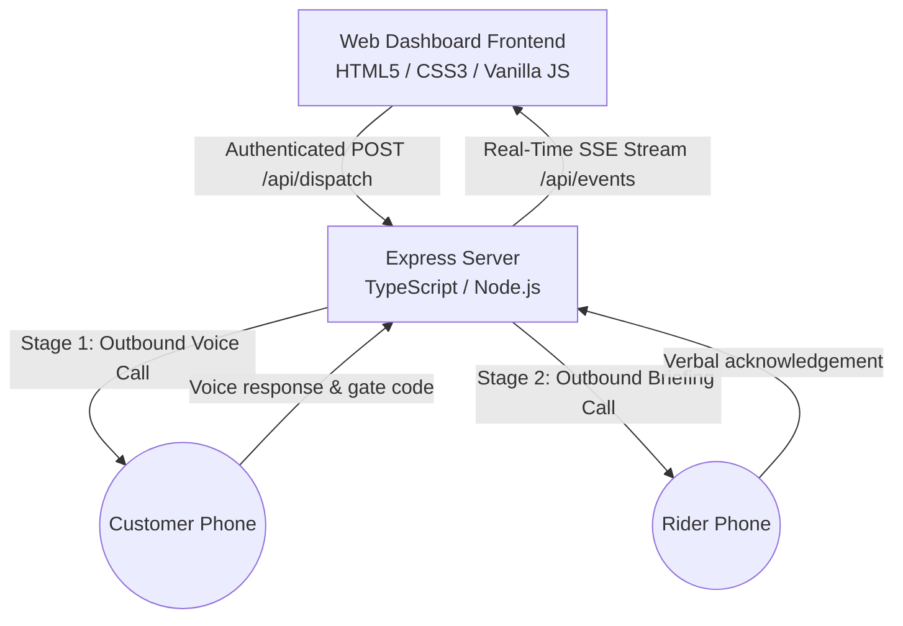

# 📦 DispatchPulse — AI Voice Logistics Command Center

> **Built for the CALL-E Hackathon: *Your Code Is Calling***
> Submission Category: **Workflow Plugins / Full-Stack Applications**

DispatchPulse is a real-time logistics command center and automated 2-stage pre-delivery phone call verification engine powered by **[CALL-E](https://call-e.ai)** voice AI.

---

## 🎯 The Problem

Logistics operators in emerging and high-density markets face high rates of failed delivery attempts (up to 30-35%) caused by:
- Recipients being away from home when the rider arrives.
- Gated estate access restrictions requiring pre-approved visitor gate pass codes.
- Unmet verification requirements for security guard drop-offs.

Traditional SMS notifications are frequently ignored or delayed. Manual phone calls by dispatchers are expensive, non-scalable, and inefficient.

---

## 💡 The Solution

**DispatchPulse** automates recipient phone verification *before* a rider is dispatched. Powered by **CALL-E's TypeScript SDK (`@call-e/calle`)** and CLI session engine:

1. **Stage 1 (Customer Call)**: Dials the delivery recipient using a polite, clear, localized tone to confirm availability, obtain estate gate pass codes (`gate_pass_code`), or process reschedule requests.
2. **Stage 2 (Rider Briefing Call)**: Automatically places a follow-up call to the assigned dispatch rider with customized delivery instructions from Stage 1 and captures verbal confirmation.
3. **Real-Time Dashboard Streaming**: Pushes live status badges, dialogue turns, and extracted JSON directly to the dispatcher's dashboard via **Server-Sent Events (SSE)**.

---

## 🏗 Architecture



---

## ✨ Key Features & Security Controls

- ☎️ **Automated 2-Stage Voice Pipeline**: Customer verification call immediately followed by rider instruction briefing.
- 🔒 **API Authorization Boundaries**: All API routes (`/api/dispatch`, `/api/history`, `/api/settings`, `/api/events`, `/api/riders`) require authentication via `x-api-key` or `Authorization: Bearer <token>`.
- 🛡️ **SSRF & Origin Protection**: Base URLs and MCP endpoints are validated against a strict domain allowlist (`https://api.heycall-e.com`), preventing credential leakage to arbitrary origins.
- 📱 **Strict E.164 & PII Masking**: Strict ITU-T E.164 phone number validation regex (`^\+[1-9]\d{6,14}$`) and automated PII masking (`+155****0100`) across all public telemetry.
- ⚡ **Provider Idempotency**: In-memory execution locks prevent duplicate concurrent calls from network retries or rapid double-clicks.
- 🛡️ **Stored XSS Sanitization**: All user and provider-controlled strings rendered into the DOM are sanitized against HTML injection.
- 🧪 **Credential-Free Test Suite**: 18 automated unit and integration tests verifying security boundaries, validation, and error propagation without requiring live telephony credentials.

---

## 🛠 Tech Stack

- **Backend**: Node.js, Express, TypeScript (`tsx`).
- **AI Voice SDK**: [`@call-e/calle`](https://www.npmjs.com/package/@call-e/calle) (`v0.6.0`).
- **Streaming**: Server-Sent Events (SSE).
- **Frontend**: Glassmorphism UI (HTML5, Vanilla CSS3, Client-side JavaScript).
- **Testing**: Built-in Node.js Test Runner (`node:test`, `node:assert`).

---

## 🚀 Quick Start

### 1. Prerequisites
- Node.js (v18+ or v20+)
- npm or pnpm
- (Optional for live telephony) CALL-E Account & API Key (or CLI session via `calle auth login`)

### 2. Environment Setup
Create a `.env` file from the example template:

```bash
cp .env.example .env
```

```env
PORT=3000
CALLE_API_KEY=your_calle_api_key_or_token
RIDER_TEST_PHONE=+15555550101
API_SECRET_KEY=your_custom_secret_key_here
DRY_RUN=true
```

### 3. Installation & Run

```bash
# Install dependencies
npm install

# Run automated tests
npm test

# Run development server (runs in safe Dry-Run mode by default)
npm run dev
```

### 4. Using the Dashboard

1. Open **`http://localhost:3000`** in your browser.
2. Navigate to **⚙️ Engine Settings** in the sidebar.
3. Enter your `API_SECRET_KEY` (configured in your `.env`) into the **Dashboard API Secret Key** field and click **💾 Save Engine Settings** to authenticate your dashboard session.
4. Return to **📦 Dispatch Control** to trigger pre-delivery verification runs:
   - **Simulation / Dry Run (Default)**: Select a test preset and click **📞 Dispatch Verification Agent** to test the 2-stage voice pipeline with real-time SSE telemetry.
   - **Live Outbound Calls**: Set `DRY_RUN=false` in `.env`, provide a valid E.164 phone number, check the **"Live Calling: Confirm recipient consent"** checkbox, and dispatch.

---

## 🧪 Running Automated Tests

Run the credential-free test suite:

```bash
npm test
```

Verifies:
- Endpoint authorization & 401 protection
- Origin allowlist & SSRF defense
- Strict E.164 phone number validation
- PII phone masking
- Idempotency & duplicate dispatch prevention
- HTML/XSS entity escaping
