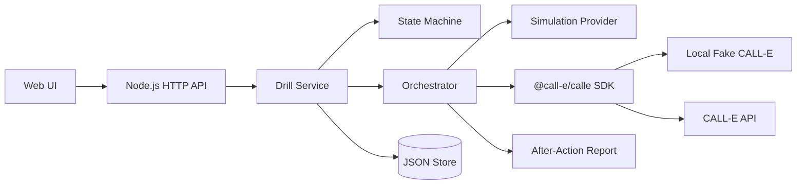

# DrillSignal

DrillSignal conducts **consented, scheduled business-continuity drills by phone**. A drill calls a primary on-call role, evaluates a strict structured result, and may deterministically escalate to an approved backup when rules permit. The app produces an evidence-backed readiness report with masked audit data.

This is a runnable demo app for AI-agent phone-call workflows. It is not a CALL-E SDK and does not define a supported product API.

## Value proposition

Operations teams need to verify that on-call roles can be reached, acknowledge an outage scenario, and assume ownership before a real incident. DrillSignal packages that workflow with explicit consent, call caps, cancellation boundaries, and deterministic scoring - without hidden schedules or emergency calls.

## Architecture



Product flow:

1. **Create Drill** - primary and optional backup contacts, consent attestations, mode selection (locked at creation).
2. **Safety Preview** - masked numbers, max-call disclosure, operator attestations, live side-effect acknowledgment when mode is live (no network).
3. **Mission Control** - explicit launch confirmation, live status, cancel control.
4. **After-Action Report** - deterministic scores and masked evidence excerpts.

## Setup

Requirements: Node.js 20+ and npm.

For reproducible installs (judges, CI, clean-room checks):

```bash
cd apps/typescript/drill-signal
npm ci
```

For local development when the lockfile may change, `npm install` is also supported.

Copy environment template:

```bash
cp .env.example .env
```

Single-command verification (typecheck, tests, build, no-network demo):

```bash
npm run verify
```

This does not invoke the repository root Python validator; run that separately from the repo root when contributing upstream.

## Run locally (simulation default)

Simulation is the default mode and **never contacts a network service**:

```bash
npm run dev
# open http://127.0.0.1:3847
```

The server binds **127.0.0.1** by default. Mutating API routes are open on loopback only.

Or use the demo helper (ephemeral port):

```bash
npm run demo
```

## Network exposure and operator authentication

- Default `DRILL_SIGNAL_BIND_HOST=127.0.0.1` - mutating routes (`POST /api/drills`, preview, launch, cancel) do not require a token.
- When `DRILL_SIGNAL_BIND_HOST` is set to a non-loopback address (for example `0.0.0.0` in Docker), set `DRILL_SIGNAL_OPERATOR_TOKEN` on the server. Every mutating route then requires `Authorization: Bearer <token>`.
- The browser UI exposes an **Operator token** field (stored in `sessionStorage` only, never bundled in static assets). Paste the token when accessing a remote host.
- Server logs never include the operator token.

## Dry run / simulation

- Default `mode=simulation` uses the in-process `SimulationProvider`.
- Choose a preset in the UI or API (`primary-success`, `primary-unavailable-backup-success`, `opt-out`, `malformed-result`, `timeout-unknown`, `cancellation`).
- Fictional reserved numbers such as `+15550100001` are used in samples.
- Mode and simulation preset are **locked at drill creation**; launch cannot override them.

## Fake-server mode

Fake-server exercises the real `@call-e/calle` client against loopback HTTP without placing a live call.

1. **Embedded fake (default):** When `CALLE_BASE_URL` is unset or invalid (`http://127.0.0.1:0`), DrillSignal auto-starts an embedded loopback fake on launch. Disable with `DRILL_SIGNAL_EMBEDDED_FAKE=0`.
2. **External fake:** Start a fake from `src/fake/calle-server.ts` (or tests) and set `CALLE_BASE_URL=http://127.0.0.1:<port>`.

The UI shows a clear error when fake-server is selected but neither `CALLE_BASE_URL` nor the embedded fake is available.

## Opt-in live verification

Live mode places a **real outbound phone call**. Use only with numbers you own or are authorized to call.

Safety Preview requires an explicit **live side-effect acknowledgment** before the drill can be armed.

```bash
export CALLE_API_KEY="<your-server-api-key>"
export CALLE_BASE_URL="https://api.heycall-e.com"
npm run dev
```

In the UI, select **Live CALL-E** and complete all consent steps. Live verification command:

```bash
CALLE_API_KEY="<your-server-api-key>" CALLE_BASE_URL="https://api.heycall-e.com" npm run dev
```

**No live call was placed during repository tests or default demo runs.**

## Side effects

| Mode | Side effect |
| --- | --- |
| simulation | None (in-process only) |
| fake-server | Local HTTP to loopback fake |
| live | One or two outbound CALL-E calls per drill, bounded by max call cap |

## Credential handling

- `CALLE_API_KEY` is read from the server environment only.
- `DRILL_SIGNAL_OPERATOR_TOKEN` protects mutating APIs when the server is not loopback-bound.
- API keys and operator tokens are never stored in drill records, rendered reports, or client bundles.
- Base URL trust is enforced before the SDK client is constructed (see `src/calle.ts`). `CALLE_ALLOWED_HOSTS` adds exact additional hostnames.

## Privacy boundary

- Full E.164 numbers may exist in the JSON store **only while a drill is active** so orchestration can dial.
- Terminal drills redact full numbers immediately on save; persisted audit data uses masked phones and short transcript excerpts.
- Active drills older than `DRILL_SIGNAL_ACTIVE_TTL_HOURS` (default 24) are purged/redacted on access via `JsonDrillStore.purgeStaleActive()`.
- Reports and API responses after completion do not include full phone numbers.

## Cancellation

- **Cancel Drill** is available in Mission Control.
- Before any provider call starts, cancellation is immediate.
- During provider waits, orchestration observes `cancelRequested`, aborts local waits, and calls `cancelCall` when the provider supports it.
- Before backup escalation, cancellation is re-checked.
- After a provider call is accepted, cancellation stops local orchestration but **cannot guarantee** the telephony provider stops an in-flight call. The UI shows an honest boundary message.

## Launch safety

- Drills must be **armed via Safety Preview** before launch; launch never arms a drill.
- Preview attestations and live side-effect acknowledgment (when applicable) are required.
- Duplicate launches are blocked: terminal drills, existing launch claims, attempts, and in-flight statuses reject new side effects.
- Same idempotency key replays return current state read-only.
- Per-drill single-flight ensures concurrent launch requests share one orchestration.
- Process-safe launch claims use atomic file creation (`wx`) under `.data/claims/`. **Single-instance boundary:** one server process per data directory; multi-instance requires external coordination.

## Safety boundaries

- One scoped scenario: `production_outage` business-continuity drill.
- No emergency-service calls, real incidents, medical/legal/financial decisions, hidden schedules, or recurring jobs.
- Explicit consent attestations and launch confirmation are required.
- Duplicate launches are blocked via durable launch claims and CALL-E idempotency keys per role.

## Structured result schema

CALL-E must return:

- `reached_live_person` (boolean)
- `acknowledged_scenario` (boolean)
- `can_take_ownership` (boolean)
- `first_action` (string)
- `escalation_target` (string | null)
- `needs_help` (boolean)
- `follow_up_required` (boolean)
- `opt_out` (boolean)

## Testing

```bash
npm run verify
```

Or run steps individually:

```bash
npm run check
npm test
npm run build
npm run demo
python3 ../../../scripts/validate_repository.py
```

Tests cover state transitions, consent/call caps, scoring, masking, idempotency, cancellation, launch guards, API security, malformed results, SDK contract against the fake server, and end-to-end simulated flows (54 source tests plus 2 post-build production static-serving tests).

## Demo script

1. `npm run dev` and open the UI.
2. Keep **Simulation** mode and preset **primary-success**.
3. Create drill with fictional `+15550100001`.
4. Acknowledge safety preview attestations.
5. Launch drill and observe Mission Control events.
6. Review After-Action Report scores, human-readable labels, and evidence excerpts.
7. Repeat with **primary-unavailable-backup-success** and backup `+15550100003`.

## Docker

Multi-stage build installs dev dependencies only in the build stage. The runtime image contains production dependencies and compiled output only. The process runs as a non-root user; mount `/data` for persistent drill storage.

When exposing DrillSignal beyond loopback, set an operator token:

```bash
docker build -t drill-signal .
docker run --rm -p 3847:3847 \
  -e DRILL_SIGNAL_BIND_HOST=0.0.0.0 \
  -e DRILL_SIGNAL_OPERATOR_TOKEN="<operator-token>" \
  -v drill-signal-data:/data \
  drill-signal
```

Provide the same token in the browser **Operator token** field (session storage only).

Health check: `GET /api/health` (used by the image `HEALTHCHECK`).

## Submission packet

Hackathon and upstream submission materials live in [`submission/`](submission/README.md): judge guide, Devpost copy, demo script, PR description template, and evidence manifest schema.

## Known limitations

- Single outage scenario only; no recurring schedules.
- JSON file store is suitable for demo/local use, not multi-tenant production.
- Launch claims are process-safe on one host; multiple instances sharing one data directory are unsupported.
- Live cancel cannot stop provider-side calls once accepted.
- `timeout-unknown` simulation may finish as ambiguous when wait limits are hit.

## Static demo artifact

See `public/architecture.svg` for a lightweight architecture diagram suitable for docs and recordings.
