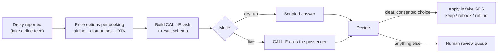

# Flight Disruption Agent

A disruption desk for online travel agencies (OTAs) and airlines. When a flight is delayed, it prices every option for each passenger across the whole ticket sales chain (airline, distributors, OTA), has CALL-E call the passenger to offer those options, and applies the passenger's confirmed choice to the booking after the call. Anything unclear goes to a human agent.

Dry run is the default. It places no calls, needs no credentials, and uses fictional data.

## The problem

Flight reschedules, refunds, and disruption handling are still mostly manual. Many OTAs and airlines route this work to outsourced contact centers, where an agent checks whether the booking qualifies, works out each party's fees, submits the change in a B2B or global distribution system (GDS) portal, and tells the passenger.

Ticket distribution makes the pricing hard. An OTA may buy a ticket straight from the airline, or through a chain:

```text
OTA -> distributor 1 -> distributor 2 -> airline
```

Each party has its own reschedule and refund rules, so the same delay costs two passengers on the same flight different amounts. The airline's own rules also change with the delay: past a threshold it is an airline-caused (involuntary) change and fees are reduced or waived; below it, a passenger who wants to change pays the normal (voluntary) fees.

See [`docs/flight-disruption-agent.md`](../../../docs/flight-disruption-agent.md) for the full process write-up.

## How it works



1. **Report a delay** on the departure board. The desk decides whether each booking gets involuntary or voluntary pricing (Nusantara Air's threshold is 2 hours).
2. **Price every option** for each booking: keep the delayed flight, move to a later flight with seats, or cancel and refund. Every line shows which party charges it. One fictional distributor (Samudra Travel Wholesale) charges admin fees even on involuntary changes, so its passengers pay for a move that is free for others.
3. **Build the call.** CALL-E cannot look anything up during a call, so the task text contains the final options and exact amounts. It tells the agent to disclose that it is an AI, to get a clear yes before accepting any cost or reduced refund, to never ask for payment details, and to hand off to a person on request.
4. **Call.** The result schema asks CALL-E to return `choice`, `selected_flight`, `fee_accepted`, `human_requested`, and a quoted `reason`.
5. **Decide after the call.** The desk applies the choice automatically only when all of these hold:
   - the call completed
   - CALL-E reports the task completed, with confidence of at least 0.7
   - the passenger chose an option that was actually offered
   - they explicitly accepted any cost or reduced refund
   - they did not ask for a person

   Everything else lands in the review queue with the reasons.
6. **Apply** in the fake booking system: keep the ticket, rebook with a new booking code and reissued ticket (and one fewer seat), or record the refund and void the ticket. A human can resolve any review item with one of the offered options.

### Where CALL-E is used

| Mode | Path | Credential | Result |
| --- | --- | --- | --- |
| `dry-run` (default) | Scripted in-process stand-in | None | Same shape as a real result |
| `sdk` | `@call-e/calle` `calls.create` + `calls.get` | `CALLE_API_KEY` | Structured `recipientResultSchema` result, confidence, transcript |
| `cli` | Local `calle call start` / `call status` | `calle auth login` (browser) | Summary and transcript only, so every call goes to human review with a hint |

SDK calls send a stable `Idempotency-Key` (`fda-<event>-<booking>`) and `metadata` with the event and booking code.

## Run it (dry run, no calls)

Requires Node.js 22+.

```bash
cd apps/typescript/flight-disruption-agent
npm install
npm start
```

Open http://127.0.0.1:4310, report a delay on NA 721, select passengers, and simulate calls. The five NA 721 passengers are scripted to cover each path: keep, refund, rebook, asks for a person, and no answer.

Terminal walkthrough of the same flow:

```bash
npm run demo        # 4-hour delay: involuntary pricing
npm run demo 90     # 90-minute delay: voluntary pricing
```

Tests and type check:

```bash
npm test
npm run check
```

## Live calls (opt-in)

Live mode places real phone calls and uses CALL-E call credits.

```bash
cp .env.example .env
```

Then set:

- `CALLE_MODE=sdk` and `CALLE_API_KEY` from the [CALL-E dashboard](https://dashboard.heycall-e.com/account/api-keys), or `CALLE_MODE=cli` after `calle auth login`.
- `LIVE_DEMO_PHONE`: the one E.164 number that live calls may reach, owned by someone who has agreed to take a test call. It must be in a region CALL-E supports. Indonesian (+62) numbers are currently refused by CALL-E, and the desk refuses them before any request is sent.
- `LIVE_CALL_BUDGET`: maximum live calls per server run (default 3).

Restart with `npm start`. The header turns red and shows the destination masked.

## Safety and side effects

- **No live calls by default.** Dry run never touches the network.
- **One destination in live mode.** Every live call goes to `LIVE_DEMO_PHONE`. The fictional fixture numbers (the reserved +1 555-01xx range) are never dialed, and the UI says when a call is redirected.
- **Per-call confirmation.** Each live call requires typing the last four digits of the destination.
- **Call budget.** A live call budget caps credit use.
- **No duplicate calls.**
  - Each booking is called at most once per disruption (dedupe key `<event>:<booking>`), and the call is recorded before dialing.
  - A submission with an uncertain outcome is marked `uncertain` and never retried automatically.
  - SDK calls also carry an idempotency key.
- **Masked numbers** everywhere in the UI and API responses.
- **AI disclosure and consent** are in the task text. The agent must say it is an AI assistant and must get an explicit yes to any cost. It never asks for card numbers, passport numbers, passwords, or one-time codes.
- **Human in the loop.** Unclear, low-confidence, or unconsented results are never applied automatically.
- **Local only.** The server binds to `127.0.0.1` and rejects cross-origin POSTs. It has no authentication, so do not expose it to a network.
- **Credentials** stay in `.env` (gitignored), are only read on the server, and are never sent to the browser.

### Cancellation and recovery

- **A started call cannot be recalled** from this desk. Closing the page or stopping the server does not stop it.
- **Live runs keep state on disk.** They persist call ids to `.data/state-<mode>.json`, so polling resumes after a restart. Dry runs start fresh.
- **To stop live calling,** set `CALLE_MODE=dry-run` (or remove `.env`) and restart.
- **Reset demo** clears bookings and call records. It is refused while a live call is in progress.

## Limitations

- **Fictional data.** The airline, distributors, OTA, bookings, and fares are fictional. There is no real GDS or airline integration; the "apply" step changes a local in-memory booking.
- **No mid-call lookups.** CALL-E cannot call out to other systems during a call, so prices are fixed before dialing. If seats sell out between the call and the apply step, the result goes to review.
- **English only.** Calls are in English.
- **No Indonesian numbers.** Indonesian numbers cannot be called today, so a live demo uses a number in a supported region.
- **CLI mode has no structured result.** It relies on a person reading the summary and transcript.
- **Heuristic hint.** The CLI-mode summary hint is keyword-based and advisory only.

## Files

```text
fixtures/            fictional flights, bookings, and fare rules per party
src/rules.ts         prices keep / move / refund across the sales chain
src/task.ts          CALL-E task text and per-recipient result schema
src/decide.ts        apply automatically or send to review
src/calle.ts         dry-run, SDK, and CLI gateways
src/desk.ts          disruptions, call ledger, dedupe, fake GDS
src/server.ts        local HTTP server and JSON API
public/              operator dashboard
test/                node:test suites (no network)
```
