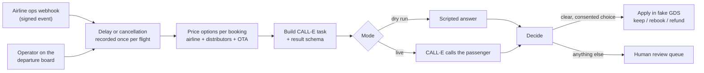
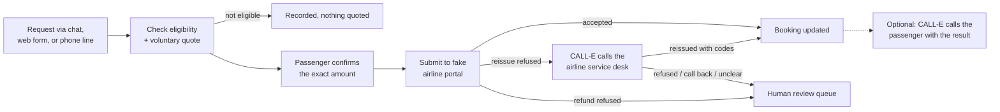

# Flight Disruption Agent

A disruption desk for online travel agencies (OTAs) and airlines. It covers two workflows:

- **Workflow A: delays and cancellations.** When a flight is delayed or cancelled, whether an operator reports it or the airline pushes it through a signed webhook, it prices every option for each passenger across the whole ticket sales chain (airline, distributors, OTA), has CALL-E call the passenger to offer those options, and applies the passenger's confirmed choice to the booking after the call.
- **Workflow B: passenger requests.** When a passenger asks to reschedule or refund, it checks eligibility, quotes the change, and submits it to the airline portal once the passenger confirms. If the portal refuses a reissue, CALL-E calls the airline service desk to force it, and can then call the passenger with the result.

Anything unclear goes to a human agent.

Dry run is the default. It places no calls, needs no credentials, and uses fictional data.

## The problem

Flight reschedules, refunds, and disruption handling are still mostly manual. Many OTAs and airlines route this work to outsourced contact centers, where an agent checks whether the booking qualifies, works out each party's fees, submits the change in a B2B or global distribution system (GDS) portal, and tells the passenger.

Ticket distribution makes the pricing hard. An OTA may buy a ticket straight from the airline, or through a chain:

```text
OTA -> distributor 1 -> distributor 2 -> airline
```

Each party has its own reschedule and refund rules, so the same delay costs two passengers on the same flight different amounts. The airline's own rules also change with the disruption:

| Disruption | Rule set | Nusantara Air (fictional) |
| --- | --- | --- |
| Delay shorter than 2 hours, any cause | Voluntary: the passenger chooses to change | Normal change fee, fare difference, and refund percentage per fare family |
| Delay of 2 hours or more, or a cancellation | Involuntary: airline-caused | Change fee and fare difference waived, full refund |
| Delay of 2 hours or more, or a cancellation, caused by force majeure (weather, volcanic ash, air traffic control) | Force majeure: outside the airline's control | Change fee waived, fare difference charged, full refund |

Distributors and the OTA apply their own voluntary or involuntary admin fees on top; force majeure uses their involuntary fees unless they define their own.

See [`docs/flight-disruption-agent.md`](../../../docs/flight-disruption-agent.md) for the full process write-up.

## How it works: Workflow A (delays and cancellations)



1. **Record the disruption.** An operator reports a delay or cancellation on the departure board, or the airline ops system pushes it to the webhook (see [Airline ops webhook](#airline-ops-webhook)). Each flight has at most one disruption. The desk picks voluntary, involuntary, or force majeure pricing from the table above.
2. **Price every option** for each booking: keep the delayed flight (delays only; a cancelled flight has nothing to keep), move to a later flight with seats, or cancel and refund. Every line shows which party charges it. One fictional distributor (Samudra Travel Wholesale) charges admin fees even on involuntary changes, so its passengers pay for a move that is free for others.
3. **Build the call.** CALL-E cannot look anything up during a call, so the task text contains the final options and exact amounts. It tells the agent to disclose that it is an AI, to get a clear yes before accepting any cost or reduced refund, to never ask for payment details, and to hand off to a person on request.
4. **Call.** The result schema asks CALL-E to return `choice`, `selected_flight`, `fee_accepted`, `human_requested`, and a quoted `reason`.
5. **Decide after the call.** The desk applies the choice automatically only when all of these hold:
   - the call completed
   - CALL-E explicitly reports `task_completed: true` (a missing value counts as no), with confidence of at least 0.7
   - the passenger chose an option that was actually offered (keeping a cancelled flight never is)
   - they explicitly accepted any cost or reduced refund
   - `human_requested` is explicitly `no` (`unknown` goes to review)

   Everything else lands in the review queue with the reasons.
6. **Apply** in the fake booking system: keep the ticket, rebook with a new booking code and reissued ticket (and one fewer seat), or record the refund and void the ticket. A human can resolve any review item with one of the offered options.

## Airline ops webhook

The airline or OTA operations system can push disruptions instead of an operator typing them.

```http
POST /api/webhooks/airline-ops
content-type: application/json
x-ops-signature: t=1789977600,v1=<hex HMAC-SHA256 of "1789977600.<raw body>">

{
  "id": "ops_2026-09-20_NA721_1",
  "type": "flight.cancelled",
  "occurred_at": "2026-09-20T05:02:00+07:00",
  "flight": { "code": "NA 721", "scheduled_departure": "2026-09-20T08:10:00+07:00" },
  "cause": "force_majeure",
  "reason": "volcanic ash on the route"
}
```

- **Types:** `flight.delayed` (requires `delay_minutes`, 15-1440) and `flight.cancelled`. `cause` is `operational` (default) or `force_majeure`.
- **Flight:** either `{ "id": "NA721-2026-09-20" }` or the airline's `code` plus `scheduled_departure`.
- **Signature:** HMAC-SHA256 with `AIRLINE_WEBHOOK_SECRET` over `<t>.<raw body>`, compared in constant time. Requests more than 5 minutes from the server clock are refused, so a captured request cannot be replayed later.
- **Responses:**

  | Status | Meaning |
  | --- | --- |
  | 201 | Disruption recorded |
  | 200 | Same event `id` delivered again; nothing changed, the first result is returned |
  | 401 | Missing, invalid, or expired signature |
  | 409 | The flight already has a disruption. The event is kept as a conflict for a person, because calls may already quote the earlier options |
  | 422 | Invalid event, unknown flight, or a flight with no bookings |
  | 503 | Webhook disabled (no secret in a live mode) |

- **No automatic calls.** An event only records the disruption. The operator still reviews prices and starts each call.
- **Feed on the dashboard.** Deliveries and their outcome appear in the Airline ops feed panel, and each disruption shows whether it came from the feed or the desk. The page picks up new events within 5 seconds.

Try it against a running dry-run desk:

```bash
npm run send-event -- cancel NA721-2026-09-20 fm   # force majeure cancellation
npm run send-event -- delay NA812-2026-09-20 150   # operational delay
```

`send-event` signs with the same secret as the server. In dry run, if `AIRLINE_WEBHOOK_SECRET` is empty, both use a published demo secret; sdk and cli modes refuse that secret and disable the webhook until you set your own.

## How it works: Workflow B (passenger requests)



1. **Log the request** in the Passenger requests panel. Requests arrive through an existing channel (chat, web form, or the phone line); the desk does not answer inbound calls.
2. **Check and quote.** The desk refuses bookings that were already changed, are on a flight with a reported delay or cancellation (Workflow A owns those), have departed, or depart within 60 minutes. It also refuses a reschedule to any flight that is not a later flight on the same route with seats. Eligible requests are priced at voluntary rates across the sales chain, with warnings for a cost or a reduced or zero refund.
3. **Confirm.** Send the quote through the passenger's channel. To submit, the operator types back the exact amount the passenger agreed to; any other amount is refused.
4. **Submit to the portal.** The fake portal accepts most changes. It is scripted to refuse the reissue for two NA 725 bookings.
5. **Call the airline desk** when a reissue is refused. The task gives the booking code, ticket, requested flight, and error, caps any airline charge at the quoted airline fees, and never shares payment details. The result schema returns `outcome`, `new_booking_code`, `new_ticket_number`, `airline_reference`, `extra_charge_requested`, and `reason`. The booking is updated with the desk's codes only when the desk confirmed the reissue, the codes are well formed, `extra_charge_requested` is explicitly `no`, CALL-E explicitly reports the task completed, and confidence is at least 0.7. Everything else goes to review, where a person can close the request or apply the reissue with codes they got from the airline.
6. **Call the passenger back (optional)** once the request is finished. The call only reports the new booking code and amount, the refund, or that the change could not be made. It changes nothing; if the passenger was not reached or wants a person, the desk flags written follow-up.

Each request allows one airline desk call and one callback. Both use idempotency keys (`fda-<run>-<request>-airline`, `fda-<run>-<request>-callback`).

### Where CALL-E is used

| Mode | Path | Credential | Result |
| --- | --- | --- | --- |
| `dry-run` (default) | Scripted in-process stand-in | None | Same shape as a real result |
| `sdk` | `@call-e/calle` `calls.create` + `calls.get` | `CALLE_API_KEY` | Structured `recipientResultSchema` result, confidence, transcript |
| `cli` | Local `calle call start` / `call status` | `calle auth login` (browser) | Summary and transcript only, so every call goes to human review with a hint |

SDK calls send a stable `Idempotency-Key` (`fda-<run>-<event>-<booking>`) and `metadata` with the event and booking code. `<run>` changes on every Reset demo, so a call placed after a reset is a new call rather than a replay of the earlier one.

## Run it (dry run, no calls)

Requires Node.js 22+.

```bash
cd apps/typescript/flight-disruption-agent
npm install
npm start
```

Open http://127.0.0.1:4310.

- **Workflow A:** report a delay or a cancellation on NA 721 (pick an operational or force majeure reason), or push one with `npm run send-event`, then select passengers and simulate calls. The five NA 721 passengers are scripted to cover each path: keep, refund, rebook, asks for a person, and no answer. On a cancelled flight, the passenger scripted to keep goes to review.
- **Workflow B:** in Passenger requests, log a reschedule for the NA 725 passengers to NA 729. Nadia Kusuma (L6F2KM) goes straight through the portal. The portal refuses Bima Saputra (P3X9GA), and the airline desk reissues the ticket. It also refuses Dewi Halim (C5V8EJ), and the desk refuses too, so that request needs a person.

Terminal walkthroughs:

```bash
npm run demo            # Workflow A, 4-hour delay: involuntary pricing
npm run demo 90         # Workflow A, 90-minute delay: voluntary pricing
npm run demo cancel     # Workflow A, cancellation: involuntary pricing, no keep option
npm run demo cancel fm  # Workflow A, force majeure cancellation
npm run demo:requests   # Workflow B: five scripted passenger requests
```

The fixture flights depart on 20 September 2026. Passenger request cutoffs in the dashboard therefore run on a demo clock that starts at `DEMO_NOW` (default `2026-09-19T09:00:00+07:00`) when the server boots and then ticks normally; the header shows it. Set `DEMO_NOW=real` to use the wall clock. Call polling and webhook signatures always use real time.

Tests and type check:

```bash
npm test
npm run check
```

## Live calls (opt-in)

Live mode places real phone calls and uses CALL-E call credits.

```bash
cp .env.example .env
```

Then set:

- `CALLE_MODE=sdk` and `CALLE_API_KEY` from the [CALL-E dashboard](https://dashboard.heycall-e.com/account/api-keys), or `CALLE_MODE=cli` after `calle auth login`.
- `LIVE_DEMO_PHONE`: the one E.164 number that live calls (passenger, airline desk, and callback) may reach, owned by someone who has agreed to take a test call. It must be in a region CALL-E supports. Indonesian (+62) numbers are currently refused by CALL-E, and the desk refuses them before any request is sent.
- `LIVE_CALL_BUDGET`: maximum live calls per server run (default 3).

Restart with `npm start`. The header turns red and shows the destination masked.

## Safety and side effects

- **No live calls by default.** Dry run never touches the network.
- **One destination in live mode.** Every live call, including airline desk calls and result callbacks, goes to `LIVE_DEMO_PHONE`. The fictional fixture numbers (the reserved +1 555-01xx range, including the airline desk) are never dialed, and the UI says when a call is redirected.
- **Per-call confirmation.** Each live call requires typing the last four digits of the destination.
- **Call budget.** A live call budget caps credit use.
- **No duplicate calls.**
  - Each booking is called at most once per disruption (dedupe key `<event>:<booking>`), and the call is recorded before dialing.
  - Each booking has at most one open request, and each request allows one airline desk call and one result callback.
  - A submission with an uncertain outcome is marked `uncertain` and never retried automatically.
  - SDK calls also carry an idempotency key.
- **Masked numbers.** Destinations are masked in the UI and API. CALL-E's summaries, transcripts, failure messages, free-text result fields, and submission errors are masked (any run of eight or more digits keeps only its last four) before they are stored, written to `.data/`, or returned by the API, for passenger, airline desk, and callback calls alike. Only the new booking code and ticket number from an airline desk result are kept as returned, because the desk applies them.
- **AI disclosure and consent** are in the task text. The agent must say it is an AI assistant and must get an explicit yes to any cost. It never asks for card numbers, passport numbers, passwords, or one-time codes.
- **Human in the loop.** Unclear, low-confidence, or unconsented results are never applied automatically.
- **Confirmed amounts only.** A Workflow B change is submitted only after the operator types the exact quoted amount the passenger agreed to. The airline desk call may not accept charges above the quoted airline fees.
- **Loopback only, enforced.** Without `OPERATOR_TOKEN`, the dashboard and its API accept only loopback clients that address the desk as `127.0.0.1` or `localhost` (other `Host` headers are refused, which blocks DNS-rebinding pages), and cross-origin POSTs are rejected. The server refuses to bind to a non-loopback `HOST` unless `OPERATOR_TOKEN` is set, in which case every dashboard route requires HTTP Basic auth with that token as the password. The airline webhook is the only route outside this check; it is authenticated by its HMAC signature.
- **Credentials** stay in `.env` (gitignored), are only read on the server, and are never sent to the browser.

### Cancellation and recovery

- **A started call cannot be recalled** from this desk. Closing the page or stopping the server does not stop it.
- **Live runs keep state on disk.** They persist call ids to `.data/state-<mode>.json`, so polling resumes after a restart. Dry runs start fresh.
- **To stop live calling,** set `CALLE_MODE=dry-run` (or remove `.env`) and restart.
- **Reset demo** clears bookings and call records. It is refused while a live call is in progress.

## Limitations

- **Fictional data.** The airline, distributors, OTA, bookings, and fares are fictional. There is no real GDS or airline integration; the portal is scripted, and the "apply" step changes a local in-memory booking.
- **Requests are logged by an operator.** Workflow B has no chat, web form, or inbound call integration, and the passenger's confirmation is recorded by typing the amount back.
- **Refused refunds are not phoned in.** The airline desk call only covers reissues; a refund the portal refuses goes to review.
- **No mid-call lookups.** CALL-E cannot call out to other systems during a call, so prices are fixed before dialing. If seats sell out between the call and the apply step, the result goes to review.
- **English only.** Calls are in English.
- **No Indonesian numbers.** Indonesian numbers cannot be called today, so a live demo uses a number in a supported region.
- **CLI mode has no structured result.** It relies on a person reading the summary and transcript.
- **Heuristic hint.** The CLI-mode summary hint is keyword-based and advisory only.

## Files

```text
fixtures/            fictional flights, bookings, and fare rules per party
src/rules.ts         prices keep / move / refund across the sales chain
src/task.ts          passenger call task text and result schema (Workflow A)
src/decide.ts        apply automatically or send to review (Workflow A)
src/events.ts        airline ops webhook: signature check and event parsing (Workflow A)
src/send-event.ts    plays the airline ops system: signs and posts an event
src/eligibility.ts   can this booking be changed as requested (Workflow B)
src/gds.ts           fake airline portal that can refuse a change (Workflow B)
src/airline.ts       airline service desk call: task, schema, decision (Workflow B)
src/callback.ts      report-only result call to the passenger (Workflow B)
src/calle.ts         dry-run, SDK, and CLI gateways
src/desk.ts          disruptions, requests, call ledger, dedupe, fake GDS
src/demo*.ts         terminal walkthroughs
src/server.ts        local HTTP server and JSON API
public/              operator dashboard
test/                node:test suites (no network)
```
