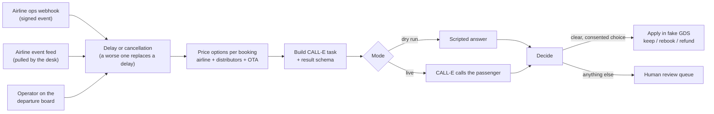
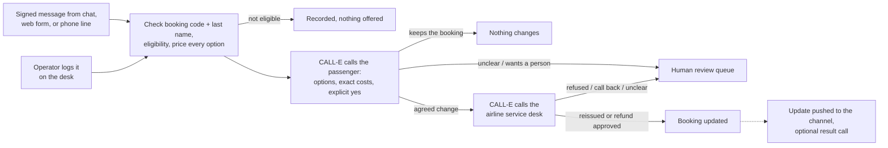

# Flight Disruption Agent

A disruption desk for online travel agencies (OTAs) and airlines. It covers two workflows:

- **Workflow A: delays and cancellations.** When a flight is delayed or cancelled, whether an operator reports it or the airline pushes it through a signed webhook, it prices every option for each passenger across the whole ticket sales chain (airline, distributors, OTA), has CALL-E call the passenger to offer those options, and applies the passenger's confirmed choice to the booking after the call.
- **Workflow B: passenger requests (passenger → CALL-E → airline desk).** When a passenger asks to change a booking, the desk checks eligibility and prices every option. CALL-E calls the passenger to agree the change and its cost, then calls the airline service desk to make exactly that change. It can finally call the passenger with the result. CALL-E does the work an outsourced contact-center agent does today on both calls.

Anything unclear goes to a human agent.

Dry run is the default. It places no calls, needs no credentials, and uses fictional data.

## The problem

Flight reschedules, refunds, and disruption handling are still mostly manual. Many OTAs and airlines route this work to outsourced contact centers, where an agent checks whether the booking qualifies, works out each party's fees, submits the change in a B2B or global distribution system (GDS) portal, and tells the passenger.

Ticket distribution makes the pricing hard. An OTA may buy a ticket straight from the airline, or through a chain:

```text
OTA -> distributor 1 -> distributor 2 -> airline
```

Each party has its own reschedule and refund rules, so the same delay costs two passengers on the same flight different amounts. The airline's own rules also change with the disruption:

| Disruption | Rule set | Nusantara Air (fictional) |
| --- | --- | --- |
| Delay shorter than 2 hours, any cause | Voluntary: the passenger chooses to change | Normal change fee, fare difference, and refund percentage per fare family |
| Delay of 2 hours or more, or a cancellation | Involuntary: airline-caused | Change fee and fare difference waived, full refund |
| Delay of 2 hours or more, or a cancellation, caused by force majeure (weather, volcanic ash, air traffic control) | Force majeure: outside the airline's control | Change fee waived, fare difference charged, full refund |

Distributors and the OTA apply their own voluntary or involuntary admin fees on top; force majeure uses their involuntary fees unless they define their own.

See [`docs/flight-disruption-agent.md`](../../../docs/flight-disruption-agent.md) for the full process write-up.

## How it works: Workflow A (delays and cancellations)



1. **Record the disruption.** An operator reports a delay or cancellation on the departure board, the airline ops system pushes it to the webhook, or the desk pulls it from the airline's event feed (see [Airline ops events](#airline-ops-events)). The desk picks voluntary, involuntary, or force majeure pricing from the table above.
   - **A disruption can get worse.** A longer delay or a cancellation replaces the flight's current delay (the board offers **Escalate**). The replaced delay stays visible for its call history but stops driving changes: passengers who agreed to keep the delayed flight go back into the queue to be called with the new options, calls still running finish into review, its review items can only be closed, and new calls come from the replacement. Rebooked and refunded passengers are not touched.
   - **Anything else needs a person.** A shorter delay, or a delay reported for a cancelled flight, is refused on the board and kept as a conflict when it arrives as an event.
2. **Price every option** for each booking: keep the delayed flight (delays only; a cancelled flight has nothing to keep), move to a later flight with seats, or cancel and refund. Every line shows which party charges it. One fictional distributor (Samudra Travel Wholesale) charges admin fees even on involuntary changes, so its passengers pay for a move that is free for others.
3. **Build the call.** CALL-E cannot look anything up during a call, so the task text contains the final options and exact amounts. It tells the agent to disclose that it is an AI, to get a clear yes before accepting any cost or reduced refund, to never ask for payment details, and to hand off to a person on request.
4. **Call.** The result schema asks CALL-E to return `choice`, `selected_flight`, `fee_accepted`, `human_requested`, and a quoted `reason`.
5. **Decide after the call.** The desk applies the choice automatically only when all of these hold:
   - the call completed
   - CALL-E explicitly reports `task_completed: true` (a missing value counts as no), with confidence of at least 0.7
   - the passenger chose an option that was actually offered (keeping a cancelled flight never is)
   - they explicitly accepted any cost or reduced refund
   - `human_requested` is explicitly `no` (`unknown` goes to review)

   Everything else lands in the review queue with the reasons.
6. **Apply** in the fake booking system: keep the ticket, rebook with a new booking code and reissued ticket (and one fewer seat), or record the refund and void the ticket. A human can resolve any review item with one of the offered options.

## Airline ops events

The airline or OTA operations system can report disruptions instead of an operator typing them, either by pushing to the webhook or by exposing a feed the desk pulls. Both use the same event format, dedupe, and escalation rules.

### Push: webhook

```http
POST /api/webhooks/airline-ops
content-type: application/json
x-ops-signature: t=1789977600,v1=<hex HMAC-SHA256 of "1789977600.<raw body>">

{
  "id": "ops_2026-09-20_NA721_1",
  "type": "flight.cancelled",
  "occurred_at": "2026-09-20T05:02:00+07:00",
  "flight": { "code": "NA 721", "scheduled_departure": "2026-09-20T08:10:00+07:00" },
  "cause": "force_majeure",
  "reason": "volcanic ash on the route"
}
```

- **Types:** `flight.delayed` (requires `delay_minutes`, 15-1440) and `flight.cancelled`. `cause` is `operational` (default) or `force_majeure`.
- **Flight:** either `{ "id": "NA721-2026-09-20" }` or the airline's `code` plus `scheduled_departure`.
- **Signature:** HMAC-SHA256 with `AIRLINE_WEBHOOK_SECRET` over `<t>.<raw body>`, compared in constant time. Requests more than 5 minutes from the server clock are refused, so a captured request cannot be replayed later.
- **Responses:**

  | Status | Meaning |
  | --- | --- |
  | 201 | Disruption recorded, or a longer delay or cancellation replaced the flight's delay (`status: "escalated"`) |
  | 200 | Same event `id` delivered again; nothing changed, the first result is returned |
  | 401 | Missing, invalid, or expired signature |
  | 409 | The event does not make the flight's disruption worse (a shorter delay, or a delay for a cancelled flight). It is kept as a conflict for a person, because calls may already quote the current options |
  | 422 | Invalid event, unknown flight, or a flight with no bookings |
  | 503 | Webhook disabled (no secret in a live mode) |

- **No automatic calls.** An event only records the disruption. The operator still reviews prices and starts each call.
- **Feed on the dashboard.** Events and their outcome appear in the Airline ops feed panel (pushed or pulled), and each disruption shows where it came from. The page picks up new events within 5 seconds.

Try it against a running dry-run desk:

```bash
npm run send-event -- cancel NA721-2026-09-20 fm   # force majeure cancellation
npm run send-event -- delay NA812-2026-09-20 150   # operational delay
```

`send-event` signs with the same secret as the server. In dry run, if `AIRLINE_WEBHOOK_SECRET` is empty, both use a published demo secret; sdk and cli modes refuse that secret and disable the webhook until you set your own.

### Pull: event feed

For airline systems that cannot call out, set `AIRLINE_FEED_URL` and the desk polls it every `AIRLINE_FEED_POLL_SECONDS` (default 30, minimum 5):

```http
GET <AIRLINE_FEED_URL>?cursor=<cursor from the previous page>
authorization: Bearer <AIRLINE_FEED_TOKEN>

200 { "events": [ ...same objects as the webhook body... ], "next_cursor": "42" }
```

- **Cursor.** The desk saves `next_cursor` after processing each page and sends it back on the next request, reading up to 10 pages per poll. Live runs keep the cursor on disk, so a restart resumes where it stopped; a page read twice is absorbed by the event id dedupe.
- **Bad data.** An event that fails validation is listed on the dashboard and skipped; the rest of the page is still processed. HTTP errors, timeouts (10 seconds), non-JSON, and pages over 1 MB are shown as the feed's last error and retried on the next poll.
- **Token safety.** `AIRLINE_FEED_TOKEN` is only sent over HTTPS, or over HTTP to this machine; any other plain-HTTP URL is refused at startup.
- **Poll now.** The dashboard shows the feed's last poll, cursor, and errors, with a button to poll immediately (`POST /api/feed/poll`).

Try it with the fake feed, which releases a delay on NA 812, a 90-minute delay on NA 721, and a minute later the cancellation of NA 721:

```bash
npm run fake-feed                                                                   # terminal 1
AIRLINE_FEED_URL=http://127.0.0.1:4320/events AIRLINE_FEED_POLL_SECONDS=5 npm start   # terminal 2
```

## How it works: Workflow B (passenger requests)



1. **Receive the request.** The chat bot, web form backend, or phone line (IVR or contact center) posts it to the signed channel webhook with the booking code and last name (see [Passenger channels](#passenger-channels)), or an operator logs it in the Passenger requests panel. The request can name a refund or a flight, or just ask for a change; the passenger decides on the call. CALL-E places outbound calls only, so it calls the passenger back rather than answering an inbound call.
2. **Check and price.** The desk refuses bookings that were already changed, are on a flight with a reported delay or cancellation (Workflow A owns those), have departed, or depart within 60 minutes, and a named flight that is not a later flight on the same route with seats. Every option is priced at voluntary rates across the sales chain: each later flight with seats, the refund, and keeping the booking.
3. **CALL-E calls the passenger.** The task discloses the AI, offers exactly those options and amounts, requires a clear yes to any cost or reduced refund, says the change is final only once the airline confirms it, and never asks for payment details. The result schema returns `choice` (`move_to_other_flight`, `refund`, `no_change`, `undecided`, `unknown`), `selected_flight`, `fee_accepted`, `human_requested`, and `reason`. The change is recorded as agreed only when CALL-E explicitly reports the task completed with confidence of at least 0.7, `human_requested` is explicitly `no`, and the passenger chose an offered option with explicit consent to its cost. Keeping the booking changes nothing; everything else goes to review.
4. **CALL-E calls the airline desk** to make the agreed change. For a reissue, the task gives the booking code, ticket, and requested flight, says the passenger already agreed, and caps any airline charge at the quoted airline fees. The result schema returns `outcome`, `new_booking_code`, `new_ticket_number`, `airline_reference`, `extra_charge_requested`, and `reason`. The booking is updated with the desk's codes only when the desk confirmed the reissue, the codes are well formed, `extra_charge_requested` is explicitly `no`, CALL-E explicitly reports the task completed, and confidence is at least 0.7. Everything else goes to review, where a person can close the request or apply the reissue with codes they got from the airline.

   For a refund, the task asks the desk to approve the airline's own refund (the fare minus the airline's deduction, before OTA and distributor fees) and forbids accepting less, a voucher, or credit, or sharing bank details. The result schema returns `outcome`, `approved_refund_amount`, `refund_reference`, `reduced_refund_offered`, and `reason`. The refund is recorded only when the desk approved exactly that amount with a reference, `reduced_refund_offered` is explicitly `no`, CALL-E explicitly reports the task completed, and confidence is at least 0.7.
5. **Update the passenger.** For a request from a channel, every later change (agreed on the call, kept, made by the airline desk, or resolved by a person) is pushed to the conversation; see [Passenger channels](#passenger-channels).
6. **Call the passenger back (optional)** once the request is finished. The call only reports the new booking code and amount, the refund, or that the change could not be made. It changes nothing; if the passenger was not reached or wants a person, the desk flags written follow-up.

In live mode every one of these calls needs its own typed confirmation; the desk never starts the airline desk call by itself.

Each request allows one passenger call, one airline desk call, and one callback, each with its own idempotency key (`fda-<run>-<request>-passenger`, `-airline`, `-callback`).

## Passenger channels

Chat, web form, and phone line integrations take the request; CALL-E then calls the passenger to agree the change. The integrations post signed messages and show the passenger the `reply` that comes back.

```http
POST /api/webhooks/channel
content-type: application/json
x-channel-signature: t=<unix seconds>,v1=<hex HMAC-SHA256 of "<t>.<raw body>">

{ "id": "msg_1", "type": "request.submitted", "channel": "chat", "conversation_id": "conv-42",
  "pnr": "P3X9GA", "last_name": "Saputra", "kind": "reschedule", "target_flight_id": "NA729-2026-09-20" }

```

- **Messages.** Only `request.submitted` exists. `kind` (`reschedule`, `refund`, or `change`) and `target_flight_id` are optional hints; the passenger's consent is taken on the CALL-E call, never typed into the channel.
- **Response.** `200` with `outcome` (`accepted` or `refused`), `requestId`, and `reply`, the text to show or read to the passenger (that CALL-E will call, or why not). A repeated message `id` returns the first result with `duplicate: true` and changes nothing. Bad signatures get `401`, malformed messages `422`, and a live mode without `CHANNEL_WEBHOOK_SECRET` gets `503`.
- **Who the passenger is.** A request needs the booking code and the passenger's last name (case and accents ignored). A wrong name and an unknown booking get the same reply, so the channel cannot be used to probe booking codes.
- **Bound to the conversation.** Updates for a request go only to the channel and `conversation_id` it came from.
- **Updates.** Set `CHANNEL_NOTIFY_URL` and the desk posts a signed `request.updated` message (`request_id`, `channel`, `conversation_id`, `status`, `reply`) when the request changes later, once per status. It must be HTTPS unless it is on this machine. Delivery is recorded on the request (sent, failed, or not configured) and never blocks the desk.
- **Secret.** `CHANNEL_WEBHOOK_SECRET` signs both directions. Dry run falls back to a published demo secret; sdk and cli modes refuse it.

Try it against a running dry-run desk:

```bash
npm run fake-channel                                               # terminal 1: prints pushed updates
CHANNEL_NOTIFY_URL=http://127.0.0.1:4330/updates npm start         # terminal 2
npm run send-channel -- submit L6F2KM Kusuma                        # open change; then on the dashboard:
                                                                   # simulate CALL-E calling the passenger, then the airline desk
```

`send-channel` defaults to `CHANNEL=chat` and `CONVERSATION_ID=conv-demo-1`; set either to play another channel or conversation.

### Where CALL-E is used

| Mode | Path | Credential | Result |
| --- | --- | --- | --- |
| `dry-run` (default) | Scripted in-process stand-in | None | Same shape as a real result |
| `sdk` | `@call-e/calle` `calls.create` + `calls.get` | `CALLE_API_KEY` | Structured `recipientResultSchema` result, confidence, transcript |
| `cli` | Local `calle call start` / `call status` | `calle auth login` (browser) | Summary and transcript only, so every call goes to human review with a hint |
| Check with CALL-E (any mode) | Local `calle call plan` (`plan_call`) | `calle auth login` + `CALLE_PLAN_PHONE` | CALL-E's verdict and plan for the exact task; never dials |

The CLI is located as `CALLE_CLI`, else the global `@call-e/cli` install, because the SDK dependency also installs a `calle` command that `npm run` would otherwise pick first. SDK calls send a stable `Idempotency-Key` (`fda-<run>-<event>-<booking>`) and `metadata` with the event and booking code. `<run>` changes on every Reset demo, so a call placed after a reset is a new call rather than a replay of the earlier one.

## Run it (dry run, no calls)

Step-by-step scenarios with expected results are in [TESTING.md](TESTING.md).

Requires Node.js 22+.

```bash
cd apps/typescript/flight-disruption-agent
npm install
npm start
```

Open http://127.0.0.1:4310.

- **Workflow A:** report a delay or a cancellation on NA 721 (pick an operational or force majeure reason), or push one with `npm run send-event`, then select passengers and simulate calls. The five NA 721 passengers are scripted to cover each path: keep, refund, rebook, asks for a person, and no answer. On a cancelled flight, the passenger scripted to keep goes to review.
- **Workflow A escalation:** report a delay, simulate some calls, then use **Escalate** on the same flight, or run the fake feed (see [Pull: event feed](#pull-event-feed)).
- **Workflow B:** in Passenger requests, log a request, or send it as the passenger with `npm run send-channel`, then simulate CALL-E calling the passenger and then the airline desk. Nadia Kusuma (L6F2KM) and Bima Saputra (P3X9GA) agree a move and the desk reissues the ticket. Dewi Halim (C5V8EJ) agrees a move but the desk refuses, so a person takes over. Putri Anggraini (W4N7QS) accepts a refund and the desk approves it. An open "change" request for Alya Rahman (K7Q2XA) ends with her keeping the booking, and Kevin Tan (B9H4ZN) asks for a person.

Terminal walkthroughs:

```bash
npm run demo            # Workflow A, 4-hour delay: involuntary pricing
npm run demo 90         # Workflow A, 90-minute delay: voluntary pricing
npm run demo cancel     # Workflow A, cancellation: involuntary pricing, no keep option
npm run demo cancel fm  # Workflow A, force majeure cancellation
npm run demo:requests   # Workflow B: six scripted passenger requests
```

The fixture flights depart on 20 September 2026. Passenger request cutoffs in the dashboard therefore run on a demo clock that starts at `DEMO_NOW` (default `2026-09-19T09:00:00+07:00`) when the server boots and then ticks normally; the header shows it. Set `DEMO_NOW=real` to use the wall clock. Call polling and webhook signatures always use real time.

Tests and type check:

```bash
npm test
npm run check
```

## Live calls (opt-in)

Live mode places real phone calls and uses CALL-E call credits.

```bash
cp .env.example .env
```

Then set:

- `CALLE_MODE=sdk` and `CALLE_API_KEY` from the [CALL-E dashboard](https://dashboard.heycall-e.com/account/api-keys), or `CALLE_MODE=cli` after `calle auth login`.
- `LIVE_DEMO_PHONE`: the one E.164 number that live calls (passenger, airline desk, and callback) may reach, owned by someone who has agreed to take a test call. It must be in a region CALL-E supports. Indonesian (+62) numbers are currently refused by CALL-E, and the desk refuses them before any request is sent.
- `LIVE_DEMO_PHONE_CONSENT=yes`: your statement that the owner of `LIVE_DEMO_PHONE` agreed to receive these test calls. Live mode refuses to start without it.
- `LIVE_CALL_BUDGET`: maximum live calls per server run (default 3).

Restart with `npm start`. The header turns red and shows the destination masked.

## Safety and side effects

- **No live calls by default.** Dry run never touches the network.
- **One destination in live mode.** Every live call, including airline desk calls and result callbacks, goes to `LIVE_DEMO_PHONE`. The fictional fixture numbers (the reserved +1 555-01xx range, including the airline desk) are never dialed, and the UI says when a call is redirected.
- **Consent and per-call confirmation.** Live mode starts only with `LIVE_DEMO_PHONE_CONSENT=yes`, the operator's statement that the destination's owner agreed to test calls. Each live call then requires typing the last four digits of the destination.
- **Call budget.** A live call budget caps credit use.
- **No duplicate calls.**
  - Each booking is called at most once per disruption (dedupe key `<event>:<booking>`), and the call is recorded before dialing.
  - Each booking has at most one open request, and each request allows one airline desk call and one result callback.
  - A submission with an uncertain outcome is marked `uncertain` and never retried automatically.
  - SDK calls also carry an idempotency key.
- **Masked numbers.** Destinations are masked in the UI and API. CALL-E's summaries, transcripts, failure messages, free-text result fields, and submission errors are masked (any run of eight or more digits keeps only its last four) before they are stored, written to `.data/`, or returned by the API, for passenger, airline desk, and callback calls alike. Only the new booking code and ticket number from an airline desk result are kept as returned, because the desk applies them.
- **AI disclosure and consent** are in the task text. The agent must say it is an AI assistant and must get an explicit yes to any cost. It never asks for card numbers, passport numbers, passwords, or one-time codes.
- **Human in the loop.** Unclear, low-confidence, or unconsented results are never applied automatically.
- **Agreed changes only.** The airline desk is called only after the passenger explicitly agreed the change and its exact cost on the CALL-E call, and that call may not accept charges above the quoted airline fees or a lower refund.
- **Loopback only, enforced.** Without `OPERATOR_TOKEN`, the dashboard and its API accept only loopback clients that address the desk as `127.0.0.1` or `localhost` (other `Host` headers are refused, which blocks DNS-rebinding pages), and cross-origin POSTs are rejected. The server refuses to bind to a non-loopback `HOST` unless `OPERATOR_TOKEN` is set, in which case every dashboard route requires HTTP Basic auth with that token as the password. The airline webhook is the only route outside this check; it is authenticated by its HMAC signature.
- **Credentials** stay in `.env` (gitignored), are only read on the server, and are never sent to the browser.

### Cancellation and recovery

- **A started call cannot be recalled** from this desk. Closing the page or stopping the server does not stop it.
- **Live runs keep state on disk.** They persist call ids to `.data/state-<mode>.json`, so polling resumes after a restart. Dry runs start fresh.
- **To stop live calling,** set `CALLE_MODE=dry-run` (or remove `.env`) and restart.
- **Reset demo** clears bookings and call records. It is refused while a live call is in progress.

## Limitations

- **Fictional data.** The airline, distributors, OTA, bookings, and fares are fictional. There is no real GDS or airline integration; the airline desk answers are scripted in dry run, and the "apply" step changes a local in-memory booking.
- **No real chat bot, web form, or IVR.** The desk exposes the channel webhook and pushes updates; `send-channel` and `fake-channel` stand in for the channels themselves. Identity is booking code plus last name, as on airline manage-booking pages, not a login.
- **One disruption at a time per flight.** Only a worse disruption replaces the current one automatically; a flight that gets better (a shorter delay, a reinstated flight) is left for a person.
- **Feed format is fixed.** The pull feed expects the cursor format above; another airline API needs an adapter in `src/feed.ts`.
- **No mid-call lookups.** CALL-E cannot call out to other systems during a call, so prices are fixed before dialing. If seats sell out between the call and the apply step, the result goes to review.
- **English only.** Calls are in English.
- **No Indonesian numbers.** Indonesian numbers cannot be called today, so a live demo uses a number in a supported region.
- **CLI mode has no structured result.** It relies on a person reading the summary and transcript.
- **Heuristic hint.** The CLI-mode summary hint is keyword-based and advisory only.

## Files

```text
fixtures/            fictional flights, bookings, and fare rules per party
src/rules.ts         prices keep / move / refund across the sales chain
src/task.ts          passenger call task text and result schema (Workflow A)
src/decide.ts        apply automatically or send to review (Workflow A)
src/events.ts        airline ops events: signature check and event parsing (Workflow A)
src/feed.ts          pulls events from the airline's feed (Workflow A)
src/send-event.ts    plays the airline ops system: signs and posts an event
src/fake-feed.ts     plays an airline feed that releases scripted events
src/eligibility.ts   can this booking be changed as requested (Workflow B)
src/intake.ts        CALL-E call to the passenger: task, schema, decision (Workflow B)
src/airline.ts       airline service desk calls for reissues and refunds (Workflow B)
src/channel.ts       chat, web form, and phone line messages, replies, updates (Workflow B)
src/send-channel.ts  plays a passenger channel: signs and posts a message
src/fake-channel.ts  plays a channel receiving request updates
src/callback.ts      report-only result call to the passenger (Workflow B)
src/calle.ts         dry-run, SDK, and CLI gateways
src/desk.ts          disruptions, requests, call ledger, dedupe, fake GDS
src/demo*.ts         terminal walkthroughs
src/server.ts        local HTTP server and JSON API
public/              operator dashboard
test/                node:test suites (no network)
```
