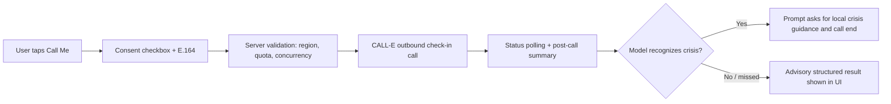

# MindQuark

MindQuark is a consent-gated CBT-informed wellbeing web app whose companion feature
is an outbound CALL-E phone check-in: the user asks for a call, explicitly consents,
and an AI persona (Maya) rings their phone for a warm 5–10 minute voice check-in with
grounding exercises. Phone numbers exist only in-flight and are never persisted.

**Contribution area: User-facing Apps.** This directory is a catalog and setup guide
for the runnable [MindQuark application](https://github.com/kkpg-l/mindquark).
The application source and tests are maintained there under the project's license.
These instructions target the revision
[`e72ad23`](https://github.com/kkpg-l/mindquark/tree/e72ad2347baaa35df5dbc4b31f3de8dae68c1120).

- [Live demo](https://kkpg-d2ga363tca9086e3e-1469579803.tcloudbaseapp.com)
- [Source repository](https://github.com/kkpg-l/mindquark)
- [CALL-E proxy implementation](https://github.com/kkpg-l/mindquark/blob/main/functions/api/calle.js)

## Workflow boundary

MindQuark handles the wellbeing side of one user-requested phone call:

1. In the chat tab the user presses "Call Me", enters an E.164 number, and ticks an
   explicit consent checkbox. No call can be created without both steps.
2. The server rejects unsupported destinations up front (Mainland China +86 is
   blocked), enforces a daily per-IP quota (`CALL_MAX_PER_DAY_PER_IP=3`) and a
   concurrency cap (`CALL_MAX_ACTIVE=1`), then sends one `POST /v1/calls` request
   to `api.heycall-e.com` with a server-only Bearer key.
3. The phone number is used in-flight only: it is never written to any database or
   persistent log.
4. The UI polls `GET /api/call/status/:id` for live dialing progress and a
   post-call structured result (outcome, mood change, support summary). The modal
   is minimizable so text chat continues during dialing.
5. The phone task instructs the CALL-E model to direct a user reporting self-harm
   or crisis to local crisis/emergency services and end the call. This is
   prompt-based, best-effort behavior, not a deterministic crisis detector or
   guaranteed intervention. Separately, text chat has a client/server interceptor
   that bypasses model inference for the high-risk text inputs it recognizes.
6. MindQuark does not diagnose, prescribe, replace therapy, or run recurring or
   scheduled call jobs. Every call is one explicit user action.



## Timing and failure behavior

CALL-E performs a server-side task-readiness review, so `POST /v1/calls` typically
takes 15–20 s. The proxy uses a 45 s create timeout and the client a 50 s fetch
timeout; shorter values report false failures on accepted calls. Upstream error
codes (unsupported region, balance, concurrency) are mapped to explicit
user-facing messages instead of a generic 502.

## Reproduce the no-call checks

Use Node.js 20 or newer. These commands do not require a CALL-E key and place no
phone call:

```bash
git clone https://github.com/kkpg-l/mindquark.git
cd mindquark
git checkout --detach e72ad2347baaa35df5dbc4b31f3de8dae68c1120
npm ci
npm test          # vitest: safety filters, reframe parsing, call-quota logic
npm run typecheck
npm run build
```

Call tests are hermetic (`callCalleApi` base URL is mocked, no network). The suite
covers E.164 validation, the +86 up-front rejection, per-IP daily quota, and the
concurrency cap. These checks do not prove carrier connectivity or a successful
live call.

## Enabling a live call (side effects — read first)

Live dialing requires deploying the CloudBase function with `CALLE_API_KEY` set as a
server-only environment variable, plus a funded CALL-E account. The hosted demo above
**places real calls to real phones**; use only your own number or a number you are
explicitly authorized to test, and respect the 3-per-day quota. Supported
destinations follow CALL-E's coverage (US +1, UK +44, Singapore +65, Malaysia +60,
etc.); +86 is rejected by design.

## Cancellation and rollback

There are no recurring jobs to cancel — each call is one-shot and user-initiated.
A queued call that has not connected can be abandoned in the UI; the concurrency
slot releases when the call reaches a terminal state. Removing `CALLE_API_KEY` (or
the "Call Me" entry point) fully disables outbound calling without affecting chat,
breathwork, or mood features.

## Safety notes for real-world use

- Outbound calling is consent-gated per call and rate-limited per IP.
- Zero phone-number persistence; no secrets in the client bundle.
- Text-chat interception bypasses inference only for recognized high-risk inputs;
  spoken-call handling remains model/prompt-based and can miss or misinterpret crisis content.
- The product is a supportive reflection tool, not a medical device or emergency service.
