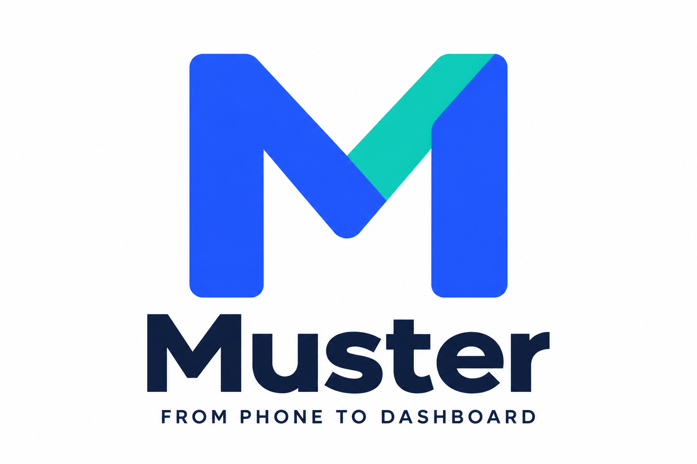

# Muster — Greenhouse Phone Monitoring

**From phone reports to evidence-backed readings.**

Muster uses CALL-E to collect spoken greenhouse status reports and turn them into
structured temperature, humidity, reservoir, and equipment-status readings that
operators can compare with the source evidence.



## Try the credential-free demo

The default demo runs locally, requires no application account or provider keys,
and places **no telephone calls**. Dependency installation requires internet access;
scenario replay itself uses committed synthetic fixtures.

Prerequisites: Git, Node.js **24.18.0**, and Corepack. The repository selects pnpm
**11.20.0**. Use these exact versions; the toolchain guard rejects other versions.

From `apps/typescript/muster-phone-to-report/` in the community repository:

```sh
corepack pnpm install --frozen-lockfile
corepack pnpm generate:simulator-demo
corepack pnpm --filter @muster/web build:demo
node apps/web/node_modules/vite/bin/vite.js preview apps/web --outDir dist-demo --host 127.0.0.1 --port 4173 --strictPort
```

Open **http://127.0.0.1:4173/simulator.html** on the same computer. Keep
**Deterministic replay** selected, choose a scenario, and select
**Replay simulated scenario**. Stop the preview with Ctrl+C.

| Scenario              | What to inspect                                                                                                    |
| --------------------- | ------------------------------------------------------------------------------------------------------------------ |
| Normal                | Complete observation; 71.5°F and 68.0°F, 68% humidity, 82% reservoir level; source evidence before interpretation. |
| Abnormal              | Different reported values and a threshold-exceeded result.                                                         |
| Ambiguous / Truncated | Incomplete evidence; no operational decision or fabricated healthy status.                                         |
| No-answer             | No fabricated readings when no report is received.                                                                 |
| Recovery-candidate    | Recovery evidence still requires human confirmation.                                                               |

The local address is not a public deployment URL. No public hosted app is claimed.
The separate Fleet interface does not imply that this replay or a live Simulator
Lab call automatically updates a production fleet.

## Demonstration boundary

The bundled CALL-E/Twilio adapter implements a separately authorized synthetic-call
workflow. Its success contract requires four grounded readings, auxiliary statuses,
signed callbacks, and safe cleanup. This contribution contains no observed provider-call
records and makes no claim that local replay proves a live call succeeded.

Interactive replay is a reproducible **no-call** demonstration, not a recording
of a new provider call. All results are **SIMULATED**, non-production, and
simulator-tested only. Physical Sensaphone compatibility, native-alarm coexistence,
continuous monitoring, and production readiness have not been established.

## Architecture

- React and Vite present the operator interface.
- TypeScript domain/application packages separate provider behavior from policy.
- PostgreSQL, Prisma, and pg-boss handle durable operations, persistence, and jobs.
- NestJS/Fastify provides the separately composed application API.
- A dedicated non-production Node.js simulator host owns the CALL-E/Twilio demo
  boundary; it is excluded from production API, worker, and web artifacts.
- A one-use authorization, at-most-one dispatch, bounded evidence admission,
  signed callback validation, and a zero-DTMF policy constrain each live demo run.

See [architecture](docs/architecture/system-patterns.md),
[API contracts](docs/api/openapi.yaml), and [security](SECURITY.md).

## Optional live integration — not required for replay

Live use can create real calls and charges. It requires your own provider
accounts, an owned synthetic-only destination, local secret references, an
explicit one-call authorization, and passing operational preflight checks.
No live credentials, actual telephone numbers, or private endpoints are bundled.
Never call physical monitoring equipment using this demo as proof of compatibility.

Start with the [synthetic qualification runbook](docs/demo/calle-twilio-greenhouse-qualification.md).
The [optional live demo runbook](docs/demo/hackathon-live-calle-observation.md)
documents the default guarded lifecycle. The separately opt-in
[persistent webhook session](docs/demo/persistent-webhook-session.md) keeps a
synthetic receiver available between calls and can incur inbound-call costs.
Do not enable it merely to run the credential-free demo.

Use an explicitly authorized destination in E.164 format, and mask telephone
numbers in shared summaries. No recurring schedule is enabled by this demo; any
future scheduler must be host-owned and independently cancellable. This synthetic
greenhouse workflow is not for medical, legal, financial, or emergency decisions.

The application makes no automatic redial. Stop scheduling/admitting new work
with the documented gate/kill controls; use supported cleanup and verify the
provider's terminal state rather than assuming that killing a local process
disconnects an in-flight telephone call.

## Verification

The complete verification suite additionally requires a running Docker-compatible
engine and Playwright Chromium. The suite uses synthetic/injected provider
boundaries; it does not require or authorize live CALL-E/Twilio calls.

```sh
corepack pnpm exec playwright install chromium
corepack pnpm verify:foundation
```

For a focused Simulator Lab browser check:

```sh
corepack pnpm exec playwright test tests/e2e/transparent-device-simulator-demo.spec.ts
```

## Publication and licensing

This repository is a fresh, sanitized source snapshot. Private development
history, internal task notes, runtime files, and live evidence were not imported.
See [publication boundary](docs/PUBLICATION.md).

This contributed snapshot is licensed under [MIT](LICENSE). Third-party dependencies
retain their respective licenses.

The complete source for this contribution is included in this directory. The
[MIT license](LICENSE) applies to this contributed snapshot; no external source
repository is required to inspect, build, or use it.
