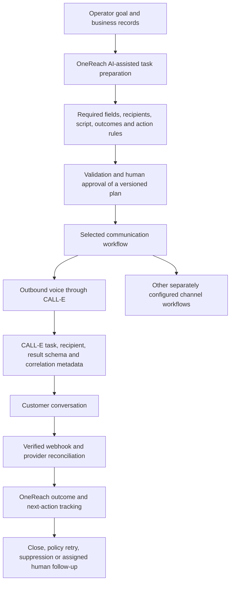

# OneReach × CALL-E: service appointment to Operations action

A standalone integration example extracted around OneReach's CALL-E boundary. An approved, synthetic service appointment becomes a CALL-E task; a structured result becomes an actionable Operations handoff. OneReach is the wider workflow product at [onereach.my](https://onereach.my). Its proprietary platform source is not required to run this example.

**Public contribution: [PR #372](https://github.com/CALLE-AI/awesome-phone-call-agents/pull/372).** Maintainer acceptance is separate from publication. The console demonstration is a standalone reference, not the full OneReach UI. Dry-run output is synthetic and never evidence of a real phone call.

## How OneReach manages the task before and after CALL-E

OneReach owns the business workflow: understanding the operator's goal, preparing a reviewable plan, managing execution, and tracking the next action. CALL-E is the outbound calling provider used when the operator chooses a calling workflow. Other OneReach communication surfaces include WhatsApp and web chat, with their own workflows; choosing CALL-E does not imply automatic routing or fallback between these channels.



### Task lifecycle

1. **Prepare the work.** The operator supplies the business objective and recipient records. OneReach's AI-assisted preparation resolves the workflow requirements into a structured plan: objective, expected outcomes, caller identity and disclosure, required business fields, recipient snapshot, conversation script, and prohibited actions. Missing information must be resolved before the plan is ready.
2. **Review and approve.** OneReach validates the plan and records human approval of its version. The plan also defines execution timing, application retry policy, contact basis, and which outcomes should create follow-up work. AI-generated text alone does not authorize a call.
3. **Dispatch the selected calling task.** For CALL-E voice execution, the worker checks workspace/run state and recipient suppression before sending recipient-specific instructions. The SDK payload includes the phone, region, locale, task, result schemas, webhook URL, and workspace/run/plan/dispatch correlation metadata. A stable idempotency key identifies the dispatch.
4. **Track execution and reconcile.** OneReach associates CALL-E's task and recipient identifiers with its stored run and attempts. Verified webhook events and provider retrieval update the execution record. An uncertain provider response must be reconciled rather than treated as permission for a fresh call.
5. **Turn the answer into work.** OneReach maps the result to the workflow's action rules: record completion, schedule a policy-controlled follow-up, suppress future contact, or create a human task in the responsible queue. A conversation outcome is distinct from completion of the downstream business action: a reschedule request still needs a confirmed calendar change.

### Task types represented in the OneReach platform

These are the platform's defined workflow families, not additional implementations or live-call evidence shipped in this small example.

| Workflow | Work prepared by OneReach | CALL-E conversation purpose | Follow-up owner |
| --- | --- | --- | --- |
| Overdue invoice follow-up | Approved invoice context and permitted outcomes | Capture payment status, a stated promise date, dispute, or callback request | Finance |
| Service and appointment reminders | Existing appointment and allowed alternate times | Confirm attendance or capture a reschedule, cancellation, or question | Operations |
| HR interview and onboarding scheduling | Administrative event details and approved slots | Confirm or reschedule an interview/onboarding event and capture questions | HR; no candidate scoring or hiring decisions |
| Social lead introduction booking | Consented enquiry context, approved product information and assigned agent | Confirm interest and capture an introductory-call time or callback request | Sales follow-up |

The same preparation → approval → dispatch → result → action pattern can be adapted to further defined tasks by supplying their required fields, permitted conversation, result schema, and outcome rules. This is an extension pattern, not a claim that every arbitrary task or channel is already implemented. Provider capabilities and each task's business constraints still apply.

### What this public commit demonstrates

This directory implements the **service appointment** slice of that lifecycle: an already-approved synthetic input, CALL-E dispatch, reconciliation, result validation, and a returned Operations action. It does not include the private AI planner, approval UI, scheduler, multi-channel configuration, or team task database. Those platform responsibilities are explained above so maintainers can understand where the reusable CALL-E boundary fits without needing the proprietary repository.

## Quick start — no account, credentials, or phone call

Requires Node.js 22+. From this directory:

```sh
node src/cli.mjs
node --test test/*.test.mjs
```

The default demonstration needs no dependency installation or network access. Two SDK contract tests skip until `npm install`; all other tests run immediately. After installation, the SDK tests use an in-memory transport and synthetic HMAC, never the provider network. It prints a fictional appointment, a clearly labelled synthetic call outcome, and an Operations next action. A requested reschedule is **not** a completed calendar booking.

## What is reusable

- Single-recipient CALL-E task with an explicit approved appointment and alternate slots.
- Strict result schema and application validation: invalid slots and ambiguous results go to human review.
- Opt-out / wrong-number handling produces a stop-contact action.
- Stable request snapshot and idempotency key, saved **before** provider creation.
- Polling by the original task ID after a timeout, without making a replacement task.
- Optional raw-body webhook verification, timestamp checks, persistent deduplication, and retryable storage failures.

The example returns actions; it does not write a CRM, update a real calendar, or claim to implement OneReach's full suppression database. Connect those downstream systems explicitly in your application.

## Intentional live test

Live calling is opt-in and may consume CALL-E credits. Use only your own number or a person who has explicitly agreed to this test. The recipient should expect an AI-assisted fictional appointment conversation.

```sh
npm install
cp .env.example .env
# Edit .env locally: API key, authorized number, region/locale, and
# CALLE_AUTHORIZED_DESTINATION set to that exact authorized number,
# CALLE_CONTACT_AUTHORIZED=true, CALLE_LIVE_ENABLED=true,
# and a stable CALLE_DEMO_ID such as judge-rehearsal-001.
node --env-file=.env src/cli.mjs --live
```

Every live run requires `CALLE_AUTHORIZED_DESTINATION` to be the exact ASCII E.164 value in `CALLE_TEST_PHONE`; changing the recipient without renewing that authorization fails before the SDK is loaded. The caller remains responsible for permission and provider-supported destinations. Credentials are server-side; never paste them into the browser or commit `.env`.

The task identifies the call as a synthetic demonstration, asks whether it is a good time, and discusses only the supplied fictional service appointment. It aims for three minutes, but **SDK 0.2.2 exposes no enforceable maximum duration or cancel/hang-up method**. This example therefore does not enforce a three-minute cap, a financial budget, or ten actual phone dials. Do not use it as an unrestricted shared judge calling service.

### Timeout, retries and stopping

The console monitors for five minutes. That timeout stops local monitoring, **not the remote call**. Rerun with the **same** `CALLE_DEMO_ID` to use the original saved task/input/key. Do not delete its state or change the ID to recover an uncertain request. One task can have multiple provider attempts; output counts distinct observed attempts with a dialing start time, not guaranteed final billable calls.

Ctrl+C stops this local process only. A recipient can decline or hang up. Provider support/account controls may be needed to stop remote work; this SDK does not expose that operation. There is no automatic task retry in the example. The saved idempotency key protects repeated create requests with identical inputs.

After first creation, changing `.env` does not replace that demonstration's saved recipient/input. Review the local state privately; choose a new ID only for a genuinely new authorized test. `.state/` may contain your test number and webhook results. It is ignored by Git; remove it only after the task is terminal and records are no longer needed, and never reuse that deleted ID.

## Optional webhook receiver

Polling works without a webhook. To receive events, configure the signing secret locally and expose only `/webhooks/calle` through an HTTPS tunnel:

```sh
node --env-file=.env src/webhook.mjs
```

Set `CALLE_WEBHOOK_URL` to that HTTPS URL **before starting a new demo ID**. The receiver binds to loopback port 3188. It authenticates the exact raw bytes using the SDK, checks the signed timestamp within five minutes, saves verified events under `.state/events/`, and acknowledges duplicate IDs safely. It does not initiate calls. Polling fetches authoritative task results and performs outcome mapping.

The timestamp window deliberately rejects old deliveries; recover by polling, not by dispatching again. This local filesystem inbox is a single-host reference. Production deployments need coordinated durable storage, retention, monitoring, and per-tenant access controls. Tests cover handler behavior; actual provider delivery still needs live verification.

## Expected demonstration

1. The fictional original appointment is at 10:00, Asia/Kuala_Lumpur, two days after fixture generation.
2. The consenting recipient asks for 14:00, one of the two approved alternatives.
3. CALL-E returns `reschedule_requested` with the exact approved slot.
4. The example outputs an Operations task and `calendarUpdated: false`.
5. An unapproved time routes to human review. Opt-out returns a stop-contact action.

## Scope and verification

This example uses the official `@call-e/calle` 0.2.2 SDK and its supported create/get/events/webhook interfaces. Local tests make no network requests and no calls. Passing them does not prove live telephony, provider performance, or a deployment at onereach.my. The hackathon video should independently show the live OneReach UI and an authorized CALL-E call.

Public release scope is this directory only; no parent repository, database, accounts, platform prompts, billing, or internal configuration is included. Before contributing, review this directory and the upstream [contribution guide](https://github.com/CALLE-AI/awesome-phone-call-agents/blob/main/CONTRIBUTING.md). Contribution location: `apps/typescript/onereach-service-followup/`.

License: MIT for the files in this example directory only. It does not license the private OneReach platform or grant rights to third-party trademarks.
