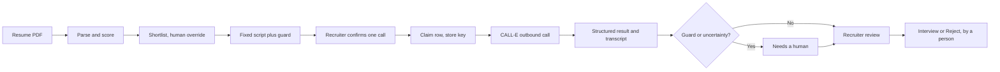

# OpenLine Screening

OpenLine is a recruiting console that places the first-round screening call to
every shortlisted candidate with CALL-E, then hands a recruiter the transcript,
structured answers, and a confidence score so a person decides who moves to
interview. Recruiters no longer work down the shortlist by phone.

**Contribution area: User-facing Apps.** This directory is a catalog and setup
guide for the runnable [OpenLine application](https://github.com/padmanabhan-r/OpenLine).
The application source and tests are maintained there under the MIT license. These
instructions target revision
[`7ae9f98`](https://github.com/padmanabhan-r/OpenLine/tree/7ae9f989b5e811a2f7ad09e11d468ab9e0e48249).

- [Source repository](https://github.com/padmanabhan-r/OpenLine)
- [Hosted demo](https://openline-calle.vercel.app) (the landing page is public; the console needs an operator token)
- [CALL-E port](https://github.com/padmanabhan-r/OpenLine/blob/7ae9f989b5e811a2f7ad09e11d468ab9e0e48249/lib/calle/port.ts), the only module that talks to CALL-E
- [Architecture tour](https://github.com/padmanabhan-r/OpenLine/blob/7ae9f989b5e811a2f7ad09e11d468ab9e0e48249/ARCHITECTURE.md)

This is not the unrelated [Openline](https://github.com/Datwebguy/openline)
service-verification app already listed in this repository.

## Where to look

Nine files show the CALL-E work; the rest of the repository is the console around them.

| File | What it shows |
| --- | --- |
| [`lib/calle/port.ts`](https://github.com/padmanabhan-r/OpenLine/blob/7ae9f989b5e811a2f7ad09e11d468ab9e0e48249/lib/calle/port.ts) | The only module that imports the CALL-E SDK: `calls.create` with `resultSchema`, `metadata`, `locale` and an idempotency key, `calls.waitForResult`, `calls.get`, plus the final guard and E.164 checks before dialing. |
| [`lib/screening/dispatch.ts`](https://github.com/padmanabhan-r/OpenLine/blob/7ae9f989b5e811a2f7ad09e11d468ab9e0e48249/lib/screening/dispatch.ts) | One call per click: operator and confirmation check, atomic claim of the row, dial, then the detached wait that stores the transcript and structured result. |
| [`lib/screening/gate.ts`](https://github.com/padmanabhan-r/OpenLine/blob/7ae9f989b5e811a2f7ad09e11d468ab9e0e48249/lib/screening/gate.ts) | The dial gate: the confirmation must name the candidate and script version, and production with a live key refuses to dial without an operator token. |
| [`lib/script/build.ts`](https://github.com/padmanabhan-r/OpenLine/blob/7ae9f989b5e811a2f7ad09e11d468ab9e0e48249/lib/script/build.ts) | The task text CALL-E receives: AI disclosure, consent request, fixed questions, and the job fact sheet, assembled by a pure function. |
| [`lib/script/guard.ts`](https://github.com/padmanabhan-r/OpenLine/blob/7ae9f989b5e811a2f7ad09e11d468ab9e0e48249/lib/script/guard.ts) | Prohibited-topic inspection of the script before the call and of the agent's own turns after it. |
| [`lib/script/schema.ts`](https://github.com/padmanabhan-r/OpenLine/blob/7ae9f989b5e811a2f7ad09e11d468ab9e0e48249/lib/script/schema.ts) | The structured result schema and the rules that route a call to a human. |
| [`lib/screening/reconcile.ts`](https://github.com/padmanabhan-r/OpenLine/blob/7ae9f989b5e811a2f7ad09e11d468ab9e0e48249/lib/screening/reconcile.ts) | Recovery for a call whose waiter died: re-read by stored id, never redialed. |
| [`app/(app)/try/actions.ts`](https://github.com/padmanabhan-r/OpenLine/blob/7ae9f989b5e811a2f7ad09e11d468ab9e0e48249/app/%28app%29/try/actions.ts) | Try a call: the same safety steps for one call to your own number, with nothing stored. |
| [`lib/calle/fake-server.ts`](https://github.com/padmanabhan-r/OpenLine/blob/7ae9f989b5e811a2f7ad09e11d468ab9e0e48249/lib/calle/fake-server.ts) | The in-process fake CALL-E API used by the no-call mode and the tests. |

Tests for these sit beside them, for example
[`port.test.ts`](https://github.com/padmanabhan-r/OpenLine/blob/7ae9f989b5e811a2f7ad09e11d468ab9e0e48249/lib/calle/port.test.ts),
[`build.test.ts`](https://github.com/padmanabhan-r/OpenLine/blob/7ae9f989b5e811a2f7ad09e11d468ab9e0e48249/lib/script/build.test.ts),
[`guard.test.ts`](https://github.com/padmanabhan-r/OpenLine/blob/7ae9f989b5e811a2f7ad09e11d468ab9e0e48249/lib/script/guard.test.ts), and
[`gate.test.ts`](https://github.com/padmanabhan-r/OpenLine/blob/7ae9f989b5e811a2f7ad09e11d468ab9e0e48249/lib/screening/gate.test.ts).

## Workflow boundary

OpenLine handles the recruiter-side workflow around one screening call per candidate:

1. A recruiter creates a job (an AI draft of the posting is optional and is reviewed
   before saving) and uploads resume PDFs. OpenAI reads each PDF and scores it against
   the posting. A score of 70 or more places the candidate on the shortlist. A recruiter
   can add or remove anyone; the score only decides who is offered a call.
2. The screening script is a fixed template, not model-written. It is assembled by a
   pure, unit-tested function, so the AI disclosure and the consent request are
   identical for every candidate: the agent says it is an AI, names the recruiter and
   company, and asks permission before the first question. If the candidate declines,
   the call ends.
3. A prohibited-topic guard (age, marital status, religion, caste, nationality,
   disability, gender, current salary, and similar) inspects every question, the
   assembled script, and the script again inside the port before dialing.
4. The recruiter presses Call on one row and confirms a prompt that names the
   candidate. The server re-checks the operator token, that the confirmation matches
   the candidate and script version, that the job is open, and that the number is
   valid E.164. There is no bulk dial and no automatic dial.
5. The call row is claimed atomically and its idempotency key is stored before CALL-E
   is called, because CALL-E has no endpoint to list calls. A double click is one call.
6. OpenLine sends one `calls.create` request with the task, a strict `resultSchema`,
   `metadata`, the job's `locale`, and the idempotency key, then waits with
   `calls.waitForResult`. A row left at "dialing" by a restarted process is re-read with
   `calls.get` by its stored id; it is never redialed.
7. The guard also inspects the agent's own turns in the transcript. Uncertain or
   flagged calls are routed to a human. A recruiter reviews the transcript and chooses
   Interview or Reject. OpenLine never rejects anyone on its own.



A separate **Try a call** page lets the operator dial their own number with the same
script, guard, E.164 check, and one-time idempotency key, after ticking a box that the
number is theirs or its owner agreed. It stores nothing.

## Default no-call path

Calls are possible only when `CALLE_API_KEY` is set and fake mode is off. With no key
the CALL-E port is off and nothing can dial. `./start.sh --fake` (or
`OPENLINE_FAKE_CALLE=1`) routes the SDK to an in-process fake CALL-E server that
returns a canned conversation and structured result, so the full loop runs without a
phone ringing and without a CALL-E key. The start script prints a banner stating
whether live calls are armed.

Seeded data is fictional: 50 applicants with US fiction-reserved `555-01xx` numbers,
which cannot connect.

## Reproduce the no-call checks

Use Node.js 20 or newer and pnpm. These commands need no database, no CALL-E key, and
no OpenAI key, and they place no call:

```bash
git clone https://github.com/padmanabhan-r/OpenLine.git
cd OpenLine
git checkout --detach 7ae9f989b5e811a2f7ad09e11d468ab9e0e48249
pnpm install --frozen-lockfile
pnpm run verify   # vitest, typecheck, eslint
```

Expected result: 223 tests pass, and typecheck and lint pass. The tests cover phone
normalization to E.164 and refusal, the prohibited-topic guard, script assembly with
disclosure and consent, the CALL-E port against the fake server, the dial gates,
script edits, and pipeline stages. They do not prove a live call.

To run the console locally with the fake CALL-E, first create `.env` if it does not
already exist:

```bash
test -f .env || cp .env.example .env
```

Then edit `.env` to add a Postgres `DATABASE_URL` (a free Neon database is enough),
and run:

```bash
pnpm run db:migrate
pnpm run db:seed
./start.sh --fake
```

Resume upload additionally needs `OPENAI_API_KEY` and Cloudflare R2 credentials.

## Opt-in live verification

Live mode places a real phone call and spends CALL-E credit. Only call your own number
or someone who has agreed to an AI screening call.

1. Set `CALLE_API_KEY` in server-side environment configuration and leave
   `OPENLINE_FAKE_CALLE` unset.
2. On any deployment reachable by others, set `OPENLINE_OPERATOR_TOKEN`. In production
   with a live key and no token, OpenLine refuses to dial.
3. Open Try a call, enter the token, type your first name and your E.164 number, tick
   the attestation, press Call, and confirm the prompt that shows the masked number.
4. The transcript and structured answers appear when the call ends.

## Structured result and human ownership

The result schema records whether the candidate was reached, whether they gave
consent, each screening answer with an answer status and transcript evidence,
availability, notice period, salary expectation, questions the candidate asked, interest
level, and follow-up. Enumerations include `unknown`; a missing answer stays unknown.

The result is advisory. It never moves a candidate to an exit stage. Interview and
Reject are buttons a person presses, and a rejected candidate can be restored.

## Credentials and data

- `CALLE_API_KEY` is read only by the server-side port. There is no base-URL override;
  the key is only sent to `https://api.heycall-e.com`, and the fake transport never
  receives it.
- `OPENLINE_OPERATOR_TOKEN` gates every console page and action (reading, dialing,
  uploads, Try a call). It is held in an httpOnly cookie.
- `OPENAI_API_KEY` is used server-side for resume parsing and job drafting only.
- Resumes are sent to OpenAI for parsing and stored in Cloudflare R2. Use your own or a
  synthetic resume in a private demo. Phone fields and confirmation prompts are
  masked, but transcript and structured-result free text are not exhaustively
  scrubbed. Use only synthetic data for public demonstrations or screen shares.
- A recruiter can delete a job or a person, which removes their applications, calls,
  and resume files. Deletion is refused while a call is in progress.

## Side effects, retries, and cancellation

- Pressing Call and confirming may place one outbound call. Nothing is scheduled and
  there are no recurring jobs or automatic redial loops.
- Call again is an explicit new attempt with a new idempotency key.
- If submission or waiting is interrupted, stop and check the call in the CALL-E
  dashboard before starting a new attempt. A missing stored call ID or a
  failed/refused interface label is not proof that no call was placed; resolve the
  uncertain outcome manually before using Call again.
- OpenLine does not use a hang-up API. Once CALL-E accepts a call, the recipient can
  decline or end it; closing the page does not stop it.
- Marking a job filled or closed stops further dialing for that job.
- Webhooks are not used; results are read through the authenticated CALL-E API.
- The guard covers English transcripts. Calls in other languages are routed to a human.

## License

The upstream OpenLine source is MIT licensed. CALL-E, OpenAI, Neon, Cloudflare, and
Vercel retain their own terms. This guide contains no API keys, private phone numbers,
call recordings, or transcripts.
