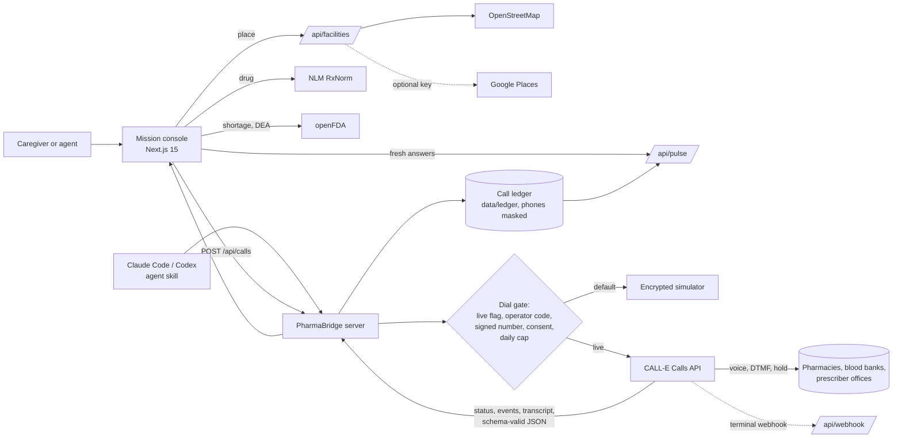

# PharmaBridge

**Critical medicine and blood, found by phone. Call once, answer everyone.**

PharmaBridge is a CALL-E phone-agent app for the two searches families still do by hand: a
shortage medication that no pharmacy website can confirm, and blood units that no blood bank
publishes live. You name what you need and where. PharmaBridge first checks the **Shortage Pulse**
(fresh answers from earlier PharmaBridge calls, shared without names), finds real pharmacies or
blood banks on a live map, and sends CALL-E voice agents to call only where nobody knows yet. It
ranks every answer with the staff member's own words as evidence, then places follow-up calls to
hold the stock (or reserve the units) and move the prescription, either as a transfer from the
family's current pharmacy or as a request to the prescriber.

> Simulation (no calls) is the default. Live calling is opt-in and fail-closed. See
> [Live calling and routing](#live-calling-and-routing) and [Safety by design](#safety-by-design).

**Demo video:** _add the YouTube link_ · **Live demo (simulation):** https://pharmabridge-callee.vercel.app · **Built for:** [CALL-E: Your Code Is Calling](https://call-e.devpost.com/)

---

## Why this exists

- The US had **227 active drug shortages in Q2 2026**, the third quarterly rise in a row
  ([ASHP via AJMC](https://www.ajmc.com/view/active-us-drug-shortages-rise-for-third-straight-quarter)).
- openFDA currently lists **1,153 shortage records** with status `Current`. The largest outpatient
  ones are ADHD stimulants: lisdexamfetamine (108 listings), mixed amphetamine salts (73), and
  methylphenidate ER (34+), all Schedule II (openFDA, September 2026).
- Neither prescription shelf stock nor blood-bank inventory by group and component is published
  in real time, so a caregiver's only option is to phone one place after another, sit through
  phone menus and hold music, and repeat the same questions. Pharmacies often decline to discuss
  controlled-substance stock by phone, and blood banks attach requirements (a signed requisition,
  a cross-match sample, replacement donors) that families only learn on the call.
- During a shortage, many families phone the same few pharmacies about the same drug. An AI that
  simply multiplies those calls makes pharmacists' days worse. PharmaBridge shares each verified
  answer so the next search can skip calls nobody needs to make.

## What it does

| Step | Medicine | Blood | Powered by |
| --- | --- | --- | --- |
| 1. Need | Exact product from RxNorm, live FDA shortage status, DEA schedule, strengths to *ask about* | Group, component, units, and the hospital where the patient is admitted | NLM RxNorm, openFDA |
| 2. Discover | Dispensing pharmacies with a listed phone, marked with recent Pulse answers. Places that just said "out" or "won't say" are left out to save calls. | Blood banks and blood centres with a listed phone, same Pulse marks | OpenStreetMap (Nominatim, Overpass), optional Google Places, Leaflet + OpenStreetMap tiles, Shortage Pulse |
| 3. Dispatch | Parallel CALL-E agents work phone menus, wait on hold, and ask the counter. The live conversation streams on screen. Queued calls are cancelled once the target is reached. | Same, asking about units, reservations, requisition, cross-match, replacement donors, charges, and 24×7 issue | CALL-E Calls API and events |
| 4. Secure | Hold call → **transfer call** to the family's current pharmacy, or a prescriber routing call → pickup checklist and directions | Reservation call → requirements checklist and a replacement-donor call-out → directions | CALL-E Calls API |
| 5. Share | Every verified answer goes to the Shortage Pulse for 12 to 24 hours | Same, for 6 hours | Call ledger projection |

Every result carries CALL-E's `completion_confidence`, `evidence`, the full transcript, and a
verbatim staff quote that the UI highlights inside the transcript. Every call, live or simulated,
is also written to a server-side call ledger that you can browse at `/records`.

## Shortage Pulse

`/pulse` is a live map and feed of fresh answers PharmaBridge calls have heard. It is a projection
of the call ledger, so:

- **Only the facility's own words appear:** a schema-valid CALL-E result from a live call to the
  facility's listed number, or from a fictional demo facility. Simulated and test-line answers about
  real businesses never appear, and nobody can type a claim onto the Pulse.
- **No private data:** no patient details, staff names, quotes, or phone numbers.
- **Answers expire:** stock answers after 12 hours, blood after 6, "not here" answers after 24.
- **Where it isn't, never where it is:** for controlled medications, pharmacies that are out or
  won't say are named, but in-stock answers are shown only as an area count, so the Pulse can't
  become a map for theft or diversion.

Before dispatch, PharmaBridge sorts places that recently had the item to the front and leaves out
places that just said no, and it counts the calls avoided. The agent skill's `pulse` command does the
same for Claude Code or Codex.

## How CALL-E is used

| CALL-E capability | Where | Why |
| --- | --- | --- |
| `POST /v1/calls` via `@call-e/calle` SDK | [`src/lib/calle.ts`](src/lib/calle.ts) | One call per facility with explicit `recipients[].phones`, `region`, and optional `locale` (retried once without the locale on `unsupported_language`). The key goes only to CALL-E's official HTTPS origin, and redirects are refused. |
| Six strict `result_schema`s | [`src/lib/calltasks.ts`](src/lib/calltasks.ts) | Pharmacy inquiry (15 fields), hold, prescription transfer, prescriber routing, blood inquiry (15 fields), and blood reservation. Closed objects, every field required, `unknown` and `refused_to_disclose` enums, and descriptions that forbid inference. |
| Structured task briefs | [`src/lib/calltasks.ts`](src/lib/calltasks.ts), [`src/components/BriefView.tsx`](src/components/BriefView.tsx) | Each brief is a `BriefSpec` (goal, subject, AI-disclosure opening, call flow, if-yes/if-no questions, guardrails). The UI renders it as cards, and the exact task text sent to CALL-E is rendered from the same object. |
| `Idempotency-Key` | [`src/app/api/calls/route.ts`](src/app/api/calls/route.ts) | `pharmabridge:{mission}:{kind}:{facility}:a{attempt}`. Network retries never double-dial, and resubmitting an unconfirmed call reuses its key. |
| `metadata` | same | `mission_id`, `kind`, `facility_kind`, `facility_id`, `routing`, echoed on calls and webhooks. |
| `GET /v1/calls/{id}` + `/events` | [`src/hooks/useMission.ts`](src/hooks/useMission.ts), [`src/lib/mission.ts`](src/lib/mission.ts) | Live phases (dialing, phone menu, hold, talking, extracting). CALL-E streams each utterance as an event ("Callee said: …") and sends the transcript only at hang-up, so PharmaBridge rebuilds the conversation from events to show it in real time. |
| `completion_confidence`, `evidence`, `transcript_turns`, `provider_call_id` | [`src/lib/scoring.ts`](src/lib/scoring.ts), [`src/lib/ledger.ts`](src/lib/ledger.ts) | Confidence-weighted ranking, evidence-grounded UI, and provider ids stored for looking up audio in the CALL-E dashboard. |
| Terminal webhooks | [`src/app/api/webhook/route.ts`](src/app/api/webhook/route.ts) | Deduplicated by `CALL-E-Event-Id` and re-verified against the API (deliveries are unsigned), then recorded to the ledger. |
| Multi-step agentic workflow | [`src/components/ResultsStep.tsx`](src/components/ResultsStep.tsx) | The inquiry result feeds the hold or reservation brief, and the hold result feeds the transfer or prescriber brief. A partial answer never unlocks follow-up calls. |

## Architecture



- **Stateless calls, recorded outcomes.** The browser orchestrates the mission (concurrency cap,
  early stop, retries, polling). The server holds the API key, the dial gate, and the ledger.
- **Encrypted simulator.** A simulated call's spec is encrypted into its `call_pb_…` id, so the
  no-call mode returns the exact SDK `Call` shape without a database.

## Live calling and routing

| Routing | Dials | Requirements |
| --- | --- | --- |
| Simulation | Nothing | None (default) |
| Test lines | Allowlisted stand-in phones, e.g. a teammate playing the pharmacist, or CALL-E's official US test line (+1 276-322-9632) | Live gate + `PHARMABRIDGE_ALLOWED_NUMBERS` |
| Live · real numbers | Each facility's listed number from discovery | Live gate + a server-issued discovery signature on the number + the operator's explicit consent checkbox + the daily cap |

The **live gate** is `PHARMABRIDGE_LIVE_CALLS=true`, a CALL-E key, an operator code (entered in
the UI for every live mission), and `PHARMABRIDGE_ACCESS_TOKEN_SECRET`. Discovery signs each listed
number with that secret, so the browser can never inject an arbitrary destination; synthetic
listings are never signed and never dialed. `PHARMABRIDGE_MAX_LIVE_CALLS_PER_DAY` (default 20)
protects your credits, and `PHARMABRIDGE_DIRECT_CALLS=false` limits live mode to test lines.

**Unknown outcomes are kept, not retried.** If CALL-E does not confirm a submission (no response, a
5xx, a timeout) or polling loses a call, the call is marked *Outcome unknown*, recorded in the ledger,
and all queued live calls are halted. Only a definite refusal is shown as "Not placed". Resubmitting
reuses the same idempotency key, so CALL-E returns the original call instead of dialing again.

## Safety by design

- **No-call default** and a dry-run "Preview agent brief" that shows the structured brief and the exact text.
- **Fail-closed live gate** (above) with timing-safe operator-code checks and scoped, expiring
  per-call access tokens for polling.
- **Credentials stay on approved transports.** The CALL-E key is sent only to
  `https://api.heycall-e.com` (or a loopback test server with `CALLE_LOCAL_TEST_TRANSPORT=true` and the dummy `CALLE_API_KEY=local-test-only`), and
  the SDK refuses redirects. The agent skill sends operator codes and call tokens only to a loopback
  server or an https origin listed in `PHARMABRIDGE_APPROVED_ORIGINS`, also without redirects.
- **Phone numbers masked everywhere.** API responses, the ledger, error messages, the smoke script,
  and the skill's output mask phone numbers in transcripts, summaries, and results; lists show
  `+1 ••• ••• ••10`.
- **AI disclosure** on every call; the agent says yes if asked whether it is an AI.
- **Minimum-necessary identity.** Inquiry calls share no patient identity. Holds and reservations
  share only a first name and last initial (plus the hospital name for blood). Transfer and
  prescriber calls share full name and date of birth only with explicit consent, and only when
  staff ask to find the prescription.
- **No medical advice or substitutions.** Agents ask about availability of alternatives but never
  suggest a different medication, strength, blood group, or component.
- **Honest outcomes.** Refusals, voicemail, unanswered, and unconfirmed calls stay in the results.
  Nothing is inferred from tone; prices and charges are never estimated.
- **Not an emergency service:** the blood flow tells families to contact the treating hospital or
  emergency services first if a life is at risk.
- **Cancellation.** Stopping a mission cancels every call not yet dialed. CALL-E has no cancel
  endpoint, so in-flight calls finish (see [FEEDBACK.md](FEEDBACK.md)).

## Call recording (ledger)

Each call is written to `data/ledger/<key>.json` as it happens: the brief and exact task, routing
and masked dial target, every transcript turn (phone-menu prompts and keypad presses included),
CALL-E events, the structured result, confidence, and `provider_call_id`s, with phone numbers
masked. A submission CALL-E never confirmed is recorded with status `unknown` and its idempotency key.
Browse records at [`/records`](http://localhost:3000/records). Records can hold live transcripts, so
they open only with the operator code, in every environment. The CALL-E Developer API returns
transcripts rather than audio files; the provider call id links each record to its audio in the
CALL-E dashboard.

## Agent skill

[`skills/pharmabridge-supply-finder`](skills/pharmabridge-supply-finder/) lets Claude Code, Codex,
or Cursor run PharmaBridge missions from a chat: resolve a drug, discover facilities, check the
Shortage Pulse, preview the brief, dispatch (simulation by default, live only with the user's
operator code and consent), and report ranked, evidence-backed answers.

```bash
node skills/pharmabridge-supply-finder/scripts/pharmabridge.mjs discover --kind blood_bank --near "Chennai, India" --radius 8
node skills/pharmabridge-supply-finder/scripts/pharmabridge.mjs pulse --kind blood_bank --group O- --component platelets --hospital "General Hospital"
```

## Optional real-time AI

With a Groq key (Cerebras as a fallback; both OpenAI-compatible), two helpers appear:

- **Describe it.** One sentence such as "My father needs 2 units of O negative blood at City General
  Hospital in Chennai today" fills the need form for review. RxNorm still resolves the exact drug,
  and a guard drops any blood group the caregiver did not actually write.
- **Translate the family update** into Tamil or Hindi before sharing, keeping every number, name,
  and reference unchanged.

The AI never decides availability, never picks a medication or blood group, and never touches the
CALL-E briefs or results. Without a key, both helpers are hidden. Retired model names are skipped
automatically.

## Quick start

Requires Node 20+.

```bash
npm install
cp .env.example .env.local   # simulation works with no key at all
npm run dev                  # http://localhost:3000
```

| Variable | Purpose |
| --- | --- |
| `CALLE_API_KEY` | CALL-E key (live calls only) |
| `CALLE_BASE_URL` | Optional. Only `https://api.heycall-e.com`, or a loopback URL together with `CALLE_LOCAL_TEST_TRANSPORT=true` and the dummy `CALLE_API_KEY=local-test-only`; real keys are never allowed for local test transport |
| `PHARMABRIDGE_LIVE_CALLS` | `true` to allow live routing |
| `PHARMABRIDGE_OPERATOR_CODE` | Code the operator types before every live mission and to open call records |
| `PHARMABRIDGE_ACCESS_TOKEN_SECRET` | 32+ random characters; signs call tokens and discovered numbers |
| `PHARMABRIDGE_ALLOWED_NUMBERS` | Comma-separated E.164 test lines |
| `PHARMABRIDGE_DIRECT_CALLS` | `false` to disable direct calls to real listed numbers |
| `PHARMABRIDGE_MAX_LIVE_CALLS_PER_DAY` | Daily live-call cap (default 20) |
| `GOOGLE_PLACES_API_KEY` | Optional Places API (New) key for discovery; called server-side, so no HTTP-referrer restriction (falls back to `GOOGLE_MAPS_API_KEY`) |
| `GROQ_API_KEY`, `GROQ_MODEL` | Optional real-time AI (intake and translation) |
| `CEREBRAS_API_KEY`, `CEREBRAS_MODEL` | Optional AI fallback provider |
| `PUBLIC_BASE_URL` | Optional https base URL for CALL-E webhooks |
| `PHARMABRIDGE_LEDGER_DIR` | Optional ledger location (default `data/ledger`) |
| `PHARMABRIDGE_APPROVED_ORIGINS` | Agent skill only: extra https origins it may send credentials to |

To place one verification call with the production brief (dry run unless `--yes`):

```bash
npm run smoke:live -- --to +1XXXXXXXXXX
```

## Tests

```bash
npm test          # 81 unit tests
npm run typecheck
```

Coverage includes every result schema checked against CALL-E's supported features and reserved
names, the safety wording of all six briefs, blood-bank and pharmacy scoring, simulator phases for
both kinds, discovery signatures, the dial policy (consent, signatures, allowlist, live gate), phase
mapping and live-transcript rebuilding from real CALL-E event messages, unknown-outcome handling,
Shortage Pulse publishing rules (freshness, controlled-medication withholding, facility-only
answers), phone masking, call-record authentication, CALL-E transport restrictions, and the AI intake
blood-group guard.

## Project structure

```
src/
  app/api/            calls, calls/[id], calls/[id]/events, facilities, pulse, records, webhook, drugs, shortages, config
  app/page.tsx        mission console (need, discover, dispatch, secure)
  app/pulse/          Shortage Pulse map and feed
  app/records/        call ledger browser (operator code required)
  components/         MapView, FacilitiesStep, DispatchBoard, Spotlight, CallCard, CallDrawer, BriefView, ResultsStep, ...
  hooks/              useMission (parallel orchestrator), useFollowUpCall
  lib/
    calltasks.ts      structured briefs and result schemas
    calle.ts          SDK wrapper (server only)
    transport.ts      approved CALL-E origins and no-redirect fetch
    config.ts         dial gate: live flag, operator code, allowlist, consent, daily cap
    discovery-signing.ts, call-access.ts, simulation-token.ts
    ledger.ts         call recorder (phones masked, unknown submissions kept)
    pulse.ts, pulse-item.ts   Shortage Pulse
    geo.ts            OpenStreetMap and Google Places discovery
    simulator.ts      encrypted no-call CALL-E stand-in
    scoring.ts, mission.ts, drugs.ts, phone.ts, result-validation.ts
skills/pharmabridge-supply-finder/   agent skill
scripts/smoke-live-call.mts
tests/
```

## Data sources and attribution

- [NLM RxNorm / RxNav](https://lhncbc.nlm.nih.gov/RxNav/) for product names, strengths, and brands.
- [openFDA](https://open.fda.gov/) for drug shortages and the NDC directory. openFDA data is
  unvalidated and must not be used for medical decisions; PharmaBridge uses it only as context.
- Map data © [OpenStreetMap](https://www.openstreetmap.org/copyright) contributors (ODbL), via
  Nominatim and Overpass; map tiles from the OpenStreetMap tile server.
- Optional [Google Places API (New)](https://developers.google.com/maps/documentation/places/web-service).
  Per Google Maps Platform terms, Google-sourced places are listed with attribution and a Google
  Maps link but never drawn on the OpenStreetMap basemap.

## Limitations and roadmap

- Listing coverage varies by city; Google Places fills gaps when a key is configured.
- Mission state lives in the browser tab; the ledger keeps every call even if the tab closes.
- The Pulse lives with one server's ledger; a shared deployment would move it to a database.
- CALL-E currently routes India calls over international test numbers; a local line is needed there.
- Publish the inquiry briefs as CALL-E Goals and run them through Goal Runs for versioned reuse.
- Re-check on the restock day staff mention, and let pharmacies confirm stock once for everyone.

## License

MIT
