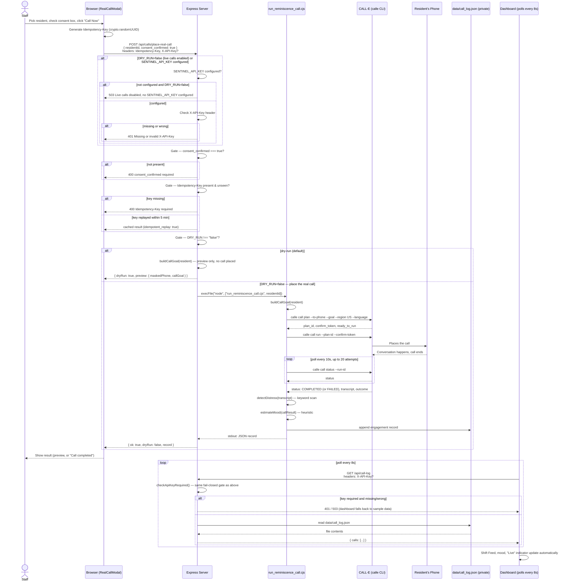

# RECALL-E

A staff dashboard for memory care facilities that manage scheduled AI reminiscence-therapy phone calls placed to residents, built on **CALL-E**.

## What's real vs. illustrative

This was built for a hackathon in a short window, so some panels show what a full product *would* look like, not what's wired up today. Here's the honest breakdown, feature by feature.

| Feature                                         | Status                         | What's actually happening                                                                                                                                                                                                               |
|-------------------------------------------------|--------------------------------|-----------------------------------------------------------------------------------------------------------------------------------------------------------------------------------------------------------------------------------------|
| **Place a real call** (`Call a Resident`)       | ✅ Real                         | Hits `POST /api/calls/place-real-call`, which — once `DRY_RUN=false` — shells out to `scripts/run_reminiscence_call.cjs`, the exact script validated against the `calle` CLI.                                                           |
| **Dry-run by default**                          | ✅ Real                         | Unless `DRY_RUN=false` is explicitly set, no call is placed; the endpoint returns a preview (masked phone number + generated call script) instead.                                                                                      |
| **Consent gate**                                | ✅ Real                         | The server rejects the request unless `consent_confirmed: true` is in the body, which the UI only sends once the consent checkbox is checked.                                                                                           |
| **Idempotency protection**                      | ✅ Real                         | Every request carries a generated `Idempotency-Key`; the server replays the cached result for a repeated key instead of dialing twice.                                                                                                  |
| **Transcript capture** (for real calls)         | ✅ Real                         | The transcript comes back from CALL-E's own call result and is appended to `data/call_log.json` — outside `public/`, so it's never served as a plain static file, and only reachable via the authenticated `GET /api/call-log`.          |
| **Mood label & distress flag** (for real calls) | ✅ Real, but a simple heuristic | Distress is a keyword scan over the transcript (`"help me"`, `"where am I"`, etc.); mood is derived from whether the call completed and CALL-E's own confidence label. The code comments say this outright: *not clinically validated*. |
| **Live dashboard / "Live" indicator**           | ✅ Real                         | Polls `residents.json` (public, redacted) and `GET /api/call-log` (authenticated) every 8 seconds. Residents without real history yet show labeled sample data so the demo isn't empty, but any real call appears automatically.         |
| **Transcript translation**                      | ✅ Real                         | A real Gemini call, with an honest fallback (returns the original text and `translated: false`) if no key is configured or the call fails.                                                                                              |
| **"Preview call script" simulator**             | ✅ Real, rehearsal-only         | A working chat simulator (Gemini, or a scripted fallback with no key) for staff to rehearse what CALL-E might say. It never dials a phone — it's a practice tool, not the calling path.                                                 |
| **Resident onboarding / edit form**             | 🟠 Illustrative / roadmap      | Updates browser state only. Nothing is written back to `scripts/residents.json`, so a resident added this way looks real in the dashboard but can't actually be called.                                                                 |
| **Family Anchor Portal**                        | 🟠 Illustrative / roadmap      | A concept UI for how a family member might contribute memories — local state only, not a live, separately-authenticated portal.                                                                                                         |
| **Nurse pager alerts** (Vocera/Ascom)           | 🟠 Illustrative / roadmap      | Simulated entirely client-side when a call is flagged. `realData.ts` always seeds `nurseAlerts: []` — no pager is ever dispatched, for real *or* simulated calls.                                                                       |
| **EHR sync status / PointClickCare note IDs**   | 🟠 Illustrative / roadmap      | The UI shows "Synced" badges and note IDs, but there's no real EHR connection.                                                                                                                                                          |
| **HIPAA audit log**                             | 🟠 Illustrative / roadmap      | Populated only from actions taken in the current browser session; resets on reload. Not a real compliance system.                                                                                                                       |
| **Facility Economics / ROI calculator**         | 🔵 Projection / estimate       | The sliders do real, live math — but the inputs (session length, hourly wage) are illustrative pitch assumptions, not billing data from an actual facility.                                                                             |

## How a real call actually works



## Setup

**Prerequisites:** Node.js, and — only if you intend to place real calls (`DRY_RUN=false`) — the `calle` CLI installed and authenticated on the machine running this server.

1. **Install dependencies**
   ```bash
   npm install
   ```

2. **Set up your environment file**
   ```bash
   cp .env.example .env
   ```
   Leave `DRY_RUN="true"` (the default) unless you specifically want to place real calls. Optionally set `GEMINI_API_KEY` to enable the AI-backed "Preview call script" simulator and transcript translation — both work without it too, via scripted fallbacks.

3. **Set up resident data**
   ```bash
   cp scripts/residents.example.json scripts/residents.json
   ```
   `scripts/residents.json` holds real phone numbers and is **git-ignored** — it's the private file the calling backend reads from. Edit it with real (or your own test) phone numbers before placing any real call.

   If you skip this step, the backend automatically falls back to `scripts/residents.example.json` (safe example data, fake phone numbers) and logs a warning — so the dry-run preview still works on a fresh clone, but you'll need to do the copy above before placing any real call.

   The frontend doesn't read this file directly — it fetches the separate, already-redacted `public/residents.json` (no phone numbers). If you add or change a resident in `scripts/residents.json`, mirror the non-sensitive fields into `public/residents.json` by hand so it shows up in the dashboard. There's no automated sync between the two today.

4. **Run it**
   ```bash
   npm run dev
   ```
   This runs `server.ts`, which serves the Vite dev server and the Express API (including the real call endpoint) together on `http://localhost:3000`.

## The safety layer

Real phone calls to real, vulnerable people are not something to place casually, so the real-call endpoint is gated three ways, in order:

1. **Dry-run by default.** `DRY_RUN` defaults to `true`. Until someone deliberately sets `DRY_RUN=false` in the environment, the endpoint can never place a call — it only ever returns a preview of the masked phone number and the exact script CALL-E would follow.
2. **Explicit, per-request consent.** The server checks for `consent_confirmed: true` in the request body on every single call. The UI only sends that once a human has checked the consent confirmation box for that specific resident, that specific time.
3. **Idempotency protection.** Every request must carry a unique `Idempotency-Key` header. If the same key shows up again within 5 minutes — a flaky retry, a double-click, a network hiccup — the server returns the original cached result instead of placing a second call to the same person.

There's also a fourth layer, required (not optional) once real calls are enabled: setting `DRY_RUN=false` requires `SENTINEL_API_KEY` to be configured, and a matching `X-API-Key` header on every request. This fails closed — if `DRY_RUN=false` and no `SENTINEL_API_KEY` is set, the endpoint refuses every live-call request instead of silently allowing unauthenticated ones. `SENTINEL_API_KEY` stays optional only for the harmless dry-run preview.

Real call transcripts are protected the same way. They're written to `data/call_log.json`, a path that sits outside `public/` and `dist/` — the two directories Vite's dev server and `express.static` will serve as plain files with no authentication at all — and the dashboard can only read them through `GET /api/call-log`, which applies the identical `SENTINEL_API_KEY` gate described above.

### Known limitation: `SENTINEL_API_KEY` and the browser

If you set `SENTINEL_API_KEY`, be aware of a real gap: this is a server-side static app with no login system, so there's no secure place for the **browser** to hold that secret. The dashboard's `fetch` calls to `/api/calls/place-real-call` and `/api/call-log` don't attach an `X-API-Key` header today, so turning the key on will make the dashboard itself start receiving `401`/`503` from those endpoints (it degrades gracefully to sample data rather than crashing, but real call data won't show).

`SENTINEL_API_KEY` is meant for a scenario where this server is reached by something other than this bundled browser dashboard — a trusted internal script, an authenticated reverse proxy that injects the header, etc. For the common case of one operator running this locally, DRY_RUN and the other gates above are the real protection; `SENTINEL_API_KEY` is an optional extra layer with this accepted trade-off, not a substitute for a real auth system, and not something in scope to solve properly at hackathon scope.

## Multi-language support

CALL-E can conduct the call itself in the resident's first language — `scripts/build_call_goal.cjs` builds the opener and topic question from `*Translated` fields in the resident's profile when they exist (see `residents.example.json` for Rosa's Spanish example), and passes `--language` straight through to the `calle call plan` command.

Worth being honest about: the **region passed to CALL-E is hardcoded to `"US"`** in `run_reminiscence_call.cjs` (`const region = "US"`), regardless of the resident's actual language or locale. That wasn't parameterized in this build — it's a real constraint of the current implementation, not a hypothetical one.

The frontend's transcript translation (English review of a non-English call) and the "Preview call script" simulator's language handling are separate, simpler string-matching logic (`includes('span')`, `includes('ital')`, etc.) — good enough for the languages exercised in this demo, not a general internationalization system.

## Business model

RECALL-E is sold to the **facility**, not to families: a flat per-resident monthly subscription (illustrated in the app at $59/bed/month) paid out of the facility's existing activities and staffing budget, positioned to replace staff hours currently spent on one-on-one reminiscence visits — not as a consumer product billed to a resident's family.

## Project structure

```
recall-e/
├── server.ts                        # Express API + Vite middleware, one process
├── scripts/
│   ├── residents.json               # Private, git-ignored — real phone numbers
│   ├── residents.example.json       # Safe template (fake phone numbers) — commit this
│   ├── build_call_goal.cjs          # Resident profile -> CALL-E call goal string
│   └── run_reminiscence_call.cjs    # plan -> run -> poll -> log, via the calle CLI
├── public/
│   ├── residents.json               # Redacted copy the frontend actually fetches
│   ├── sample_call_history.json     # Seed/sample calls, shown until real ones exist
│   └── assets/
├── data/
│   └── call_log.json                # Real call results (git-ignored, NOT in public/ --
│                                     # only reachable via authenticated GET /api/call-log)
├── src/
│   ├── App.tsx                      # Top-level state, tabs, modal orchestration
│   ├── main.tsx
│   ├── types.ts
│   ├── data/
│   │   └── realData.ts              # Fetches residents.json + sample_call_history.json as
│   │                                 # static files, and real call data via /api/call-log
│   ├── lib/
│   │   ├── language.ts              # Language -> flag emoji lookup
│   │   └── speech.ts                # Shared speech-synthesis tuning
│   └── components/
│       ├── ui/
│       │   └── ModalShell.tsx       # Shared modal chrome
│       ├── Navbar.tsx
│       ├── MetricsOverview.tsx
│       ├── AttentionAlertBanner.tsx
│       ├── ReminiscenceHeroBanner.tsx
│       ├── CallLogsView.tsx         # Shift feed
│       ├── CallDetailModal.tsx
│       ├── RealCallModal.tsx        # Places an actual call
│       ├── LiveCallSimulatorModal.tsx  # Rehearsal-only chat simulator
│       ├── ResidentRosterView.tsx
│       ├── ResidentProfileModal.tsx
│       ├── FamilyAnchorPortalModal.tsx
│       ├── NurseStationHandoffView.tsx
│       ├── ScheduleQueueView.tsx
│       ├── FacilityEconomicsModal.tsx
│       └── EhrTelephonyHubModal.tsx
├── .env.example
├── .gitignore
└── package.json
```

The demo video is linked in the Devpost submission.
