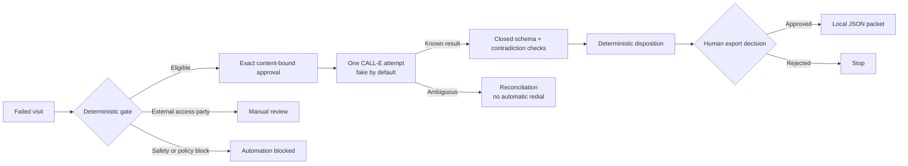

# RevisitZero — Meter Access Recovery

> One failed visit. One controlled call. One trustworthy rebook decision.

RevisitZero is a focused desktop operator workbench for recovering a failed smart-meter visit caused by access barriers. It applies deterministic safety and eligibility rules, binds an operator approval to one exact call, uses a fake transport by default, and provides a guarded CALL-E adapter for an optional participant-authorised test call. It validates a closed result locally and stops at a human-approved JSON export packet.

It does **not** book a technician, update a CRM or retailer system, contact a landlord/body corporate, diagnose a defect, send a notification, or retry a call automatically.

## Fastest credential-free review

Requires Node.js 20.19 or later.

```bash
cd apps/typescript/revisit-zero
npm ci
npm run check
npm test
npm run demo
npm run build
npm run start:prod
```

Open <http://127.0.0.1:4174>. The default `CALL_MODE=fake` path uses three fictional cases, requires no CALL-E account, and creates no external side effects.

Expected demo summary:

```text
MTR-2026-0042 -> READY_FOR_REBOOK_REVIEW
MTR-2026-0043 -> MANUAL_REVIEW
MTR-2026-0044 -> AUTOMATION_BLOCKED
3 cases, 1 fake call, 0 real side effects
```

For development, run `npm start` for the local API on port 4174 and `npm run dev` for Vite on port 4173. Vite proxies `/api` to the local API.

## Three demo cases

1. `MTR-2026-0042`: locked side gate, unsecured dog, obstruction, and presence needed. The authorised contact confirms every blocker is resolved and selects Thursday 12pm–4pm. Result: `READY_FOR_REBOOK_REVIEW`.
2. `MTR-2026-0043`: a body corporate controls a shared locked meter room. RevisitZero will not switch recipients or contact that external party. Result without a call: `MANUAL_REVIEW`.
3. `MTR-2026-0044`: a suspected electrical/site defect. Result before approval or contact: `AUTOMATION_BLOCKED`.

The numbers in `examples/failed-visits.json` are fictional numbers reserved by the Australian Communications and Media Authority for creative works. The browser and exports mask them.

## Workflow and architecture



The React workbench calls the local server API. Both the CLI demo and UI therefore use the same policy, approval digest, fake/live transport port, validation, decision, suppression, idempotency ledger, and export function.

Key modules:

- `src/policy.ts`: deterministic pre-call decisions.
- `src/preview.ts`: canonical call content and exact SHA-256 approval receipt.
- `src/calle-client.ts`: fake/live transport boundary and official `@call-e/calle` live adapter.
- `src/validation.ts`: closed schema enforcement and contradiction detection.
- `src/decision.ts`: deterministic rebook-readiness disposition.
- `src/workflow.ts`: one-call reservation, suppression, reconciliation, and human export boundary.
- `src/server.ts`: local-only server, controlled live configuration, and UI API.

## Deterministic gates

Pre-call output is one of `ELIGIBLE_FOR_CALL`, `MANUAL_REVIEW_REQUIRED`, `AUTOMATION_BLOCKED`, or `CALL_WINDOW_CLOSED`.

The app fails closed for technical/safety defects, suspected hazardous material, life-support or vulnerability indicators, emergencies/outages, billing or disconnection disputes, missing recipient authorisation, invalid E.164 numbers, suppression, malformed windows, and closed call windows. External access control routes to manual review; RevisitZero never calls that external party.

Final dispositions are `READY_FOR_REBOOK_REVIEW`, `NOT_READY`, `MANUAL_REVIEW`, `DO_NOT_CONTACT`, `UNREACHED`, or `AUTOMATION_BLOCKED`. `UNREACHED` remains available for an explicit trusted transport/structured outcome; the live adapter never infers it from an unconstrained Calls failure string. A ready result is still only a recommendation for a human rebook review—not a booking.

## Exact approval and duplicate prevention

The preview digest covers the complete case snapshot, recipient, objective, allowed questions, visit windows, and guardrails. Editing any bound value invalidates the approval. The provider idempotency key is a SHA-256 digest of the normalized recipient, exact generated task, locale, closed result schema, and server-attributed approval receipt. It is reserved before invoking the transport; the approved preview digest also travels as a request fingerprint so an idempotent record for different content is quarantined rather than reused as success.

The in-memory ledger prevents duplicate invocation during the local run. The live adapter is implemented to send the same stable key to CALL-E. A timeout, lost response, HTTP 408/409/429/5xx, missing call identifier, or incomplete provider result becomes a reconciliation record. RevisitZero never creates a fresh key or automatically redials.

## Result and privacy boundary

The accepted result is a closed object containing only:

- reached/unreached/do-not-contact outcome;
- `YES` / `NO` / `UNKNOWN` / `NOT_APPLICABLE` access answers;
- one approved visit-window ID or `null`;
- an opt-out boolean.

Unknown keys, free-form narratives, malformed values, unapproved windows, impossible answers, unreached outcomes with answers, and conflicting opt-out fields are rejected locally and cannot become ready. The call goal expressly prohibits names, addresses, account numbers, gate/security codes, passwords, banking/payment data, medical data, photos, and free-form personal narratives.

The provider-facing `recipientResultSchema` stays within the documented CALL-E subset: explicit JSON types, no union types, `schemaVersion` as a one-value string enum, and `selectedVisitWindowId` as a string enum containing only the exact approved window IDs plus the `NONE` sentinel. `contactOutcome` is the single provider-facing source of truth: the redundant wire-level `optOut` field is omitted and the local boolean is derived only after the exact provider shape is checked. `NONE` is normalized locally to `null` before strict validation; any unexpected provider field, unapproved window string, or semantic contradiction fails closed and cannot become ready.

An opt-out hashes the phone number into the in-process suppression registry so future automated contact in the same run is blocked. No raw phone number is written to an export packet.

## Side effects and cancellation

Fake mode has no external side effects. The only local side effect is a JSON download after a separate human approval.

Controlled live mode submits exactly one CALL-E task for one configured consenting recipient and one phone number. The task expressly instructs CALL-E not to retry or redial, the app never submits a second create request for the case, and any provider response showing more than one attempt is quarantined instead of accepted. The Calls API exposes no client cancellation operation: closing the local app prevents new requests but does not terminate a task already accepted by CALL-E. If the create outcome is ambiguous, reconcile the existing call/idempotency reference before doing anything else—never press the call action again with a new key. A participant-authorised controlled-live test verified one completed provider attempt, ledger-based duplicate prevention, and no automatic redial.

No transcript, recording, credential, real phone number, or provider response is committed by this app. CALL-E maintains its own service-side operational records under its account controls.

## Controlled live mode

Live mode uses the official server-side TypeScript SDK, pinned as `@call-e/calle@0.2.2`. The credential is read only by the Node server and is never included in browser data, source files, logs, exports, or metadata.

Do not enable live mode with a customer record. Use one test recipient who has explicitly consented to this exact call.

Required controls:

```bash
export CALL_MODE=live
export CALLE_LIVE_ENABLED=true
export CALLE_API_KEY="<CALL-E server API key>"
export CALLE_TEST_RECIPIENT_E164="<consenting test recipient in E.164>"
export CALLE_LIVE_WINDOW_START="<current ISO-8601 timestamp with offset>"
export CALLE_LIVE_WINDOW_END="<ISO-8601 timestamp no more than four hours later>"
export REVISIT_ZERO_LIVE_OPERATOR_ID="<server-authorized operator identifier>"
export REVISIT_ZERO_LIVE_DISPATCH_TOKEN="<random secret with at least 32 characters>"
npm run build
npm run start:prod
```

Optional `CALLE_BASE_URL` is accepted only when it is exactly `https://api.heycall-e.com`; arbitrary credential destinations are refused. In live mode the configured test number and short current call window replace the fictional values **before** preview generation, so both are content-bound to the operator approval. The operator must then review the masked recipient and exact content, click **Approve this exact call**, enter the separately delivered live-dispatch token, and click **Start one approved live CALL-E call**. The server authenticates the Bearer token, attributes the approval to `REVISIT_ZERO_LIVE_OPERATOR_ID`, and derives the live-approval gate itself; client-supplied identity or live-approval fields are not trusted. Keep the dispatch token out of shell history, screenshots, logs, source files, and browser storage.

On 2026-08-16, one participant-authorised controlled-live test completed at the provider. RevisitZero rejected the returned structured result because an opt-out assertion conflicted with its outcome, produced `MANUAL_REVIEW`, blocked export, and prevented a duplicate call. This verified the live boundary and fail-closed behavior, but it was not a successful golden-path end-to-end result. The corrective pass removed the redundant provider field, added exact outcome rules to the approved preview and task, and added regression coverage. No second real call was placed. No transcript, real phone number, credential, or provider payload is included in the repository.

The full suite contains 71 tests across six files. Of those, 34 isolated adapter tests verify the installed `@call-e/calle@0.2.2` request shape, exact dispatch-bound idempotency, supported provider-schema subset, non-redundant `recipientResultSchema`, exact outcome instructions, local opt-out derivation, fingerprint/idempotency metadata, completed structured results, recipient binding, official base URL, error mapping, and zero create retry; the focused adapter-plus-validation run passes 43 tests. Six authorization cases verify server-configured operator attribution, missing/invalid credential rejection, and fail-closed live configuration. Regression coverage reproduces the observed opt-out/outcome conflict and verifies `MANUAL_REVIEW`, unavailable export, and duplicate prevention. The Calls contract leaves `failureCode` unconstrained, so every failed or cancelled Calls state—including candidate strings such as `no_answer`, `declined`, `voicemail`, `busy`, and `expired`—is quarantined as `AMBIGUOUS` for reconciliation rather than treated as verified `UNREACHED`. Unknown, mixed, or contradictory failure strings fail closed the same way. These offline tests do not contact CALL-E.

Official references: [CALL-E integrations](https://github.com/CALLE-AI/call-e-integrations), [CALL-E developer documentation](https://docs.heycall-e.com/), and the [`@call-e/calle` package](https://www.npmjs.com/package/@call-e/calle).

## Verification

```bash
npm ci                 # reproducible install from package-lock.json
npm run check          # strict TypeScript/ESM/JSX check
npm test               # focused policy, approval, validation, workflow, adapter-mapping, suppression and ambiguity tests
npm run demo           # all three cases; one fake invocation only
npm run build          # server TypeScript + production Vite UI
npm audit --audit-level=moderate
```

The upstream repository performs a separate repository-wide check from its root:

```bash
python3 scripts/validate_repository.py
```

## Troubleshooting

- `UI_NOT_BUILT_RUN_NPM_BUILD`: run `npm run build`, then `npm run start:prod` from this app directory.
- Port 4174 is busy: set `PORT` to an unused port from 1024–65535. For Vite development, update the proxy target too.
- `CONTACT_SUPPRESSED`: the recipient opted out earlier in this server run. Restarting clears this demo-only in-memory registry; a production system would require a durable governed suppression store.
- Live mode refuses startup: check the live controls, exact E.164 consenting number, and ISO timestamps. Never paste the API key into a case file or browser field.
- Ambiguous live result: retain the displayed call ID and idempotency reference, reconcile in CALL-E, and do not redial automatically.

## Limitations

- English-only desktop prototype with exactly three fictional demo cases.
- One authorised recipient and at most one controlled call per case.
- Single-operator Bearer authorization for controlled live dispatch; no production identity provider, durable ledger/suppression, multi-tenancy, or concurrency across processes.
- No appointment booking, field-service/retailer/CRM integration, landlord/body-corporate calling, gate-code collection, uploads, diagnosis, ML, analytics, SMS/email, inbound calling, multilingual flow, bulk calling, or mobile app.
- Stops at a local export packet and requires a human for every downstream decision.

See `docs/devpost-submission.md`, `docs/demo-script.md`, `docs/visual-plan.md`, and `docs/readiness-matrix.md` for submission materials and evidence tracking.
