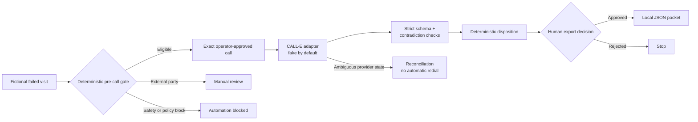

# RevisitZero visual and screenshot plan

## Visual language

Use a calm utility-operations palette: deep green for controlled progress, amber for explicit human checkpoints, red only for safety blocks, and neutral grey for untouched stages. Keep every phone number masked and every case clearly fictional. Avoid decorative AI imagery; the strongest visual is the audit trail itself.

## Architecture graphic

Create one 16:9 image with this left-to-right flow:

Place these three guardrail captions below the graphic:

- **One authorised recipient · one attempt**
- **Closed, non-sensitive structured result**
- **Stops at local export · never books or notifies**

Do not depict a CRM, scheduling engine, technician dispatch, database of customer records or outbound notifications; those would imply out-of-scope side effects.

## Devpost screenshot set

### 1. Hero — a trustworthy ready recommendation

- **State:** Case 1 after the fake structured result, before export approval.
- **Frame:** Full 1440×900 browser viewport with all three columns visible.
- **Must show:** fake/no-call banner, fictional badge, validated result, `READY_FOR_REBOOK_REVIEW`, masked recipient, audit references and pending human export decision.
- **Caption:** “One screen keeps source evidence, controlled contact and the human decision boundary in view.”

### 2. Exact call approval

- **State:** Case 1 before approval.
- **Frame:** Centre-column crop with enough left-column context to show the source case.
- **Must show:** recipient, objective, allowed questions, “never collect,” one-attempt rule, ambiguous-outcome reconciliation and stale-approval cue.
- **Caption:** “The operator approves the exact call—not a general permission to contact.”

### 3. Safe manual handoff

- **State:** Case 2 selected.
- **Frame:** Full workbench or a left/centre crop.
- **Must show:** shared meter-room source failure, `MANUAL_REVIEW_REQUIRED`, body-corporate boundary and disabled call action.
- **Caption:** “External access authority stays with an approved human process; RevisitZero does not switch recipients.”

### 4. Automation blocked before contact

- **State:** Case 3 selected.
- **Frame:** Full workbench with the blocked timeline visible.
- **Must show:** suspected defect, `AUTOMATION_BLOCKED`, no approval receipt and no attempted call.
- **Caption:** “A suspected safety defect stops the workflow before approval or contact.”

### 5. Reproducibility evidence

- **State:** Clean test and production-build results.
- **Frame:** Two terminal captures placed side by side in one image.
- **Must show:** focused tests passing, build completing and the project path only.
- **Must hide:** environment variables, credentials, tokens, real phone numbers, home-directory usernames and unrelated terminal history.
- **Caption:** “The credential-free demo, deterministic rules and production build are reproducible.”

## Capture checklist

1. Use the final production build rather than a mockup.
2. Set the browser to a clean 16:9 viewport at 90–100% zoom.
3. Disable notifications, bookmark bars, password-manager prompts and personal browser profiles.
4. Reset Case 1 before each state capture; never show a duplicate attempt.
5. Inspect the frame for secrets, real identifiers, downloads and unrelated tabs.
6. Preserve exact enum spelling; do not replace dispositions with marketing labels.
7. Export PNGs at 2× where practical, then verify body text remains legible at Devpost preview size.
8. Keep the fake/no-call banner visible in every product screenshot.

## Video thumbnail

Use the Case 1 ready-state screenshot. Add only the product name and short promise in the empty upper-left area; do not obscure status badges. A small “FAKE / NO-CALL DEMO” chip must remain visible so the thumbnail cannot imply a real customer call.
