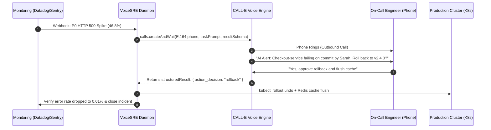

# VoiceSRE ☎️⚡

> **Autonomous Hands-Free Production Incident Hotfix Agent**  
> *Turn your on-call phone into an authenticated terminal to triage and rollback production outages.*

[](https://www.typescriptlang.org/)
[](https://open.heycall-e.com)
[](https://call-e.devpost.com/)
[](https://opensource.org/licenses/Apache-2.0)

---

## 💥 The Problem

P0 production outages (e.g. checkout errors, API 500 spikes) inevitably hit when SREs and engineers are:
- Driving on the highway.
- Away from keyboards without Wi-Fi.
- Woken up at 2:00 AM in bed.

Passive alerts (SMS, PagerDuty, Slack) require opening a laptop, unlocking VPNs, and typing terminal commands—causing **15–30 minutes of critical revenue loss**.

## 🚀 The Solution: VoiceSRE

**VoiceSRE** bridges the gap between the physical on-call engineer and the digital cloud infrastructure:
1. **Intelligent Outbound Dialing:** When Datadog/Sentry flags a P0 incident, CALL-E dials the on-call engineer.
2. **Immediate AI Disclosure & Root Cause Briefing:** Discloses AI identity immediately, then delivers a concise verbal summary of the failure (service, commit author, error trace).
3. **Conversational Tool Execution:** The engineer issues a verbal hotfix instruction (*"Roll back canary to v2.4.0 and flush Redis"*).
4. **Autonomous Remediation & Health Verification:** CALL-E extracts structured JSON via `resultSchema`, executes Git/Kubernetes rollbacks, validates that error rates normalize, and resolves the PagerDuty ticket.

---

## 🏛️ Architecture Flow



---

## 🛡️ Safety & Responsible Calling Model

VoiceSRE implements strict guardrails:
- **Immediate AI Disclosure:** Every call begins with explicit disclosure: *"This is VoiceSRE, an AI on-call assistant..."*
- **Strict E.164 Validation:** Rejects any phone numbers not adhering to `/^\+[1-9]\d{7,14}$/`.
- **Zero Phone Leakage:** All logs, previews, and reports mask phone numbers (`+84******1234`).
- **Dry-Run / Preview Mode by Default:** `VOICE_SRE_MODE=preview` simulates the entire remediation pipeline without consuming phone call credits.
- **Idempotency Safeguard:** Prevents duplicate dialing via unique `idempotencyKey` per incident.

---

## ⚡ Quickstart & Installation

### 1. Clone & Install Dependencies
```bash
git clone https://github.com/CALLE-AI/awesome-phone-call-agents.git
cd apps/typescript/voice-sre
npm install
```

### 2. Configure Environment
Copy `.env.example` to `.env`:
```bash
cp .env.example .env
```

Set your configuration:
```ini
# CALL-E API Key (Get 20 free calls from https://open.heycall-e.com)
CALLE_API_KEY=calle_sk_your_key_here

# Target Engineer Phone (E.164 format)
ONCALL_PHONE_NUMBER=+12025550123

# Set to 'preview' (default safe simulation) or 'live' (real phone call)
VOICE_SRE_MODE=preview

PORT=3000
```

### 3. Run Automated Unit Tests
```bash
npm test
```

### 4. Start Mission Control Dashboard
```bash
npm run dev
```
Open **`http://localhost:3000`** in your browser.

---

## 🎮 How to Demo (3-Minute Hackathon Walkthrough)

1. Open `http://localhost:3000`. You will see the **Mission Control Dashboard** showing a healthy cluster.
2. Click **💥 1. Simulate P0 Outage**. Notice the error rate spike to **46.8%**, latency jump to **1450ms**, and the cluster turns **CRITICAL RED**.
3. In **Preview Mode**: Click **📞 2. Dispatch VoiceSRE Call**. Watch the live terminal logs stream the AI prompt, verbal decision parsing, and automated rollback execution.
4. In **Live Mode**: Set your real phone number, input your CALL-E key, set mode to **Live Call**, and click Dispatch.
   - Your actual phone will ring!
   - Answer and say: *"Roll back the deployment and flush cache"*.
   - Watch the dashboard instantly update: Error rate drops to **0.01%**, latency drops to **45ms**, and the cluster turns **HEALTHY GREEN**.

---

## 📄 License
Distributed under the Apache 2.0 License.
