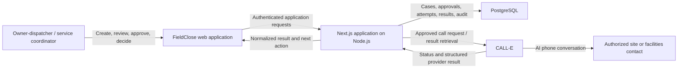
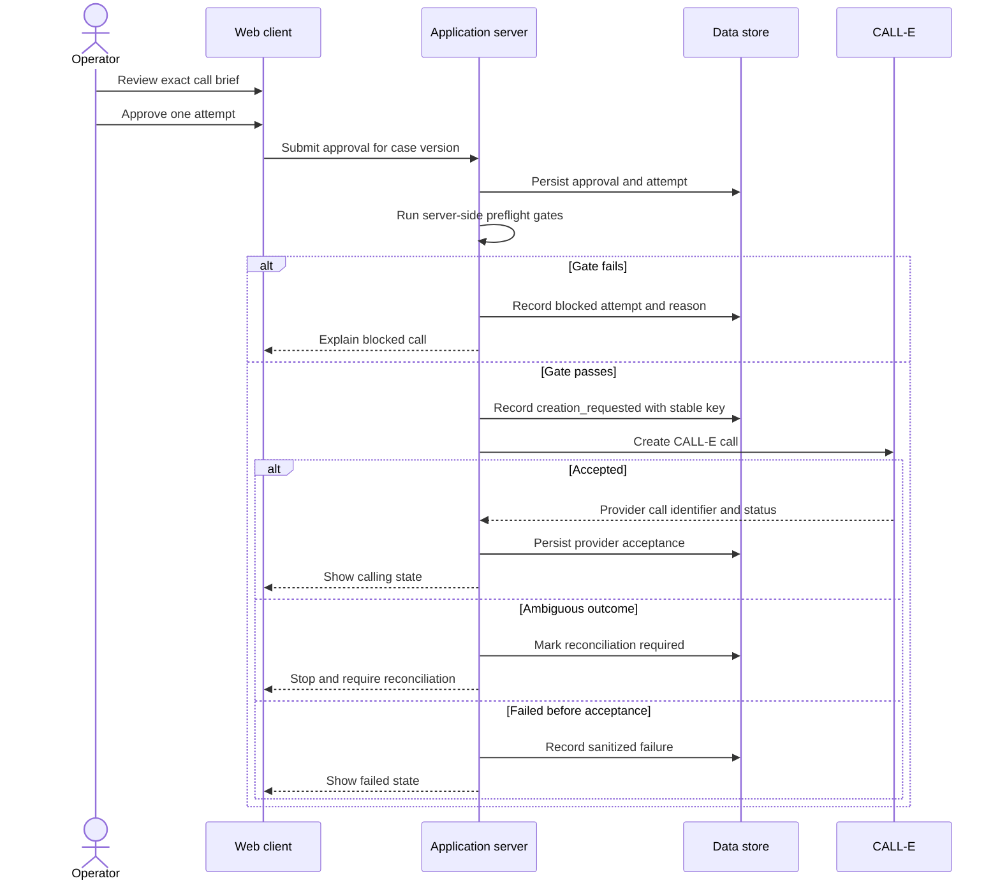

# FieldClose Architecture

## Document status

- Status: Technology-specific architecture accepted for the MVP
- Product phase: MVP implementation in progress
- Technology decision: Accepted on 2026-07-28

This document defines the system boundaries and invariants for the selected TypeScript implementation. Package versions and the full decision rationale are recorded in [Technology Selection](technology-selection.md).

## Architecture goals

1. Make a focused web workflow easy to understand and demonstrate.
2. Ensure that the browser cannot create a live call without server-side approval checks.
3. Preserve exactly-once intent even when external call creation has an ambiguous outcome.
4. Separate provider facts from FieldClose business interpretation.
5. Support a complete fake or dry-run path with no live credentials.
6. Make each material decision auditable without storing excessive personal data.
7. Keep the CALL-E integration replaceable at a narrow adapter boundary.
8. Complete the workflow with a durable, human-authored disposition that has no
   hidden external side effect.

## Decisions already made

- Product form: Web application
- Initial vertical: Small commercial HVAC contractors
- Primary workflow: Completed-work-order closeout follow-up
- External call provider for the hackathon: CALL-E
- Call authority: One human approval authorizes one exact attempt
- Default local/test behavior: No live call
- MVP retry behavior: No automatic live retries
- Final operational disposition: Human only
- Result model: Structured and uncertainty-preserving
- Application shape: Next.js App Router monolith on the Node.js runtime
- Primary language: Strict TypeScript
- Persistence: PostgreSQL through Drizzle ORM
- CALL-E runtime: Official `@call-e/calle` server SDK
- Result delivery: Authenticated bounded polling with explicit reconciliation
- Default hosting: Vercel application and Neon PostgreSQL
- Default public behavior: Authenticated, isolated fake-provider workspace
- Authentication implementation: Better Auth 1.6.25 with credentials, email OTP, and optional GitHub OAuth

The framework choices do not weaken any product or safety decision.

## System context



## Logical components

### Web client

Responsibilities:

- case list and case creation;
- call-brief preview;
- explicit approval interaction;
- masked contact display;
- status and result presentation;
- human disposition and exception handling.

The web client is not trusted to determine authorization, approval validity, calling windows, duplicate state, provider status, or business route.

### Application API

Responsibilities:

- authenticate operators;
- validate all input;
- enforce product and safety policy;
- create and version cases;
- create approvals and attempts;
- own all call-creation decisions;
- expose masked, least-privilege views;
- record audit events.

The API is implemented with Next.js Route Handlers. State changes use explicit `POST` operations. Provider, policy, persistence, normalization, secret, and cryptographic modules remain server-only.

### Authentication and workspace boundary

Better Auth exposes its Node.js handler at `/api/auth/[...all]` and stores users, credential or encrypted OAuth accounts, sessions, and hashed verification state in PostgreSQL. Email or username plus password is the primary login, an existing account may use a six-digit email OTP, and GitHub OAuth remains optional. Application endpoints resolve the full server-side session before accessing data.

Every contact and closeout case belongs to one workspace. Membership queries scope all application reads and writes. Personal public-demo workspaces are created idempotently and are constrained in PostgreSQL to the fake provider with live calls disabled. See [Authentication and Workspaces](authentication-and-workspaces.md).

### Policy and preflight service

Responsibilities:

- validate contact authorization attestation;
- validate E.164 input;
- require explicit IANA timezone;
- calculate permitted calling windows;
- enforce do-not-call and refusal blocks;
- verify approval version and brief hash;
- check live-call feature flags and operator permissions;
- reject duplicate creation.

This may begin as an application module rather than a separately deployed service.

### CALL-E adapter

Responsibilities:

- translate the approved `CallBrief` into the supported CALL-E request;
- invoke the official `@call-e/calle` SDK from the Node.js runtime;
- pass the attempt's stable idempotency key;
- retrieve task status and lifecycle events;
- map provider-specific failures into provider-neutral application facts;
- expose reconciliation without embedding business routing decisions.

The adapter must not create a broader prompt than the approved brief. It must send an explicit E.164 recipient, `US` region, and `en-US` locale for the initial product scope. It must not ask CALL-E to infer a destination from free text.

### Result normalizer

Responsibilities:

- validate untrusted provider output;
- preserve the provider status and opaque provider identifier;
- map answers into the FieldClose result schema;
- preserve unknown and ambiguous values;
- select a route recommendation using explicit rules;
- create a human task when validation or interpretation is uncertain.

### Persistence

Stores:

- cases and versions;
- protected contact details;
- approvals and brief hashes;
- attempts and provider identifiers;
- normalized results;
- follow-up tasks;
- audit events.

It must not become an uncontrolled archive for full recordings or transcripts.

### Fake provider

The default development provider implements the same narrow adapter contract without network calls. It returns deterministic fixtures for the scenarios in [Testing and Evaluation](testing-and-evaluation.md).

## Primary live-call sequence



## Result sequence

Authenticated bounded polling is the only result path. While the workbench is active, the browser asks FieldClose to refresh every five seconds; FieldClose performs the CALL-E lookup and returns only persisted, redacted application state. The browser never calls CALL-E directly.

1. Authenticate the session and owner/operator membership before provider access.
2. Atomically claim `lastCheckedAt` and throttle each attempt to one lookup per five seconds.
3. Fetch the already accepted provider call outside the database transaction.
4. Match the returned provider call ID to the stored attempt.
5. Store allow-listed provider facts without trusting free text.
6. Normalize terminal data into the FieldClose schema in one idempotent transaction.
7. Route invalid results, mismatched identifiers, and unresolved 600-second attempts to `needs_attention` with one reconciliation task.
8. Present the normalized result or explicit reconciliation state to the operator.

The current MVP has no service worker, background poller, or hosted scheduler
for accepted calls. The mounted case view schedules the first refresh after
about five seconds and clears that timer when the view unmounts. Reopening the
case reloads the persisted attempt and resumes the same bounded lookup loop when
the attempt is still nonterminal. Correctness therefore depends on PostgreSQL
state, the stored provider call ID, and `acceptedAt`, not on continuity of the
browser timer. If unattended scheduled reconciliation is added later, its due
work must be persisted in PostgreSQL and invoked by a hosted scheduler.

## Human disposition sequence

This final sequence is implemented as the operator-owned closeout boundary. It
never calls CALL-E or an external field-service, scheduling, invoicing, or
payment system.

1. The browser presents the normalized result, current open task, and expected
   case version together.
2. An owner or operator submits the task identifier, one bounded disposition
   outcome, and an optional or outcome-required resolution note.
3. The application authenticates workspace membership and derives the actor
   from the server session.
4. One PostgreSQL transaction locks the case and task, validates the current
   route and version, returns an identical existing disposition when present,
   or rejects a conflicting decision.
5. The same transaction inserts the disposition, resolves or cancels the task,
   moves the FieldClose case to `closed`, increments its version, and appends the
   redacted audit event.
6. The browser reloads the persisted final state and does not infer success from
   its submitted form values.

## Call-attempt consistency model

Call creation crosses a network boundary and cannot be treated as a normal database transaction.

FieldClose therefore uses the following pattern:

1. Create an attempt before the provider request.
2. Assign a stable server-generated idempotency key.
3. Persist `creation_requested` before sending the request.
4. Persist the provider identifier immediately after acceptance.
5. If the result of creation is ambiguous, freeze further automated creation for the case.
6. Reconcile the original attempt before permitting a new one.

The execution claim in step 3 is durable: it is written inside the same locked
transaction that evaluates the request, so a concurrent execution observes the
claim. For the next 60 seconds, another execution returns the claimed attempt as
`in_progress` without crossing the provider boundary. After that lease, an
explicit recovery may reuse the same request and stable idempotency key to
recover an acceptance write lost during interruption. Accepted, failed, and
ambiguous outcome updates are conditional on the outcome still being
unrecorded; a later writer returns the current persisted state instead of
overwriting it.

A browser refresh, timeout, or repeated button click must never generate a new idempotency key for the same approved attempt.

## Provider adapter contract

Selected runtime operations:

```text
createCall(approvedAttempt) -> CreationOutcome
getCall(providerCallId) -> ProviderCallState
listCallEvents(providerCallId, cursor?) -> ProviderEventPage
reconcileAttempt(attempt) -> ReconciliationOutcome
```

`buildCallBrief` and approval preview generation are FieldClose application operations, not provider operations. The selected CALL-E Developer API has no developer cancellation or scheduling operation. These capabilities are represented as unsupported, and the UI must not promise them.

## Provider state and business outcomes

FieldClose stores the raw CALL-E task status separately from its business interpretation. Only the documented task states are mapped directly:

```text
queued
in_progress
completed
failed
canceled
```

The application does not infer `ringing`, `connected`, `no_answer`, `busy`, `voicemail`, or similar outcomes from those task states. Such outcomes are recorded only when supported by validated provider attempt or result data. Unknown evidence remains unknown and routes to human review.

## Trust boundaries

### Browser boundary

The browser is untrusted. It may request an action but cannot assert that approval, authorization, phone validation, time policy, or provider state is valid.

### Provider boundary

Provider responses, summaries, structured fields, transcript text, and status metadata are untrusted inputs until retrieved through the authenticated provider client and validated.

### Operator-content boundary

Work-order notes and free text may contain sensitive, misleading, or prompt-like content. The application must extract allow-listed fields rather than concatenate raw notes into the provider prompt.

### Public-demo boundary

Screenshots, logs, seeded cases, and videos must use fictional or specifically authorized data. The demo path must not reveal credentials, private numbers, or private transcripts.

## Failure handling

| Failure | Required behavior |
| --- | --- |
| Invalid contact or timezone | Block before provider interaction |
| Expired or stale approval | Invalidate and require review |
| Duplicate submission | Return existing attempt state |
| Credential unavailable | Fail safely; expose no secret details |
| Provider rejects request | Record sanitized error and do not retry automatically |
| Provider request times out | Mark reconciliation required |
| Unknown provider status | Preserve `unknown`; stop automatic progression |
| Malformed result | Preserve provider facts and route to human review |
| Terminal status polled twice | Process idempotently |
| Contact refuses | Record do-not-call block and stop |
| Storage write fails after side effect | Reconcile by stable attempt/provider identifiers |

## Observability

The MVP needs structured, redacted telemetry for:

- case and attempt identifiers;
- state transitions;
- preflight decisions and coded failure reasons;
- provider request lifecycle without credentials or full numbers;
- result-validation and normalization outcomes;
- duplicate prevention;
- reconciliation actions;
- human disposition.

Do not place raw phone numbers, secrets, full transcripts, or unrestricted work-order notes in logs.

## Deployment topology

The public URL and browser-visible fake-only boundary can be reviewed directly.
The server, database, account, credential-presence, and protected-workspace
details below are maintainer-reported private operational observations. They do
not identify a publicly verifiable deployment revision and are not source or
build provenance; the public source of truth is this repository tree and its
visible pull-request history.

- The current Aliyun ECS host serves the public demo and a separate
  `fieldclose-staging` hostname behind Caddy HTTPS. The staging perimeter uses
  HTTP Basic authentication; its DNS, valid hostname certificate, TLS 1.3
  handshake, Caddy response, and `401` unauthenticated boundary were rechecked
  on 2026-08-20.
- A private 2026-08-04 preflight record identifies the protected release,
  protected CALL-E workspace, recognized provider credential, and paused
  durable kill switch that existed at that time.
- The public application contains no CALL-E credentials and forces isolated
  fake-provider workspaces.
- A 2026-08-20 read-only server inspection verified distinct systemd services,
  loopback ports, root-owned `0600` environment files, database URLs, Better
  Auth secrets, field-encryption keys, and lookup keys. CALL-E credentials and
  the protected-operator allowlist exist only in staging. The durable global
  live-call switch was present and paused, and staging contained zero live
  attempts.
- The same-host PostgreSQL deployment uses distinct database names and roles,
  aliases pinned to `127.0.0.1`, a loopback-only listener, and database-specific
  host rules restricted to `127.0.0.1/32`. This is the documented equivalent to
  certificate-verified transport for the current same-host topology; any
  off-host database must use `sslmode=verify-full`.
- On 2026-08-20 the Basic-auth credential was rotated and its bcrypt material
  moved to a `root:caddy 0640` Caddy import. A dedicated protected access log
  now removes IP, URI, and header fields and applies bounded rotation and
  retention.
- Public and staging share the same-owner QQ SMTP identity as an explicit,
  documented operator-approved exception. On 2026-08-24 the unique verified
  non-owner account received the existing protected workspace's `operator`
  membership without changing the environment allowlist or live-call gates.
  The operator then signed in and observed the protected workspace; the latest
  bounded staging session row confirmed the verified non-owner operator role
  and exact eight-hour duration. This completed W4 application-access evidence.
- The protected server is designed to retrieve CALL-E status through
  authenticated bounded polling and process terminal results idempotently.
- Vercel and Neon remain a supported managed-hosting alternative.
- `FIELDCLOSE_LIVE_CALLS_ENABLED` and a database-backed kill switch must both permit creation.
- All timestamps are stored in UTC; each case retains its explicit IANA timezone.
- Secrets are held by the deployment platform and never exposed through `NEXT_PUBLIC_` variables.

## Repository shape

The Next.js implementation keeps these boundaries visible:

```text
src/
├── app/
├── components/
├── application/
├── domain/
├── providers/
│   ├── call-e/
│   └── fake/
├── persistence/
├── validation/
└── observability/

tests/
├── unit/
├── integration/
├── contract/
└── e2e/
```

Framework conventions may refine these folder names. They must not collapse the server-side policy boundary into browser code.

## Selected technologies

| Concern | Selection |
| --- | --- |
| Web and API | Next.js 16 App Router and Route Handlers |
| Runtime | Node.js 24 LTS |
| Language | Strict TypeScript |
| Persistence | PostgreSQL, Drizzle ORM, and Drizzle Kit |
| Runtime validation | Zod plus an explicit restricted CALL-E JSON Schema |
| Authentication | Better Auth 1.6.25 with credentials, email OTP, optional GitHub OAuth, and server-side sessions |
| CALL-E | Official `@call-e/calle@0.6.0` server SDK |
| Result processing | Authenticated bounded polling and explicit reconciliation |
| Hosting | Vercel and Neon PostgreSQL |
| Tests | Vitest, PostgreSQL integration tests, and Playwright |
| Telemetry | Structured, allow-listed, redacted server logs |

## Implementation validation status

The selected architecture remains subject to concrete implementation evidence. Completed checks are marked below:

- [x] A Next.js production build on Node.js 24
- [x] PostgreSQL migrations and a concurrent idempotency test against PostgreSQL 17
- [x] Better Auth schema, server-side session boundary, and unauthenticated-route verification
- [x] Credential registration, hashed email verification, username login, OTP login, and one-time consumption against PostgreSQL 17
- [x] Deterministic fake-provider normalization, duplicate prevention, and ambiguous-creation freeze against PostgreSQL 17
- [ ] Hosted authentication-email, GitHub OAuth, and secure-cookie deployment verification
- [x] A complete fake-provider browser flow with desktop and mobile Playwright evidence
- [x] Durable human disposition, task resolution, final case transition, and
  browser evidence
- [x] An authorized asynchronous CALL-E creation smoke test, completed locally
  with successful participant contact, a separately documented structured-result
  discrepancy, and redacted evidence
- [x] CALL-E lookup throttling, reconciliation, and late-recovery tests

Failure of a spike may reopen the affected technology choice. It does not relax the product or safety invariants.
