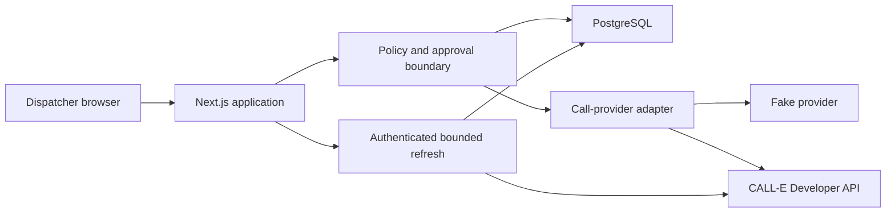

# FieldClose Technology Selection

## Decision status

- Status: Accepted for the hackathon MVP
- Decision date: 2026-07-28
- Product form: Web application
- Implementation status: MVP implemented; fake-only public and protected
  staging verified
- Live-integration status: One authorized local CALL-E attempt reached the intended participant and completed a conversation; structured answer capture was inaccurate, and protected-staging execution remains unverified
- Review trigger: Revisit only if the CALL-E integration spike, hosting spike, or security controls fail

This document records the implementation stack and operational shape selected
for FieldClose. The public fake-only deployment and the authorized local CALL-E
evidence are verified separately. The live run reached the intended participant
and completed a conversation, but the structured result incorrectly treated a
Sonetel forwarding announcement in the connection path as terminal. FieldClose
stored every requested HVAC field as `not_asked` and routed the result to a
human. A dated operator correction records the successful contact
without rewriting the original machine artifacts. The run is evidence of a
successful conversation, but not of accurate structured answer capture or the
still-pending protected-staging deployment.

## Decision

FieldClose will be implemented as a TypeScript full-stack monolith:

```text
Next.js App Router + React + strict TypeScript
PostgreSQL + Drizzle ORM
Zod application contracts
Official @call-e/calle server SDK
Vitest + Playwright
Vercel Node runtime + Neon PostgreSQL
```

The application will have two call-provider implementations behind one server-only boundary:

- `FakeCallProvider`, which is the default for development, automated tests, and the public demo;
- `CalleCallProvider`, which can be enabled only in a separately protected environment.

The MVP will not introduce a Python service, Redis, a general-purpose job queue, a message broker, or microservices.

## Decision summary

| Area | Selected technology or policy |
| --- | --- |
| Primary language | TypeScript with strict compiler settings |
| Runtime | Node.js 24 LTS, Node runtime only |
| Package manager | pnpm 11 with a committed lockfile |
| Web framework | Next.js 16 App Router |
| UI | React 19, Tailwind CSS 4, accessible headless primitives as needed |
| Application API | Next.js Route Handlers using explicit `POST` operations for side effects |
| CALL-E integration | `@call-e/calle@0.6.0`, server-side Developer API path |
| Persistence | PostgreSQL 17-compatible schema |
| Data access | Drizzle ORM and Drizzle Kit migrations |
| Runtime validation | Zod for application contracts; explicit restricted JSON Schema for CALL-E results |
| Authentication | `better-auth@1.6.25` with credentials, email OTP, optional GitHub OAuth, and server-side sessions |
| Result processing | Authenticated bounded server-side polling and reconciliation |
| Production hosts | Vercel for the application; Neon for managed PostgreSQL |
| Unit and integration tests | Vitest, with real PostgreSQL integration tests |
| Browser tests | Playwright |
| Logging | Structured, allow-listed, redacted server logs |

## Product and delivery constraints

The stack must preserve the product boundary defined in [Product Specification](product-spec.md): FieldClose is a human-approved commercial HVAC closeout workflow, not a general outbound-call dashboard.

The implementation must support:

- a polished web flow that can be understood in a three-minute demonstration;
- one exact human approval for one exact call attempt;
- durable case, approval, attempt, idempotency, result, and audit records;
- server-side credentials, policy checks, and provider calls;
- deterministic fake behavior without CALL-E credentials;
- a separately enabled live-call path;
- authenticated bounded polling and idempotent terminal-result ingestion;
- reconciliation after an ambiguous external side effect;
- IANA timezone and calling-window checks;
- authenticated state-changing operator actions;
- a public demo that cannot place real calls;
- automated type, unit, integration, browser, and production-build validation;
- a focused upstream contribution under `apps/web/fieldclose/`.

## Evidence behind the decision

### Official CALL-E integration fit

The selected runtime path is the CALL-E Developer API through the official TypeScript server SDK. CALL-E documents the SDK as a trusted-backend integration and warns against exposing the API key in browser or mobile code. FieldClose pins [`@call-e/calle@0.6.0`](https://www.npmjs.com/package/@call-e/calle).

The verified Developer API surface includes:

- `POST /v1/calls` to create an asynchronous call task;
- `GET /v1/calls/{call_id}` to retrieve status and results;
- `GET /v1/calls/{call_id}/events` to retrieve lifecycle events;
- a provider idempotency key;
- structured results using a restricted JSON Schema subset.

Primary references:

- [CALL-E SDK documentation](https://docs.heycall-e.com/sdks)
- [Calls API reference](https://docs.heycall-e.com/api-reference/calls)
- [Calls guide](https://docs.heycall-e.com/calls)
- [CALL-E integrations repository](https://github.com/CALLE-AI/call-e-integrations)

The current Developer API does not provide developer scheduling or cancellation operations. It also does not provide a browser SDK. Scheduling, if added later, must be owned by FieldClose and must delay provider creation until the approved execution time. The UI must not promise that an accepted live call can be canceled.

MCP, the CALL-E CLI, and the `calle` Agent Skill remain useful for local diagnostics and agent-driven demonstrations, but they are not the FieldClose web application's production runtime.

### Public participant research

The Devpost project gallery was not public when this decision was made, so the comparison is a biased sample of publicly indexed repositories and the seven open pull requests in [Awesome Phone Call Agents](https://github.com/CALLE-AI/awesome-phone-call-agents/pulls?q=is%3Apr+is%3Aopen). It must not be presented as a complete census.

The public sample included:

- [ProofMesh](https://github.com/fokrulanthro16-eng/proofmesh): Next.js, FastAPI, and PostgreSQL;
- [Attest](https://github.com/StephenSook/attest): React, FastAPI, and the Python CALL-E SDK;
- [Fonio](https://github.com/Kilanga/Fonio): Rails, PostgreSQL, Hotwire, and direct CALL-E REST integration;
- [FieldRelay](https://github.com/AtchayamG/FieldRelay): Ionic/Angular, NestJS, and PostgreSQL;
- [Waitlist Backfill](https://github.com/CALLE-AI/awesome-phone-call-agents/pull/34): Node.js, a small browser UI, and the official TypeScript SDK;
- [MedRoute](https://github.com/CALLE-AI/awesome-phone-call-agents/pull/32): Node.js, PostgreSQL, and the official TypeScript SDK;
- [Voxra](https://github.com/CALLE-AI/awesome-phone-call-agents/pull/11): Next.js, TypeScript, Redis, and MCP/OAuth.

JavaScript or TypeScript was present in every open PR reviewed. Backend choices varied, but mature web entries converged on server-side CALL-E use, explicit approval, fake or dry-run behavior, durable state, idempotency, polling or callbacks, and auditability. This supports a TypeScript web stack while showing that reliability, not framework novelty, is the useful differentiator.

## Candidate evaluation

Candidates were scored from 1 to 5 against the documented weights. The normalized total is out of 100. These scores are delivery judgments for this MVP, not general framework benchmarks.

| Criterion | Weight | TypeScript monolith | TypeScript + Python API | ASP.NET Core application |
| --- | ---: | ---: | ---: | ---: |
| Delivery speed | 20 | 5 | 3 | 3 |
| CALL-E integration fit | 20 | 5 | 4 | 3 |
| Side-effect correctness | 15 | 5 | 5 | 5 |
| Deployment simplicity | 15 | 4 | 3 | 4 |
| Testability | 10 | 5 | 4 | 5 |
| Product experience | 10 | 5 | 5 | 3 |
| Type and runtime safety | 5 | 5 | 3 | 4 |
| Upstream contribution fit | 5 | 5 | 4 | 3 |
| **Normalized total** | **100** | **97** | **77** | **74** |

The TypeScript monolith wins because the official TypeScript SDK is newer than the Python package, the browser and server can share one language, and a single application is faster to deploy and explain. PostgreSQL preserves the transactional correctness that live side effects require.

## Selected application architecture



### Browser boundary

The browser may request an operation, but it cannot assert approval validity, authorization, phone validity, calling-window compliance, live-mode state, idempotency, or provider state. Every state-changing route recalculates those decisions on the server.

Server Components may render reads. Mutations use explicit `POST` Route Handlers so side effects remain visible, testable, and auditable. No `GET` route may create a call or change business state.

### Server module boundaries

The repository should preserve these logical modules even when Next.js conventions affect physical paths:

```text
src/
├── app/                    # routes, layouts, Server Components, Route Handlers
├── components/             # reusable presentation components
├── application/            # use cases and transaction orchestration
├── domain/                 # states, policies, and provider-neutral contracts
├── providers/
│   ├── call-e/             # server-only SDK adapter and status lookup
│   └── fake/               # deterministic fake implementation
├── persistence/            # Drizzle schema, repositories, migrations
├── validation/             # Zod and CALL-E result schemas
└── observability/          # redaction and structured logging

tests/
├── unit/
├── integration/
├── contract/
└── e2e/
```

The provider, policy, normalization, persistence, secret, and cryptographic modules must import `server-only` and must never be included in Client Components.

## CALL-E runtime design

### Adapter capabilities

The provider adapter will expose only capabilities supported by the selected runtime:

```text
createCall(approvedAttempt) -> CreationOutcome
getCall(providerCallId) -> ProviderCallState
listCallEvents(providerCallId, cursor?) -> ProviderEventPage
reconcileAttempt(attempt) -> ReconciliationOutcome
```

`buildCallBrief` and approval preview generation are FieldClose application operations, not CALL-E operations. Cancellation and scheduling are represented as unsupported capabilities instead of no-op functions.

### Creation sequence

1. The operator reviews the exact recipient, disclosure, questions, and allowed context.
2. The server recalculates authorization, case version, canonical brief hash, E.164 format, IANA timezone, calling window, do-not-call state, and live switches.
3. One transaction creates the approval, attempt, stable idempotency key, and audit events.
4. The transaction commits before the external request; no database lock is held across CALL-E network I/O.
5. The server sends an explicit recipient in E.164 form, with `US` and `en-US` for the initial product scope. It never asks the provider to infer a number from free text.
6. The server persists the provider identifier immediately after acceptance.
7. A timeout or ambiguous response changes the attempt to `reconciliation_required` and freezes further call creation for the case.

The production HTTP path will use asynchronous creation and return promptly. It will not call `createAndWait` from a Route Handler.

### Status and result processing

FieldClose stores the raw CALL-E task status separately from its business interpretation. Only the documented task states are mapped directly. Outcomes such as no answer, voicemail, wrong person, refusal, or unresolved work must come from validated attempt or result data, not from guessed status transitions.

Authenticated bounded polling is the only result path. The active browser calls the FieldClose refresh route every five seconds; the browser never polls CALL-E directly. The server authenticates workspace access, atomically throttles lookups with `lastCheckedAt`, and performs provider network I/O outside the claim transaction.

Polling must:

1. query only an already accepted live attempt with a stored provider call ID;
2. never create, retry, or redial a call;
3. match the returned provider call ID;
4. keep nonterminal snapshots result-free;
5. validate and normalize terminal structured data;
6. persist terminal state, one result, follow-up work, and redacted audit events idempotently;
7. stop automatic checks after 600 seconds and create one explicit reconciliation task when the final lookup remains unresolved.

`result_validation_failed`, `structured_result: null`, malformed payloads, and unknown states route to `needs_attention`. They never imply that the HVAC work order can be closed.

## Persistence and transaction decisions

### Database

PostgreSQL is selected because FieldClose needs transactions, uniqueness constraints, partial indexes, durable audit records, and explicit reconciliation state. Local and integration-test environments use PostgreSQL rather than substituting SQLite, so concurrency and constraint behavior remain representative.

Drizzle ORM is selected for typed queries and inspectable SQL migrations. Domain decisions remain in application services rather than ORM hooks.

### Required database constraints

At minimum, migrations must enforce:

- unique `call_attempt.idempotency_key`;
- unique non-null `call_attempt.provider_call_id`;
- one approval for one `approved_attempt_id`;
- optimistic concurrency through `closeout_case.version`;
- valid enum or check-constraint values for critical state fields;
- foreign keys between cases, approvals, attempts, results, and audit events.

Repeated browser submissions return the existing attempt. A timeout never generates a new idempotency key. A new attempt always requires a new approval after the previous attempt has been reconciled.

### Sensitive fields

Managed-database encryption at rest is necessary but not sufficient for private recipient data. The application will store:

- an AES-256-GCM encrypted canonical E.164 value with a random nonce and key version;
- a separately keyed HMAC for equality checks where required;
- a masked presentation value;
- no raw phone number in normal logs, audit metadata, screenshots, or fixtures.

Encryption and HMAC keys are separate deployment secrets. Full transcripts and recordings are not stored by default. Only allow-listed structured evidence required for review and audit is retained.

## Runtime schemas and contracts

Zod validates browser input, application commands, database-to-domain boundaries where needed, sanitized provider facts, and API responses. TypeScript types are inferred from runtime schemas when practical; a compile-time interface alone is not accepted as boundary validation.

CALL-E structured results use an explicit JSON Schema that stays within the provider's supported subset. The schema must:

- use only documented object, primitive, enum, and simple-array features;
- set `additionalProperties: false`;
- make `unknown` or unavailable outcomes representable;
- avoid unsupported composition and recursive features;
- avoid provider-reserved field names;
- be checked by contract fixtures to prevent drift from the Zod normalization schema.

Provider summaries, evidence, and transcripts are untrusted text. They are rendered as text, never executable HTML, and are never treated as instructions to the application.

## Authentication and environment separation

Better Auth with email or username credentials and email OTP is selected for primary operator identity. GitHub OAuth remains a secondary developer and evaluator convenience. Sessions use secure, `HttpOnly`, `SameSite` cookies. Refresh, access, password, and OTP credentials are never stored in browser storage.

The authentication choice also reflects the same biased public sample used for the stack comparison:

- ProofMesh implements email/password accounts and workspaces;
- FieldRelay uses organization email/password plus a one-click evaluator session;
- Fonio gives technicians password or SMS-code access while its single-manager MVP uses shared Basic Auth;
- Voxra authenticates to the CALL-E Broker with OAuth rather than maintaining a separate business-user identity flow;
- MedRoute and Waitlist Backfill use operator tokens instead of customer accounts.

No inspected sample used GitHub as the primary login for ordinary business operators. This supports making standard credentials and email codes prominent for FieldClose's HVAC audience while keeping CALL-E authorization separate from product identity.

Two deployments have intentionally different capabilities:

| Environment | Access | Provider | Live credentials |
| --- | --- | --- | --- |
| Public demo | Any authenticated user receives an isolated demo workspace; anonymous users see the sign-in experience | Fake only | Absent |
| Protected live/staging | Allow-listed operator identities only | Fake by default; CALL-E only after explicit approval | Required only in protected server secret storage; configuration is not publicly verifiable |

A live call requires both:

- `FIELDCLOSE_LIVE_CALLS_ENABLED=true` in the protected server environment;
- a database-backed kill switch that is not paused.

Both default to blocking live creation. Neither can be enabled from ordinary browser state. The public demo deployment is built without CALL-E credentials and cannot become live through a UI action.

## Hosting and operations

### Current deployment evidence and target protected topology

- The public demo is browser-visible at its HTTPS URL and exposes a fake-only
  boundary. The absence of a CALL-E credential is additionally enforced by the
  public build-time configuration check in this tree.
- The protected target is a separate application environment with separate data
  and server-side CALL-E and authentication-email secrets.
- Protected deployment, isolation, production authentication, and CALL-E/SMTP
  statements have maintainer-reported private operational evidence only. No
  inaccessible deployment revision is cited as public provenance.

### Supported managed topology

- Vercel runs the Next.js application on the Node runtime, not the Edge runtime.
- Neon provides managed PostgreSQL with a pooled connection string.
- Vercel stores application, auth, encryption, and protected CALL-E secrets.
- The public demo and protected live/staging environment are separate Vercel projects.

The MVP does not require a continuously running worker. Bounded polling happens only during active views or explicit reconciliation. If unattended scheduled reconciliation becomes necessary, it must use database-backed due work and a hosted scheduler. It must not use an in-process interval.

### Required environment variables

Names may be refined during scaffolding, but the capability split is fixed:

```text
DATABASE_URL
FIELDCLOSE_PUBLIC_BASE_URL
BETTER_AUTH_SECRET
BETTER_AUTH_URL
SMTP_HOST
SMTP_PORT
SMTP_USERNAME
SMTP_PASSWORD
SMTP_FROM
SMTP_USE_TLS
SMTP_USE_SSL
RESEND_API_KEY
FIELDCLOSE_AUTH_EMAIL_FROM
GITHUB_CLIENT_ID
GITHUB_CLIENT_SECRET
FIELDCLOSE_DEMO_MODE=true
FIELDCLOSE_DATA_KEY
FIELDCLOSE_LOOKUP_KEY
CALL_E_API_KEY
CALL_E_BASE_URL
FIELDCLOSE_LIVE_CALLS_ENABLED=false
```

A non-loopback production `DATABASE_URL` must include
`sslmode=verify-full`. Runtime configuration rejects weaker modes, and the
postgres.js client explicitly uses certificate-verified TLS for every remote
database connection.

Secrets must be absent from committed `.env` files. `.env.example` contains names and safe explanations only.

### Logging

Logs use structured event names, internal case and attempt identifiers, coded outcomes, timing, and redacted errors. They exclude credentials, complete private phone numbers, unrestricted work-order notes, provider response bodies, recordings, and full transcripts.

## Testing strategy

### Unit tests

Vitest covers:

- state transitions;
- approval invalidation and canonical brief hashing;
- calling-window behavior, including daylight-saving boundaries;
- E.164 validation and masking;
- result normalization;
- provider-status mapping;
- redaction;
- kill-switch and authorization policy.

### Integration tests

Integration tests run against PostgreSQL and the fake provider. They cover:

- credential registration, hashed email verification, username login, email-code login, and one-time OTP consumption;
- concurrent duplicate submissions;
- transaction and uniqueness behavior;
- creation timeout followed by reconciliation;
- concurrent refresh throttling and terminal-result idempotency;
- provider call ID mismatch, lookup timeout, and late terminal recovery;
- malformed or null structured results;
- refusal, wrong-person, no-answer, voicemail, partial-answer, and do-not-call paths.

### Browser tests

Playwright covers the dispatcher journey from case creation through approval,
fake call progress, normalized result review, role-gated human disposition,
resolved task, final FieldClose case state, and audit evidence. Browser tests
are structurally unable to select the live provider.

### Live verification

Live verification is a separate, opt-in smoke test. It requires an authorized test number, visible confirmation, the protected environment, and dedicated environment flags. It is never part of `pnpm test` or CI.

## Exact initial versions

Versions were observed from official release pages or package registries on 2026-07-28. Application packages will initially be pinned exactly and recorded in `pnpm-lock.yaml`.

| Component | Selected version | Policy |
| --- | --- | --- |
| Node.js | 24.x LTS; 24.18.0 baseline | Pin the major in `engines` and the development patch in the version-manager file |
| pnpm | 11.17.0 | Pin through the `packageManager` field |
| Next.js | 16.2.12 | Exact initial pin |
| React / React DOM | 19.2.8 | Exact initial pin |
| TypeScript | 5.9.3 | Exact initial pin; defer newer compiler majors until ecosystem validation |
| Tailwind CSS | 4.3.3 | Exact initial pin |
| `@tailwindcss/postcss` | 4.3.3 | Keep aligned with Tailwind CSS |
| `@call-e/calle` | 0.6.0 | Exact pin; upgrade only after contract and live smoke tests |
| Zod | 4.4.3 | Exact initial pin |
| Drizzle ORM | 0.45.2 | Exact initial pin |
| Drizzle Kit | 0.31.10 | Exact initial pin |
| postgres.js | 3.4.9 | Exact initial pin |
| Better Auth | 1.6.25 | Exact initial pin and compatibility smoke test |
| Vitest | 4.1.10 | Exact initial pin |
| Playwright | 1.62.0 | Exact initial pin with browser artifacts installed in CI |
| ESLint | 9.39.5 | Exact initial pin; matches the React plugin range used by Next.js 16.2.12 |

Node.js 24 is an LTS line according to the [official Node.js release table](https://nodejs.org/en/about/previous-releases). Next.js 16 requires Node.js 20.9 or newer; Node.js 24 satisfies that baseline. See the [Next.js 16 upgrade guide](https://nextjs.org/docs/app/guides/upgrading/version-16).

TypeScript 7 was the newest registry major on the decision date, while the official Next.js 16.2 scaffold still selected the TypeScript 5 line. The MVP therefore selects [TypeScript 5.9.3](https://www.npmjs.com/package/typescript/v/5.9.3) to reduce avoidable compiler, lint, and test-tool migration risk. This is a bounded delivery choice, not a claim that newer TypeScript versions are unsuitable.

## Required project scripts

The scaffold must expose these stable commands:

```text
pnpm dev
pnpm typecheck
pnpm lint
pnpm test
pnpm test:integration
pnpm test:e2e
pnpm build
pnpm validate
pnpm test:live:smoke
```

`pnpm validate` runs type-checking, linting, non-live tests, and the production build. `pnpm test:live:smoke` is isolated, guarded, never run by default, and must fail closed when explicit live-test prerequisites are absent.

## Alternatives considered

### TypeScript client plus FastAPI service

Rejected for the MVP because it adds a second runtime, deployment, contract boundary, logging surface, and test matrix without a compensating CALL-E advantage. The Python package is older and currently synchronous. A thin Python worker remains a future option only if a required provider capability becomes Python-only.

### ASP.NET Core

Rejected for the MVP because CALL-E does not currently publish an official .NET SDK. ASP.NET Core would provide strong policy and persistence primitives, but the custom provider adapter and mixed contribution ecosystem would slow this particular hackathon delivery.

### MCP, CLI, or Agent Skill as the web runtime

Rejected because these surfaces are oriented toward interactive agent hosts and user OAuth. They do not replace a durable multi-user application backend with project credentials, database transactions, authenticated provider lookup, and auditable approval state.

### Redis and a background job system

Deferred because the first release has no automatic retries or scheduled calls. PostgreSQL, bounded polling, and explicit reconciliation cover the MVP lifecycle. Infrastructure may be added only after a measured requirement appears.

### SQLite for local development

Rejected because partial uniqueness, concurrency, transaction, and migration behavior must match production. PostgreSQL will be used in development, integration tests, and production.

## Main tradeoffs and mitigations

| Tradeoff or risk | Mitigation |
| --- | --- |
| Serverless functions do not provide a durable in-process worker | Use asynchronous create, persisted state, active-page bounded polling, and explicit reconciliation |
| The CALL-E SDK version is ahead of some documentation references | Pin `0.6.0`, use only documented operations, retain fixtures, and run an authorized smoke test before live enablement |
| A TypeScript monolith can blur browser/server boundaries | Use `server-only`, explicit application modules, Route Handlers, import constraints, and tests |
| Provider lookups may fail or remain nonterminal | Keep the accepted attempt locked, use persisted throttling and a 600-second bound, then require explicit reconciliation |
| Provider creation can succeed while the HTTP result is ambiguous | Commit the attempt first, keep one stable idempotency key, freeze new attempts, and reconcile |
| PostgreSQL and hosted auth add local setup | Provide Docker Compose for PostgreSQL, deterministic seeds, and a documented fake-only local path |
| Better Auth is an additional dependency | Pin the version and require a Next.js 16 session/OAuth compatibility spike before feature work |
| Public access could be abused | Public deployment has no live credentials and forces isolated fake workspaces; live deployment is allow-listed |
| Sensitive contact data could leak through logs or fixtures | Encrypt canonical values, mask presentation data, centralize redaction, and prohibit raw transcripts by default |

## Implementation validation gates

Use these evidence gates in order and do not treat later live-workflow gates as
complete until their inspectable evidence exists:

1. Scaffold Next.js, strict TypeScript, pnpm, linting, testing, and production build scripts.
2. Prove a PostgreSQL migration and transactional unique idempotency constraint.
3. Prove Better Auth login, secure session cookies, demo isolation, and live allow-list behavior on Next.js 16.
4. Implement the fake provider and complete one browser happy path without any live credentials.
5. Confirm that the CALL-E Dashboard provides a project API key.
6. Prove server-only SDK import and asynchronous call creation against an authorized number.
7. Capture inspectable evidence for provider status, bounded refresh, structured result handling, and ambiguous response behavior.
8. Confirm the first demo jurisdiction, permitted calling window, data-retention period, deletion process, and incident owner.

A failed spike may reopen only the affected decision. It does not authorize weakening the approval, idempotency, privacy, or live-call safety requirements.

## Documentation follow-up

This decision is reflected in [Architecture](architecture.md) through the
following boundaries:

- identify local call-brief planning as an application operation rather than a CALL-E operation;
- mark provider cancellation and scheduling as unsupported;
- replace speculative ringing or connection mappings with documented raw CALL-E task states and separately validated outcomes;
- record the selected Next.js, PostgreSQL, adapter, polling, and hosting decisions.

The root README describes the implemented setup and validation behavior while
keeping deployment and live-provider claims explicit.
