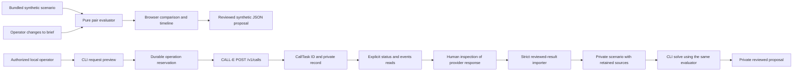

# Harvest Relay design

Harvest Relay answers one question: **do these independently reported storage and transport facts form a feasible full-lot handoff?** It is an operational planning prototype. It neither certifies food safety nor commits another party to a booking.

## Scope and architecture

The runnable product has two explicit paths:



The CLI provides the complete read → human review → ingest → solve path through the same evaluator. Its reviewed scenarios stay private; the public browser continues to use its bundled synthetic scenario. A successful API request, an API connection check, a completed telephone conversation, and a feasible handoff are different outcomes. A local JSON import does not independently authenticate its server origin.

| File | Responsibility |
| --- | --- |
| `web/scenario.json` | Fictional lot, provider facts, route durations, quotes, conversations, and fixed scenario time |
| `web/engine.js` | Dependency-free pure evaluator shared by browser and CLI demo |
| `web/app.js` | Fixture replay, brief controls, pair comparison, timeline, source inspection, reviewed JSON export |
| `web/index.html`, `web/styles.css` | Semantic page structure and responsive presentation |
| `src/calle.mjs` | Documented REST requests, request templates, private reservation and snapshot handling |
| `src/cli.mjs` | Explicit preview/create/read commands and local demo |
| `src/ingest.mjs` | Strict result validation, reviewed scenario reconstruction, provenance separation, and private output |
| `src/server.mjs` | Loopback static server, local preview, and read-only integration endpoints |
| `tests/` | Deterministic solver tests and no-call adapter/server tests |

There are no package dependencies, database, background worker, recurring calls, routing service, or live inventory integration. The provider handles telephone execution; the local application handles its own records.

## Scenario and solver contract

```js
evaluatePairs(scenario, overrides = {})
// => { pairs, feasible, best, lot }
```

`scenario` contains `now_min`, `lot`, `storages`, and `carriers`. Each provider needs a stable ID, confirmed status, capacity, temperature band, quoted price, and quote expiry. A storage supplies receiving start and cutoff; a carrier supplies pickup time and a per-storage route duration. Every time is a local minute count with the **same time origin**. The bundled scenario is a fixed, same-day rehearsal, not a live clock.

Permitted overrides are `quantity_kg`, `latest_arrival_min`, `budget_usd`, and `unavailable_storage_ids`. The original scenario remains unchanged. These are scenario explorations; selecting 650 kg does not retroactively change the original 900 kg conversation text or establish a real quote for a revised shipment.

Each result pair contains:

```text
id, storage_id, carrier_id, storage_name, carrier_name,
cost_usd, arrival_min, handoff_min, slack_min, feasible, reasons
```

Pair IDs are `storage--carrier`. Unknown calculated values are `null`. `reasons` are readable explanations. `feasible` is a sorted array of eligible pairs; `best` is its first item or `null`. Sort order is total cost, then earliest handoff, then stable pair ID.

### Eligibility rules

1. The lot quantity is a finite positive number; fractional kilograms are allowed. Requested temperature bounds must be finite and ordered. Deadline, current time, and budget must be valid.
2. Both provider results must be confirmed. A quote expires when `now_min >= valid_until_min`. An optional future `valid_from_min` is not yet valid. A quote must be current at evaluation; it is not assumed to be a reservation lasting until arrival.
3. Each provider must fit the **entire** lot. The solver does not divide loads or combine vehicle capacities.
4. Each provider's complete reported temperature band must be inside the operator's requested band. A matching band is not proof of temperature control in the field, product condition, or handling compliance.
5. Pickup cannot precede the evaluation time. A pickup at the current minute is allowed. Route duration must be explicitly known, finite, and nonnegative. Missing travel is never a zero-minute journey.
6. `arrival = pickup + travel`; `handoff = max(arrival, receiving start)`. The handoff must occur no later than both the receiving cutoff and the lot deadline. Waiting for a dock consumes deadline slack. Exact-boundary handoffs are allowed.
7. Transport plus 24-hour storage must fit the budget. Currency is USD in this prototype; prices use cent precision. Zero can be a known free price, but missing or malformed prices are rejected.
8. An unavailable storage cannot participate. Every pair remains visible, including rejected pairs.

Exhaustive enumeration is `O(storage count × carrier count)`. With three stores and two carriers, checking six pairs is more transparent than introducing a general optimization dependency. The pattern can be reused for other two-service handoffs, but multi-stop routing and split-load allocation are not implemented.

## Why the default answer is $310

The fictional lot is 900 kg and requires 0–4°C, arrival by 15:00, and at most $500. Evaluation time is 13:00.

| Candidate fact | Consequence |
| --- | --- |
| Orchard receives only until 14:00 | Swift's 14:25 arrival cannot use its $90 room |
| Hillcrest's reported band is 6–10°C | Both pairings violate the requested temperature range |
| Local Co-op Van holds 700 kg | It cannot carry the 900 kg lot |
| Swift holds 1,000 kg, departs at 13:35, needs 50 minutes to Riverside | Arrival is 14:25 |
| Riverside receives 14:00–16:00 and holds 1,000 kg at 0–4°C | The full lot fits within its receiving window |
| Swift costs $160; Riverside costs $150 | The combined proposal is $310 with 35 minutes of deadline slack |

At 650 kg, the local van can carry the entire lot and reach Orchard at 13:45 for $190. At 900 kg with a 14:00 deadline, none of the six pairs qualifies. These are fixture outcomes, not measured delivery results.

## Runtime call lifecycle

The request builder selects a known provider label and constructs one recipient with one explicitly supplied E.164 destination. Synthetic provenance adds a role-play disclosure to the task. The task asks for permission to continue, operational facts, service date/timezone, and read-backs; it prohibits bookings, payment commitments, and safety judgments.

Numeric result fields are optional so unknown facts can remain absent. `availability` is `yes`, `no`, or `unknown`. `evidence` may be a quote or faithful paraphrase. This current schema does not itself prove consent, authority, exact transcript support, or a completed read-back.

Before a real create request, an exclusive private file reserves the operation ID. The record contains the request, idempotency key, creation time, and state. States are `reserved`, `accepted`, `rejected`, or `unknown`. Acceptance adds the returned CallTask ID; status and event reads create separate timestamped snapshots. Repeating an already reserved operation is rejected locally.

A create timeout is not a failed phone call. CALL-E may already have accepted the task. The reservation is retained, and the CLI does not automatically resend. If acceptance succeeded but saving the updated record failed, the returned error includes the CallTask ID so the operator can retain it and reconcile. This is a local duplicate guard, not a claim of provider-wide exactly-once execution.

The HTTP client uses a fixed HTTPS API origin, bearer credentials, request deadlines, redirect rejection, bounded error messages, and a stable idempotency key. Tests inject a fake `fetch`; they do not call a remote number.

## Reviewed result ingestion

`ingestCallResult(scenario, call, { providerType, providerId, reviewed })` accepts a raw completed Calls API task only after an explicit review acknowledgment. `prepareReviewedScenario(scenario)` reconstructs a scenario from retained original calls before every later import and CLI solve. Both functions are pure; private file writing is separate.

The operator must supply a valid service date, IANA timezone, same-day minute values, lot requirements, and unique provider identity lists. The importer validates the CallTask shape, completed task/recipient state, terminal attempts and transcript shape, expected provider metadata, and the extraction schema. The service date and normalized timezone must match the context. An affirmative quote requires complete critical facts and a completed attempt containing a recipient transcript. Unknown/no answers remain unconfirmed, and missing carrier routes remain absent.

Every initial provider is reduced to identity plus unknown status. No fixture price, capacity, window, or source text survives unless a reviewed source call supplies it. Imported providers retain the original `source_call`; derived facts are reconstructed from that original JSON on later evaluation. This prevents manual edits to derived quote fields from being treated as source evidence, but cannot independently detect fabricated or edited source JSON.

Synthetic-source or explicitly TEST calls remain `evidence_mode: test`; they cannot be combined with operator-supplied evidence in one scenario. Other imports remain operator-reviewed, not independently authenticated-live records. The operator reviews consent, authority, transcript support, and whether the answer applies to the stated lot. Automated schema checks do not replace that semantic review.

The CLI saves each reviewed scenario to a new private JSON file under `runtime/`, refusing overwrites and path escapes. `solve --scenario` revalidates retained source records and runs `evaluatePairs`; expired or operationally incompatible quotes remain visible and are rejected by the solver. The included offline integration test exercises two official-shaped TEST imports followed by the same $310 Riverside/Swift result. That test is not evidence of a real call.

## Review and evidence

The public page consumes only its bundled fixture. Its illustrative API panel is separate from the exact adapter-generated request. On localhost, **Check local adapter** requests health and a preview; a successful check means request generation worked, not that CALL-E authenticated or a phone connected.

The browser export requires a completed rehearsal, a feasible pair, and an explicit acknowledgment. Every brief change clears that acknowledgment. The export carries all pairs and fictional source evidence, preserving the scope of what the user actually reviewed. It is not sent to any carrier or warehouse.

Credentials and runtime records live outside the static web root. Real requests, provider results, and CLI output may contain private phone numbers or transcripts; the adapter's credential redaction is not general personal-data anonymization. The server has no HTTP create-call route and the CLI has no cancel-call route. Stopping the local process cannot revoke a remotely accepted task.

## Remaining work and limits

- Complete a consented live pilot and publish only deliberately reviewed evidence. No completed live call, real shipment, user adoption, or measured food rescued is claimed here.
- Add an authenticated retrieval-to-review interface and a browser view for explicitly selected reviewed scenarios. The CLI importer already validates date/timezone and source shapes; consent, identity, semantic transcript support, and source authenticity still need human review and further verification.
- Preserve actual transcript spans for critical claims and distinguish quotes from paraphrases. The present fixture viewer and request prompt do not independently verify extraction accuracy.
- Extend beyond one local service day to multiple dates, cross-midnight routes, quote revisions, realistic loading/traffic uncertainty, and different price units. Current imports require an explicit matching date/timezone; route durations remain supplied facts, with no live traffic model.
- Evaluate with coordinators before adding allocation, multi-stop routes, or commitments. A domain expert must decide temperature requirements, product handling, and any food-safety action.

See the [README](README.md) for exact commands, test scope, upstream references, and license attribution.
