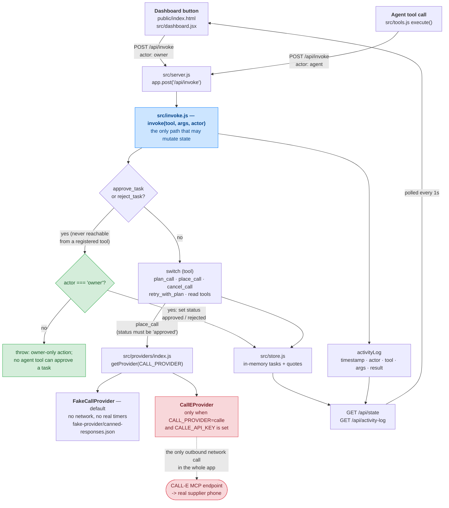
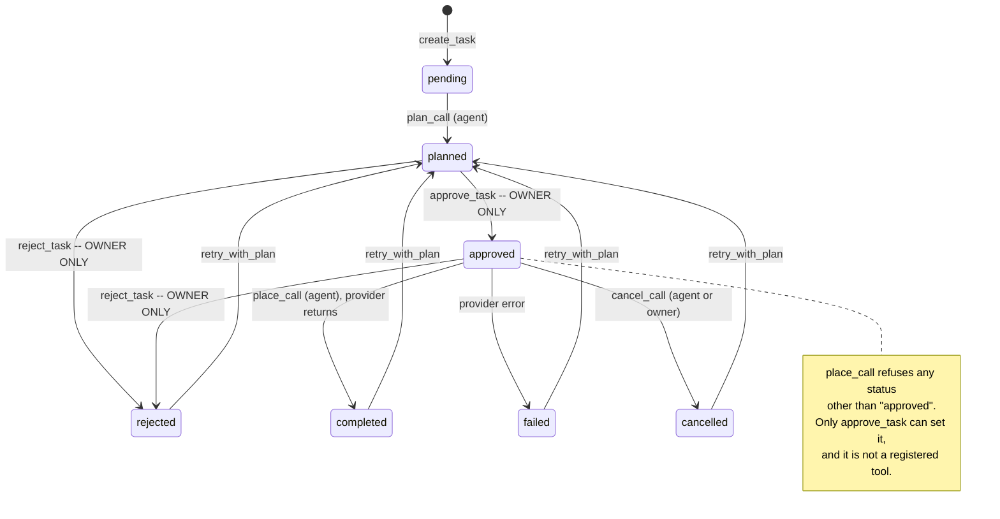

# Architecture

Supplier Quote Agent — how an agent and a human end up driving the same code.

Two rendered copies of these diagrams are checked in for submission forms that want an
image rather than a code fence:

- [`architecture.svg`](architecture.svg) — the request path below
- [`task-lifecycle.svg`](task-lifecycle.svg) — the task state machine below

## The one idea

A procurement agent can plan a call, dial a supplier, cancel a call in flight, and
re-plan a failed one. It cannot approve one. Approval is a button a person presses, and
the code is arranged so that no amount of clever tool use gets around it.

That constraint is not a policy note in a prompt — it is three independent mechanisms in
the code, and `tests/approval-gate.test.js` asserts each one separately.

## Request path

Both callers — the dashboard's buttons and the agent's tool calls — reach the same
Express route, which calls the same `invoke()` function with a different `actor` string.
There is no second code path for the agent.

Reading it as code:

| Box | Where |
|---|---|
| `POST /api/invoke` | `src/server.js` — the one mutating route |
| `invoke(tool, args, actor)` | `src/invoke.js` — a single `switch`; every case ends in a `store` call and an `activityLog.log()` |
| owner check | `src/invoke.js` `approveTask()` / `rejectTask()` — `if (actor !== 'owner') throw` |
| tool registry | `src/tools.js` — every tool's `execute()` body is `return await invoke(name, input, actor)` and nothing else |
| provider choice | `src/providers/index.js` `getProvider()`, read from `CALL_PROVIDER` at call time |

Because each tool's `execute()` is a one-line delegation, a tool physically cannot reach
the store without passing the same guards the dashboard passes.

## Task lifecycle

The load-bearing detail is the retry edge. `retry_with_plan` returns a task to
**`planned`**, never to `approved` — so a task that has already been dialed once still
needs a fresh human approval before it can be dialed again. A single approval does not
become a standing licence to keep calling.

## The three layers of the approval gate

Any one of these alone would be a convention. Together they are a mechanism.

**1. `approve_task` and `reject_task` are not tools.**
They exist only as cases inside `src/invoke.js`'s `switch`. `src/tools.js` exports an
array that does not contain them, so neither `getAllTools()` nor `GET /api/tools` can
surface them to a model doing tool discovery. `tests/approval-gate.test.js` pins the
registry to an exact allow-list and separately asserts that no registered tool matches
approve/reject "under any spelling".

**2. They refuse any actor but the owner.**
Even called directly on `invoke()` — bypassing the registry entirely — both throw unless
`actor === 'owner'`. This is defence in depth for the case where something in future
reaches `invoke()` without going through `tools.js`.

**3. The generic write path is closed too.**
`update_task` takes a free-form `updates` object, which would otherwise be an obvious way
around layers 1 and 2. `invoke.js` refuses it if it tries to set `status` to `"approved"`
or `"rejected"`, and names the right action in the error.

On top of those, `place_call` refuses to dial a task whose status is not `approved`, and
its refusal tells the caller what to do instead rather than failing blankly:

> `Task task_1 must be approved by the owner before calling (status: "planned"). Ask the owner to approve it from the dashboard — no tool call can approve a task.`

## Where a real call could happen

Exactly one place: `CallEProvider.placeCall()` in `src/providers/calle-provider.js`, and
only when `CALL_PROVIDER=calle` **and** `CALLE_API_KEY` is set. Everything else in the
app — every test, the default `npm start`, the whole demo — runs on `FakeCallProvider`,
which reads canned outcomes from `fake-provider/canned-responses.json` and never opens a
socket.

`CallEProvider` takes its `fetchImpl` by injection, which is why its request shape and
response parsing can be unit-tested against `tests/fixtures/calle-responses.json` with no
network at all. No test ever constructs it with the real `fetch`.

## Deliberate limits

- **State is in memory.** `src/store.js` is a module-level object. Restarting the server
  resets to the seeded task and quote. There is no database, and quotes do not survive a
  restart — fine for a demo, not a production procurement system.
- **The dashboard is duplicated by hand.** `public/index.html` is what `npm start`
  actually serves (`React.createElement` calls, loaded from a CDN, no build step);
  `src/dashboard.jsx` is the same component tree in readable JSX. There is no bundler
  wiring the JSX file in, so the two are kept in sync manually.
- **`request_human_approval` only gathers.** It returns the top quotes for a person to
  look at. It does not approve anything — the name is inherited from the original spec,
  and its description says so explicitly.
- **The activity log is unbounded.** It grows for the life of the process.
