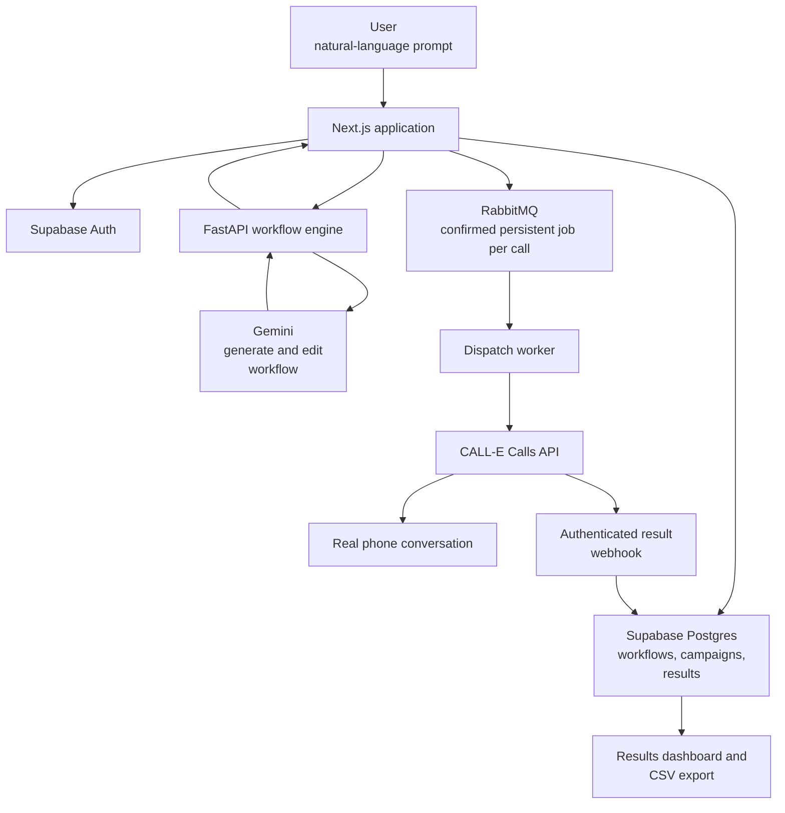
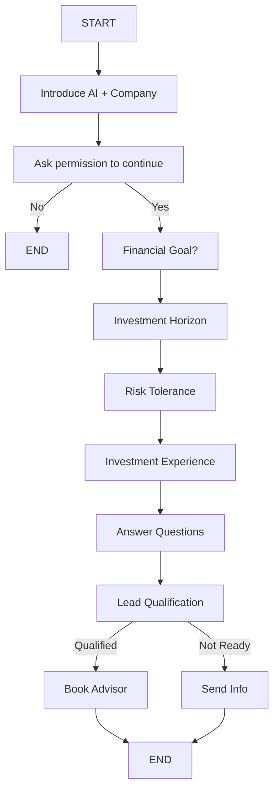
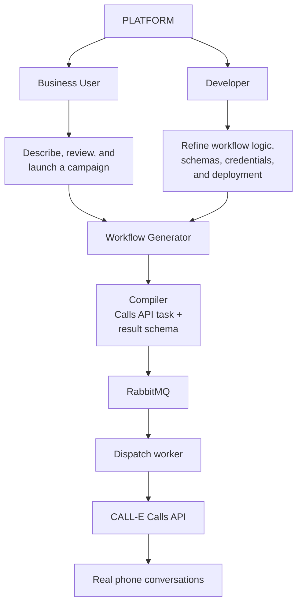

<div align="center" style="text-align: center;">
  
</div>

# Veyra

Describe an outbound calling process in plain English and voila, Veyra turns it into an editable, reusable phone workflow, and CALL-E executes it through real conversations.

**Links:** [Live app](https://veyra-workflow.vercel.app) · [Source](https://github.com/srijan399/veyra)

**Companion skill:** [`veyra-campaign-planner`](../../../skills/veyra-campaign-planner/)

**Built with:** CALL-E · Next.js 16 · TypeScript · FastAPI · Gemini · Supabase · RabbitMQ · Drizzle ORM · Tailwind CSS · React 19

## The Problem

Businesses that rely on high-volume, repetitive outbound calling such as **sales qualification**, **appointment confirmation**, **renewal reminders** must either hire large teams to run scripts manually or ask engineers to build voice-agent logic for every campaign.

Both are **slow** and **do not scale well**:

- Manual call teams are **expensive**, **inconsistent**, and **difficult** to **scale** quickly.
- Hand-built voice agents **require an AI engineer** to translate each process into prompts, conversation states, and branching logic and repeat that work whenever it changes.

There is no direct path from **_“here is our calling process”_** to a **working, structured, deployable voice workflow.**

## Our Proposed Solution

Veyra is a **workflow generation** **and orchestration** layer built on CALL-E which forms the crux of the system.

A business user describes a calling process in natural language.

**Veyra** generates a **structured, editable and re-usable** conversation workflow with _nodes, branches, qualification logic, and data capture_, then compiles it into a CALL-E **Calls API task and result schema**.

A developer or non-technical operator can **refine the workflow**, add contacts manually or drop in a CSV, **approve the exact campaign**, and launch it through CALL-E. Completed calls return structured outcomes and transcripts to Veyra's results dashboard.

Past campaigns can be cloned into new drafts, allowing teams to reuse the same workflow and contacts while requiring a fresh preview and approval.

CALL-E does not execute an external branching graph so Veyra flattens the graph at compile time into a natural-language task and result schema.

The **workflow graph** is Veyra's own **authoring and editing abstraction**.

### The ideal customer profile

Industry agnostic sales and operations teams that run repetitive outbound campaigns and need structured, actionable outcomes from every conversation.

## Setup

Requires Node.js 20.9+, Python 3.11+, Supabase, and a Gemini API key. RabbitMQ and CALL-E credentials are needed only for live calls.

```bash
corepack enable
corepack prepare pnpm@11.23.0 --activate
pnpm install
cp engine/.env.example engine/.env
cp web/.env.example web/.env.local
```

Set `GEMINI_API_KEY` in `engine/.env`. In `web/.env.local`, set `DATABASE_URL`, the two `NEXT_PUBLIC_SUPABASE_*` values, `ENGINE_URL=http://localhost:8008`, and matching `ENGINE_SHARED_SECRET` values if engine authentication is enabled. A remote engine must use HTTPS and its exact origin must be set in `ENGINE_ALLOWED_ORIGINS`. Keep the default fake-call settings:

```env
APP_URL=http://localhost:3000
CALL_MODE=fake
CALLE_LIVE_ENABLED=false
CAMPAIGN_SCHEDULING_ENABLED=false
```

Apply the database migrations, then start the engine and web app in separate terminals:

```bash
pnpm --dir web db:migrate
pnpm run:engine
pnpm run:web
```

Use the app to sign in, generate or edit a workflow, add contacts, preview and approve the campaign, launch it, and review the structured results.

Fake campaigns run inline and make no CALL-E or RabbitMQ request. Verify the no-call path with:

```bash
pnpm --dir web demo
```

For live calls, set these values on both the web deployment and worker, then run `pnpm --dir web worker`:

```env
CALL_MODE=live
CALLE_LIVE_ENABLED=true
CALLE_API_KEY=<CALL-E API key>
CALLE_BASE_URL=https://api.heycall-e.com
APP_URL=https://<public-web-app-domain>
CALLE_WEBHOOK_TOKEN=<at-least-32-random-characters>
RABBIT_MQ_URL=<RabbitMQ AMQP URL>
ENGINE_URL=https://<engine-domain>
ENGINE_ALLOWED_ORIGINS=https://<engine-domain>
```

`APP_URL` is the public Next.js URL that receives CALL-E webhooks. New accounts are `business_user`; use the Supabase SQL editor as an administrator to set an authorized profile's `role` to `live_operator` before it can view/export results or preview, launch, and schedule live calls. Only the signup trigger creates profiles, and authenticated users cannot edit their own role. Optional scheduling also requires `CAMPAIGN_SCHEDULING_ENABLED=true`, `CRON_SECRET`, and a frequent caller for `GET /api/cron/campaigns`. `render.yaml` deploys the engine; deploy the web app on Vercel and the long-running worker separately.

### Safety and stopping calls

- Fake mode is the default and cannot place a real call, even when a CALL-E key is present.
- Ordinary signups cannot spend live CALL-E credentials or access results in any mode; `live_operator` is an explicit administrator-controlled entitlement.
- Every live recipient must use E.164 format and be explicitly authorized as part of the exact campaign preview. Logs and previews mask phone numbers.
- CALL-E output is deeply sanitized before persistence and again before display or CSV export; raw tasks, transcripts, structured results, provider errors, and queue payloads are excluded from logs.
- A campaign can be claimed for launch only once, every call carries a stable idempotency key, and duplicate contacts are always rejected.
- Each queued call must atomically claim its reserved result row. A redelivery can never re-enter CALL-E while that row is already submitting or finished.
- An ambiguous CALL-E or RabbitMQ submission moves the campaign to `reconciliation_required`; not-yet-started contacts are durably canceled, and reruns and workflow deletion remain blocked until an operator reconciles the provider outcome.
- This reference app does not claim end-to-end exactly-once delivery: there is no transactional database-to-RabbitMQ outbox, so a process crash after reservation but before broker confirmation can leave visible `pending` rows that require operator reconciliation.
- Launching a live campaign queues real-world side effects: recipients may be called and CALL-E credits may be consumed. Veyra cannot cancel a call after the worker submits it.
- To stop future live submissions, stop the dispatch worker and set `CALL_MODE=fake` and `CALLE_LIVE_ENABLED=false` before restarting it. Stopping the worker pauses queued jobs; it does not delete them.
- Disable `CAMPAIGN_SCHEDULING_ENABLED` to stop scheduled campaigns from becoming newly due. Veyra never creates hidden recurring schedules and never automatically retries an uncertain provider submission.
- Generated medical, legal, financial, or emergency workflows require operator review. They must not diagnose, provide professional advice, replace emergency services, or make commitments outside the approved task.

## Our System Architecture in full flow



## Example Generated Workflow

The following wealth-management example shows the full transformation from business intent to a structured CALL-E request.

### Initial Prompt

Call people who requested information about our **wealth management services**, understand **their financial goals**, **risk tolerance** and **investment horizon**, answer basic questions, qualify them, and **book an advisor consultation for qualified leads**.

Veyra turns that request into an editable workflow such as:



The user can review the purpose of every generated node if you didn't follow the chart:

| Node               | Purpose                          |
| ------------------ | -------------------------------- |
| Introduction       | Establish identity and purpose   |
| Consent            | Confirm willingness to talk      |
| Financial Goals    | Understand primary objective     |
| Investment Horizon | Determine time horizon           |
| Risk Profile       | Understand risk tolerance        |
| Experience         | Determine investment familiarity |
| Questions          | Answer basic questions           |
| Qualification      | Score the lead                   |
| Conversion         | Offer advisor consultation       |
| Completion         | Capture outcome                  |

### What this compiles into

The graph above is not sent to CALL-E. At compile time it is flattened into a single Calls API request, one per contact:

```yaml
task:
  You are Ava calling on behalf of Northbridge Wealth. Introduce yourself as an AI
  assistant and reference the wealth management information Marta Reyes requested.
  Ask permission to continue. If they decline, offer to send information by email and
  end politely. If they agree, ask about their financial goal—retirement, wealth growth,
  tax planning, education, or another goal—followed by their investment horizon and
  risk tolerance. Answer basic questions about the service, but never give financial
  advice. If they qualify, offer to book an advisor consultation. If they are not ready,
  offer to send information.

result_schema:
  type: object
  additionalProperties: false
  properties:
    qualified:
      type: boolean
      description: Met the advisor threshold

    primary_goal:
      type: string
      enum:
        - retirement
        - wealth_growth
        - tax_planning
        - education
        - other

    horizon_years:
      type: number

    risk_profile:
      type: string
      enum:
        - cautious
        - balanced
        - growth

    slot_booked:
      type: boolean

    next_step:
      type: string
      enum:
        - book_advisor
        - send_info
        - retry
        - do_not_contact

metadata:
  campaignId: c_2f91
  contactId: ct_88a3

webhook_url: https://veyra.app/api/calle/webhook
```

The dispatch worker sends it with `Idempotency-Key: veyra_c_2f91_ct_88a3` to prevent double calling.

A developer can then ask Veyra to “add a question about approximate investable assets after risk tolerance,” and the platform updates the graph without requiring manual prompt or state-machine editing.

## Two Users, One Platform



- **Business user**
  describes intent in plain language, reviews and approves the generated workflow, launches campaigns, and reviews results.
- **Developer**
  refines workflow logic, schemas, call settings, and deployment while
  owning the reliability of live campaigns.

CALL-E remains the **developer-first execution layer**, while Veyra makes the **authoring and campaign experience accessible to non-technical operators**.

## Target Customers

### Priority Segments

**1. Sales and lead generation teams (Veyra's strongest initial market)**

- Wealth management firms
- Insurance companies
- Real estate companies
- Education institutes
- Automotive dealerships
- SaaS companies
- B2B service companies.

Typical workflow: import a lead list, call, qualify, answer questions, book a meeting, and export structured results.

**2. Customer operations and call centers**

Internal teams handling:

- appointment confirmations
- onboarding
- feedback collection
- renewal reminders
- document collection
- service follow-ups
- verification

Today, a manager writes a script, employees follow it, and results are entered manually. With Veyra, the manager describes the process, a workflow is generated, CALL-E makes the calls, and structured results appear in the dashboard.

**3. Agencies, BPOs, and outsourced call centers**

An agency running campaigns for many clients today needs a separate script or process for each client.

With Veyra, each client gets a reusable workflow and campaign without engineering a new voice agent each time. This makes the platform useful infrastructure for voice-call agencies.

**4. Financial services**

- Wealth managers
- Insurance companies
- Loan providers
- Financial advisory firms
- Fintech companies.

Use cases include lead qualification, insurance requirement collection, and loan pre-qualification.

The platform should remain within qualification, information collection, FAQs, and appointment booking and it should not provide financial advice.

**5. Automotive**

Dealerships can use Veyra for test-drive bookings, service reminders, lead qualification, vehicle-availability enquiries, and finance or insurance qualification.

### Segment Priority

| Customer            | Use case                               | Priority    |
| ------------------- | -------------------------------------- | ----------- |
| Sales teams         | Lead qualification                     | High        |
| Call centers / BPOs | Automated outbound campaigns           | High        |
| Financial services  | Advisor / insurance lead qualification | High        |
| Education           | Student qualification                  | Medium-high |
| Agencies            | Run campaigns for clients              | Medium-high |
| Automotive          | Leads, service, test drives            | Medium      |

## Business Model

Potential monetisation paths include:

- **Usage-based pricing**
  charge per generated workflow and campaign call or minute.
- **Seat-based pricing**
  teams pay per seat for workflow editing, campaign management, and analytics
