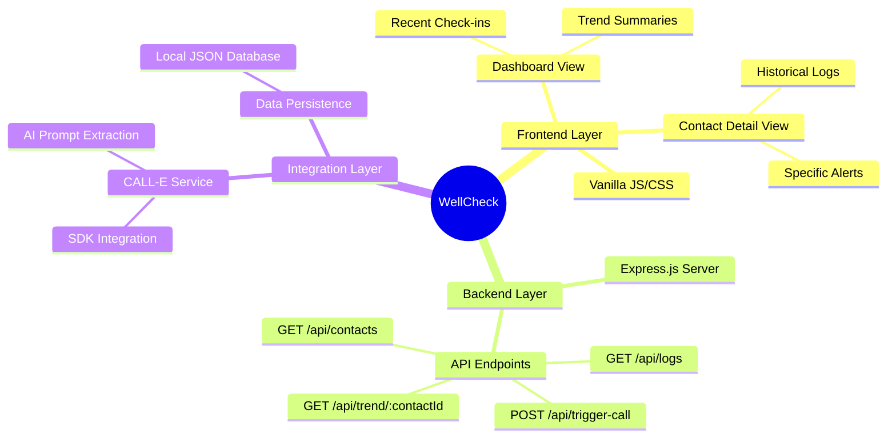

# WellCheck

WellCheck is a supplementary health and wellbeing monitoring application designed to provide automated, daily phone check-ins for elderly individuals or patients requiring regular monitoring. By leveraging the CALL-E SDK, the application conducts conversational check-ins, extracts vital health data, and presents actionable insights through a clean, accessible dashboard.


## Overview

The system automates the process of checking on individuals, focusing on key daily indicators such as medication adherence, meals, and general wellbeing. It aggregates this data into a centralized dashboard, allowing caretakers or family members to identify concerning trends rapidly and intervene if necessary.

## Features

*   **Automated Calling:** Integrates with the CALL-E SDK to initiate outbound voice calls.
*   **Intelligent Data Extraction:** Parses conversational data to extract structured health metrics (e.g., medication taken, food eaten).
*   **Real-time Dashboard:** A responsive, glassmorphism-inspired UI built with vanilla HTML/CSS/JS that displays recent check-ins and high-level statistics.
*   **Trend Analysis:** Automatically highlights concerning patterns, such as multiple consecutive days of skipped meals or missed medications.
*   **Contact Management:** Detailed contact views providing historical logs and specific concern alerts.

## Architecture



## Project Structure

```text
Well-Check/
├── public/
│   ├── assets/
│   │   ├── hero-add-contact.png
│   │   ├── hero-contact-detail.png
│   │   └── hero-home.png
│   ├── app.js               # Frontend logic for the main dashboard
│   ├── bg-office.png        # Dashboard ambient background
│   ├── contact.html         # Contact detail view
│   ├── contact.js           # Frontend logic for contact specific views
│   ├── index.html           # Main dashboard view
│   └── styles.css           # Global stylesheet
├── .env                     # Environment variables (Excluded from version control)
├── .gitignore               # Git ignore rules
├── calle-service.js         # Core integration with the CALL-E SDK
├── index.js                 # Express server entry point
├── package.json             # Node.js dependencies and scripts
└── README.md                # Project documentation
```

## Setup and Installation

1.  **Clone the repository:**
    ```bash
    git clone https://github.com/i-ayush-7/Well-Check.git
    cd Well-Check
    ```

2.  **Install dependencies:**
    ```bash
    npm install
    ```

3.  **Environment Configuration:**
    Create a `.env` file in the root directory and configure your CALL-E API key:
    ```env
    CALLE_API_KEY=your_api_key_here
    ```

4.  **Start the Server:**
    ```bash
    npm start
    ```
    The server will start on `http://localhost:3000`.

## Disclaimer

WellCheck is a supplementary tool designed to help users stay informed about the wellbeing of their contacts. It does not provide medical advice or diagnosis.

## License

This project is licensed under the MIT License. See the LICENSE file for more details.

## Demo Data
A sample database with curated demo check-ins is included. To populate your dashboard instantly, copy database.seed.json to database.json.
