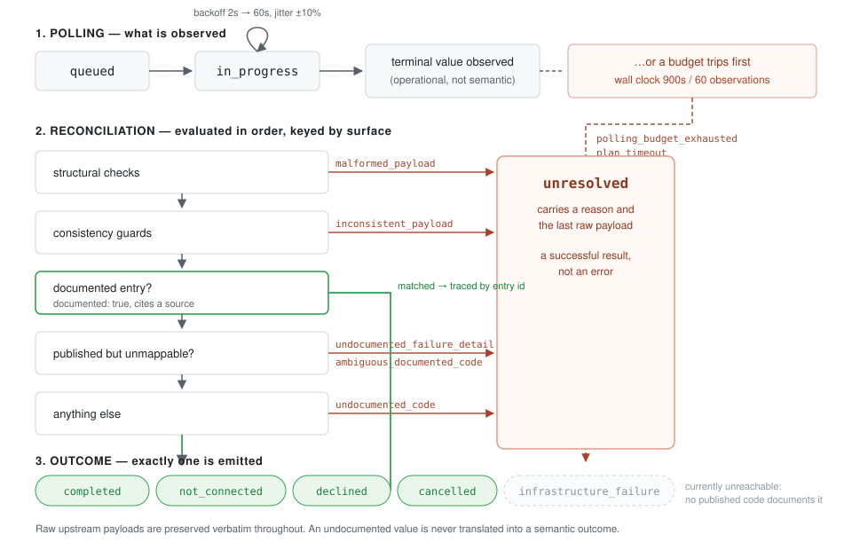

# Call Outcome Reconciler

Long-form guidance for the [`call-outcome-reconciler`](../../skills/call-outcome-reconciler/)
skill and its companion app,
[`apps/python/outcome-reconciler`](../../apps/python/outcome-reconciler/).

## The problem

A workflow built on CALL-E cannot always answer "how did this call end?"

* A call can stay in progress for days without a terminal state arriving, which
  blocks any webhook-driven or polling integration indefinitely.
* A failure that happens before media is established — zero duration, no audio,
  no transcript — can be reported as the callee declining. Infrastructure
  failure then looks identical to a person saying no, and automation acts on it:
  no retry, no escalation, a contact marked as refused.
* The Calls surface carries a `failure_code` field that is typed as a nullable
  string with no published enumeration, so failure detail cannot be interpreted.
* A request that times out leaves no documented recovery path.

The common thread is not that calls fail. It is that a workflow cannot tell the
difference between kinds of failure, and cannot tell "failed" from "not finished
yet".

## What this adds

A conservative client-side layer over CALL-E's public contract. It turns a call
reference into exactly one durable terminal outcome, and when the public
contract does not answer the question it says `unresolved` — with a
machine-readable reason and the raw upstream payload — instead of guessing.

Canonical outcome and result semantics remain defined upstream. This layer
asserts none of its own.

## How it decides

Polling observes upstream states until a terminal value appears or a budget
trips. Reconciliation then applies structural checks, consistency guards,
documented mapping entries, and published-but-unmappable values, in that order.
Anything that does not match a documented entry resolves to `unresolved`.

Two properties are worth drawing out:

**Terminality is operational, not semantic.** A value can end polling and still
have no published meaning. Polling stops; the outcome is `unresolved`.

**Guards fire before mapping.** A payload that contradicts itself is not
resolved even when an entry would otherwise match. A call reported as declined
that began and ended at the same instant, with no transcript, is the motivating
case: nothing in it evidences a person having heard the call and refused it.

Guards are written against fields that upstream actually sends. On the Calls
surface that means `completed_at` and the nested
`recipients[].attempts[].transcript_turns`, because the contract has no duration
field anywhere; a guard keyed on one would be inert against real data.

## Surfaces

A status value is only meaningful together with the surface it was read from.
The same word carries different vocabularies across surfaces, one published and
one not, so every observation and every mapping entry is keyed by surface and
matching never crosses between them.

| Surface | Documented upstream |
| --- | --- |
| `rest.calls` (`CallStatus`) | Yes, a five-value enum. |
| `rest.goal_runs` (`GoalRunStatus` + `GoalRunError.code`) | Yes: a five-value lifecycle enum and an eight-value failure enum. |
| `mcp.get_call_run` | No. |

On the Goal Runs surface the two published vocabularies are kept apart on
purpose. `GoalRunStatus` decides when to stop polling; `GoalRunError.code`
carries the meaning. An error code is not a lifecycle state, and treating it as
one would end polling on a value that never described where a run had got to.

Because the Goal Runs error vocabulary is the only place CALL-E publishes an
enumerated failure list, documented failure outcomes are reachable only from
that surface. That is not a limitation of this layer; it is a faithful reading
of what is currently published.

## Reading an unresolved result

`unresolved` is a successful result. It means the question was asked honestly
and the public contract does not answer it. The right responses are to reconcile
again later, route to a human, or record the call as unknown.

The wrong response is to coerce it into a semantic outcome. Automation that
treats `unresolved` as `completed` or as `declined` reintroduces exactly the
ambiguity the layer exists to remove.

## Further reading

* [Outcome contract](../../skills/call-outcome-reconciler/references/outcome-contract.md) — record shape and guarantees.
* [Mapping table](../../skills/call-outcome-reconciler/references/outcome-code-map.md) — structure, entries, how to update.
* [Polling policy](../../skills/call-outcome-reconciler/references/polling-policy.md) — budgets, backoff, credentials.
* [Safety](../../skills/call-outcome-reconciler/references/safety.md) — masking, credentials, handling records.
* [Examples](../../skills/call-outcome-reconciler/references/examples.md) — worked scenarios, all offline.
