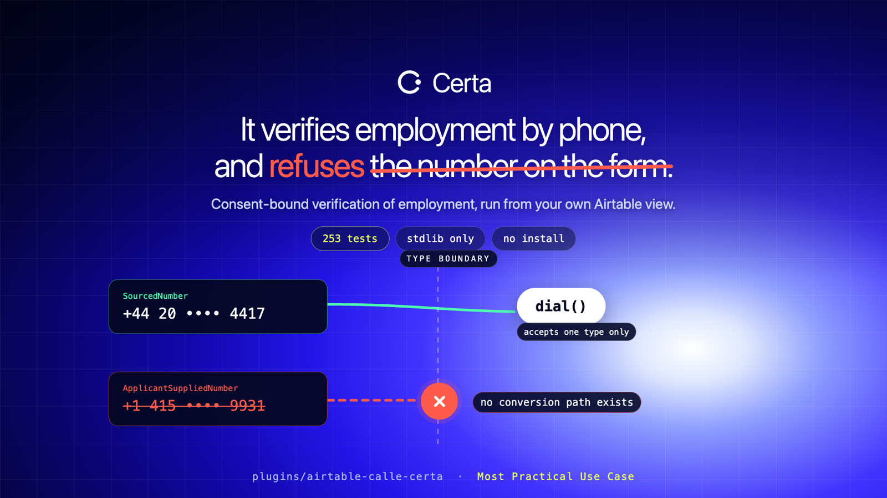
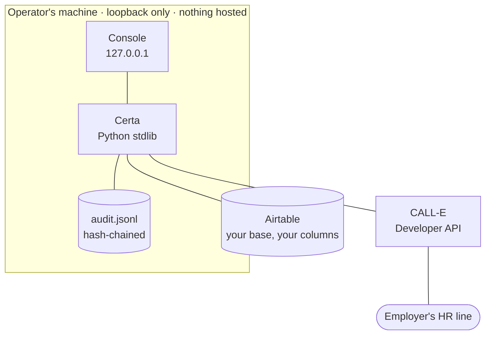
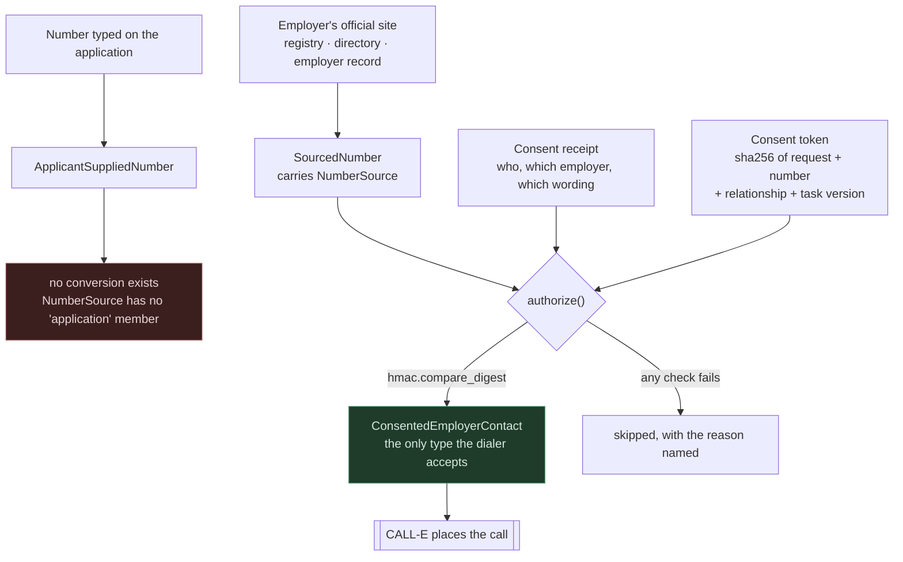
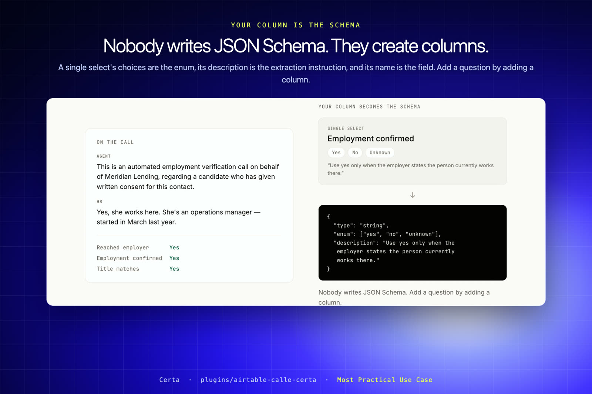
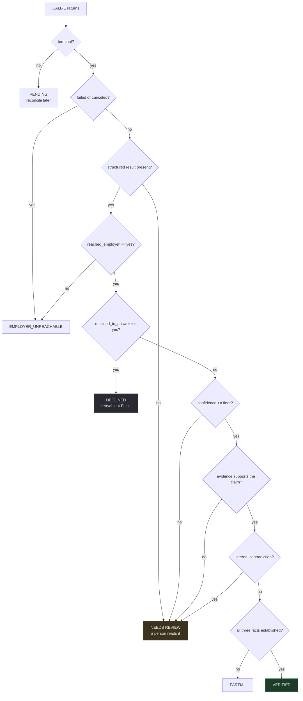
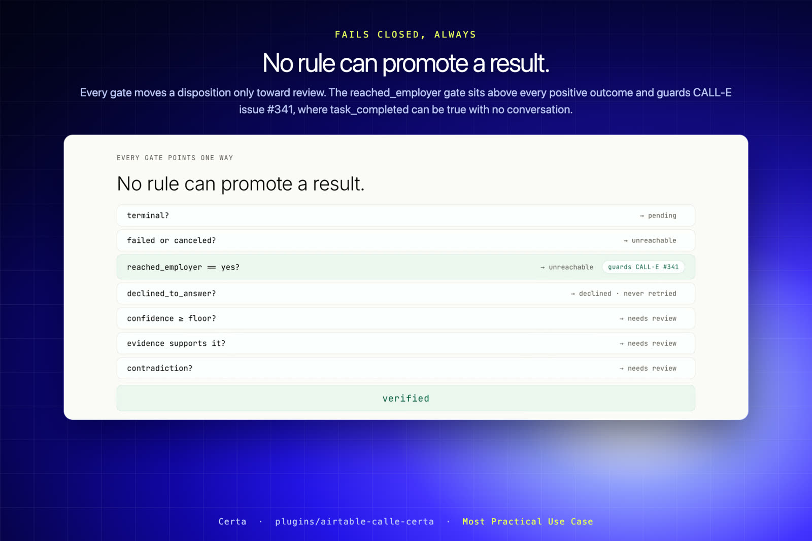
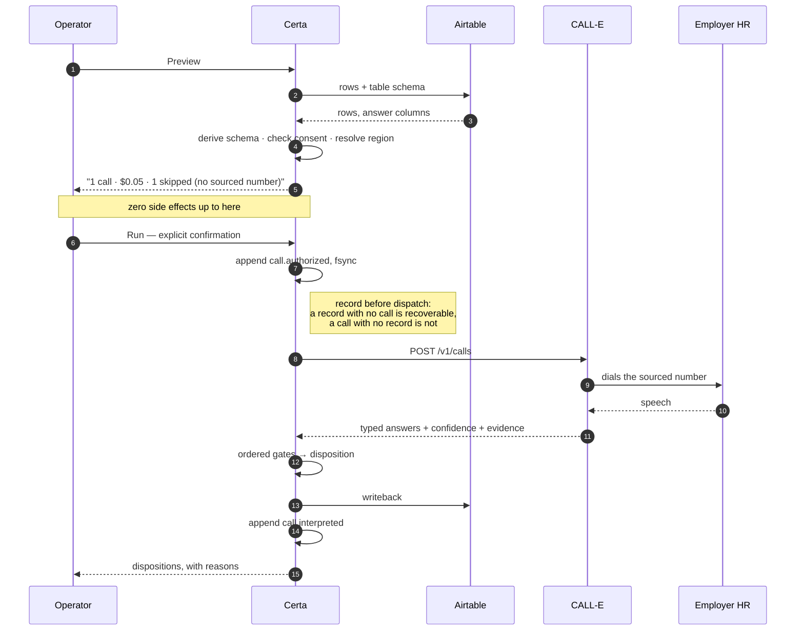
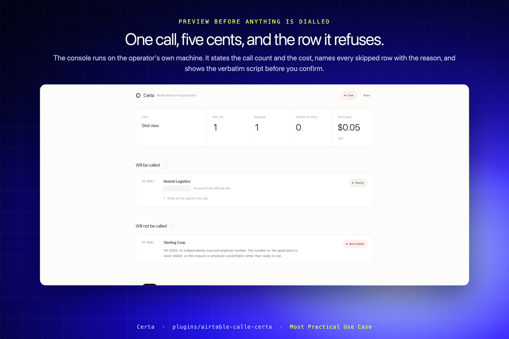

# Certa — consent-bound Verification of Employment

**Certa verifies someone's employment by phone: calling only employers the applicant consented to, never the phone number the applicant supplied, and returning a typed answer instead of a voicemail.**



**[Demo video](https://vimeo.com/1226396799)** &nbsp;·&nbsp; **[Landing page](https://sooryacodes.github.io/certa/)** &nbsp;·&nbsp; **[Pull request](https://github.com/CALLE-AI/awesome-phone-call-agents/pull/552)**

A workflow plugin for Airtable, built on the CALL-E Developer API. Submitted to the **Workflow Plugins** contribution area for *CALL-E: Your Code Is Calling*, targeting **Most Practical Use Case**.

**macOS** — double-click `Certa.command`
**Windows** — double-click `run.bat`
**Anywhere** — `./run.sh`

That is the whole setup. It opens the panel in your browser on **sample data**,
so the first thing you see is the product working — no account, no API key, no
environment variables, no install. Connect your own Airtable from the Setup
screen when you are ready; you never return to a terminal.

Python 3.11+, **standard library only**. No install, no build step, no lockfile.

---

## How it fits together

Certa is a connector, not a platform. It runs on the operator's own machine,
reads a table they already own, and hands CALL-E a task it is not allowed to
exceed. Nothing is hosted, and no data passes through a third party.



*Structure, not sequence — the order of operations is the sequence diagram further down.*

**Where the model is.** CALL-E's LLM does the speaking, the listening, and the
extraction. Certa runs no model at all. It decides what may be asked, who may
be called, and whether the answer counts — and those three decisions are
deterministic code, not a prompt. If Certa did the extraction, a hallucination
would become a verified employment record in a lending file.

| Concern | Decided by |
| --- | --- |
| Speaking, listening, understanding | CALL-E's model |
| Conversation into typed fields | CALL-E's model, against a schema Certa derives |
| What may be said at all | Certa — `tasks.py`, version-pinned into the consent token |
| Whether a result is trustworthy | Certa — ordered gates, no model |

**Two transports, one of them primary.** The REST Developer API is the product:
it is the only surface that accepts `result_schema` and
`recipient_result_schema`, which is what turns your columns into typed answers.
The MCP surface (`plan_call` → `run_call`) is a fallback for a network where
the REST host will not resolve; it takes no schema, so a call placed over it
returns a transcript and **can never read as verified** — `tests/test_mcp.py`
asserts exactly that. The console shows which transport is live.

---

## The problem

Every mortgage, most tenancy applications, much consumer lending and a large share of hiring require **Verification of Employment** — an independent confirmation that the employer, the job title and the dates on an application are real.

For large employers there is a database. Equifax's [The Work Number](https://theworknumber.com/) holds **823 million employee records from roughly 5 million employers**, and answers in seconds.

For everyone else there is a phone call. Coverage gaps are concentrated in small and mid-size businesses — [as the industry puts it](https://www.goodhire.com/resources/articles/the-work-number/), if an applicant works for a business with ten employees there is a good chance that employer is not in the database. And when the database misses:

> Someone contacts the employer by phone, fax, or email. **That process takes days or weeks and often fails entirely when the employer does not respond.**

That fallback is a paid product: Equifax sells [manual verification](https://developer.equifax.com/products/apiproducts/verification-employment-and-income) as a waterfall for exactly this case. Its implementation is a human on hold.

**And that is the United States, the one market with a large payroll database.** In the EU, UK, Canada, Australia, India, Southeast Asia and Latin America there is no equivalent, so verification is manual everywhere by default.

Global employment screening was **USD 5.3–8.0 billion in 2026**, heading to roughly **USD 13.7 billion by 2034**, with employment verification as a core segment ([Fortune Business Insights](https://www.fortunebusinessinsights.com/employment-screening-services-market-115476)).

### And the number on the form cannot be trusted

Half of mortgage fraud findings involve potentially fraudulent income or employment. Fake employers are not crude: investigators describe them as having *"legitimate phone numbers and automated call centers... legitimate addresses and call attendants... information on file with the Yellow Pages"* ([The Work Number](https://theworknumber.com/all-blogs/-/post/fakes-frauds-and-phonies-fraudulent-income-and-employment-data-in-mortgage-loan-applications-are-bad-for-the-industry-brokers-lenders-and-borrowers)). [Fannie Mae's red flags](https://singlefamily.fanniemae.com/mortgage-fraud-prevention) include "employer unable to be contacted", and guidance is to check the employer's name, address and phone **using multiple data sources** rather than a single search.

The employer phone number on an application is the one field a fraudulent applicant fully controls. The manual process calls it anyway.

**What is sourced and what is not.** The market figures, the coverage gap, the "days or weeks" description and the fraud characterisation are all cited above. Per-application call volumes and cost-per-verification are **not** published anywhere we could find, so this README makes no claim about them.

---

## Why CALL-E rather than a scripted dialer

- **An employer's verification line is a phone tree.** CALL-E navigates IVR with DTMF tones. A scripted dialer dies at the menu, which is the most common reason manual VOE fails.
- **The first person who answers is never the right one.** The call has to ask to be transferred and keep going.
- **Answers are hedged.** *"He left last month."* *"I can confirm she works here but not the salary."* That has to land in a typed field with an honest `unknown`.
- **Verification is multilingual outside the US**, and CALL-E covers 42 countries.
- **Latency is the whole problem**, and it comes from humans queueing calls one at a time.

---

## The two boundaries

Both are enforced by construction, not by policy a caller can forget.

### 1. Consent is not a checkbox

Ticking one cell and dragging it down a column is the most ordinary gesture in a spreadsheet, and it would authorise every row it touched. So consent is a token derived from the row's own content:

```
token = sha256(request_id | phone | relationship | task_spec_version | consent_receipt_id)
```

`authorize()` recomputes it from the row in front of it. A token copied from another row was derived from a different number and is refused. Editing the questions bumps `task_spec_version`, which invalidates every token gathered under the previous wording — **consent is revoked by construction when the purpose changes.**

Three regulators require this, in their own words:

| | |
|---|---|
| **US** | FCRA — a consumer report requires a permissible purpose; for employment purposes, written consent and disclosure |
| **EU/UK** | GDPR — contacting a third party about a data subject needs a lawful basis and purpose limitation |
| **India** | [RBI Guidelines on Digital Lending](https://rbidocs.rbi.org.in/rdocs/notification/PDFs/GUIDELINESDIGITALLENDINGD5C35A71D8124A0E92AEB940A7D25BB3.PDF) (2 Sep 2022) — data collection must be *"need-based and with prior and explicit consent of the borrower having audit trail"* |

### 2. The number on the application is never dialed

The dialer's only parameter type is a `ConsentedEmployerContact`, which carries a `SourcedNumber` — a number tagged with independent provenance. The number written on the application is an `ApplicantSuppliedNumber`, a separate type with **no conversion path**. `NumberSource` has no `application` member.

If no independent source exists, the request fails closed as **employer unverifiable** — itself a Fannie Mae red flag, not an error.



An applicant who lists a friend's mobile as "HR" is the fraud this is built
against, and it is the one control neither a payroll database nor the manual
process performs. The boundary is a type, not a validation rule, so it cannot
be forgotten at a call site: there is no code path from the left branch to the
right one.

> A payroll database cannot detect a fake employer, because a fake employer is by construction not in it. The manual process calls the number on the form. Certa structurally cannot. **This is a control neither existing method performs.**

Tests: `tests/test_boundaries.py` asserts direct construction fails, that no function anywhere accepts an `ApplicantSuppliedNumber`, and that filling a consent token down a column is refused.

---

## The idea that makes it usable

**Nobody writes JSON Schema. They create columns.**

A single select's choices *are* an enum, its description *is* the extraction instruction, and its name *is* the field. So `recipient_result_schema` is read off the table rather than written:

```
single select "Employment confirmed" (Yes | No)
  description: "Use yes only when the employer states the person currently works there."

  →  { "type": "string",
       "enum": ["yes", "no", "unknown"],
       "description": "Use yes only when the employer states..." }
```

Two rules come from [CALL-E's own documentation](https://docs.heycall-e.com/) rather than taste:

- It asks for string enums with an `unknown` value wherever an answer may be unclear. So every answer select must carry an `Unknown` choice, and Certa refuses one that does not — a column that cannot store `unknown` turns a paid call into a failed write. A checkbox is refused outright for the same reason: two states cannot record three answers, and "HR would not tell me" stored as an unticked box is an unverified fact recorded as a negative.
- It reserves `summary`, `status`, `transcript`, `call_id` and timing fields on the recipient result, so a colliding column is refused with the rename spelled out instead of being silently dropped server-side.

Add a question by adding a column. `tests/test_airtable.py` asserts that.



---

## Correctness

**The contact gate.** CALL-E issue **#341** reports the API returning `task_completed: true` when voice-agent setup fails before dialing. For a verification product that means *employment confirmed with no conversation*. Nothing reaches a positive disposition without `reached_employer: yes`, extracted from the call. A table whose columns cannot express it is rejected outright.

**A refusal is terminal.** `declined_to_answer: yes` is a complete answer with `retryable=False`. An HR department declining to confirm has not failed; redialling them is harassment.

Every gate below can only move a result *toward* review. There is no rule
anywhere that promotes one, and `tests/test_calle.py` asserts that property
directly rather than trusting the reading.



The `reached_employer` gate is the one that matters most. CALL-E issue **#341**
reports the API returning `task_completed: true` when voice-agent setup fails
before dialing — for a verification product that is *employment confirmed with
no conversation*. That gate sits above every positive outcome, and a table
whose columns cannot express it is refused at setup.

**Fails closed.** Low confidence, a positive claim with no supporting evidence string, or any internal contradiction all route to human review. `tests/test_calle.py` asserts **no rule can promote a result** — every gate can only move a disposition toward review.

Two gates existed only after review on this PR pointed out they did not. A call carrying no `completion_confidence` skipped the floor comparison entirely and could reach `verified` with no score at all; and a value the derived schema does not define — `"probably"`, `"YES"` — was neither a contradiction nor an `unknown`, so it passed both of those checks and counted as an established fact. Both now route to review, and `GatesThatWereSkippable` in `tests/test_calle.py` fails if either regresses.



**Hash-chained audit log.** Editing a record, deleting one from the middle, or reordering all break the chain, and `verify_chain()` names the sequence number. Records are fsynced before the call they authorise is dispatched: a record with no call is recoverable, a call with no record is not.

---

---

## What a run actually does





### Live testing, stated precisely

This has been run against the real CALL-E API and a real Airtable base, not
only fixtures. Being exact about what that did and did not establish:

**Confirmed working end to end.** A call placed through CALL-E to a real phone
connected, held a 48-second conversation over 13 turns, and CALL-E returned the
extraction *"confirmed that the applicant is currently employed there as an
operations manager, with a start date of 2 March"*. Separately, the Airtable
writeback has landed real dispositions (`Status`, `Reason`, `Call ID`,
`Consent receipt ID`) on a live base, and the audit chain verified intact
across consent, authorisation, dispatch and interpretation records.

**Demonstrated since.** A full product payload — REST, derived region, both
schemas — completed a 51-second call over 13 turns at confidence 0.93,
returning `reached_employer: yes` and `employment_confirmed: yes`. The row
wrote back as **verified** with its call id, consent receipt and reason, and
the chain verified intact across consent, authorisation, dispatch and
interpretation.

**A finding from that run.** CALL-E kept refining the recipient result *after*
the call was terminal: `title_matches` read `"yes"` when the runner read it and
`"unknown"` about a minute later. The row was written verified and was, by
CALL-E's own later answer, partial. `_confirm` now re-reads a terminal call
after a settle delay; a result that moved routes to **needs review**, because
neither read is knowably the final one and picking a winner would be the
guessing this product exists to avoid. An unchanged second read costs one
request and settles it.

**Still open.** Some live attempts failed inside CALL-E's telephony leg before
the destination rang — `failure_code` varying (404, 500) across payloads whose
recipient fields were byte-identical to one that connected. That is not a
signature this plugin's input can produce. It is reported upstream and
recorded here rather than omitted.

**What that means for a reviewer.** The plugin's own path — schema derivation,
consent gating, provenance refusal, region resolution, dispatch, audit
chaining, interpretation and writeback — is exercised by 250 tests and by live
traffic. The remaining gap is CALL-E-side call completion, which this plugin
cannot fix and does not pretend to.

## Limits, stated plainly

- **The audit chain cannot detect tail truncation.** Removing records from the end leaves a shorter but internally valid chain. `head()` returns the value to anchor externally; this plugin does not anchor it for you. A test asserts this is a limit rather than pretending otherwise.
- **An attacker with write access and the code can rebuild the log.** The chain makes tampering evident to someone holding an earlier head, not impossible.
- **One writing process per log.** Appends are serialised in-process; two processes would interleave and break the chain.
- **CALL-E has no cancel-in-flight operation.** `POST /v1/calls`, `GET /v1/calls/{id}` and `GET /v1/calls/{id}/events` are the whole surface. Cancelling a request guarantees **nothing further is dispatched**; a call already dialing runs to completion.
- **Spend is estimated, not authoritative.** CALL-E exposes no balance endpoint (issue **#183**), so caps are enforced locally against a published $0.05 per call.
- **Airtable free plan: 1,000 API calls per workspace per month**, 5 requests/second. This plugin uses the Web API rather than an extension or scripted automation precisely so it runs on free, where neither is available.
- **Number provenance is asserted by the operator**, recorded in a `Number source` column and carried into the call metadata. Certa does not itself source numbers.
- **Revoking consent mid-run stops calls not yet placed, but cannot recall one already dialed.** Consent is re-read immediately before each call, so a revocation made while a batch is running does stop the rows still queued. A call already handed to CALL-E is gone: there is no cancel-in-flight operation to reach it with. Treat "revoked" as "nothing further will be dialed", not as "the call in progress will stop".
- **A confirming re-read can fail, and then the first read stands.** A terminal result is read a second time after a settle delay, and a changed answer routes to review. If that second request raises, the first interpretation is kept rather than invented — so a network failure during confirmation leaves the original disposition in place, unconfirmed.
- **`verified` is a disposition, not a legal attestation.** It means a person at an independently sourced number was reached, answered, and their answers passed every gate at the moment they were read. It does not certify identity, authority, or that the person who answered was entitled to speak for the employer.

---

---

## The four credentials, and which is which

This trips people up, so plainly: there are four token-shaped things and they
do completely different jobs. Only two are secrets you paste.

| | What it is | Where it comes from | Where it lives |
| --- | --- | --- | --- |
| **Console access token** | A random string in the console URL, e.g. `?token=LOMOe…`. It stops anything else on your machine from driving the console. | Generated fresh **every time Certa starts**. Printed in the terminal window that opens. | Nowhere. It dies when you close Certa. |
| **Airtable token** | A personal access token so Certa can read your base and write results back. | You create it at [airtable.com/create/tokens](https://airtable.com/create/tokens) with `data.records:read`, `data.records:write`, `schema.bases:read`. | `.env`, created `0600`, never staged by git. |
| **CALL-E API key** | Authorises placing calls, and is what gets billed. | CALL-E sends it when you request credits. | `.env`, same file, same permissions. |
| **Consent token** | **Not a credential.** A SHA-256 fingerprint proving a specific applicant agreed to a specific employer being called under a specific script version. | Derived by Certa when you record consent. | A column in your Airtable row. |

### Why the consent token is the interesting one

It is not a password and nobody types it. It is
`sha256(request_id · phone · relationship · task_spec_version · consent_receipt_id)`,
and `authorize()` compares it with `hmac.compare_digest`. Three consequences
fall straight out of that:

- **You cannot fill it down a column.** A token copied from row 1 to row 2 is
  a token for row 1's number, so row 2 fails the comparison. Spreadsheet drag-fill
  is the most obvious way consent gets faked, and it simply does not work here.
- **Changing the script invalidates every existing consent.** `task_spec_version`
  is an input to the hash. Edit what the agent is allowed to say and every token
  gathered under the old wording stops matching. Consent to be asked three
  questions is not consent to be asked a fourth — that is a hash, not a policy.
- **Revoking is real.** Clear the column and the row can never be dialled again.

### If you lose the console URL

Close the Certa window and start it again. A new access token is printed. There
is nothing to reset and nothing to recover — the token is deliberately
disposable, and the console only ever listens on `127.0.0.1`, so nothing off
your machine can reach it regardless.

## Setup

### 1. Start it

Double-click `Certa.command` on macOS or `run.bat` on Windows. From a shell,
`./run.sh`. All three do the same thing: find a suitable Python, start the
panel, open your browser.

Opens on **sample data**: three employers called, one contradiction routed to
review, one employer never reached, one request skipped for having no
independently sourced number. Everything is real except the phone calls.

### 2. Create the Airtable base

```bash
python3 -m certa init --dry-run                    # show the table, create nothing
python3 -m certa init --workspace wsp1234567890    # create it
```

Nineteen columns by hand, with one wrong field type failing confusingly much
later, is the worst part of setting this up — so `init` builds the table in one
call. It needs a token with `schema.bases:write`, and the workspace id is the
`wsp…` segment of your Airtable address bar. `examples/base-template.json`
documents the same structure if you would rather build it yourself.

Then add a view called **Ready to verify**, filtered to rows that have a consent
token and a sourced number.

### The columns, and why each one exists

Certa reads a table you own, so the column names are yours to choose — the
names below are what `FieldMap` defaults to and what **Create the base**
produces. The console's **table checkup** reports any column that is missing
or cannot hold an answer, with the exact change, before anything is dialed.

**Certa reads these:**

| Column | Type | Why |
| --- | --- | --- |
| `Request ID` | single line text | Identifies the request in the audit log |
| `Applicant name` | single line text | The person being verified; spoken on the call |
| `Employer` | single line text | The employer being called |
| `Sourced number` | phone / text | **The only number ever dialed.** E.164 |
| `Number source` | single select | Its provenance: `official_site`, `business_registry`, `directory`, `known_employer_record` |
| `Number on application` | phone / text | Recorded and **never dialed** — there is no code path from this column to the dialer |
| `Consent receipt ID` | single line text | Which consent record authorises this call |
| `Consent disclosure version` | single line text | Which wording the applicant agreed to |
| `Consent signed at` | single line text | When |
| `Consent token` | single line text | The hash. Written by **Record consent**; a filled-down cell cannot forge it |
| `Cancelled` | checkbox | A ticked row is never called |

**Certa writes these back:**

| Column | Type | Why |
| --- | --- | --- |
| `Status` | single line text | The disposition |
| `Reason` | long text | Why, in words |
| `Call ID` | single line text | The CALL-E call it came from |

**Your answer columns — these become the extraction schema.** Name them
whatever your process calls them. Each one must be a **single select**, and
each must include an `Unknown` choice:

| Column | Choices | Description becomes the extraction instruction |
| --- | --- | --- |
| `Reached employer` | Yes · No · **Unknown** | **Required.** Nothing is verified without it |
| `Employment confirmed` | Yes · No · **Unknown** | "Use yes only when the employer states the person currently works there." |
| `Title matches` | Yes · No · **Unknown** | "Use yes when the stated job title matches the application." |
| `Declined to answer` | Yes · No · **Unknown** | "Use yes when the employer refuses to confirm anything." |

Add a question by adding a column. Three rules, all enforced:

1. **`Reached employer` is mandatory.** A table that cannot express whether a
   human was actually reached is refused, because nothing could then be
   trusted as verified.
2. **Every answer select needs `Unknown`,** spelled exactly that way. CALL-E
   answers `unknown` when it cannot establish a fact. "Not stated" and
   "Unclear" read as unknown to a person but are just other choices to the
   writeback, so they are refused rather than guessed at.
3. **Reserved names are refused with a rename.** CALL-E owns `summary`,
   `status`, `transcript`, `call_id` and the timing fields on the recipient
   result, so a colliding column is caught at setup rather than dropped
   silently server-side.

> Airtable's Update Field API can change only a field's name and description,
> not its choices. Certa therefore cannot add `Unknown` to an existing column
> for you — the checkup names the column to open instead of offering a button
> that could not work.

### 3. Connect

Open **Connections** in the console and paste:

| | |
|---|---|
| Airtable token | needs `schema.bases:read` plus record read/write — [create one](https://airtable.com/create/tokens) |
| Airtable base ID | the `app…` segment of your base URL |
| CALL-E API key | only to place calls — [dashboard](https://dashboard.heycall-e.com/account/api-keys) |
| Your organisation | spoken on every call; an unnamed caller asking about an employee is pretexting |

Saved to a local `.env` created **mode 0600**, never written to your base,
never logged, and never returned by any endpoint. The panel only ever shows
the last four characters, so you can tell one key from another without either
being readable. Environment variables still win if you would rather inject
them, and the panel warns if the file's permissions are loose.

With an Airtable token but no CALL-E key it runs **preview only** — reading
your real table, unable to dial.

### 4. Work

The panel shows the rows in scope, the rows being skipped and why, how many
the view's filter is hiding, the estimated spend, and **the verbatim script
that will be spoken**. Then Run, with a confirmation naming the count. Results
land back in your Airtable base, which updates live as they arrive.

Three properties are worth stating, because two PRs in this repository were
blocked for the opposite:

- It binds **loopback only** and refuses any other address.
- Every API request needs a one-off token; the page itself carries no secret.
- **The run endpoint accepts no destination.** It takes a view name and a
  confirmation, and rejects any other field. Numbers come from consented rows
  the server reads itself, so there is no request shape that can introduce a
  phone number. `tests/test_panel.py` asserts that for `phone`, `phones`,
  `to`, `recipients`, `number` and `e164`.

### For scripting and CI

```bash
python3 -m certa replay      # whole pipeline on fixtures, no credentials
python3 -m certa preview     # your table; writes nothing, dials nothing
python3 -m certa run --confirm-consent
python3 -m certa verify      # walk the audit chain
```

---

## The landing page

`site/index.html` is a single static file describing the product for someone
who has not seen it: the problem with its sources, the three-step flow, and
both boundaries. It has no build step and no dependencies, so it can be opened
directly or served from any static host.

```bash
python3 -m http.server 8090 --bind 127.0.0.1 --directory site
```

---

## Plugin contract

| | |
|---|---|
| **Platform** | Airtable (Web API v0). Works on the free plan. |
| **Trigger** | An operator pressing Run in the panel (or the `run` command) against a named view. No automatic or scheduled trigger; nothing dials without a person. |
| **Required inputs** | Request ID, applicant name and reference, employer, an independently sourced E.164 number with its source, a consent receipt (id, disclosure version, signed-at) and its derived token |
| **Outputs** | A disposition and reason per row, the call id, and one answer column per derived schema field |
| **Credentials** | Entered in the panel's Setup or supplied as environment variables, stored in a local `.env` created mode 0600. Never written to the table, never logged, never returned by an endpoint. Each is restricted to a single origin: `api.airtable.com` and `api.heycall-e.com`. |
| **Side effects** | `run` places real outbound phone calls to real employers, billed by CALL-E, and writes results back into the base. `preview` and `replay` place none. |
| **Cancellation** | Tick `Cancelled` on a request; nothing further is dispatched for it. In-flight calls cannot be stopped — see Limits. |
| **Rollback** | Dispositions are overwritten by a later run; the audit log is append-only by design and is not rolled back. |
| **Recurrence** | None. This plugin has no scheduler and creates no recurring job. |
| **Tests** | `python3 -m unittest discover -s tests -t .` — 184 tests, no credentials, no outbound network, no call placed. The panel tests bind a loopback socket. |

---

## Safety

Every call discloses that it is automated, on whose behalf, and that the applicant consented, before anything is asked. Eight prohibitions are stored as data and asserted present in the rendered text: never salary or any financial detail, never an opinion about the person, never a question outside employment status and title and dates, never argue after a refusal, never offer expedited handling, never leave the applicant's name on a voicemail or with someone who will not identify their role, never imply an obligation to answer, never give advice.

Phone numbers are masked to the last four digits everywhere — table, console, logs and audit records. Consent tokens are stored in the audit log as a short prefix: enough to correlate, not enough to replay.

All example numbers are in the `+1 555 01xx` range reserved for fiction. No real call transcripts, recordings or screenshots are included.

## What it is not

- Not a collections tool. It never calls anyone about money owed.
- Not a credit decision engine. It returns evidence; a human underwrites.
- Not a background check. It cannot reach anyone the applicant did not consent to.
- Not a salary lookup. It is prohibited from asking, and tested for it.
- Not a replacement for a payroll database. It is the waterfall — the case the database cannot answer.

## Licence

MIT, as the repository.
