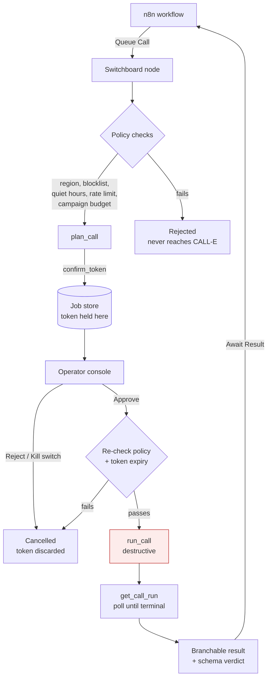

# Switchboard

Human approval gate for CALL-E phone calls in n8n workflows.

Switchboard plans a call, takes custody of the confirm token, and refuses to spend it until a person approves in a console. Nothing dials automatically.

## Relationship to the official node

This is not a calling node and does not replace one. Use [`@call-e/n8n-nodes-calle`](../n8n-nodes-calle) to place calls. Switchboard sits in front of it and decides whether a call happens at all.

## Why this exists

`run_call` is annotated `destructiveHint: true` in CALL-E's MCP tool list. In the MCP spec that means irreversible and side-effecting. A bad database write can be rolled back; a phone call cannot. Someone's phone rang and a synthetic voice spoke to them.

CALL-E already ships the mechanism for this. `plan_call` returns a `confirm_token`, and `run_call` will not dial without it. Two-phase commit.

But nothing forces a human to hold that token. In a workflow the plan step hands `confirm_token` straight to the run step and the call goes out. The safety mechanism is bypassed by default, not out of malice but because wiring two nodes together is the obvious thing to do.

Switchboard takes custody of the token. The gate stops being decorative.

## Architecture



The token exists only in the job store. It is never emitted into workflow data, and it is nulled the moment it is spent.

## Install

```bash
cd plugins/n8n-switchboard
cp .env.example .env
node scripts/test.js
```

No dependencies. Node 22 or later, for `--env-file`.

You also need the CALL-E CLI, authenticated:

```bash
npm install -g @call-e/cli
calle auth login
calle mcp tools
```

Link it into n8n as a custom node:

```bash
mkdir -p ~/.n8n/custom && cd ~/.n8n/custom
npm init -y
npm link /path/to/plugins/n8n-switchboard
N8N_CUSTOM_EXTENSIONS=~/.n8n/custom npx n8n
```

Verified against n8n 2.38.

## Try it without dialling

```bash
node --env-file=.env scripts/demo.js --reset
node --env-file=.env console/server.js
```

Seeds a collections queue: jobs awaiting approval with real confirm tokens held, one refused on region, one scheduled for tomorrow, and a runaway loop caught by the rate limit. `plan_call` does not dial, so this costs nothing.

CALL-E also publishes a US test hotline for integration testing, so the full approve-and-dial path can be exercised without involving a real person.

## Node operations

| Operation | What it does |
|---|---|
| Queue Call | Runs policy checks, plans the call, parks it. Does not dial. |
| Await Result | Waits for approval, dials, polls until the call ends. |
| Get Status | Reads a job without changing it. |
| Cancel | Cancels a job. CALL-E ships no cancel tool, so this is the only stop. |

Modes: `require_approval` (default), `dry_run`, `auto`.

## Safety controls

Every check runs before planning, and the policy is re-evaluated immediately before dialing, so a call approved at 8pm and dialed at 10pm still hits quiet hours.

- **Region.** CALL-E supports a fixed recipient region list. Anything outside it is refused locally rather than failing at dial time.
- **Blocklist.** Numbers that are never dialed, checked first.
- **Quiet hours.** No dialing inside a configured window, evaluated against the dial time rather than the queue time.
- **Rate limit.** Maximum calls per recipient per 24 hours. Catches runaway loops.
- **Campaign budget.** Per-campaign call caps, checked again at dial time.
- **Token expiry.** `confirm_expires_at` is checked before dialing. Approving a call is not the same as approving it in time.
- **Kill switch.** Cancels every pending, scheduled and approved job at once.
- **Audit log.** Who approved what, when.

See [docs/SAFETY.md](docs/SAFETY.md). Cancellation before dial is real; after `run_call` has been sent, Switchboard stops tracking the job but the call may still happen.

## What we found about CALL-E

Four things, verified against live runs. They shaped the design.

**There is no cancel tool.** The tool list is `plan_call`, `run_call`, `get_call_run`, `track_ui_events`. Once a run is submitted there is no documented way to stop it, so Switchboard holds scheduled jobs itself and never hands CALL-E a future time.

**There is no caller-defined result schema.** `result.extracted` always returns the same run envelope: `goal`, `region`, `repair`, `calling`, `language`, `to_phones`. CALL-E does perform the extraction you ask for, but flattens it into `post_summary` as prose. Switchboard requests a schema, validates what comes back, and reports the gap plainly rather than pretending. What it can give you in machine-readable form is exposed as `branchable`:

```json
{
  "taskCompleted": true,
  "confidenceScore": 0.95,
  "confidenceLabel": "high",
  "evidence": ["A live response was received from the test hotline."],
  "callStatus": "finished",
  "durationSeconds": 24,
  "calleeCount": 1
}
```

A workflow can route on `taskCompleted && confidenceScore > 0.8`. It cannot route on prose.

**`get_call_run` asks for a human and has nowhere to send them.** `next_step.action` includes `ask_user_for_missing_info` and `ask_user_for_retry_confirmation`. In a headless workflow that request is swallowed. Switchboard surfaces it as a `needs_human` job with the question rendered and an answer box.

**The supported region list is documentation, not data.** `calle regions list` returns a URL. There is no programmatic way to know whether a number is callable except by trying. Our list is a dated snapshot, overridable with `SWITCHBOARD_REGIONS`, and the refusal message says so.

## Limitations

A human approval step costs latency, and it does not scale to high-volume calling. Someone will click approve without reading by the hundredth call.

That is an acceptable trade because CALL-E targets low-frequency, personalized phone tasks. At ten calls a day a human gate is affordable. At ten thousand it is theatre, and you should use `auto` mode with tight policy limits instead.

Scheduled jobs are promoted by a tick inside the console server. If the console is not running, scheduled calls do not fire.

Switchboard cannot reattach to a run whose job record was lost. CALL-E ships `calle call recover` for this; wiring it into the node is not done yet.

## Layout

```
core/       store, policy checks, CALL-E adapter, runner, campaigns
nodes/      the n8n community node
console/    the operator console
examples/   importable n8n workflow and a sample result schema
scripts/    tests and a no-call demo seed
docs/       safety notes
```

## Notes

All phone numbers in examples are fictional except CALL-E's own published test hotline, which is included because it lets anyone run this without a phone number in a supported region.

Tests write to `data/test-jobs.json` and never touch the live queue.
