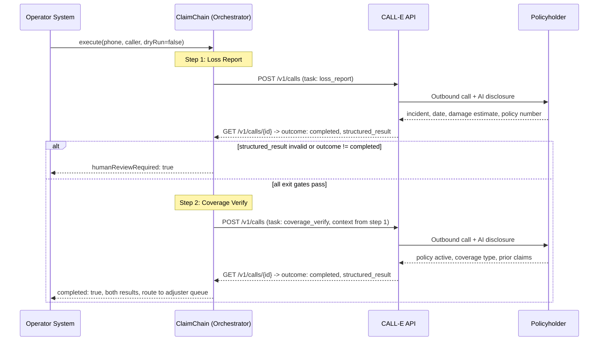

# Insurance Claims Orchestrator — Sequence Diagram

```mermaid
sequenceDiagram
    participant Operator as Operator System
    participant Chain as ClaimChain (Orchestrator)
    participant CALLE as CALL-E API
    participant PH as Policyholder

    Operator->>Chain: execute(phone, caller, dryRun=false)

    Note over Chain: Step 1: Loss Report

    Chain->>CALLE: POST /v1/calls (task: loss_report)
    CALLE->>PH: Outbound call + AI disclosure
    PH-->>CALLE: incident, date, damage estimate, policy number
    CALLE-->>Chain: GET /v1/calls/{id} -> outcome: completed, structured_result

    alt structured_result invalid or outcome != completed
        Chain-->>Operator: humanReviewRequired: true
    else all exit gates pass
        Note over Chain: Step 2: Coverage Verify
        Chain->>CALLE: POST /v1/calls (task: coverage_verify, context from step 1)
        CALLE->>PH: Outbound call + AI disclosure
        PH-->>CALLE: policy active, coverage type, prior claims
        CALLE-->>Chain: GET /v1/calls/{id} -> outcome: completed, structured_result
        Chain-->>Operator: completed: true, both results, route to adjuster queue
    end
```
